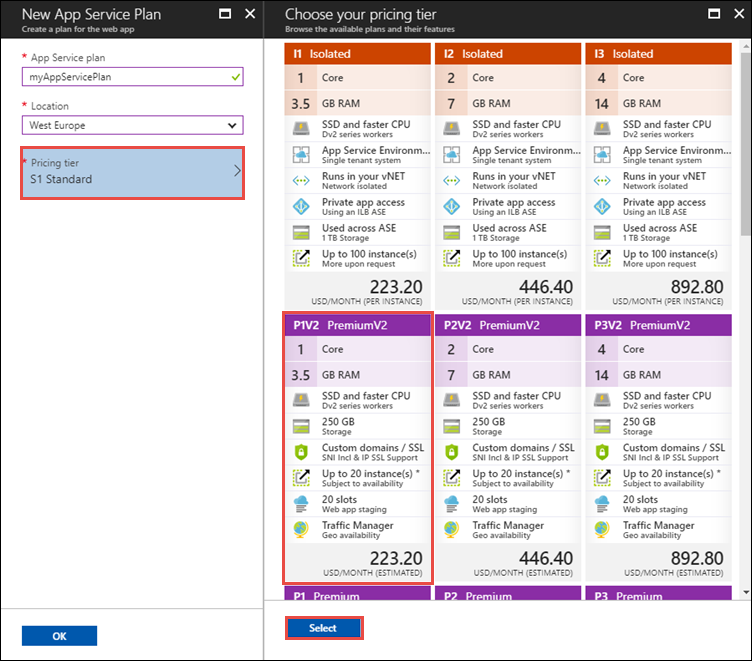
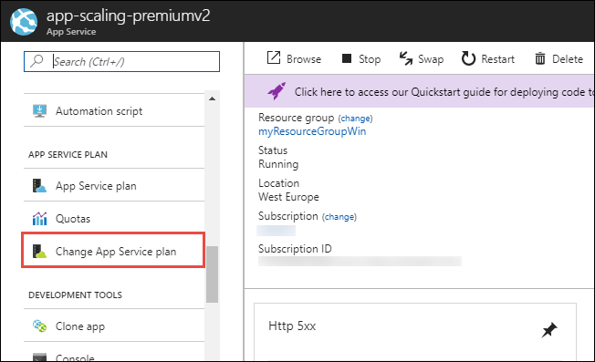
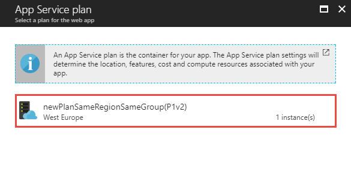

# Configure PremiumV2 tier (Preview) for App Service

The new **PremiumV2** pricing tier (Preview) features [Dv2-series VMs](../virtual-machines/windows/sizes-general.md#dv2-series) with faster processors, SSD storage, and double memory-to-core ratio compared to **Standard** tier. In this article, you learn how to create an app in **PremiumV2** tier or scale up an app to **PremiumV2** tier.

<a name="availability"></a>

## PremiumV2 availability

The PremiumV2 tier is currently available for App Service on _Windows_. Web Apps on Containers is not yet supported.

PremiumV2 is already available in most regions, and it will be available in all Azure regions in the near future. To see if it is available in your region, run the following Azure CLI command in the [Azure Cloud Shell](../cloud-shell/overview.md):

```azurecli-interactive
az appservice list-locations --sku P1V2
```

<a name="create"></a>

## Create an app in PremiumV2 tier

The pricing tier of an App Service app is defined in the [App Service plan](azure-web-sites-web-hosting-plans-in-depth-overview.md) that it runs on. 

When configuring the App Service plan in the <a href="https://portal.azure.com" target="_blank">Azure portal</a>, select **Pricing tier**. 

Choose one of the **PremiumV2** options and click **Select**.



If you do not see **P1V2**, **P2V2**, and **P3V2** as options, either PremiumV2 is not available in your region of choice, or you are configuring a Linux App Service plan, which does not support **PremiumV2**.

If you receive an error during deployment, then **PremiumV2** is most likely not available for your region of choice.

## Scale up an existing app to PremiumV2 tier

Before scaling an existing app to PremiumV2 tier, make sure that PremiumV2 is available in your region. For information, see [PremiumV2 availability](#availability).

Depending on your hosting environment, scaling up may require extra steps. 

In the <a href="https://portal.azure.com" target="_blank">Azure portal</a>, open your App Service app page.

In the left navigation of your App Service app page, select **Scale up (App Service plan)**.


Select one of the **PremiumV2** sizes, then click **Select**.


If your operation finishes successfully, your app's overview page shows that it is now in a **PremiumV2** tier.


### If you get an error

Some App Service plans cannot scale up to the PremiumV2 tier. If your scale-up operation gives you an error, you need a new App Service plan for your app.

Create a _Windows_ App Service plan in the same region and resource group as your existing App Service app. Follow the steps at [Create an app in PremiumV2 tier](#create) to set it to **PremiumV2** tier. If desired, use the same scale-out configuration as your existing App Service plan (number of instances, autoscale, and so on).

Open your App Service app page again. In the left navigation of your App Service, select **Change App Service plan**.



Select the App Service plan you just created.



Once the change operation completes, your app is running in **PremiumV2** tier.

## Scale up from an unsupported region

If your app runs in a region where **PremiumV2** is not yet available, you can move your app to different region to take advantage of **PremiumV2**. You have two options:

- Create an app in new PremiumV2 plan, then redeploy your application code. Follow the steps at [Create an app in PremiumV2 tier](#create) to set it to **PremiumV2** tier. If desired, use the same scale-out configuration as your existing App Service plan (number of instances, autoscale, and so on).
- If your app already runs in an existing **Premium** tier, then you can clone your app with all app settings, connection strings, and deployment configuration.

    

    In the **Clone app** page, you can create a new App Service plan in the region you want, and specify the settings that you want to clone.

## Automate with scripts

You can automate app creation in the PremiumV2 tier with scripts, using the [Azure CLI](/cli/azure/install-azure-cli) or [Azure PowerShell](/powershell/azure/overview).

### Azure CLI

The following command creates an App Service plan in _P1V2_. You can run it in the Cloud Shell. The options for `--sku` are P1V2, _P2V2_, and _P3V2_.

```azurecli-interactive
az appservice plan create \
    --resource-group <resource_group_name> \
    --name <app_service_plan_name> \
    --sku P1V2
```

### Azure PowerShell

The following command creates an App Service plan in _P1V2_. The options for `-WorkerSize` are _Small_, _Medium_, and _Large_.

```PowerShell
New-AzureRmAppServicePlan -ResourceGroupName <resource_group_name> `
    -Name <app_service_plan_name> `
    -Location <region_name> `
    -Tier "PremiumV2" `
    -WorkerSize "Small"
```
## More resources

[Scale up an app in Azure](web-sites-scale.md)  
[Scale instance count manually or automatically](../monitoring-and-diagnostics/insights-how-to-scale.md)