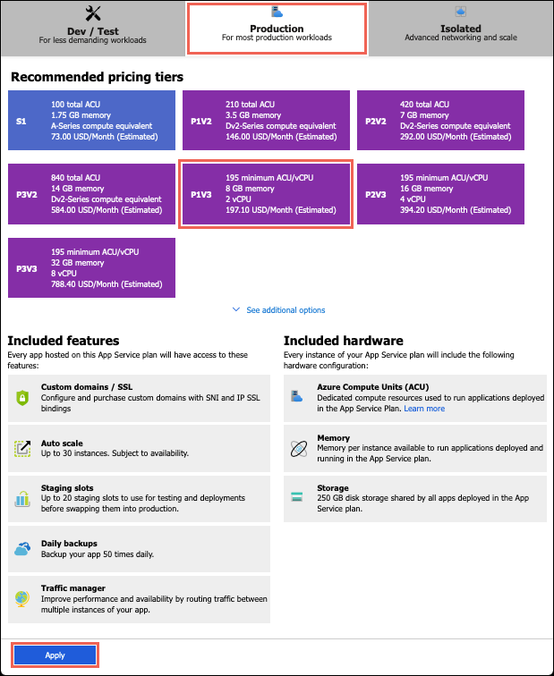
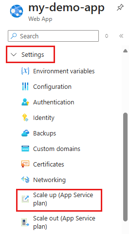
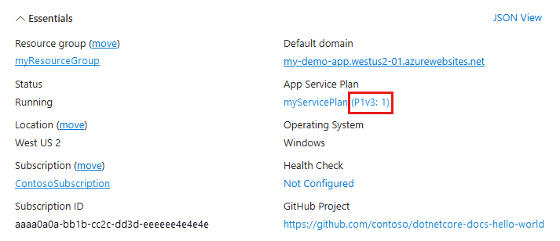
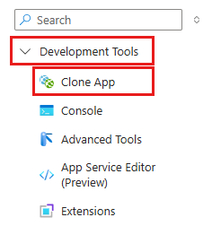

# Configure PremiumV2 tier for Azure App Service

The new **PremiumV2** pricing tier gives you faster processors, SSD storage, and doubles the memory-to-core ratio of the existing pricing tiers. With the performance advantage, you could save money by running your apps on fewer instances. In this article, you learn how to create an app in **PremiumV2** tier or scale up an app to **PremiumV2** tier.

## Prerequisites

To scale-up an app to **PremiumV2**, you need to have an Azure App Service app that runs in a pricing tier lower than **PremiumV2**, and the app must be running in an App Service deployment that supports PremiumV2.

<a name="availability"></a>

## PremiumV2 availability

The **PremiumV2** tier is available for App Service on both _Windows_ as well as _Linux_.

**PremiumV2** is available in most Azure regions. To see if it's available in your region, run the following Azure CLI command in the [Azure Cloud Shell](../cloud-shell/overview.md):

```azurecli-interactive
az appservice list-locations --sku P1V2
```

<a name="create"></a>

## Create an app in PremiumV2 tier

The pricing tier of an App Service app is defined in the [App Service plan](overview-hosting-plans.md) that it runs on. You can create an App Service plan by itself or as part of app creation.

When configuring the App Service plan in the <a href="https://portal.azure.com" target="_blank">Azure portal</a>, select **Pricing tier**. 

Select **Production**, then select **P1V2**, **P2V2**, or **P3V2**, then click **Apply**.



> [!IMPORTANT] 
> If you don't see **P1V2**, **P2V2**, and **P3V2** as options, or if the options are greyed out, then **PremiumV2** likely isn't available in the underlying App Service deployment that contains the App Service plan. See [Scale up from an unsupported resource group and region combination](#unsupported) for more details.

## Scale up an existing app to PremiumV2 tier

Before scaling an existing app to **PremiumV2** tier, make sure that **PremiumV2** is available. For information, see [PremiumV2 availability](#availability). If it's not available, see [Scale up from an unsupported resource group and region combination](#unsupported).

Depending on your hosting environment, scaling up may require extra steps. 

In the <a href="https://portal.azure.com" target="_blank">Azure portal</a>, open your App Service app page.

In the left navigation of your App Service app page, select **Scale up (App Service plan)**.



Select **Production**, then select **P1V2**, **P2V2**, or **P3V2**, then click **Apply**.


If your operation finishes successfully, your app's overview page shows that it's now in a **PremiumV2** tier.



### If you get an error

Some App Service plans can't scale up to the PremiumV2 tier if the underlying App Service deployment doesn’t support PremiumV2.  See [Scale up from an unsupported resource group and region combination](#unsupported) for more details.

<a name="unsupported"></a>

## Scale up from an unsupported resource group and region combination

If your app runs in an App Service deployment where **PremiumV2** isn't available, or if your app runs in a region that currently does not support **PremiumV2**, you will need to re-deploy your app to take advantage of **PremiumV2**.  You have two options:

- Create a **new** resource group, and then create a **new** app and App Service plan in the **new** resource group, choosing your desired Azure region during the creation process.  You **must** select the **PremiumV2** plan at the time the new app service plan is created.  This ensures the combination of resource group, App Service plan, and Azure region will result in the App Service plan being created in an App Service deployment that supports **PremiumV2**.  Then redeploy your application code into the newly created app and app service plan. If desired you can subsequently scale the App Service plan down from **PremiumV2** to save costs, and you will still be able to successfully scale back up again in the future using **PremiumV2**.
- If your app already runs in an existing **Premium** tier, then you can clone your app with all app settings, connection strings, and deployment configuration into a new app service plan that uses **PremiumV2**.

    

    In the **Clone app** page, you can create an App Service plan using **PremiumV2** in the region you want, and specify the app settings and configuration that you want to clone.

## Automate with scripts

You can automate app creation in the **PremiumV2** tier with scripts, using the [Azure CLI](/cli/azure/install-azure-cli) or [Azure PowerShell](/powershell/azure/overview).

### Azure CLI

The following command creates an App Service plan in _P1V2_. You can run it in the Cloud Shell. The options for `--sku` are P1V2, _P2V2_, and _P3V2_.

```azurecli-interactive
az appservice plan create \
    --resource-group <resource_group_name> \
    --name <app_service_plan_name> \
    --sku P1V2
```

### Azure PowerShell

[!INCLUDE [updated-for-az](../../includes/updated-for-az.md)]

The following command creates an App Service plan in _P1V2_. The options for `-WorkerSize` are _Small_, _Medium_, and _Large_.

```powershell
New-AzAppServicePlan -ResourceGroupName <resource_group_name> `
    -Name <app_service_plan_name> `
    -Location <region_name> `
    -Tier "PremiumV2" `
    -WorkerSize "Small"
```
## More resources

[Scale up an app in Azure](web-sites-scale.md)  
[Scale instance count manually or automatically](../monitoring-and-diagnostics/insights-how-to-scale.md)
