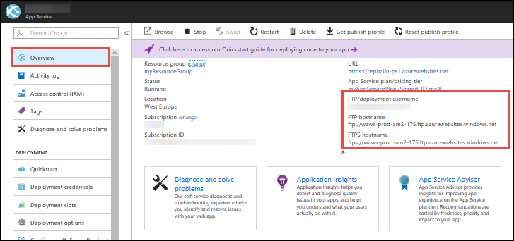

# Deploy your app to Azure App Service using FTP/S

This article shows you how to use FTP or FTPS to deploy your web app, mobile app backend, 
or API app to [Azure App Service](http://go.microsoft.com/fwlink/?LinkId=529714).

The FTP/S endpoint for your app is already active. No configuration is necessary to enable FTP/S deployment.

## Step 1: Set deployment credentials

To access the FTP server for your app, you first need deployment credentials. 

To set or reset your deployment credentials, see [Azure App Service Deployment Credentials](app-service-deployment-credentials.md). This tutorial demonstrates the use of user-level credentials.

## Step 2: Get FTP connection information

1. In the [Azure portal](https://portal.azure.com), open your app's [resource page](../azure-resource-manager/resource-group-portal.md#manage-resources).
2. Select **Overview** in the left navigation, then note the values for **FTP/Deployment User**, **FTP Host Name**, and **FTPS Host Name**. 

    

    > [!NOTE]
    > To provide proper context for the FTP server, the **FTP/Deployment User** value displayed by the Azure portal includes the app name.
    > You can find the same information when you select **Properties** in the left navigation. 
    >
    > Also, the deployment password is never shown. If you forget your deployment password, go back to [step 1](#step1) and reset your deployment password.
    >
    >

## Step 3: Deploy files to Azure

1. From your FTP client (for example, [Visual Studio](https://www.visualstudio.com/vs/community/) or [FileZilla](https://filezilla-project.org/download.php?type=client)), 
use the connection information you gathered to connect to your app.
3. Copy your files and their respective directory structure to the [**/site/wwwroot** directory](https://github.com/projectkudu/kudu/wiki/File-structure-on-azure) in Azure (or the **/site/wwwroot/App_Data/Jobs/** directory for WebJobs).
4. Browse to your app's URL to verify the app is running properly. 

> [!NOTE] 
> Unlike [Git-based deployments](app-service-deploy-local-git.md), FTP deployment doesn't support the following deployment automations: 
>
> - dependency restores (such as NuGet, NPM, PIP, and Composer automations)
> - compilation of .NET binaries
> - generation of web.config (here is a [Node.js example](https://github.com/projectkudu/kudu/wiki/Using-a-custom-web.config-for-Node-apps))
> 
> Generate these necessary files manually on your local machine, and then deploy them together with your app.
>
>

## Enforce FTPS

For enhanced security, you should allow FTP over SSL only. You can also disable both FTP and FTPS if you don't use FTP deployment.

In your app's resource page in [Azure portal](https://portal.azure.com), select **App settings** in the left navigation.

To disable unencrypted FTP, select **FTPS Only**. To disable both FTP and FTPS entirely, select **Disable**. When finished, click **Save**.

## Troubleshoot FTP deployment

- [How can I troubleshoot FTP deployment?](#how-can-i-troubleshoot-ftp-deployment)
- [I'm not able to FTP and publish my code. How can I resolve the issue?](#im-not-able-to-ftp-and-publish-my-code-how-can-i-resolve-the-issue)
- [How can I connect to FTP in Azure App Service via passive mode?](#how-can-i-connect-to-ftp-in-azure-app-service-via-passive-mode)

### How can I troubleshoot FTP deployment?

The first step for troubleshooting FTP deployment is isolating a deployment issue from a runtime application issue.

A deployment issue typically results in no files or wrong files deployed to your app. It can be addressed by investigating your FTP deployment or selecting an alternate deployment path (such as source control).

A runtime application issue typically results in the right set of files deployed to your app but incorrect app behavior. It can be addressed by focusing on code behavior at runtime and investigating specific failure paths.

To determine a deployment or runtime issue, see [Deployment vs. runtime issues](https://github.com/projectkudu/kudu/wiki/Deployment-vs-runtime-issues).

 
### I'm not able to FTP and publish my code. How can I resolve the issue?
Check that you've entered the correct hostname and [credentials](#step-1--set-deployment-credentials). Check also that the following FTP ports on your machine are not blocked by a firewall:

- FTP control connection port: 21
- FTP data connection port: 989, 10001-10300
 
### How can I connect to FTP in Azure App Service via passive mode?
Azure App Service supports connecting via both Active and Passive mode. Passive mode is preferred because your deployment machines are usually behind a firewall (in the operating system or as part of a home or business network). See an [example from the WinSCP documentation](https://winscp.net/docs/ui_login_connection). 

## Next steps

For more advanced deployment scenarios, try [deploying to Azure with Git](app-service-deploy-local-git.md). Git-based deployment to Azure
enables version control, package restore, MSBuild, and more.

## More Resources

* [Azure App Service Deployment Credentials](app-service-deploy-ftp.md)
