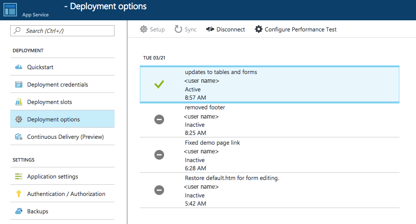

# Local Git Deployment to Azure App Service

This how-to guide shows you how to deploy your code to [Azure App Service](app-service-web-overview.md) from a Git repository on your local computer.

[!INCLUDE [quickstarts-free-trial-note](../../includes/quickstarts-free-trial-note.md)]

## Prerequisites

To follow the steps in this how-to guide:

* [Install Git](http://www.git-scm.com/downloads).
* Maintain a local Git repository with code you want to deploy.

To use a sample repository to follow along, run the following command in your local terminal window:

```bash
git clone https://github.com/Azure-Samples/nodejs-docs-hello-world.git
```

## Prepare your repository

Make sure that your repository root has the correct files in your project.

| Runtime | Root directory files |
|-|-|
| ASP.NET (Windows only) | _*.sln_, _*.csproj_, or _default.aspx_ |
| ASP.NET Core | _*.sln_ or _*.csproj_ |
| PHP | _index.php_ |
| Ruby (Linux only) | _Gemfile_ |
| Node.js | _server.js_, _app.js_, or _package.json_ with a start script |
| Python (Windows only) | _\*.py_, _requirements.txt_, or _runtime.txt_ |
| HTML | _default.htm_, _default.html_, _default.asp_, _index.htm_, _index.html_, or _iisstart.htm_ |
| WebJobs | _\<job_name>/run.\<extension>_ under _App\_Data/jobs/continuous_ (for continuous WebJobs) or _App\_Data/jobs/triggered_ (for triggered WebJobs). For more information, see [Kudu WebJobs documentation](https://github.com/projectkudu/kudu/wiki/WebJobs) |
| Functions | See [Continuous deployment for Azure Functions](../azure-functions/functions-continuous-deployment.md#continuous-deployment-requirements). |

To customize your deployment, you can include a _.deployment_ file in the repository root. For more information, see [Customizing deployments](https://github.com/projectkudu/kudu/wiki/Customizing-deployments) and [Custom deployment script](https://github.com/projectkudu/kudu/wiki/Custom-Deployment-Script).

> [!NOTE]
> Be sure to `git commit` all the changes you want to deploy.
>
>

[!INCLUDE [cloud-shell-try-it.md](../../includes/cloud-shell-try-it.md)]

[!INCLUDE [Configure a deployment user](../../includes/configure-deployment-user.md)]

## Enable Git for your app

To enable Git deployment for an existing App Service app, run [`az webapp deployment source config-local-git`](/cli/azure/webapp/deployment/source?view=azure-cli-latest#az_webapp_deployment_source_config_local_git) in the Cloud Shell.

```azurecli-interactive
az webapp deployment source config-local-git --name <app_name> --resource-group <group_name>
```

To create a Git-enabled app instead, run [`az webapp create`](/cli/azure/webapp?view=azure-cli-latest#az_webapp_create) in the Cloud Shell with the `--deployment-local-git` parameter.

```azurecli-interactive
az webapp create --name <app_name> --resource-group <group_name> --plan <plan_name> --deployment-local-git
```

The `az webapp create` command should give you something similar to the following output:

```json
Local git is configured with url of 'https://<username>@<app_name>.scm.azurewebsites.net/<app_name>.git'
{
  "availabilityState": "Normal",
  "clientAffinityEnabled": true,
  "clientCertEnabled": false,
  "cloningInfo": null,
  "containerSize": 0,
  "dailyMemoryTimeQuota": 0,
  "defaultHostName": "<app_name>.azurewebsites.net",
  "deploymentLocalGitUrl": "https://<username>@<app_name>.scm.azurewebsites.net/<app_name>.git",
  "enabled": true,
  < JSON data removed for brevity. >
}
```

## Deploy your project

Back in the _local terminal window_, add an Azure remote to your local Git repository. Replace _\<url>_ with the URL of the Git remote that you got from [Enable Git for your app](#enable-git-for-you-app).

```bash
git remote add azure <url>
```

Push to the Azure remote to deploy your app with the following command. When prompted for a password, make sure that you enter the password you created in [Configure a deployment user](#configure-a-deployment-user), not the password you use to log in to the Azure portal.

```bash
git push azure master
```

You may see runtime-specific automation in the output, such as MSBuild for ASP.NET, `npm install` for Node.js, and `pip install` for Python. 

Once deployment is finished, your app in the Azure portal should now have a record of your `git push` in the **Deployment options** page.



Browse to your app to verify that the content is deployed.

## Troubleshooting

The following are common errors or problems when using Git to publish to an App Service app in Azure:

---
**Symptom**: `Unable to access '[siteURL]': Failed to connect to [scmAddress]`

**Cause**: This error can happen if the app isn't up and running.

**Resolution**: Start the app in the Azure portal. Git deployment is unavailable when the Web App is stopped.

---
**Symptom**: `Couldn't resolve host 'hostname'`

**Cause**: This error can happen if the address information entered when creating the 'azure' remote was incorrect.

**Resolution**: Use the `git remote -v` command to list all remotes, along with the associated URL. Verify that the URL for the 'azure' remote is correct. If needed, remove and recreate this remote using the correct URL.

---
**Symptom**: `No refs in common and none specified; doing nothing. Perhaps you should specify a branch such as 'master'.`

**Cause**: This error can happen if you don't specify a branch during `git push`, or if you haven't set the `push.default` value in `.gitconfig`.

**Resolution**: Run `git push` again, specifying the master branch. For example:

```bash
git push azure master
```

---
**Symptom**: `src refspec [branchname] does not match any.`

**Cause**: This error can happen if you try to push to a branch other than master on the 'azure' remote.

**Resolution**: Run `git push` again, specifying the master branch. For example:

```bash
git push azure master
```

---
**Symptom**: `RPC failed; result=22, HTTP code = 5xx.`

**Cause**: This error can happen if you try to push a large git repository over HTTPS.

**Resolution**: Change the git configuration on the local machine to make the postBuffer bigger

```bash
git config --global http.postBuffer 524288000
```

---
**Symptom**: `Error - Changes committed to remote repository but your web app not updated.`

**Cause**: This error can happen if you deploy a Node.js app with a _package.json_ file that specifies additional required modules.

**Resolution**: Additional messages with 'npm ERR!' should be logged before this error, and can provide additional context on the failure. The following are known causes of this error and the corresponding 'npm ERR!' message:

* **Malformed package.json file**: npm ERR! Couldn't read dependencies.
* **Native module that does not have a binary distribution for Windows**:

  * `npm ERR! \cmd "/c" "node-gyp rebuild"\ failed with 1`

      OR
  * `npm ERR! [modulename@version] preinstall: \make || gmake\`

## Additional Resources

* [Project Kudu documentation](https://github.com/projectkudu/kudu/wiki)
* [Continuous Deployment to Azure App Service](app-service-continuous-deployment.md)
* [Sample: Create Web App and deploy code from a local Git repository (Azure CLI)](./scripts/app-service-cli-deploy-local-git.md?toc=%2fcli%2fazure%2ftoc.json)
* [Sample: Create Web App and deploy code from a local Git repository (PowerShell)](./scripts/app-service-powershell-deploy-local-git.md?toc=%2fpowershell%2fmodule%2ftoc.json)
