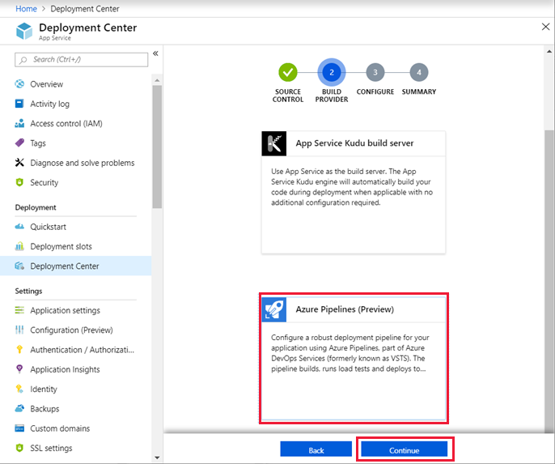

# Local Git Deployment to Azure App Service

This how-to guide shows you how to deploy your code to [Azure App Service](app-service-web-overview.md) from a Git repository on your local computer.

[!INCLUDE [quickstarts-free-trial-note](../../includes/quickstarts-free-trial-note.md)]

## Prerequisites

To follow the steps in this how-to guide:

* [Install Git](http://www.git-scm.com/downloads).
* Maintain a local Git repository with code you want to deploy.

To use a sample repository to follow along, run the following command in your local terminal window:

```bash
git clone https://github.com/Azure-Samples/nodejs-docs-hello-world.git
```

[!INCLUDE [Prepare repository](../../includes/app-service-deploy-prepare-repo.md)]

[!INCLUDE [cloud-shell-try-it.md](../../includes/cloud-shell-try-it.md)]

## Deploy from local Git with Kudu builds

The easiest way to enable local Git deployment for your app with the Kudu build server is to use the Cloud Shell.

### Create a deployment user

[!INCLUDE [Configure a deployment user](../../includes/configure-deployment-user-no-h.md)]

### Enable local Git with Kudu

To enable local Git deployment for your app with the Kudu build server, run [`az webapp deployment source config-local-git`](/cli/azure/webapp/deployment/source?view=azure-cli-latest#az-webapp-deployment-source-config-local-git) in the Cloud Shell.

```azurecli-interactive
az webapp deployment source config-local-git --name <app_name> --resource-group <group_name>
```

To create a Git-enabled app instead, run [`az webapp create`](/cli/azure/webapp?view=azure-cli-latest#az-webapp-create) in the Cloud Shell with the `--deployment-local-git` parameter.

```azurecli-interactive
az webapp create --name <app_name> --resource-group <group_name> --plan <plan_name> --deployment-local-git
```

The `az webapp create` command should give you something similar to the following output:

```json
Local git is configured with url of 'https://<username>@<app_name>.scm.azurewebsites.net/<app_name>.git'
{
  "availabilityState": "Normal",
  "clientAffinityEnabled": true,
  "clientCertEnabled": false,
  "cloningInfo": null,
  "containerSize": 0,
  "dailyMemoryTimeQuota": 0,
  "defaultHostName": "<app_name>.azurewebsites.net",
  "deploymentLocalGitUrl": "https://<username>@<app_name>.scm.azurewebsites.net/<app_name>.git",
  "enabled": true,
  < JSON data removed for brevity. >
}
```

### Deploy your project

Back in the _local terminal window_, add an Azure remote to your local Git repository. Replace _\<url>_ with the URL of the Git remote that you got from [Enable Git for your app](#enable-git-for-you-app).

```bash
git remote add azure <url>
```

Push to the Azure remote to deploy your app with the following command. When prompted for a password, make sure that you enter the password you created in [Configure a deployment user](#configure-a-deployment-user), not the password you use to log in to the Azure portal.

```bash
git push azure master
```

You may see runtime-specific automation in the output, such as MSBuild for ASP.NET, `npm install` for Node.js, and `pip install` for Python. 

Browse to your app to verify that the content is deployed.

## Deploy from local Git with Azure DevOps Services builds

> [!NOTE]
> For App Service to create the necessary Azure Pipelines in your Azure DevOps Services organization, your Azure account must have the role of **Owner** in your Azure subscription.
>

To enable local Git deployment for your app with the Kudu build server, navigate to your app in the [Azure portal](https://portal.azure.com).

In the left navigation of your app page, click **Deployment Center** > **Local Git** > **Continue**. 


Click **Azure DevOps Services Continuous Delivery** > **Continue**.



In the **Configure** page, configure a new Azure DevOps Services organization, or specify an existing organization. When finished, click **Continue**.

> [!NOTE]
> If you want to use an existing Azure DevOps Services organization that is not listed, you need to [link the Azure DevOps Services organization to your Azure subscription](https://github.com/projectkudu/kudu/wiki/Setting-up-a-VSTS-account-so-it-can-deploy-to-a-Web-App).

In the **Test** page, choose whether to enable load tests, then click **Continue**.

Depending on the [pricing tier](https://azure.microsoft.com/pricing/details/app-service/plans/) of your App Service plan, you may also see a **Deploy to staging** page. Choose whether to enable deployment slots, then click **Continue**.

In the **Summary** page, verify your options and click **Finish**.

It takes a few minutes for the Azure DevOps Services organization to be ready. When it's ready, copy the Git repository URL in the deployment center.


Back in the _local terminal window_, add an Azure remote to your local Git repository. Replace _\<url>_ with the URL you got from the last step.

```bash
git remote add vsts <url>
```

Push to the Azure remote to deploy your app with the following command. When prompted by Git Credential Manager, sign in with your visualstudio.com user. For additional authentication methods, see [Azure DevOps Services authentication overview](/vsts/git/auth-overview?view=vsts).

```bash
git push vsts master
```

Once deployment is finished, you can find the build progress at `https://<vsts_account>.visualstudio.com/<project_name>/_build` and the deployment progress at `https://<vsts_account>.visualstudio.com/<project_name>/_release`.

Browse to your app to verify that the content is deployed.

[!INCLUDE [What happens to my app during deployment?](../../includes/app-service-deploy-atomicity.md)]

## Troubleshooting Kudu deployment

The following are common errors or problems when using Git to publish to an App Service app in Azure:

---
**Symptom**: `Unable to access '[siteURL]': Failed to connect to [scmAddress]`

**Cause**: This error can happen if the app isn't up and running.

**Resolution**: Start the app in the Azure portal. Git deployment is unavailable when the Web App is stopped.

---
**Symptom**: `Couldn't resolve host 'hostname'`

**Cause**: This error can happen if the address information entered when creating the 'azure' remote was incorrect.

**Resolution**: Use the `git remote -v` command to list all remotes, along with the associated URL. Verify that the URL for the 'azure' remote is correct. If needed, remove and recreate this remote using the correct URL.

---
**Symptom**: `No refs in common and none specified; doing nothing. Perhaps you should specify a branch such as 'master'.`

**Cause**: This error can happen if you don't specify a branch during `git push`, or if you haven't set the `push.default` value in `.gitconfig`.

**Resolution**: Run `git push` again, specifying the master branch. For example:

```bash
git push azure master
```

---
**Symptom**: `src refspec [branchname] does not match any.`

**Cause**: This error can happen if you try to push to a branch other than master on the 'azure' remote.

**Resolution**: Run `git push` again, specifying the master branch. For example:

```bash
git push azure master
```

---
**Symptom**: `RPC failed; result=22, HTTP code = 5xx.`

**Cause**: This error can happen if you try to push a large git repository over HTTPS.

**Resolution**: Change the git configuration on the local machine to make the postBuffer bigger

```bash
git config --global http.postBuffer 524288000
```

---
**Symptom**: `Error - Changes committed to remote repository but your web app not updated.`

**Cause**: This error can happen if you deploy a Node.js app with a _package.json_ file that specifies additional required modules.

**Resolution**: Additional messages with 'npm ERR!' should be logged before this error, and can provide additional context on the failure. The following are known causes of this error and the corresponding 'npm ERR!' message:

* **Malformed package.json file**: npm ERR! Couldn't read dependencies.
* **Native module that doesn't have a binary distribution for Windows**:

  * `npm ERR! \cmd "/c" "node-gyp rebuild"\ failed with 1`

      OR
  * `npm ERR! [modulename@version] preinstall: \make || gmake\`

## Additional Resources

* [Project Kudu documentation](https://github.com/projectkudu/kudu/wiki)
* [Continuous Deployment to Azure App Service](app-service-continuous-deployment.md)
* [Sample: Create Web App and deploy code from a local Git repository (Azure CLI)](./scripts/app-service-cli-deploy-local-git.md?toc=%2fcli%2fazure%2ftoc.json)
* [Sample: Create Web App and deploy code from a local Git repository (PowerShell)](./scripts/app-service-powershell-deploy-local-git.md?toc=%2fpowershell%2fmodule%2ftoc.json)
