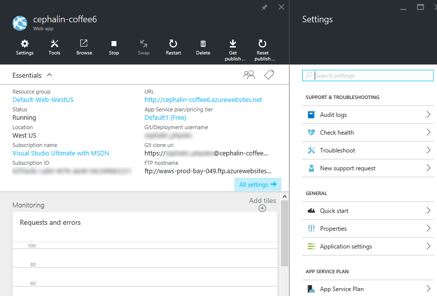

<properties 
	pageTitle="Get started with Azure App Service" 
	description="Learn how easy it is to run your web app live in App Service. Start doing real development in 5 minutes and see results immediately." 
	services="app-service"
	documentationCenter=""
	authors="cephalin" 
	manager="wpickett" 
	editor="" 
/>

<tags 
	ms.service="app-service" 
	ms.workload="web" 
	ms.tgt_pltfrm="na" 
	ms.devlang="na" 
	ms.topic="article" 
	ms.date="02/16/2016" 
	ms.author="cephalin"
/>
	
# Get started with Azure App Service

This tutorial helps you to get started quickly with [Azure App Service](app-service-value-prop-what-is.md). With very little action on your part, you will: 

- deploy a sample web app to App Service
- see your app running live in seconds
- update your web app the same way you would push [Git](http://www.git-scm.com/) commits

You'll also take a first glance at the [Azure portal](https://portal.azure.com) and survey the features available there. 

## Sign up for Microsoft Azure

You need an Azure account to complete this tutorial. You can:

* [Open an Azure account for free](/pricing/free-trial/?WT.mc_id=A261C142F). You get credits that can be used to try out paid Azure services. Even after the credits are 
used up, you can keep the account and use free Azure services and features, such as the free tier of Azure App Service.
* [Activate Visual Studio subscriber benefits](/pricing/member-offers/msdn-benefits-details/?WT.mc_id=A261C142F). Your Visual Studio subscription gives you credits every 
month that you can use for paid Azure services.

>[AZURE.NOTE] To see Azure App Service in action before signing up for an Azure account, go to [Try App Service](http://go.microsoft.com/fwlink/?LinkId=523751). There, 
you can immediately create a short-lived starter app in App Service—no credit card required, no commitments.

## Deploy a web app

Let's deploy a web app to Azure App Service. 

2. First, install the [Azure CLI](../xplat-cli-install.md). If you have NPM installed already, you can just install it with the following command:

        npm install azure-cli -g

1. In a Windows command prompt, Linux shell, or OS X terminal, clone the sample app like so:

        git clone <github_sample_url>

    For &lt;github_sample_url>, use one of the following URLs, depending on the framework you like: 

    - ASP.NET: [https://github.com/cephalin/aspnet-get-started.git](https://github.com/cephalin/aspnet-get-started.git)
    - PHP (CodeIgniter): [https://github.com/cephalin/php-get-started.git](https://github.com/cephalin/php-get-started.git)
    - Node.js (Express): [https://github.com/cephalin/nodejs-get-started.git](https://github.com/cephalin/nodejs-get-started.git) 
    - Python (Django): [https://github.com/cephalin/python-get-started.git](https://github.com/cephalin/python-get-started.git)
    - Java: [https://github.com/cephalin/java-get-started.git](https://github.com/cephalin/java-get-started.git)

2. `CD` into your sample app's project root. For example, 

        cd aspnet-get-started

3. Log into Azure like so:

        azure login
    
    Follow the prompt to continue the login in a browser with a Microsoft account that has your Azure subscription.

4. Create the App Service app resource in Azure with a unique app name, like so:

        azure site create --git <app_name>
    
    Not only is your app created in Azure now, but your current directory is also Git-initialized and connected to the new App Service app as a Git remote.

    >[AZURE.IMPORTANT] **Java sample only**: Before you proceed, be sure to follow the instructions at the sample's 
    [Requirement](https://github.com/cephalin/java-get-started#requirements) section. 

4. Now, deploy your sample code to the new App Service app like you would push any code with Git:

        git push azure master 
    
    `git push` not only puts code in Azure, but also triggers deployment tasks. If you have any package.json 
    (Node.js) or requirements.txt (Python) in your project (repository) root, or if you have a packages.config in your ASP.NET project, the deployment 
    scripts will restore the required packages for you. You can also [enable the Composer extension]() to automatically process composer.json files
    in your PHP app.  

5. Congratulations, you have deployed your app to Azure App Service. 

## See your app running live

To see your app running live in Azure, run this command:

    azure site browse <app_name>

If you see the error message: `Site <app_name> does not exist or has no hostnames`, retry the command in a few seconds. Some apps (especially Java) take longer
to wrap up deployment. You'll notice it only if you're a fast typer.

## Make updates to your app

Just like how you deployed your app to Azure for the first time, you can now use Git to push from your project (repository) root anytime to make an update to the live site.
For example, everytime you want to push a new changes that you've tested locally, just run the following commands from your project (repository) root:
    
    git add .
    git commit -m "<you_message>"
    git push azure master

## Other ways to deploy

There are a variety of ways you can deploy your web app, and Git deploy from a local repository is just one of them. There's the intuitive wizard deployment in
Visual Studio, continuous deployment directly from GitHub, content syncing from DropBox, and many other options, including the FTP method that web developers
are familiar with. For more information on deployment options, see [Deploy your app to Azure App Service](../app-service-web/web-sites-deploy.md).

## See your app on the Azure portal

Now, let's go to the Azure portal to see what you created:

1. Log into the [Azure portal](https://portal.azure.com) with a Microsoft account that has your Azure subscription.

2. On the left bar, click **App Services**.

3. Click the App Service app that you just created to open its blade in the portal. You will see that the **Settings** blade is also opened by default for your convenience.

 

Your App Service app's blade surfaces a rich set of settings and tools for you to configure, monitor, and secure, and troubleshoot your app. Take a moment to 
familiarize yourself with this interface by performing some simple tasks:

- stop the app
- restart the app
- click the **Resource Group** link to see all the resources deployed in the resource group
- click **Settings** > **Properties** to see other information about your app
- click **Tools** to access useful tools for monitoring and troubleshooting  

## Next steps

Take the app you deployed to the next level. Secure it with authentication. Scale it based on demand. Set up some performance alerts. All with a few clicks. See 
[Get started with Azure App Service - Part 2](app-service-get-start-3.md).

There is also a lot of content that shows you the range of apps you can build on Azure App Service, including web apps, mobile app backends, and API apps. 

- [Create web apps](/documentation/learning-paths/appservice-webapps/)
- [Create mobile apps](/documentation/learning-paths/appservice-mobileapps/)
- [Create API apps](../app-service-api/app-service-api-apps-why-best-platform.md)
