<properties 
	pageTitle="Get started with Azure App Service" 
	description="Get started with Azure App Service" 
	services="app-service"
	documentationCenter=""
	authors="cephalin" 
	manager="wpickett" 
	editor="" 
/>

<tags 
	ms.service="app-service" 
	ms.workload="web" 
	ms.tgt_pltfrm="na" 
	ms.devlang="na" 
	ms.topic="article" 
	ms.date="02/16/2016" 
	ms.author="cephalin"
/>
	
# Get started with Azure App Service

Welcome to [Azure App Service](app-service-value-prop-what-is)! This tutorial helps you to get started quickly with this feature-rich service. With very little action on your part, you will: 

- deploy a sample app from [GitHub](https://github.com) to App Service
- enforce authentication for your users
- autoscale your app
- receive alerts on your app

In doing so, you will take your first tour of App Service through the [Azure portal](https://portal.azure.com), learn how to navigate the
UI, and survey the available features. App Service brings enterprise-class capabilities to your great app, so you can focus your creative energy on delighting
your users with your app and not on meeting the real-world demands of scalability, performance, management, etc.

## Sign up for Microsoft Azure

You need an Azure account to complete this tutorial. You can:

* [Open an Azure account for free](/pricing/free-trial/?WT.mc_id=A261C142F). You get credits that can be used to try out paid Azure services. Even after the credits are 
used up, you can keep the account and use free Azure services and features, such as the free tier of Azure App Service.
* [Activate Visual Studio subscriber benefits](/pricing/member-offers/msdn-benefits-details/?WT.mc_id=A261C142F). Your Visual Studio subscription gives you credits every 
month that you can use for paid Azure services.

To see Azure App Service in action before signing up for an Azure account, go to [Try App Service](http://go.microsoft.com/fwlink/?LinkId=523751). There, 
you can immediately create a short-lived starter app in App Service—no credit card required, no commitments.

In the following video, Scott Hanselman shows how easy it is to sign up for a free trial of Microsoft Azure. (Duration: 1:58)

> [AZURE.VIDEO sign-up-for-microsoft-azure]

## Deploy a web app

First, let's quickly deploy a sample application to Azure App Service. 

1. Log into the [Azure portal](https://portal.azure.com) with a Microsoft account that has your Azure subscription.

1. Click on any one of the **bulleted** app samples below to deploy it to Azure App Service. If you have not yet logged into your Azure subscription, you will be 
redirected to the login page.

    - [**Deploy a simple HTML site**](https://deploy.azure.com/?repository=https://github.com/BlackrockDigital/startbootstrap-business-casual) - an open-source HTML 
    and [Bootstrap](https://getbootstrap.com/) template designed by [Start Bootstrap](https://startbootstrap.com/). This is a simple example that shows how 
    a basic app runs in App Service, with HTML, CSS, and image files.  
        
        \[[GitHub Repo](https://github.com/BlackrockDigital/startbootstrap-business-casual)]
    - [**Deploy a WordPress app**](https://deploy.azure.com/?repository=https://github.com/cephalin/WordPress) - the most popular open-source content
    management system (CMS) based on PHP and MySQL. The deployed app is the default WordPress code, with a 
    custom deployment template that's embedded in the GitHub repository that custom-deploys a MySQL database along with the app and simple 
    [configuration changes](https://github.com/cephalin/WordPress/blob/master/wp-config.php) to enable database access from the App Service app.  
        
        \[[GitHub Repo](https://github.com/cephalin/WordPress)] \[[Deployment Template](https://github.com/cephalin/WordPress/blob/master/azuredeploy.json)]
    - [**Deploy the default app from MEAN.JS**](https://deploy.azure.com/?repository=https://github.com/cephalin/mean) - an open-source MEAN 
    (MongoDB, Express, AngularJS, and Node.js) framework. The default codebase contains a CRUD sample and a chat sample. It lacks user-defined settings for social 
    login, but you can still use the manual sign-up/login UI. A custom deployment template that's embedded in the GitHub repository custom-deploys a 
    MongoDB database to enable database access from the App Service app.  
         
        \[[GitHub Repo](https://github.com/cephalin/mean)] \[[Deployment Template](https://github.com/cephalin/mean/blob/master/azuredeploy.json)]
    - [**Deploy the ContosoMoments app**](https://deploy.azure.com/?repository=https://github.com/azure-appservice-samples/ContosoMoments) - a .NET Framework multi-channel 
    photo sharing app built on top of [Xamarin Platform for Visual Studio](https://xamarin.com/platform) that includes both web and native client apps. It brings together 
    multiple components
    in Azure to enable the end-to-end scenario, including App Service (with WebJobs), SQL Database, Storage, and push notification with Notification Service. 
    A custom deployment template that's embedded in the GitHub repository performs the complex 
    deployment for everything except for the native Windows Phone/iOS/Android apps themselves.  
    [IMAGE HERE...]
    \[[GitHub Repo](https://github.com/azure-appservice-samples/ContosoMoments)] \[[Deployment Template](https://github.com/azure-appservice-samples/ContosoMoments/blob/master/azuredeploy.json)]

2. Accept the default parameters as you desire and click **Next**. In most cases, the deployment template already defines default values for the parameters, 
or [https://deploy.azure.com](https://deploy.azure.com) may generate one. For some apps, you also need to supply a database password to use because the 
deployment template requires one.  
    

3. Click **Deploy** to start the deploying to Azure.  
   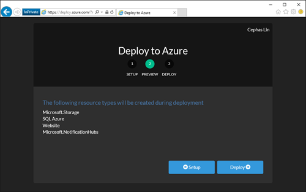 

4. Once deployment is finished, you can click the link for the app to browse to it, or click **Manage** to view and manage it in the Azure portal.  
    

### Congratulations! You have just deployed your first app to Azure App Service!

Click the **Manage** link to open the app's blade in the Azure portal.

 

Your App Service app's blade surfaces a rich set of settings and tools for you to configure, monitor, and secure, and troubleshoot your app. Take a moment to 
familiarize yourself with this interface by performing some simple tasks:

- stop the app
- restart the app
- click the **Resource Group** link to see all the resources deployed in the resource group
- click **Settings** > **Properties** to see other information about your app

The deployement method demonstrated here is [https://deploy.azure.com](https://deploy.azure.com), which deploys a [GitHub](https://github.com)-hosted 
repository to Azure App Service with or without a custom deployment template. This is one of the methods to continously publish your app to Azure. 
There are many other ways to deploy your app to App Service, such as Visual Studio, 
Team Foundation Server, Git, and FTP. For example, the easiest way for ASP.NET developers to get started is with the .NET Azure SDK, which 
gives you a simple and intuitive tool to help you provision the App Service resources *everytime you create an ASP.NET project* in Visual Studio. For 
more information on deployment options, see [Deploy your app to Azure App Service](../app-service-web/web-sites-deploy.md).

There is also a lot of content that shows you the range of apps you can build on App Service 

- [Create web apps](/documentation/learning-paths/appservice-webapps/)
- [Create mobile apps](/documentation/learning-paths/appservice-mobileapps/)
- [Create API apps](../app-service-api/app-service-api-apps-why-best-platform.md)

## Authenticate your users

Now, let's see how easy it is to add authentication to your app. Assuming that you have deployed 
[the first sample app](https://github.com/BlackrockDigital/startbootstrap-business-casual): 

1. In your app's blade, that you just opened, click **Settings** > **Authentication / Authorization**.  
   
    
2. Click **On** to turn on authentication.  
    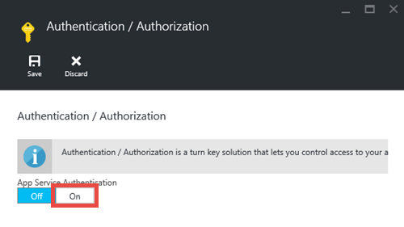
    
4. In **Authentication Providers**, click **Azure Active Directory**.  
    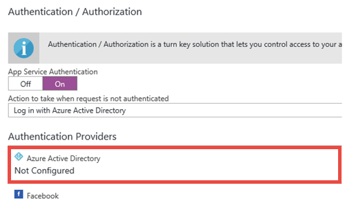

5. In the **Azure Active Directory Settings** blade, click **Express**, then click **OK**. The default settings will create a new Azure AD application in
your default directory.  
    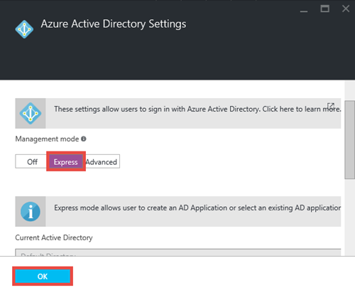

6. Click **Save**.  
    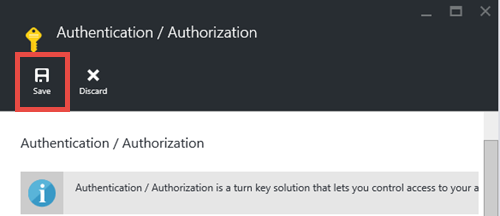

    Once the change is successful, you'll see the notification bell turn green.

7. Back in your app's main blade, click the **URL** link (or **Browse** in the menu bar). Note that the link is an HTTP address.  
    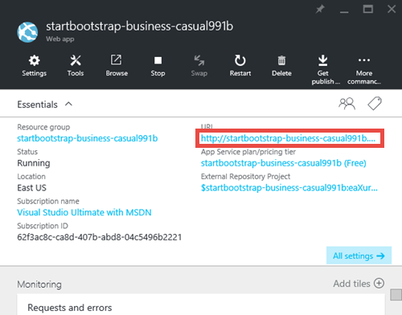  
    But once it opens the app in a new tab, the URL box redirects several times and finishes on your app with an HTTPS address. What you're seeing is that
    you're already logged into the Microsoft account with your Azure subscription, and you're automatically logged into the app using that account.  
    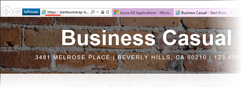  
    So if you now open another browser (to ensure that you're not already logged in), you'll see a login screen when you navigate to the same app's URL:
    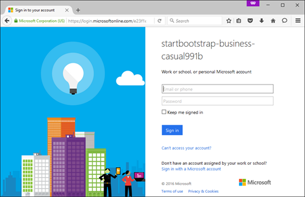  
    If you've never done anything with Azure Active Directory, your default directory might not have any Azure AD users. In that case, probably the only account
    in there is the Microsoft account with you Azure subscription, which is why you could be automatically logged into the app in the same browser earlier. 
    You can use that same Microsoft account to log in on this login page as well.

### Congratulations! You are authenticating all traffic to your site!

You may have noticed in the **Authentication / Authorization** blade that you can do a lot more, such as:

- Enable social login
- Enable multiple login options
- Change the default behavior when users first navigate to your app

App Service provides a turn-key solution for some of the common authentication needs so you don't need to provide the authentication logic yourself. 
For more information, see [...](/services/app-service/).

## Scale your app up and out

Next, let's scale your app. You scale your App Service app in two ways:

- [Scale up](https://en.wikipedia.org/wiki/Scalability#Horizontal_and_vertical_scaling): When you scale up an App Service app, you change the pricing
tier of the App Service plan the app belongs to. In additional to more CPU, memory, and disk space, scaling up gives you additional features, such 
as dedicated VM instances, autoscaling, SLA of 99.95%, custom domains, custom SSL certificates, deployment slots, backup and restore, and much more. 
Higher tiers provide more features to your App Service app.  
- [Scale out](https://en.wikipedia.org/wiki/Scalability#Horizontal_and_vertical_scaling): When you scale out an App Service app, you change the number 
of VM instances your app (or apps in the same App Service plan) runs on. With Standard tier or above, you can enable autoscaling of VM instances based
on performance metrics. 

Without further ado, let's set up autoscaling for your app.

1. First, let's scale up to enable autoscaling. In your app's blade, click **Settings** > **Scale Up (App Service Plan)**.  
    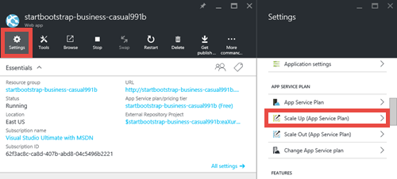

2. Scroll and select the **S1 Standard** tier, the lowest tier that supports autoscaling (circled below), then click **Select**.  
    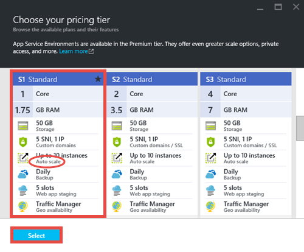

    You're done scaling up!
    
3. Next, let's configure autoscaling. In your app's blade, click **Settings** > **Scale Out (App Service Plan)**.  
    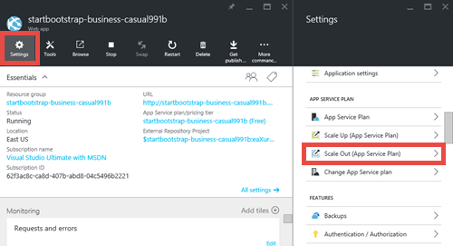

4. Change **Scale by** to **CPU Percentage**. The sliders underneath the dropdown will change accordingly. Then, define a **Target range** between 
**40** and **80**, either by typing in the boxes on the side or by moving the sliders in the middle.  
    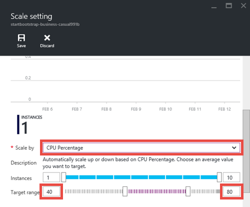
    
    Based on this configuration, your app will automatically scale out (to the maximum of 10 instances) when CPU utilization is above 80% and 
    scale in (to the minimum of 1 instance) when CPU utilization is below 40%. 
    
5. Click **Save** in the menu bar.

### Congratulations! Your app is autoscaling!

You may have noticed in the **Scale Settings** blade that you can do a lot more, such as:

- Scale to a specific number of instances manually
- Scale by additional performance metrics, such as memory percentage or disk queue
- Customize scaling behavior when a performance rule is triggered
- Autoscale on a schedule
- Set autoscaling behavior for a future event

For more information on scaling up your app, see [Scale pricing tier in Azure App Service](app-service-scale.md). For more information on
scaling out, see [Scale instance count manually or automatically](../azure-portal/insights-how-to-scale.md).

## Receive alerts for your app

Now that your app will automatically scale out, what happens when it has reach the maximum intance count (10 instances for **Standard** tier) and CPU 
utilization goes above your desired percentage (80%)? You can set up an alert to inform you of this situation so you can further scale up your app, for 
example. Let's quickly set up an alert for this.

1. In your app's blade, click **Tools** > **Alerts**.  
    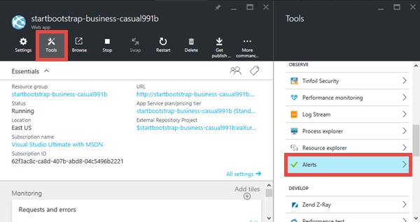

2. Click **Add alert**. Then, in the **Resource** box, select the resource that ends with **(serverfarms)**. That's your App Service plan.  
    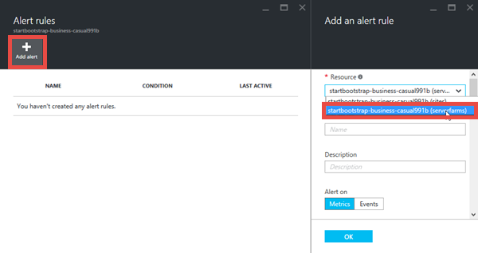

3. Specify **Name** as `CPU Maxed`, **Metric** as **CPU Percentage**, and **Threshold** as `90`, then select **Email owners, contributors, and readers**,
and then click **OK**.   
    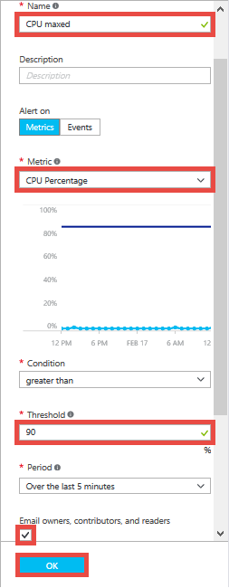
    
    As a subscription 

    When Azure finishes creating the alert, you'll see it in the **Alerts** blade.  
    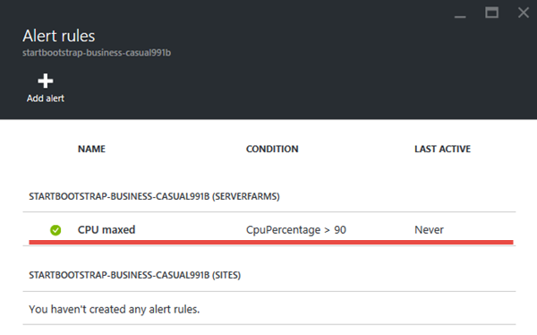

### Congratulations! You're now getting alerts! 

This alert setting will now check CPU utilization every 5 minutes. If that number goes above 90%,
you'll receive an email alert, along with anyone who is authorized. To see everyone who is authorized to receive the alerts, go back to your app's blade
and click the **Access** button.  
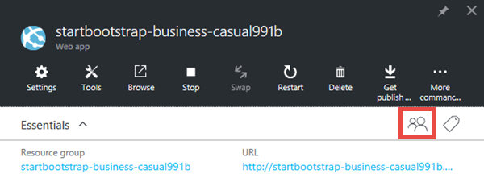

You should see that **Subscription admins** are already the **Owner** of the app. That would include you if you're the account administrator of your 
Azure subscription (e.g. your trial subscription). For more information on Azure role-based access control, see 
[Azure Role-Based Access Control](../active-directory/role-based-access-control-configure.md).

## Next Steps

On your way to configure the alert, you may have noticed a rich set of tools in the **Tools** blade, which lets you troubleshoot issues, 
monitor performance, test for vulnerabilities, manage resources, interact with the VM console, and add useful extensions. We invite you to click on 
each one of these tools to discover the simple yet powerful tools at your finger tips. 

Also, find out how to do more with your deployed app. Here's a partial list:

- [Buy and configure a custom domain name](../app-service-web/custom-dns-web-site-buydomains-web-app.md)
- [Set up staging environments](../app-service-web/web-sites-staged-publishing.md)
- [Set up continuous deployment](../app-service-web/web-sites-publish-source-control.md)
- [Backup your app](../app-service-web/web-sites-backup.md)
- [Enable diagnostic logs](../app-service-web/web-sites-enable-diagnostic-log.md)
- [Access on-premises resources](../app-service-web/web-sites-hybrid-connection-get-started.md)
- [Learn how App Service works](app-service-how-works-readme.md)