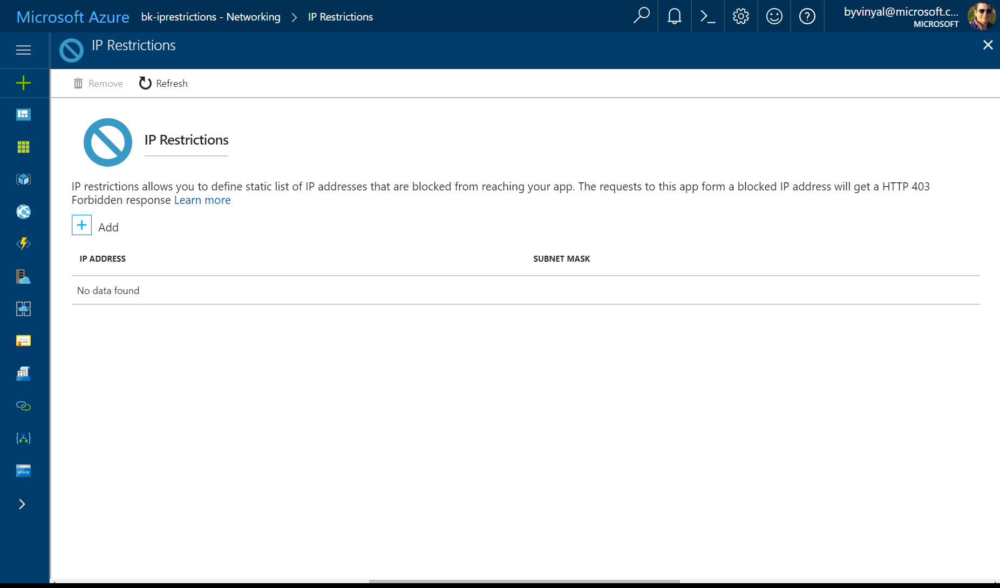
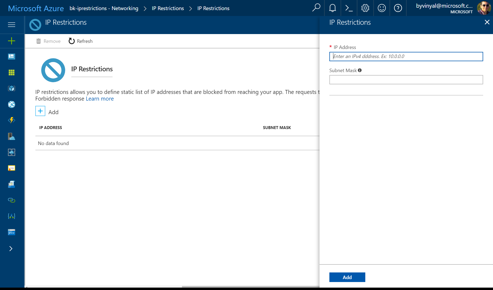

# Azure App Service Static IP Restrictions #

IP Restrictions allow you to define a black list of ip addresses that are blocked from accessing your app. The black list can include individual IP Addresses or a range of IP Addresses defined by a Subnet mask.

When a request to the app is generated from a client, the ip address is evaluated against the black list. If there is a match, the app replies with an [HTTP 403](https://en.wikipedia.org/wiki/HTTP_403) status code.

IP Restrictions are evaluated on the same App Service plan instances assigned to your app.

## Adding and IP Restriction using the Azure portal ##

To add an ip restriction rule to your app, use the menu to open **Network**>**IP Restrictions** and click on **Configure IP Restrictions**

![ip restrictions]
(media/app-service-ip-restrictions/ip-restrictions.png)

From here you can review the list IP restrictions rules defined for your app.

You can click on **[+] Add** to add a new ip restriction rule.

