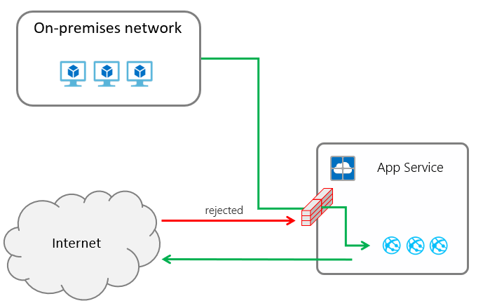
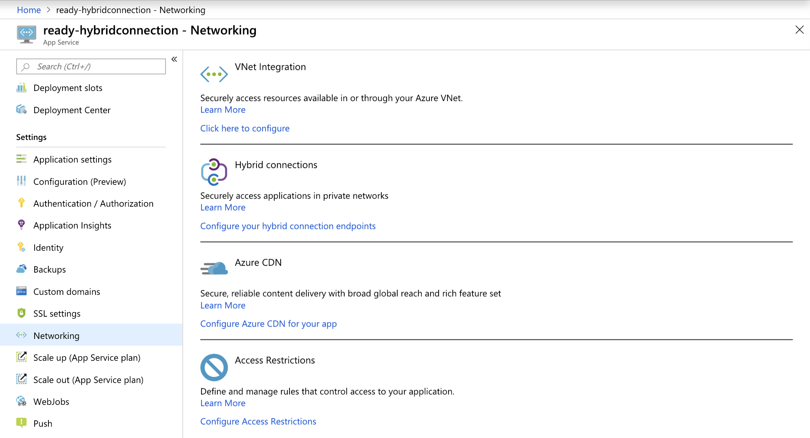
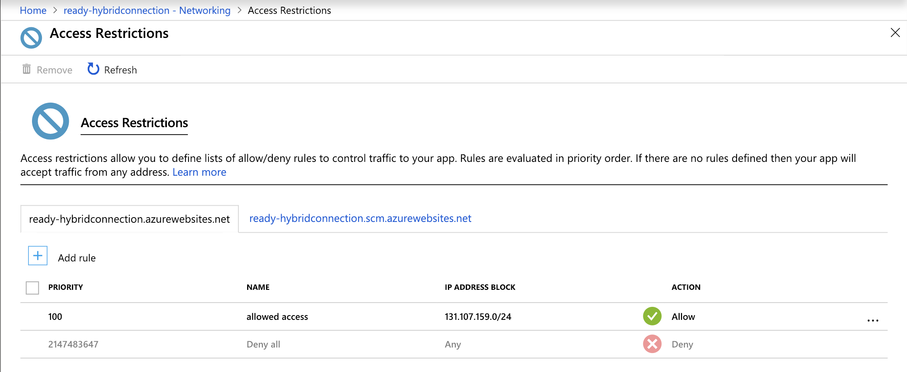
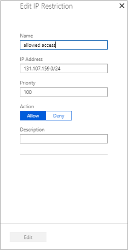
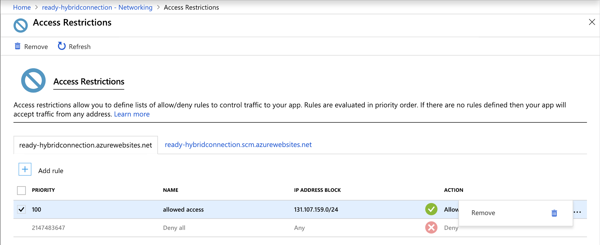
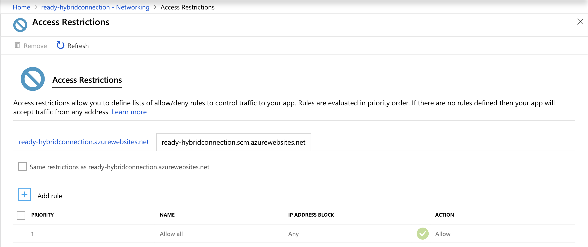

# Azure App Service Static Access Restrictions #

Access Restrictions allow you to define a priority ordered allow/deny list of IP addresses that are allowed to access your app. The allow list can include IPv4 and IPv6 addresses. When there are one or more entries, there is then an implicit deny all that exists at the end of the list.

The Access Restrictions capability works with all App Service hosted work loads, which include; web apps, API apps, Linux apps, Linux container apps, and Functions.

When a request is made to your app, the FROM IP address is evaluated against the Access Restrictions list. If the address is not allowed access based on the rules in the list, the service replies with an [HTTP 403](https://en.wikipedia.org/wiki/HTTP_403) status code.

The Access Restrictions capability is implemented in the App Service front-end roles, which are upstream of the worker hosts where your code runs. Therefore, Access Restrictions are effectively network ACLs.  

For a time, the Access Restrictions capability in the portal was a layer on top of the ipSecurity capability in IIS. The current Access Restrictions capability is different. You can still configure ipSecurity within your application web.config but the front-end based Access Restrictions rules will be applied before any traffic reaches IIS.

## Adding and editing Access Restriction rules in the portal ##

To add an access restriction rule to your app, use the menu to open **Network**>**Access Restrictions** and click on **Configure Access Restrictions**

  

From the Access Restrictions UI, you can review the list of access restriction rules defined for your app.

If your rules were configured as in this image, then your app would only accept traffic from 131.107.159.0/24 and would be denied from any other IP address.

You can click on **[+] Add** to add a new access restriction rule. Once you add a rule, it will become effective immediately. Rules are enforced in priority order starting from the lowest number and going up. There is an implicit deny all that is in effect once you add even a single rule.

IP Address notation must be specified in CIDR notation for both IPv4 and IPv6 addresses. To specify an exact address, you can use something like 1.2.3.4/32 where the first four octets represent your IP address and /32 is the mask. The IPv4 CIDR notation for all addresses is 0.0.0.0/0. To learn more about CIDR notation, you can read [Classless Inter-Domain Routing](https://en.wikipedia.org/wiki/Classless_Inter-Domain_Routing).  

You can click on any row to edit an existing access restriction rule. Edits are effective immediately including changes in priority ordering.

To delete a rule, click the **...** on your rule and then click **remove**.

You can also restrict deployment access in the next tab. To add/edit/delete each rule, follow the same step as above.

## Programmatic manipulation of access restriction rules ##

There currently is no CLI or PowerShell for the new Access Restrictions capability but the values can be set manually with a PUT operation on the app configuration in Resource Manager. As an example, you can use resources.azure.com and edit the ipSecurityRestrictions block to add the required JSON.

The location for this information in Resource Manager is:

management.azure.com/subscriptions/**subscription ID**/resourceGroups/**resource groups**/providers/Microsoft.Web/sites/**web app name**/config/web?api-version=2018-02-01

The JSON syntax for the earlier example is:

    "ipSecurityRestrictions": [
      {
        "ipAddress": "131.107.159.0/24",
        "action": "Allow",
        "tag": "Default",
        "priority": 100,
        "name": "allowed access"
      }
    ],

## Function App IP Restrictions

IP restrictions are available for both Function Apps with the same functionality as App Service plans. Note that enabling IP restrictions will disable the portal code editor for any disallowed IPs.

[Learn more here](../azure-functions/functions-networking-options.md#inbound-ip-restrictions)