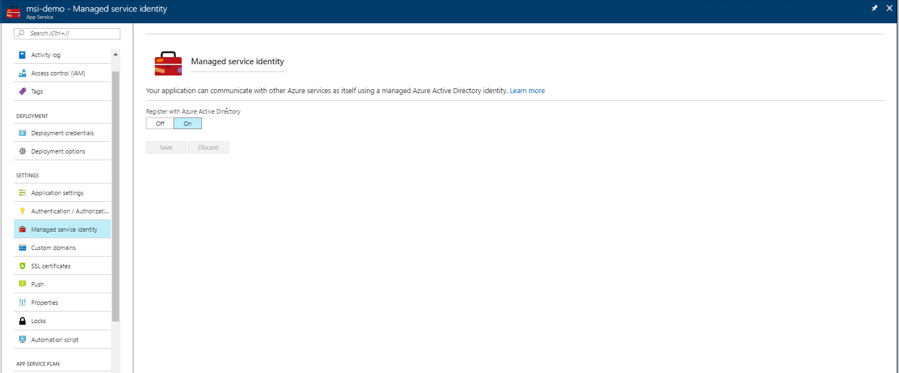

# How to use managed identities for App Service and Azure Functions

> [!NOTE] 
> App Service on Linux and Web App for Containers do not currently support managed identities.

> [!Important] 
> Managed identities for App Service and Azure Functions will not behave as expected if your app is migrated across subscriptions/tenants. The app will need to obtain a new identity, which can be done by disabling and re-enabling the feature. See [Removing an identity](#remove) below. Downstream resources will also need to have access policies updated to use the new identity.

This topic shows you how to create a managed identity for App Service and Azure Functions applications and how to use it to access other resources. A managed identity from Azure Active Directory allows your app to easily access other AAD-protected resources such as Azure Key Vault. The identity is managed by the Azure platform and does not require you to provision or rotate any secrets. For more about managed identities in AAD, see [Managed identities for Azure resources](../active-directory/managed-identities-azure-resources/overview.md).

## Creating an app with an identity

Creating an app with an identity requires an additional property to be set on the application.

### Using the Azure portal

To set up a managed identity in the portal, you will first create an application as normal and then enable the feature.

1. Create an app in the portal as you normally would. Navigate to it in the portal.

2. If using a function app, navigate to **Platform features**. For other app types, scroll down to the **Settings** group in the left navigation.

3. Select **Managed identity**.

4. Switch **Register with Azure Active Directory** to **On**. Click **Save**.



### Using the Azure CLI

To set up a managed identity using the Azure CLI, you will need to use the `az webapp identity assign` command against an existing application. You have three options for running the examples in this section:

- Use [Azure Cloud Shell](../cloud-shell/overview.md) from the Azure portal.
- Use the embedded Azure Cloud Shell via the "Try It" button, located in the top right corner of each code block below.
- [Install the latest version of Azure CLI](https://docs.microsoft.com/cli/azure/install-azure-cli) (2.0.31 or later) if you prefer to use a local CLI console. 

The following steps will walk you through creating a web app and assigning it an identity using the CLI:

1. If you're using the Azure CLI in a local console, first sign in to Azure using [az login](/cli/azure/reference-index#az-login). Use an account that is associated with the Azure subscription under which you would like to deploy the application:

    ```azurecli-interactive
    az login
    ```
2. Create a web application using the CLI. For more examples of how to use the CLI with App Service, see [App Service CLI samples](../app-service/app-service-cli-samples.md):

    ```azurecli-interactive
    az group create --name myResourceGroup --location westus
    az appservice plan create --name myPlan --resource-group myResourceGroup --sku S1
    az webapp create --name myApp --resource-group myResourceGroup --plan myPlan
    ```

3. Run the `identity assign` command to create the identity for this application:

    ```azurecli-interactive
    az webapp identity assign --name myApp --resource-group myResourceGroup
    ```

### Using Azure PowerShell

The following steps will walk you through creating a web app and assigning it an identity using Azure PowerShell:

1. If needed, install the Azure PowerShell using the instruction found in the [Azure PowerShell guide](/powershell/azure/overview), and then run `Login-AzureRmAccount` to create a connection with Azure.

2. Create a web application using Azure PowerShell. For more examples of how to use Azure PowerShell with App Service, see [App Service PowerShell samples](../app-service/app-service-powershell-samples.md):

    ```azurepowershell-interactive
    # Create a resource group.
    New-AzureRmResourceGroup -Name myResourceGroup -Location $location
    
    # Create an App Service plan in Free tier.
    New-AzureRmAppServicePlan -Name $webappname -Location $location -ResourceGroupName myResourceGroup -Tier Free
    
    # Create a web app.
    New-AzureRmWebApp -Name $webappname -Location $location -AppServicePlan $webappname -ResourceGroupName myResourceGroup
    ```

3. Run the `identity assign` command to create the identity for this application:

    ```azurepowershell-interactive
    Set-AzureRmWebApp -AssignIdentity $true -Name $webappname -ResourceGroupName myResourceGroup 
    ```

### Using an Azure Resource Manager template

An Azure Resource Manager template can be used to automate deployment of your Azure resources. To learn more about deploying to App Service and Functions, see [Automating resource deployment in App Service](../app-service/app-service-deploy-complex-application-predictably.md) and [Automating resource deployment in Azure Functions](../azure-functions/functions-infrastructure-as-code.md).

Any resource of type `Microsoft.Web/sites` can be created with an identity by including the following property in the resource definition:
```json
"identity": {
    "type": "SystemAssigned"
}    
```

This tells Azure to create and manage the identity for your application.

For example, a web app might look like the following:
```json
{
    "apiVersion": "2016-08-01",
    "type": "Microsoft.Web/sites",
    "name": "[variables('appName')]",
    "location": "[resourceGroup().location]",
    "identity": {
        "type": "SystemAssigned"
    },
    "properties": {
        "name": "[variables('appName')]",
        "serverFarmId": "[resourceId('Microsoft.Web/serverfarms', variables('hostingPlanName'))]",
        "hostingEnvironment": "",
        "clientAffinityEnabled": false,
        "alwaysOn": true
    },
    "dependsOn": [
        "[resourceId('Microsoft.Web/serverfarms', variables('hostingPlanName'))]"
    ]
}
```

When the site is created, it has the following additional properties:
```json
"identity": {
    "tenantId": "<TENANTID>",
    "principalId": "<PRINCIPALID>"
}
```

Where `<TENANTID>` and `<PRINCIPALID>` are replaced with GUIDs. The tenantId property identifies what AAD tenant the identity belongs to. The principalId is a unique identifier for the application's new identity. Within AAD, the service principal has the same name that you gave to your App Service or Azure Functions instance.

## Obtaining tokens for Azure resources

An app can use its identity to get tokens to other resources protected by AAD, such as Azure Key Vault. These tokens represent the application accessing the resource, and not any specific user of the application. 

> [!IMPORTANT]
> You may need to configure the target resource to allow access from your application. For example, if you request a token to Key Vault, you need to make sure you have added an access policy that includes your application's identity. Otherwise, your calls to Key Vault will be rejected, even if they include the token. To learn more about which resources support Azure Active Directory tokens, see [Azure services that support Azure AD authentication](../active-directory/managed-identities-azure-resources/services-support-msi.md#azure-services-that-support-azure-ad-authentication).

There is a simple REST protocol for obtaining a token in App Service and Azure Functions. For .NET applications, the Microsoft.Azure.Services.AppAuthentication library provides an abstraction over this protocol and supports a local development experience.

### <a name="asal"></a>Using the Microsoft.Azure.Services.AppAuthentication library for .NET

For .NET applications and functions, the simplest way to work with a managed identity is through the Microsoft.Azure.Services.AppAuthentication package. This library will also allow you to test your code locally on your development machine, using your user account from Visual Studio, the [Azure CLI](/cli/azure), or Active Directory Integrated Authentication. For more on local development options with this library, see the [Microsoft.Azure.Services.AppAuthentication reference]. This section shows you how to get started with the library in your code.

1. Add references to the [Microsoft.Azure.Services.AppAuthentication](https://www.nuget.org/packages/Microsoft.Azure.Services.AppAuthentication) and [Microsoft.Azure.KeyVault](https://www.nuget.org/packages/Microsoft.Azure.KeyVault) NuGet packages to your application.

2.  Add the following code to your application:

```csharp
using Microsoft.Azure.Services.AppAuthentication;
using Microsoft.Azure.KeyVault;
// ...
var azureServiceTokenProvider = new AzureServiceTokenProvider();
string accessToken = await azureServiceTokenProvider.GetAccessTokenAsync("https://vault.azure.net");
// OR
var kv = new KeyVaultClient(new KeyVaultClient.AuthenticationCallback(azureServiceTokenProvider.KeyVaultTokenCallback));
```

To learn more about Microsoft.Azure.Services.AppAuthentication and the operations it exposes, see the [Microsoft.Azure.Services.AppAuthentication reference] and the [App Service and KeyVault with MSI .NET sample](https://github.com/Azure-Samples/app-service-msi-keyvault-dotnet).

### Using the REST protocol

An app with a managed identity has two environment variables defined:
- MSI_ENDPOINT
- MSI_SECRET

The **MSI_ENDPOINT** is a local URL from which your app can request tokens. To get a token for a resource, make an HTTP GET request to this endpoint, including the following parameters:

> [!div class="mx-tdBreakAll"]
> |Parameter name|In|Description|
> |-----|-----|-----|
> |resource|Query|The AAD resource URI of the resource for which a token should be obtained.|
> |api-version|Query|The version of the token API to be used. "2017-09-01" is currently the only version supported.|
> |secret|Header|The value of the MSI_SECRET environment variable.|


A successful 200 OK response includes a JSON body with the following properties:

> [!div class="mx-tdBreakAll"]
> |Property name|Description|
> |-------------|----------|
> |access_token|The requested access token. The calling web service can use this token to authenticate to the receiving web service.|
> |expires_on|The time when the access token expires. The date is represented as the number of seconds from 1970-01-01T0:0:0Z UTC until the expiration time. This value is used to determine the lifetime of cached tokens.|
> |resource|The App ID URI of the receiving web service.|
> |token_type|Indicates the token type value. The only type that Azure AD supports is Bearer. For more information about bearer tokens, see [The OAuth 2.0 Authorization Framework: Bearer Token Usage (RFC 6750)](http://www.rfc-editor.org/rfc/rfc6750.txt).|


This response is the same as the [response for the AAD service-to-service access token request](../active-directory/develop/v1-oauth2-client-creds-grant-flow.md#service-to-service-access-token-response).

> [!NOTE] 
> Environment variables are set up when the process first starts, so after enabling a managed identity for your application, you may need to restart your application, or redeploy its code, before `MSI_ENDPOINT` and `MSI_SECRET` are available to your code.

### REST protocol examples
An example request might look like the following:
```
GET /MSI/token?resource=https://vault.azure.net&api-version=2017-09-01 HTTP/1.1
Host: localhost:4141
Secret: 853b9a84-5bfa-4b22-a3f3-0b9a43d9ad8a
```
And a sample response might look like the following:
```
HTTP/1.1 200 OK
Content-Type: application/json
 
{
    "access_token": "eyJ0eXAi…",
    "expires_on": "09/14/2017 00:00:00 PM +00:00",
    "resource": "https://vault.azure.net",
    "token_type": "Bearer"
}
```

### Code examples
<a name="token-csharp"></a>To make this request in C#:
```csharp
public static async Task<HttpResponseMessage> GetToken(string resource, string apiversion)  {
    HttpClient client = new HttpClient();
    client.DefaultRequestHeaders.Add("Secret", Environment.GetEnvironmentVariable("MSI_SECRET"));
    return await client.GetAsync(String.Format("{0}/?resource={1}&api-version={2}", Environment.GetEnvironmentVariable("MSI_ENDPOINT"), resource, apiversion));
}
```
> [!TIP]
> For .NET languages, you can also use [Microsoft.Azure.Services.AppAuthentication](#asal) instead of crafting this request yourself.

<a name="token-js"></a>In Node.JS:
```javascript
const rp = require('request-promise');
const getToken = function(resource, apiver, cb) {
    var options = {
        uri: `${process.env["MSI_ENDPOINT"]}/?resource=${resource}&api-version=${apiver}`,
        headers: {
            'Secret': process.env["MSI_SECRET"]
        }
    };
    rp(options)
        .then(cb);
}
```

<a name="token-powershell"></a>In PowerShell:
```powershell
$apiVersion = "2017-09-01"
$resourceURI = "https://<AAD-resource-URI-for-resource-to-obtain-token>"
$tokenAuthURI = $env:MSI_ENDPOINT + "?resource=$resourceURI&api-version=$apiVersion"
$tokenResponse = Invoke-RestMethod -Method Get -Headers @{"Secret"="$env:MSI_SECRET"} -Uri $tokenAuthURI
$accessToken = $tokenResponse.access_token
```

## <a name="remove"></a>Removing an identity

An identity can be removed by disabling the feature using the portal, PowerShell, or CLI in the same way that it was created. In the REST/ARM template protocol, this is done by setting the type to "None":

```json
"identity": {
    "type": "None"
}    
```

Removing the identity in this way will also delete the principal from AAD. System-assigned Identities are automatically removed from AAD when the app resource is deleted.

> [!NOTE] 
> There is also an application setting that can be set, WEBSITE_DISABLE_MSI, which just disables the local token service. However, it leaves the identity in place, and tooling will still show the managed identity as "on" or "enabled." As a result, use of this setting is not recommmended.

## Next steps

> [!div class="nextstepaction"]
> [Access SQL Database securely using a managed identity](app-service-web-tutorial-connect-msi.md)

[Microsoft.Azure.Services.AppAuthentication reference]: https://go.microsoft.com/fwlink/p/?linkid=862452
