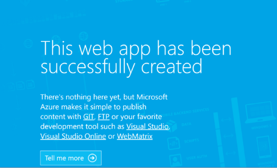

# Load Balance an App Geographically with Azure PowerShell

## Summary


In less than 5 minutes, you will execute a series of command-line tools to generation the following in Azure:

* Resource Group
* App Service Plan
* App Service Site
* Traffic Manager Profile
* Traffic Manager Endpoint

Once completed, you will have a Web Server which is configured in a Performance based Load Balancer.

[!INCLUDE [App Service CLI Create Site](../../includes/app-service-powershell-create-site.md)]

## Step 2: Upgrade App Service Plan to Standard

**Command**

```powershell
Set-AzureRMAppServicePlan -Tier Standard -Name <plan-name> -ResourceGroupName <resource-group-name>
```

**Output**

```text
Sku                       : Microsoft.Azure.Management.WebSites.Models.SkuDescription
ServerFarmWithRichSkuName : <plan-name>
WorkerTierName            :
Status                    : Ready
Subscription              : <subscription-id>
AdminSiteName             :
HostingEnvironmentProfile :
MaximumNumberOfWorkers    : 10
GeoRegion                 : <resource-group-name>
PerSiteScaling            : False
NumberOfSites             : 1
ResourceGroup             : <resource-group-name>
Id                        : /subscriptions/<subscription-id>/resourceGroups/<resource-group-name>/providers/Microsoft.Web/serverfarms/<plan-name>
Name                      : <plan-name>
Location                  : West US
Type                      : Microsoft.Web/serverfarms
Tags                      :
```

## Step 3: Create Traffic Manager Profile

**Command**

```powershell
New-AzureRMTrafficManagerProfile -Name <profile-name> -ResourceGroupName <resource-group-name> -TrafficRoutingMethod <routing-method> -RelativeDnsName <unique-dns-name> -Ttl 300 -MonitorProtocol HTTP -MonitorPort 80 -MonitorPath /
```

**Output** 

```text
Id                   : /subscriptions/<subscription-id>/resourceGroups/<resource-group-name>/providers/Microsoft.Network/trafficManagerProfiles/<unique-dns-name>
Name                 : <plan-name>
ResourceGroupName    : <resource-group-name>
RelativeDnsName      : <plan-name>
Ttl                  : 300
ProfileStatus        : Enabled
TrafficRoutingMethod : <routing-method>
MonitorProtocol      : HTTP
MonitorPort          : 80
MonitorPath          : /
Endpoints            : {}
```

## Step 4: Add the App Service Traffic Manager Endpoint

**Command**

```powershell
New-AzureRmTrafficManagerEndpoint -Name <endpoint-name> -ProfileName <profile-name> -ResourceGroupName <resource-group-name> -Type <endpoint-type> -TargetResourceId <target-resource-id>
```

**Output**

```text
Id                    : /subscriptions/<subscription-id>/resourceGroups/<resource-group-name>/providers/Microsoft.Network/trafficManagerProfiles/<profile-name>/azureEndpoints/<endpoint-name>
Name                  : <endpoint-name>
ProfileName           : <profile-name>
ResourceGroupName     : <resource-group-name>
Type                  : AzureEndpoints
TargetResourceId      : /subscriptions/<subscription-id>/resourceGroups/<resource-group-name>/providers/Microsoft.Web/sites/<app-name>
Target                : <app-name>.azurewebsites.net
EndpointStatus        : Enabled
Weight                : 1
Priority              : 1
Location              : <resource-group-location>
EndpointMonitorStatus : CheckingEndpoint
MinChildEndpoints     :
```

## Step 5: Validate

**Command**

```powershell
Get-AzureRmTrafficManagerProfile -Name <profile-name> -ResourceGroupName <resource-group-name> | % {$_.RelativeDnsName + '.trafficmanager.net'}
```

**Output**

Paste the resulting URL into your favourite web browser.



## Conclusion

Your subscription should now be populated with the following:

* Resource Group
* App Service Plan
* App Service Site
* Traffic Manager Profile
* Traffic Manager Endpoint

Continue this challenge by creating another site and adding it as an endpoint in traffic manager.

## Glossary

| Token | Service | Description | Data Type |
|---|---|---|---|
| resource-group-name | Resource Group | The name of the Resource Group to deploy the services | string |
| resource-group-location | Resource Group | The region in which to create your resource group | string |
| plan-name | App Service | The name to give to the App Service Site | string |
| app-name | App Service | The name to give to the App Service Site | string |
| profile-name | Traffic Manager | The friendly name provided to the Profile | string |
| routing-method | Traffic Manager | One of the following | Enum: [Performance \| Priority \| Weighted] |
| unique-dns-name | Traffic Manager | The (globally) unique dns prefix for the traffic manager profile | string |
| endpoint-name | Traffic Manager | The friendly name to provide to the Endpoint | string |
| endpoint-type | Traffic Manager | The type of endpoint which is to be configured | Enum: [azureEndpoints \| externalEndpoints \| nestedEndpoints] |
| target-resource-id | Traffic Manager | The ResourceId of the App Service which is to be added as an endpoint. | relative uri |

## Related documentation

* [App Service](index.md)
* [Traffic Manager](../traffic-manager/index.md)