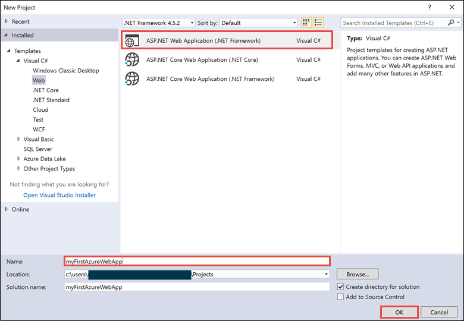
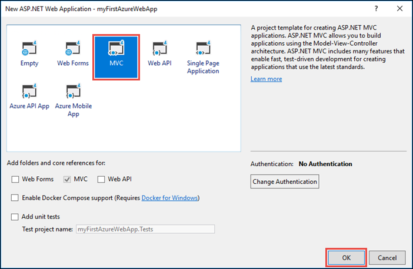
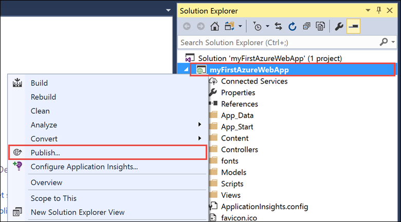
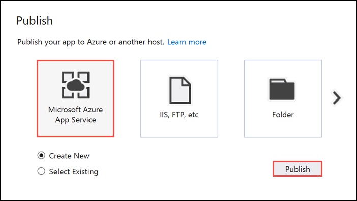
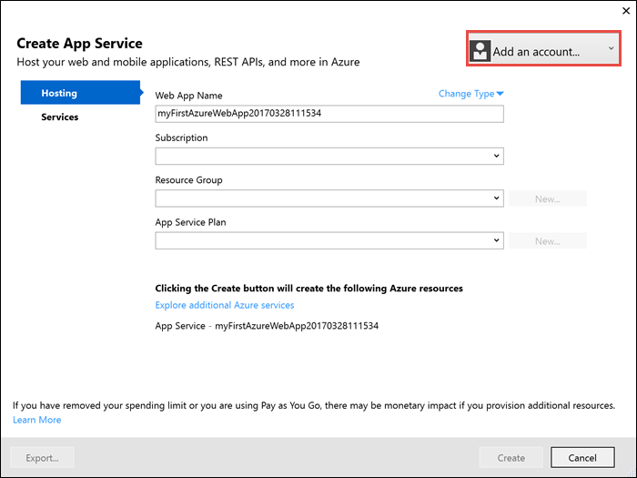
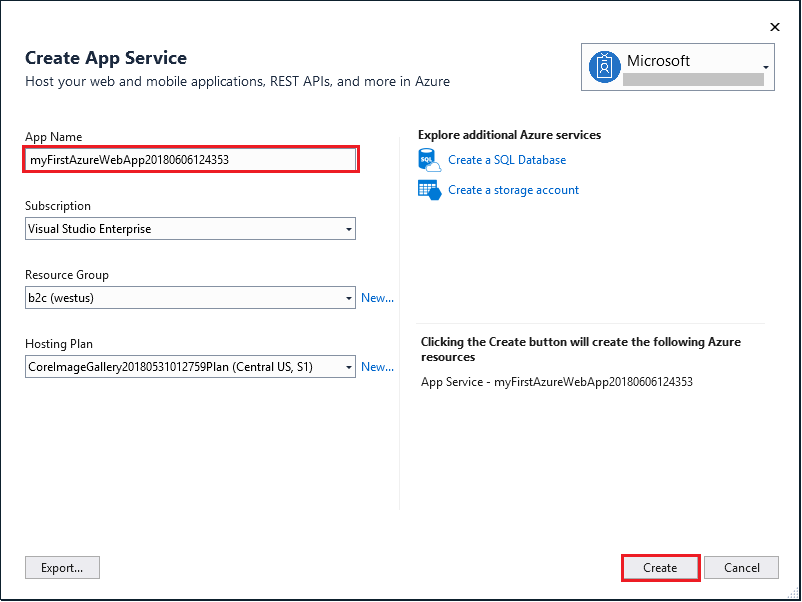
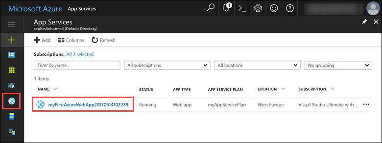
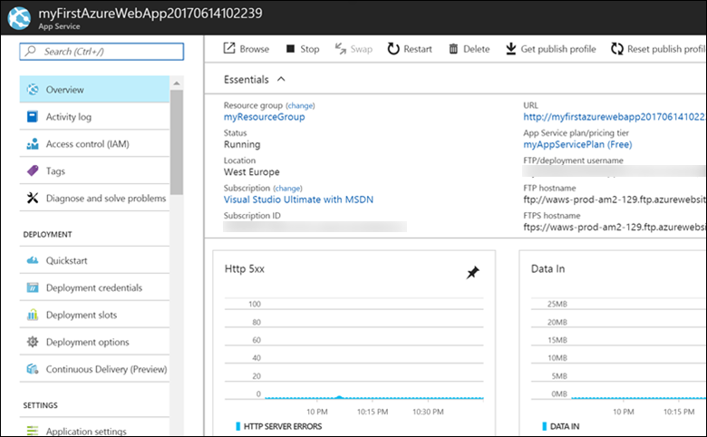

# Create an ASP.NET Framework web app in Azure

[Azure Web Apps](app-service-web-overview.md) provides a highly scalable, self-patching web hosting service.  This quickstart shows how to deploy your first ASP.NET web app to Azure Web Apps. When you're finished, you'll have a resource group that consists of an App Service plan and an Azure web app with a deployed web application.


[!INCLUDE [quickstarts-free-trial-note](../../includes/quickstarts-free-trial-note.md)]

## Prerequisites

To complete this tutorial, install <a href="https://www.visualstudio.com/downloads/" target="_blank">Visual Studio 2017</a> with the **ASP.NET and web development** workload.

If you've installed Visual Studio 2017 already:

- Install the latest updates in Visual Studio by clicking **Help** > **Check for Updates**.
- Add the workload by clicking **Tools** > **Get Tools and Features**.

## Create an ASP.NET web app

In Visual Studio, create a project by selecting **File > New > Project**. 

In the **New Project** dialog, select **Visual C# > Web > ASP.NET Web Application (.NET Framework)**.

Name the application _myFirstAzureWebApp_, and then select **OK**.
   


You can deploy any type of ASP.NET web app to Azure. For this quickstart, select the **MVC** template, and make sure authentication is set to **No Authentication**.
      
Select **OK**.



From the menu, select **Debug > Start without Debugging** to run the web app locally.


## Launch the publish wizard

In the **Solution Explorer**, right-click the **myFirstAzureWebApp** project and select **Publish**.



The publish wizard is automatically launched. Select **App Service** > **Publish** to open the **Create App Service** dialog.



## Sign in to Azure

In the **Create App Service** dialog, select **Add an account**, and sign in to your Azure subscription. If you're already signed in, select the account containing the desired subscription from the dropdown.

> [!NOTE]
> If you're already signed in, don't select **Create** yet.
>
>
   


## Create a resource group

[!INCLUDE [resource group intro text](../../includes/resource-group.md)]

Next to **Resource Group**, select **New**.

Name the resource group **myResourceGroup** and select **OK**.

## Create an App Service plan

[!INCLUDE [app-service-plan](../../includes/app-service-plan.md)]

Next to **Hosting Plan**, select **New**. 

In the **Configure Hosting Plan** dialog, use the settings in the table following the screenshot.


| Setting | Suggested Value | Description |
|-|-|-|
|App Service Plan| myAppServicePlan | Name of the App Service plan. |
| Location | West Europe | The datacenter where the web app is hosted. |
| Size | Free | [Pricing tier](https://azure.microsoft.com/pricing/details/app-service/?ref=microsoft.com&utm_source=microsoft.com&utm_medium=docs&utm_campaign=visualstudio) determines hosting features. |

Select **OK**.

## Create and publish the web app

In **App Name**, type a unique app name (valid characters are `a-z`, `0-9`, and `-`), or accept the automatically generated unique name. The URL of the web app is `http://<app_name>.azurewebsites.net`, where `<app_name>` is your app name.

Select **Create** to start creating the Azure resources.



Once the wizard completes, it publishes the ASP.NET web app to Azure, and then launches the app in the default browser.


The app name specified in the [create and publish step](#create-and-publish-the-web-app) is used as the URL prefix in the format `http://<app_name>.azurewebsites.net`.

Congratulations, your ASP.NET web app is running live in Azure App Service.

## Update the app and redeploy

From the **Solution Explorer**, open _Views\Home\Index.cshtml_.

Find the `<div class="jumbotron">` HTML tag near the top, and replace the entire element with the following code:

```HTML
<div class="jumbotron">
    <h1>ASP.NET in Azure!</h1>
    <p class="lead">This is a simple app that we’ve built that demonstrates how to deploy a .NET app to Azure App Service.</p>
</div>
```

To redeploy to Azure, right-click the **myFirstAzureWebApp** project in **Solution Explorer** and select **Publish**.

On the publish page, select **Publish**.


When publishing completes, Visual Studio launches a browser to the URL of the web app.


## Manage the Azure web app

Go to the <a href="https://portal.azure.com" target="_blank">Azure portal</a> to manage the web app.

From the left menu, select **App Services**, and then select the name of your Azure web app.



You see your web app's Overview page. Here, you can perform basic management tasks like browse, stop, start, restart, and delete. 



The left menu provides different pages for configuring your app. 

## Video

Watch the video to see this quickstart in action and then follow the steps yourself to publish your first .NET app on Azure.

> [!VIDEO https://channel9.msdn.com/Shows/Azure-for-NET-Developers/Create-a-NET-app-in-Azure-Quickstart/player]

[!INCLUDE [Clean-up section](../../includes/clean-up-section-portal.md)]

## Next steps

> [!div class="nextstepaction"]
> [ASP.NET with SQL Database](app-service-web-tutorial-dotnet-sqldatabase.md)
