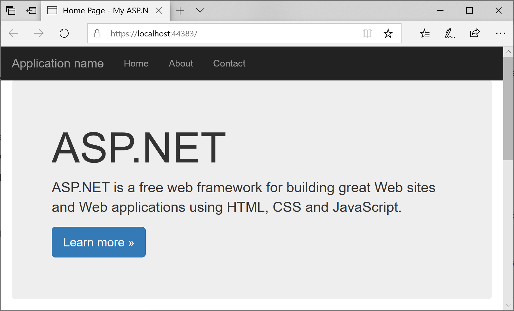
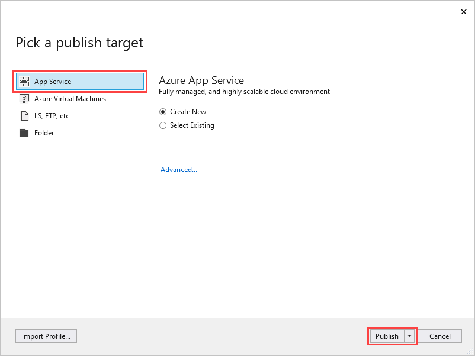
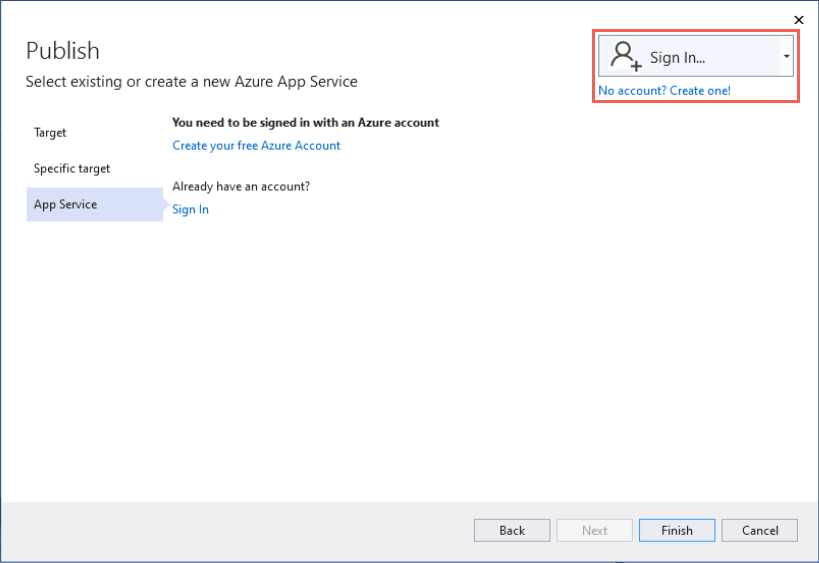
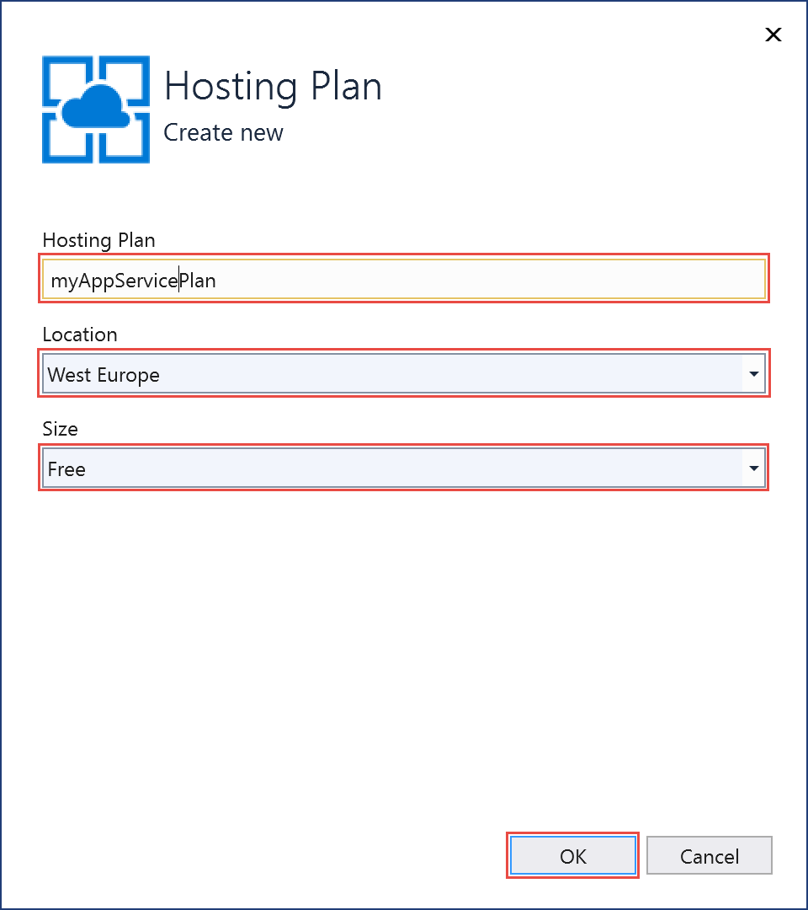
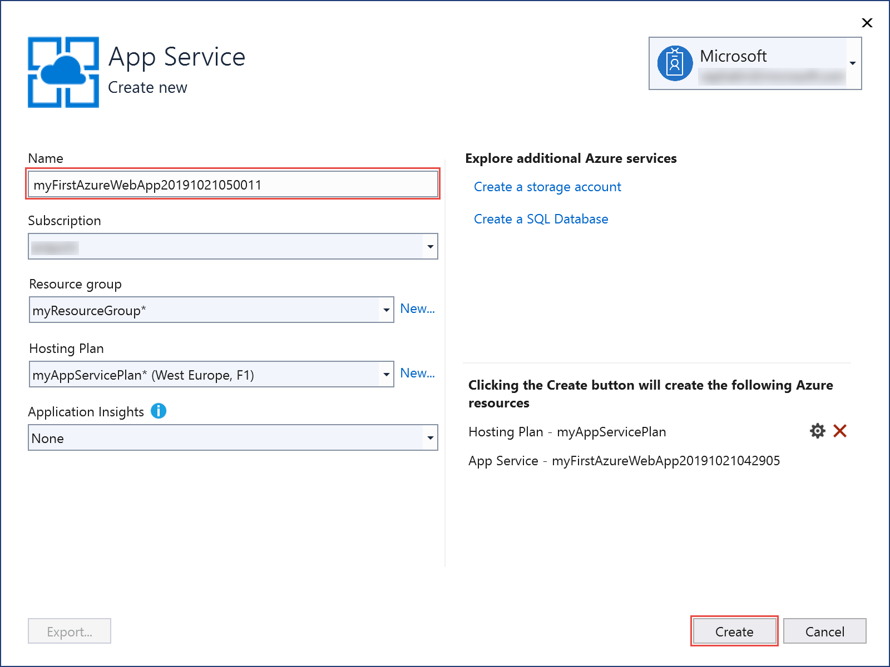
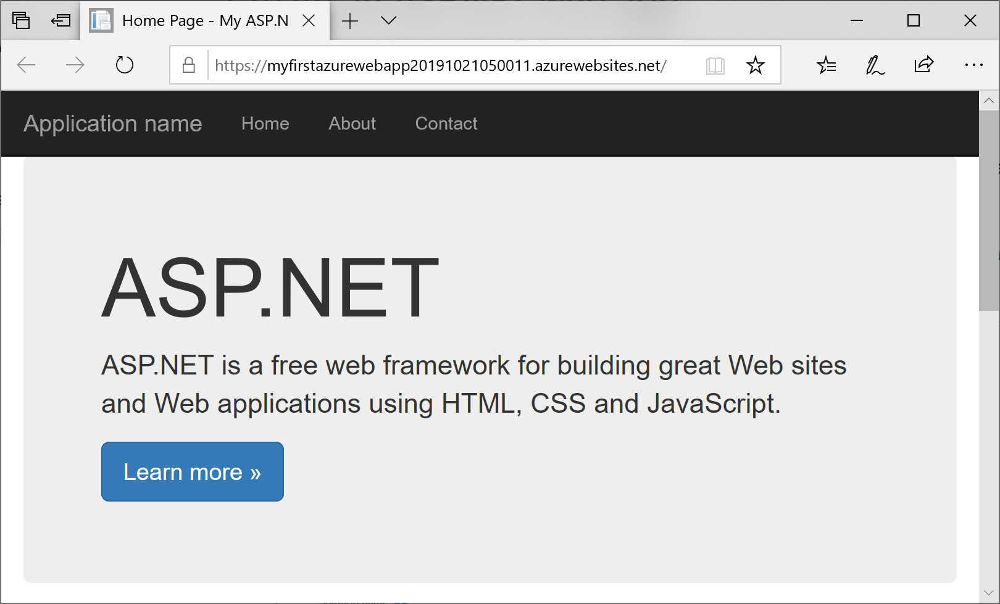
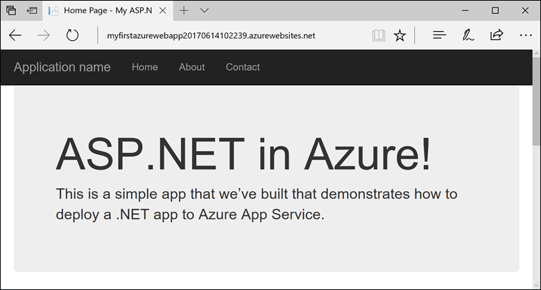
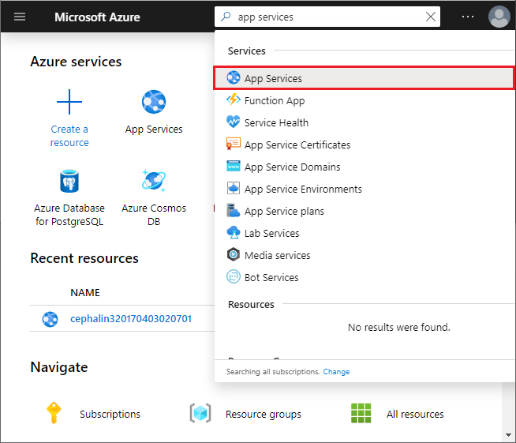
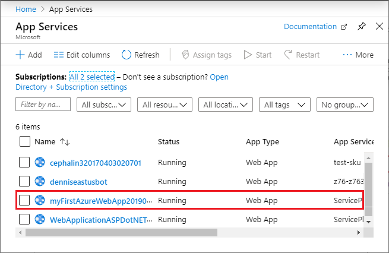
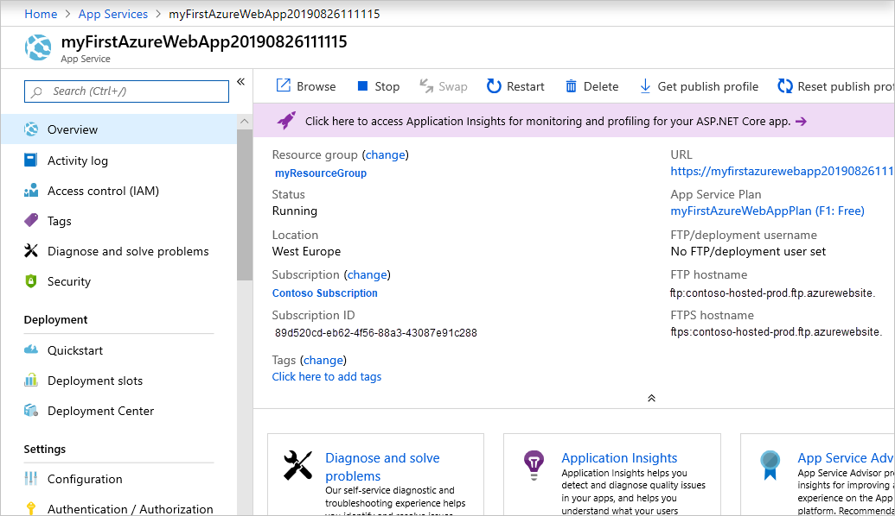

# Create an ASP.NET Framework web app in Azure

[Azure App Service](overview.md) provides a highly scalable, self-patching web hosting service.

This quickstart shows how to deploy your first ASP.NET web app to Azure App Service. When you're finished, you'll have an App Service plan. You'll also have an App Service app with a deployed web application.

[!INCLUDE [quickstarts-free-trial-note](../../includes/quickstarts-free-trial-note.md)]

## Prerequisites

To complete this tutorial, install <a href="https://www.visualstudio.com/downloads/" target="_blank">Visual Studio 2019</a> with the **ASP.NET and web development** workload.

If you've installed Visual Studio 2019 already:

- Install the latest updates in Visual Studio by selecting **Help** > **Check for Updates**.
- Add the workload by selecting **Tools** > **Get Tools and Features**.

## Create an ASP.NET web app <a name="create-and-publish-the-web-app"></a>

Create an ASP.NET web app by following these steps:

1. Open Visual Studio and then select **Create a new project**.

2. In **Create a new project**, find and choose **ASP.NET Web Application (.NET Framework)**, then select **Next**.

3. In **Configure your new project**, name the application _myFirstAzureWebApp_, and then select **Create**.

   

4. You can deploy any type of ASP.NET web app to Azure. For this quickstart, choose the **MVC** template.

5. Make sure authentication is set to **No Authentication**. Select **Create**.

   

6. From the Visual Studio menu, select **Debug** > **Start Without Debugging** to run the web app locally.

   

## Publish your web app <a name="launch-the-publish-wizard"></a>

1. In **Solution Explorer**, right-click the **myFirstAzureWebApp** project and select **Publish**.

1. Choose **App Service** and select **Create profile**.

   

1. In **App Service Create new**, your options depend on whether you're signed in to Azure already and whether you have a Visual Studio account linked to an Azure account. Select either **Add an account** or **Sign in** to sign in to your Azure subscription. If you're already signed in, select the account you want.

   > [!NOTE]
   > If you're already signed in, don't select **Create** yet.
   >
   >

   

   [!INCLUDE [resource group intro text](../../includes/resource-group.md)]

1. For **Resource group**, select **New**.

1. In **New resource group name**, enter *myResourceGroup* and select **OK**.

   [!INCLUDE [app-service-plan](../../includes/app-service-plan.md)]

1. For to **Hosting Plan**, select **New**.

1. In the **Configure Hosting Plan** dialog, enter the values from the following table, and then select **OK**.

   | Setting | Suggested Value | Description |
   |-|-|-|
   | Hosting Plan| myAppServicePlan | Name of the App Service plan. |
   | Location | West Europe | The datacenter where the web app is hosted. |
   | Size | Free | [Pricing tier](https://azure.microsoft.com/pricing/details/app-service/?ref=microsoft.com&utm_source=microsoft.com&utm_medium=docs&utm_campaign=visualstudio) determines hosting features. |

   

1. In **Name**, enter a unique app name that includes only the valid characters are `a-z`, `A-Z`, `0-9`, and `-`. You can accept the automatically generated unique name. The URL of the web app is `http://<app-name>.azurewebsites.net`, where `<app-name>` is your app name.

2. Select **Create** to start creating the Azure resources.

   

    Once the wizard completes, the Azure resources are created for you and you are ready to publish.

3. In the **Publish** page, click **Publish**. Visual Studio builds, packages, and publishes the app to Azure, and then launches the app in the default browser.

    

The app name specified in the **App Service Create new** page is used as the URL prefix in the format `http://<app-name>.azurewebsites.net`.

**Congratulations!** Your ASP.NET web app is running live in Azure App Service.

## Update the app and redeploy

1. In **Solution Explorer**, under your project, open **Views** > **Home** > **Index.cshtml**.

1. Find the `<div class="jumbotron">` HTML tag near the top, and replace the entire element with the following code:

   ```HTML
   <div class="jumbotron">
       <h1>ASP.NET in Azure!</h1>
       <p class="lead">This is a simple app that we've built that demonstrates how to deploy a .NET app to Azure App Service.</p>
   </div>
   ```

1. To redeploy to Azure, right-click the **myFirstAzureWebApp** project in **Solution Explorer** and select **Publish**. Then, select **Publish**.

    When publishing completes, Visual Studio launches a browser to the URL of the web app.

    

## Manage the Azure app

1. To manage the web app, go to the [Azure portal](https://portal.azure.com), and search for and select **App Services**.

   

2. On the **App Services** page, select the name of your web app.

   

   You see your web app's Overview page. Here, you can do basic management like browse, stop, start, restart, and delete.

   

   The left menu provides different pages for configuring your app.

[!INCLUDE [Clean-up section](../../includes/clean-up-section-portal.md)]

## Next steps

> [!div class="nextstepaction"]
> [ASP.NET with SQL Database](app-service-web-tutorial-dotnet-sqldatabase.md)
