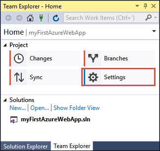
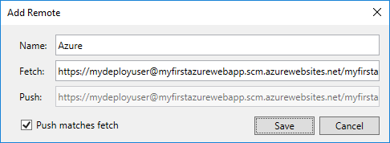

# Create an ASP.NET Core web app in Azure

> [!NOTE]
> This article deploys an app to App Service on Windows. To deploy to App Service on _Linux_, see [Create a .NET Core web app in App Service on Linux](./containers/quickstart-dotnetcore.md).
>
> If you're looking for steps for an ASP.NET Framework app, see [Create an ASP.NET Framework web app in Azure](app-service-web-get-started-dotnet-framework.md). 
>

[Azure Web Apps](app-service-web-overview.md) provides a highly scalable, self-patching web hosting service.  This quickstart shows how to deploy your first ASP.NET Core web app to Azure Web Apps. When you're finished, you'll have a resource group that consists of an App Service plan and an Azure web app with a deployed web application.

[!INCLUDE [quickstarts-free-trial-note](../../includes/quickstarts-free-trial-note.md)]

## Prerequisites

To complete this tutorial:

* Install <a href="https://www.visualstudio.com/downloads/" target="_blank">Visual Studio 2017</a> with the following workloads:
    - **ASP.NET and web development**
    - **Azure development**

    

## Create an ASP.NET Core web app

In Visual Studio, create a project by selecting **File > New > Project**. 

In the **New Project** dialog, select **Visual C# > Web > ASP.NET Core Web Application**.

Name the application _myFirstAzureWebApp_, then select **Create new Git repository**, and then select **OK**.
   


You can deploy any type of ASP.NET Core web app to Azure. For this quickstart, select the **Web Application** template, and make sure authentication is set to **No Authentication**.
      
Select **OK**.


Once the ASP.NET Core project is created, the ASP.NET Core welcome page is displayed, providing numerous links to resources to help you get started. 


From the menu, select **Debug > Start without Debugging** to run the web app locally.


[!INCLUDE [cloud-shell-try-it.md](../../includes/cloud-shell-try-it.md)]

[!INCLUDE [Configure deployment user](../../includes/configure-deployment-user.md)] 

[!INCLUDE [Create resource group](../../includes/app-service-web-create-resource-group.md)] 

[!INCLUDE [Create app service plan](../../includes/app-service-web-create-app-service-plan.md)] 

[!INCLUDE [Create web app](../../includes/app-service-web-create-web-app.md)] 


## Push to Azure from Visual Studio

Back in Visual Studio, from the **View** menu, click **Team Explorer**. The **Team Explorer** is displayed.

In the **Home** view, click **Settings** > **Repository Settings**.



In the **Remotes** section of the **Repository Settings**, select **Add**. The **Add Remote** dialog box is displayed.

Set the **Name** field to _Azure_, and then set the **Fetch** field to the URL that you saved from [Create a web app](#create-a-web-app). Click **Save**.



This setting is equivalent to the Git command `git remote add Azure <URL>`.

Click the **Home** button at the top.

Select **Settings** > **Global Settings**. Confirm that the name and email address are set. Select **Update** if necessary.

Visual Studio already committed all the files into the Git repository when it created the project. All you need to do now is to push the files to Azure.

Click the **Home** button at the top. Select **Sync** > **Actions** > **Open Command Prompt**. 

Enter the following command in the command window, and enter the deployment password when prompted:

```
git push Azure master
```

This command may take a few minutes to run. While running, it displays information similar to the following example:

```
Counting objects: 4, done.
Delta compression using up to 8 threads.
Compressing objects: 100% (4/4), done.
Writing objects: 100% (4/4), 349 bytes | 349.00 KiB/s, done.
Total 4 (delta 3), reused 0 (delta 0)
remote: Updating branch 'master'.
remote: Updating submodules.
remote: Preparing deployment for commit id '9e20345e9c'.
remote: Generating deployment script.
remote: Project file path: .\myFirstAzureWebApp\myFirstAzureWebApp.csproj
remote: Solution file path: .\myFirstAzureWebApp.sln
remote: Generated deployment script files
remote: Running deployment command...
remote: Handling ASP.NET Core Web Application deployment.
remote:   Restoring packages for D:\home\site\repository\myFirstAzureWebApp\myFirstAzureWebApp.csproj...
remote:   Restoring packages for D:\home\site\repository\myFirstAzureWebApp\myFirstAzureWebApp.csproj...
...
remote: Finished successfully.
remote: Running post deployment command(s)...
remote: Deployment successful.
To https://<app_name>.scm.azurewebsites.net/<app_name>.git
 * [new branch]      master -> master
```

## Browse to the app

In a browser, navigate to the Azure web app URL: `http://<app_name>.azurewebsites.net`.

The page is running as an Azure App Service web app.


Congratulations, your ASP.NET Core web app is running live in Azure App Service.

## Update the app and redeploy

From the **Solution Explorer**, open _Pages/Index.cshtml_.

Find the `<div id="myCarousel" class="carousel slide" data-ride="carousel" data-interval="6000">` HTML tag near the top, and replace the entire element with the following code:

```HTML
<div class="jumbotron">
    <h1>ASP.NET in Azure!</h1>
    <p class="lead">This is a simple app that we’ve built that demonstrates how to deploy a .NET app to Azure App Service.</p>
</div>
```

From the **Solution Explorer**, right-click _Pages/Index.cshtml_ and click **Commit**. Enter a commit message for your change and click **Commit All**.

Back in the command prompt window, push the code changes to Azure.

```bash
git push Azure master
```

When deployment completes, navigate to `http://<app_name>.azurewebsites.net` again.


## Manage the Azure web app

Go to the <a href="https://portal.azure.com" target="_blank">Azure portal</a> to manage the web app.

From the left menu, select **App Services**, and then select the name of your Azure web app.


You see your web app's Overview page. Here, you can perform basic management tasks like browse, stop, start, restart, and delete. 


The left menu provides different pages for configuring your app. 

[!INCLUDE [Clean-up section](../../includes/clean-up-section-portal.md)]

## Next steps

> [!div class="nextstepaction"]
> [ASP.NET Core with SQL Database](app-service-web-tutorial-dotnetcore-sqldb.md)
