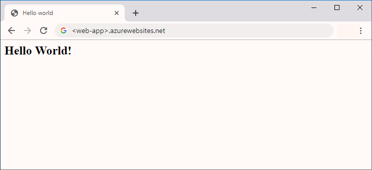

# Quickstart: Create a Java app on Azure App Service on Windows

> [!NOTE]
> This article deploys an app to App Service on Windows. To deploy to App Service on _Linux_, see [Create Java web app on Linux](./containers/quickstart-java.md).
>

[Azure App Service](overview.md) provides a highly scalable, self-patching web hosting service.  This quickstart shows how to use the [Azure CLI](https://docs.microsoft.com/cli/azure/get-started-with-azure-cli) with the [Azure Web App Plugin for Maven](https://github.com/Microsoft/azure-maven-plugins/tree/develop/azure-webapp-maven-plugin) to deploy a Java web archive (WAR) file.

> [!NOTE]
> The same thing can also be done using popular IDEs like IntelliJ and Eclipse. Check out our similar documents at [Azure Toolkit for IntelliJ Quickstart](/java/azure/intellij/azure-toolkit-for-intellij-create-hello-world-web-app) or [Azure Toolkit for Eclipse Quickstart](/java/azure/eclipse/azure-toolkit-for-eclipse-create-hello-world-web-app).
>


[!INCLUDE [quickstarts-free-trial-note](../../includes/quickstarts-free-trial-note.md)]

[!INCLUDE [cloud-shell-try-it.md](../../includes/cloud-shell-try-it.md)]

## Create a Java app

Execute the following Maven command in the Cloud Shell prompt to create a new app named `helloworld`:

```bash
mvn archetype:generate -DgroupId=example.demo -DartifactId=helloworld -DarchetypeArtifactId=maven-archetype-webapp -Dversion=1.0-SNAPSHOT
```

Then change your working directory to the project folder:

```bash
cd helloworld
```

## Configure the Maven plugin

You can run the following maven command in the Command Prompt to configure the deployment, choose  **'2'** for the **windows** OS in the first step, then accept the default configurations by pressing **ENTER** until you get the **Confirm (Y/N)** prompt, then press **'y'** and the configuration is done. 

```bash
mvn com.microsoft.azure:azure-webapp-maven-plugin:1.9.1:config
```

A sample process looks like:

```cmd
~@Azure:~/helloworld$ mvn com.microsoft.azure:azure-webapp-maven-plugin:1.9.1:config
[INFO] Scanning for projects...
[INFO]
[INFO] ----------------------< example.demo:helloworld >-----------------------
[INFO] Building helloworld Maven Webapp 1.0-SNAPSHOT
[INFO] --------------------------------[ war ]---------------------------------
[INFO]
[INFO] --- azure-webapp-maven-plugin:1.9.1:config (default-cli) @ helloworld ---
[WARNING] The plugin may not work if you change the os of an existing webapp.
Define value for OS(Default: Linux):
1. linux [*]
2. windows
3. docker
Enter index to use: 2
Define value for javaVersion(Default: 1.8): 
1. 1.7
2. 1.7.0_191_ZULU
3. 1.7.0_51
4. 1.7.0_71
5. 1.7.0_80
6. 1.8 [*]
7. 1.8.0_102
8. 1.8.0_111
9. 1.8.0_144
10. 1.8.0_172
11. 1.8.0_172_ZULU
12. 1.8.0_181
13. 1.8.0_181_ZULU
14. 1.8.0_202
15. 1.8.0_202_ZULU
16. 1.8.0_25
17. 1.8.0_60
18. 1.8.0_73
19. 1.8.0_92
20. 11
21. 11.0.2_ZULU
Enter index to use:
Define value for webContainer(Default: tomcat 8.5): 
1. jetty 9.1
2. jetty 9.1.0.20131115
3. jetty 9.3
4. jetty 9.3.13.20161014
5. tomcat 7.0
6. tomcat 7.0.50
7. tomcat 7.0.62
8. tomcat 8.0
9. tomcat 8.0.23
10. tomcat 8.5 [*]
11. tomcat 8.5.20
12. tomcat 8.5.31
13. tomcat 8.5.34
14. tomcat 8.5.37
15. tomcat 8.5.6
16. tomcat 9.0
17. tomcat 9.0.0
18. tomcat 9.0.12
19. tomcat 9.0.14
20. tomcat 9.0.8
Enter index to use:
Please confirm webapp properties
AppName : helloworld-1590394316693
ResourceGroup : helloworld-1590394316693-rg
Region : westeurope
PricingTier : PremiumV2_P1v2
OS : Windows
Java : 1.8
WebContainer : tomcat 8.5
Deploy to slot : false
Confirm (Y/N)? :
[INFO] Saving configuration to pom.
```

> [!NOTE]
> In this article we are only working with Java apps packaged in WAR files. The plugin also supports JAR web applications, visit [Deploy a Java SE JAR file to App Service on Linux](https://docs.microsoft.com/java/azure/spring-framework/deploy-spring-boot-java-app-with-maven-plugin?toc=%2fazure%2fapp-service%2fcontainers%2ftoc.json) to try it out.

Open to `pom.xml` to see the updated configuration.

```bash
code pom.xml
```

You can modify the configurations for App Service directly in your pom file if needed, some common ones are listed below:

 Property | Required | Description | Version
---|---|---|---
`<schemaVersion>` | false | Specify the version of the configuration schema. Supported values are: `v1`, `v2`. | 1.5.2
`<resourceGroup>` | true | Azure Resource Group for your Web App. | 0.1.0+
`<appName>` | true | The name of your Web App. | 0.1.0+
`<region>` | true | Specifies the region where your Web App will be hosted; the default value is **westeurope**. All valid regions at [Supported Regions](/java/api/overview/azure/maven/azure-webapp-maven-plugin/readme) section. | 0.1.0+
`<pricingTier>` | false | The pricing tier for your Web App. The default value is **P1V2**.| 0.1.0+
`<runtime>` | true | The runtime environment configuration, you could see the detail [here](/java/api/overview/azure/maven/azure-webapp-maven-plugin/readme). | 0.1.0+
`<deployment>` | true | The deployment configuration, you could see the details [here](/java/api/overview/azure/maven/azure-webapp-maven-plugin/readme). | 0.1.0+

> [!div class="nextstepaction"]
> [I ran into an issue](https://www.research.net/r/javae2e?tutorial=app-service-web-get-started-java&step=config)

## Deploy the app

The deploy process to Azure App Service uses account credentials from the Azure CLI. [Sign in with the Azure CLI](/cli/azure/authenticate-azure-cli?view=azure-cli-latest) before continuing.

```azurecli
az login
```
Then you can deploy your Java app to Azure using the following command:

```bash
mvn package azure-webapp:deploy
```

Once deployment has completed, browse to the deployed application using the following URL in your web browser, for example `http://<webapp>.azurewebsites.net/`.


**Congratulations!** You've deployed your first Java app to App Service on Windows.

[!INCLUDE [cli-samples-clean-up](../../includes/cli-samples-clean-up.md)]

## Next steps
> [!div class="nextstepaction"]
> [Connect to Azure SQL database with Java](/azure/sql-database/sql-database-connect-query-java?toc=%2Fazure%2Fjava%2Ftoc.json)

> [!div class="nextstepaction"]
> [Connect to Azure DB for MySQL with Java](/azure/mysql/connect-java)

> [!div class="nextstepaction"]
> [Connect to Azure DB for PostgreSQL with Java](/azure/postgresql/connect-java)

> [!div class="nextstepaction"]
> [Azure for Java Developers Resources](/java/azure/)

> [!div class="nextstepaction"]
> [Map custom domain](app-service-web-tutorial-custom-domain.md)

> [!div class="nextstepaction"]
> [Learn More about Maven plugins for Azure](https://github.com/microsoft/azure-maven-plugins)
