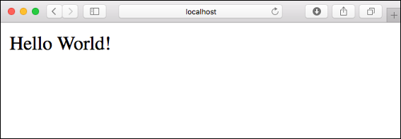
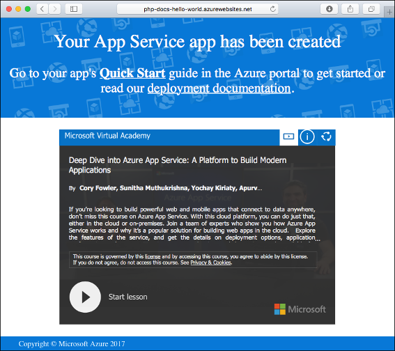
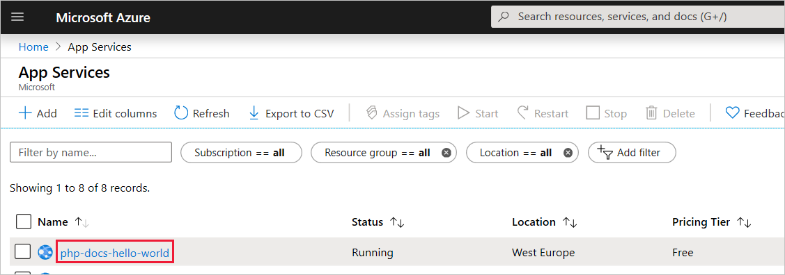
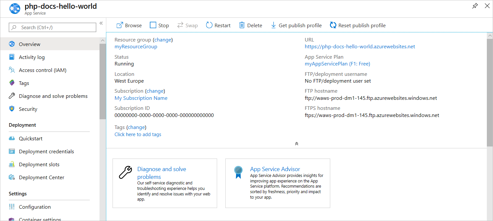

# Create a PHP web app in Azure

> [!NOTE]
> This article deploys an app to App Service on Windows. To deploy to App Service on _Linux_, see [Create a PHP web app in App Service on Linux](./containers/quickstart-php.md).
>

[Azure App Service](overview.md) provides a highly scalable, self-patching web hosting service.  This quickstart tutorial shows how to deploy a PHP app to Azure App Service. You create the web app using the [Azure CLI](https://docs.microsoft.com/cli/azure/get-started-with-azure-cli) in Cloud Shell, and you use Git to deploy sample PHP code to the web app.


You can follow the steps here using a Mac, Windows, or Linux machine. Once the prerequisites are installed, it takes about five minutes to complete the steps.

[!INCLUDE [quickstarts-free-trial-note](../../includes/quickstarts-free-trial-note.md)]

## Prerequisites

To complete this quickstart:

* <a href="https://git-scm.com/" target="_blank">Install Git</a>
* <a href="https://php.net/manual/install.php" target="_blank">Install PHP</a>

## Download the sample locally

In a terminal window, run the following commands. This will clone the sample application to your local machine, and navigate to the directory containing the sample code. 

```bash
git clone https://github.com/Azure-Samples/php-docs-hello-world
cd php-docs-hello-world
```

## Run the app locally

Run the application locally so that you see how it should look when you deploy it to Azure. Open a terminal window and use the `php` command to launch the built-in PHP web server.

```bash
php -S localhost:8080
```

Open a web browser, and navigate to the sample app at `http://localhost:8080`.

You see the **Hello World!** message from the sample app displayed in the page.



In your terminal window, press **Ctrl+C** to exit the web server.

[!INCLUDE [cloud-shell-try-it.md](../../includes/cloud-shell-try-it.md)]

[!INCLUDE [Configure deployment user](../../includes/configure-deployment-user.md)]

[!INCLUDE [Create resource group](../../includes/app-service-web-create-resource-group.md)]

[!INCLUDE [Create app service plan](../../includes/app-service-web-create-app-service-plan.md)]

## Create a web app

In the Cloud Shell, create a web app in the `myAppServicePlan` App Service plan with the [`az webapp create`](/cli/azure/webapp?view=azure-cli-latest#az-webapp-create) command. 

In the following example, replace `<app_name>` with a globally unique app name (valid characters are `a-z`, `0-9`, and `-`). The runtime is set to `PHP|7.0`. To see all supported runtimes, run [`az webapp list-runtimes`](/cli/azure/webapp?view=azure-cli-latest#az-webapp-list-runtimes). 

```azurecli-interactive
# Bash
az webapp create --resource-group myResourceGroup --plan myAppServicePlan --name <app_name> --runtime "PHP|7.0" --deployment-local-git
# PowerShell
az --% webapp create --resource-group myResourceGroup --plan myAppServicePlan --name <app_name> --runtime "PHP|7.0" --deployment-local-git
```

When the web app has been created, the Azure CLI shows output similar to the following example:

```json
Local git is configured with url of 'https://<username>@<app_name>.scm.azurewebsites.net/<app_name>.git'
{
  "availabilityState": "Normal",
  "clientAffinityEnabled": true,
  "clientCertEnabled": false,
  "cloningInfo": null,
  "containerSize": 0,
  "dailyMemoryTimeQuota": 0,
  "defaultHostName": "<app_name>.azurewebsites.net",
  "enabled": true,
  < JSON data removed for brevity. >
}
```
You’ve created an empty new web app, with git deployment enabled.

> [!NOTE]
> The URL of the Git remote is shown in the `deploymentLocalGitUrl` property, with the format `https://<username>@<app_name>.scm.azurewebsites.net/<app_name>.git`. Save this URL as you need it later.
>

Browse to your newly created web app. Replace _&lt;app name>_ with your unique app name created in the prior step.

```bash
http://<app name>.azurewebsites.net
```

Here is what your new web app should look like:



[!INCLUDE [Push to Azure](../../includes/app-service-web-git-push-to-azure.md)] 

```bash
Counting objects: 2, done.
Delta compression using up to 4 threads.
Compressing objects: 100% (2/2), done.
Writing objects: 100% (2/2), 352 bytes | 0 bytes/s, done.
Total 2 (delta 1), reused 0 (delta 0)
remote: Updating branch 'master'.
remote: Updating submodules.
remote: Preparing deployment for commit id '25f18051e9'.
remote: Generating deployment script.
remote: Running deployment command...
remote: Handling Basic Web Site deployment.
remote: Kudu sync from: '/home/site/repository' to: '/home/site/wwwroot'
remote: Copying file: '.gitignore'
remote: Copying file: 'LICENSE'
remote: Copying file: 'README.md'
remote: Copying file: 'index.php'
remote: Ignoring: .git
remote: Finished successfully.
remote: Running post deployment command(s)...
remote: Deployment successful.
To https://<app_name>.scm.azurewebsites.net/<app_name>.git
   cc39b1e..25f1805  master -> master
```

## Browse to the app

Browse to the deployed application using your web browser.

```
http://<app_name>.azurewebsites.net
```

The PHP sample code is running in an Azure App Service web app.


**Congratulations!** You've deployed your first PHP app to App Service.

## Update locally and redeploy the code

Using a local text editor, open the `index.php` file within the PHP app, and make a small change to the text within the string next to `echo`:

```php
echo "Hello Azure!";
```

In the local terminal window, commit your changes in Git, and then push the code changes to Azure.

```bash
git commit -am "updated output"
git push azure master
```

Once deployment has completed, return to the browser window that opened during the **Browse to the app** step, and refresh the page.


## Manage your new Azure app

Go to the <a href="https://portal.azure.com" target="_blank">Azure portal</a> to manage the web app you created.

From the left menu, click **App Services**, and then click the name of your Azure app.



Your web app's Overview page will be displayed. Here, you can perform basic management tasks like browse, stop, start, restart, and delete.



The left menu provides different options for configuring your app. 

[!INCLUDE [cli-samples-clean-up](../../includes/cli-samples-clean-up.md)]

## Next steps

> [!div class="nextstepaction"]
> [PHP with MySQL](app-service-web-tutorial-php-mysql.md)
