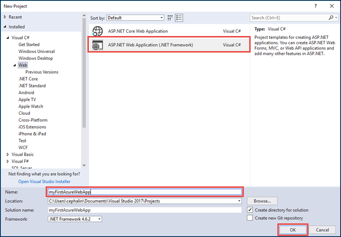
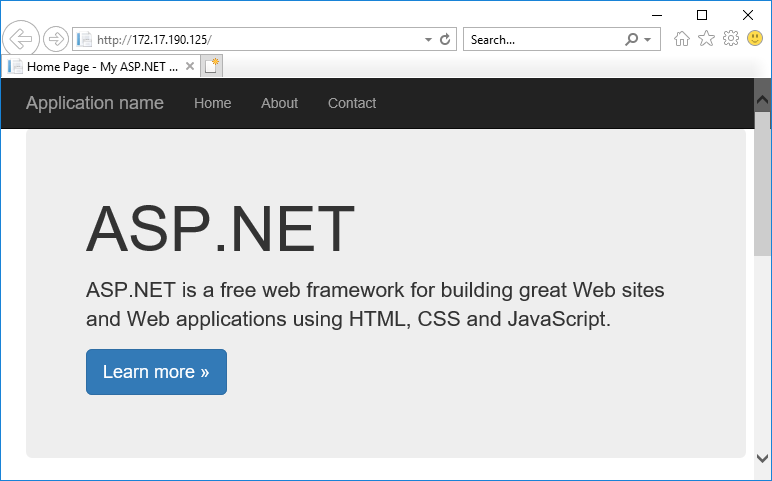
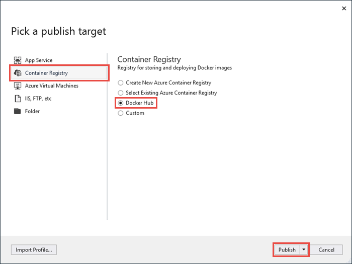

# Run a custom Windows container in Azure (Preview)

[Azure App Service](overview.md) provides pre-defined application stacks on Windows like ASP.NET or Node.js, running on IIS. The preconfigured Windows environment locks down the operating system from administrative access, software installations, changes to the global assembly cache, and so on (see [Operating system functionality on Azure App Service](operating-system-functionality.md)). If your application requires more access than the preconfigured environment allows, you can deploy a custom Windows container instead. This quickstart shows how to deploy an ASP.NET app in a Windows image to [Docker Hub](https://hub.docker.com/) from Visual Studio and run it in a custom container in Azure App Service.


## Prerequisites

To complete this tutorial:

- <a href="https://hub.docker.com/" target="_blank">Sign up for a Docker Hub account</a>
- <a href="https://docs.docker.com/docker-for-windows/install/" target="_blank">Install Docker for Windows</a>.
- <a href="https://docs.microsoft.com/virtualization/windowscontainers/quick-start/quick-start-windows-10" target="_blank">Switch Docker to run Windows containers</a>.
- <a href="https://www.visualstudio.com/downloads/" target="_blank">Install Visual Studio 2017</a> with the **ASP.NET and web development** and **Azure development** workloads. If you've installed Visual Studio 2017 already:
    - Install the latest updates in Visual Studio by clicking **Help** > **Check for Updates**.
    - Add the workloads in Visual Studio by clicking **Tools** > **Get Tools and Features**.

## Create an ASP.NET web app

In Visual Studio, create a project by selecting **File > New > Project**. 

In the **New Project** dialog, select **Visual C# > Web > ASP.NET Web Application (.NET Framework)**.

Name the application _myFirstAzureWebApp_, and then select **OK**.
   


You can deploy any type of ASP.NET web app to Azure. For this quickstart, select the **MVC** template, and make sure authentication is set to **No Authentication**.

Select **Enable Docker Compose support**.

Select **OK**.


If the _Dockerfile_ file isn't opened automatically, open it from the **Solution Explorer**.

You need to use a [supported parent image](#use-a-different-parent-image). Change the parent image by replacing the `FROM` line with the following code and save the file:

```Dockerfile
FROM mcr.microsoft.com/dotnet/framework/aspnet:4.7.2-windowsservercore-ltsc2019
```

From the menu, select **Debug > Start without Debugging** to run the web app locally.



## Publish to Docker Hub

In the **Solution Explorer**, right-click the **myFirstAzureWebApp** project and select **Publish**.


The publish wizard is automatically launched. Select **Container Registry** > **Docker Hub** > **Publish**.



Supply your Docker Hub account credentials and click **Save**. 

Wait for the deployment to complete. The **Publish** page now shows the repository name that you will use later in App Service.


Copy this repository name for later.

## Sign in to Azure

Sign in to the Azure portal at https://portal.azure.com.

## Create a Windows container app

1. Choose **Create a resource** in the upper left-hand corner of the Azure portal.

2. In the search box above the list of Azure Marketplace resources, search for and select **Web App for Containers**.

3. Provide an app name, such as *win-container-demo*, accept the defaults to create a new resource group, and click **Windows (Preview)** in the **OS** box.

    

4. Create an App Service plan by clicking **App Service plan/Location** > **Create new**. Give the new plan a name, accept the defaults, and click **OK**.

    

5. Click **Configure container**. In **Image and optional tag**, use the repository name you copied in [Publish to Docker Hub](#publish-to-docker-hub), then click **OK**.

    

    If you have a custom image elsewhere for your web application, such as in [Azure Container Registry](/azure/container-registry/) or in any other private repository, you can configure it here.

6. Click **Create** and wait for Azure to create the required resources.

## Browse to the container app

When the Azure operation is complete, a notification box is displayed.


1. Click **Go to resource**.

2. In the app page, click the link under **URL**.

A new browser page is opened to the following page:


Wait a few minutes and try again, until you get the default ASP.NET home page:


**Congratulations!** You're running your first custom Windows container in Azure App Service.

## See container start-up logs

It may take some time for the Windows container to load. To see the progress, navigate to the following URL by replacing *\<app_name>* with the name of your app.
```
https://<app_name>.scm.azurewebsites.net/api/logstream
```

The streamed logs looks like this:

```
2018-07-27T12:03:11  Welcome, you are now connected to log-streaming service.
27/07/2018 12:04:10.978 INFO - Site: win-container-demo - Start container succeeded. Container: facbf6cb214de86e58557a6d073396f640bbe2fdec88f8368695c8d1331fc94b
27/07/2018 12:04:16.767 INFO - Site: win-container-demo - Container start complete
27/07/2018 12:05:05.017 INFO - Site: win-container-demo - Container start complete
27/07/2018 12:05:05.020 INFO - Site: win-container-demo - Container started successfully
```

## Update locally and redeploy

From the **Solution Explorer**, open _Views\Home\Index.cshtml_.

Find the `<div class="jumbotron">` HTML tag near the top, and replace the entire element with the following code:

```HTML
<div class="jumbotron">
    <h1>ASP.NET in Azure!</h1>
    <p class="lead">This is a simple app that we’ve built that demonstrates how to deploy a .NET app to Azure App Service.</p>
</div>
```

To redeploy to Azure, right-click the **myFirstAzureWebApp** project in **Solution Explorer** and select **Publish**.

On the publish page, select **Publish** and wait for publishing to complete.

To tell App Service to pull in the new image from Docker Hub, restart the app. Back in the app page in the portal, click **Restart** > **Yes**.


[Browse to the container app](#browse-to-the-container-app) again. As you refresh the webpage, the app should revert to the "Starting up" page at first, then display the updated webpage again after a few minutes.


## Use a different parent image

You are free to use a different custom Docker image to run your app. However, you must choose the right [parent image](https://docs.docker.com/develop/develop-images/baseimages/) for the framework you want: 

- To deploy .NET Framework apps, use a parent image based on the Windows Server Core 2019 [Long-Term Servicing Channel (LTSC)](https://docs.microsoft.com/windows-server/get-started-19/servicing-channels-19#long-term-servicing-channel-ltsc) release. 
- To deploy .NET Core apps, use a parent image based on the Windows Server Nano 1809 [Semi-Annual Servicing Channel (SAC)](https://docs.microsoft.com/windows-server/get-started-19/servicing-channels-19#semi-annual-channel) release. 

It takes some time to download a parent image during app start-up. However, you can reduce start-up time by using one of the following parent images that are already cached in Azure App Service:

- [mcr.microsoft.com/dotnet/framework/aspnet](https://hub.docker.com/_/microsoft-dotnet-framework-aspnet/):4.7.2-windowsservercore-ltsc2019
- [mcr.microsoft.com/windows/nanoserver](https://hub.docker.com/_/microsoft-windows-nanoserver/):1809 - this is the base container used across Microsoft [ASP.NET Core](https://hub.docker.com/_microsoft-dotnet-cores-aspnet) Microsoft Windows Nano Server images.

## Next steps

> [!div class="nextstepaction"]
> [Migrate to Windows container in Azure](app-service-web-tutorial-windows-containers-custom-fonts.md)
