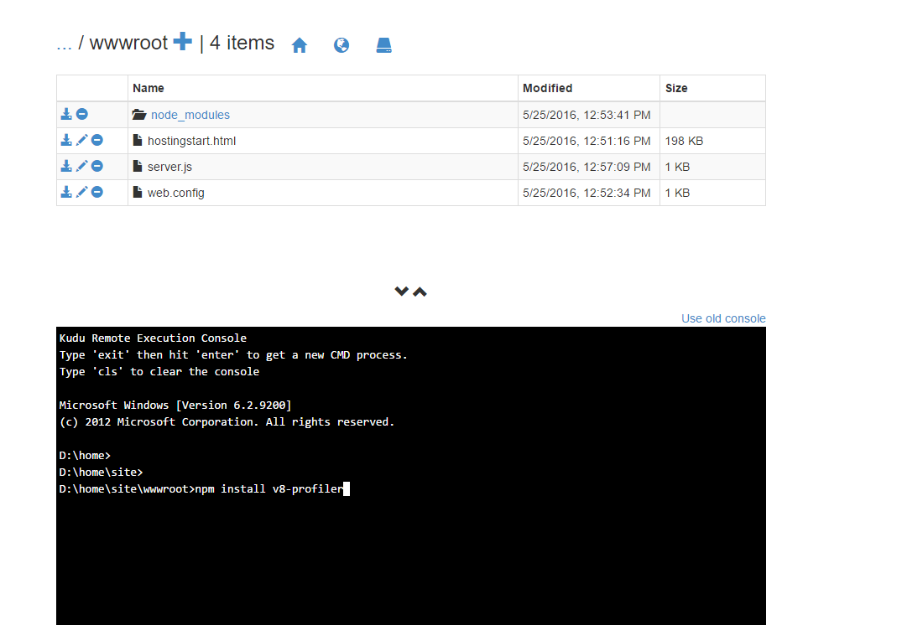
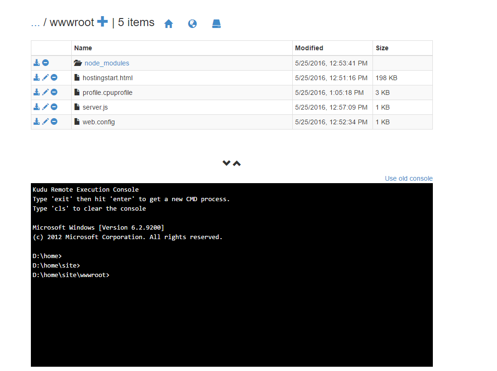
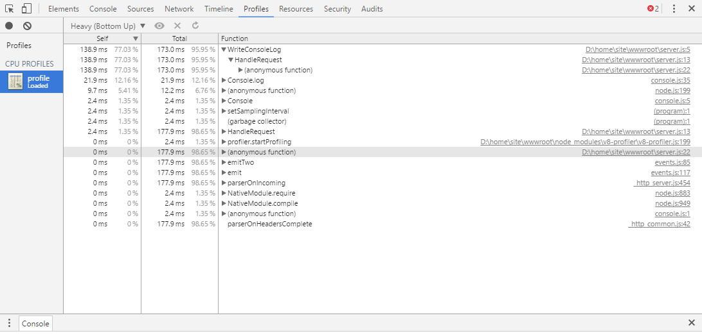

# Best practices and troubleshooting guide for node applications on Azure App Service Windows

In this article, you learn best practices and troubleshooting steps for [node applications](app-service-web-get-started-nodejs.md) running on Azure App Service (with [iisnode](https://github.com/azure/iisnode)).

> [!WARNING]
> Use caution when using troubleshooting steps on your production site. Recommendation is to troubleshoot your app on a non-production setup for example your staging slot and when the issue is fixed, swap your staging slot with your production slot.
>

## IISNODE configuration

This [schema file](https://github.com/Azure/iisnode/blob/master/src/config/iisnode_schema_x64.xml) shows all the settings that you can configure for iisnode. Some of the settings that are useful for your application:

### nodeProcessCountPerApplication

This setting controls the number of node processes that are launched per IIS application. The default value is 1. You can launch as many node.exes as your VM vCPU count by changing the value to 0. The recommended value is 0 for most applications so you can use all of the vCPUs on your machine. Node.exe is single-threaded so one node.exe consumes a maximum of 1 vCPU. To get maximum performance out of your node application, you want to use all vCPUs.

### nodeProcessCommandLine

This setting controls the path to the node.exe. You can set this value to point to your node.exe version.

### maxConcurrentRequestsPerProcess

This setting controls the maximum number of concurrent requests sent by iisnode to each node.exe. On Azure App Service, the default value is Infinite. You can configure the value depending on how many requests your application receives and how fast your application processes each request.

### maxNamedPipeConnectionRetry

This setting controls the maximum number of times iisnode retries making the connection on the named pipe to send the requests to node.exe. This setting in combination with namedPipeConnectionRetryDelay determines the total timeout of each request within iisnode. The default value is 200 on Azure App Service. Total Timeout in seconds = (maxNamedPipeConnectionRetry \* namedPipeConnectionRetryDelay) / 1000

### namedPipeConnectionRetryDelay

This setting controls the amount of time (in ms) iisnode waits between each retry to send the request to node.exe over the named pipe. The default value is 250 ms.
Total Timeout in seconds = (maxNamedPipeConnectionRetry \* namedPipeConnectionRetryDelay) / 1000

By default, the total timeout in iisnode on Azure App Service is 200 \* 250 ms = 50 seconds.

### logDirectory

This setting controls the directory where iisnode logs stdout/stderr. The default value is iisnode, which is relative to the main script directory (directory where main server.js is present)

### debuggerExtensionDll

This setting controls what version of node-inspector iisnode uses when debugging your node application. Currently, iisnode-inspector-0.7.3.dll and iisnode-inspector.dll are the only two valid values for this setting. The default value is iisnode-inspector-0.7.3.dll. The iisnode-inspector-0.7.3.dll version uses node-inspector-0.7.3 and uses web sockets. Enable web sockets on your Azure webapp to use this version. See <https://ranjithblogs.azurewebsites.net/?p=98> for more details on how to configure iisnode to use the new node-inspector.

### flushResponse

The default behavior of IIS is that it buffers response data up to 4 MB before flushing, or until the end of the response, whichever comes first. iisnode offers a configuration setting to override this behavior: to flush a fragment of the response entity body as soon as iisnode receives it from node.exe, you need to set the iisnode/@flushResponse attribute in web.config to 'true':

```xml
<configuration>
    <system.webServer>
        <!-- ... -->
        <iisnode flushResponse="true" />
    </system.webServer>
</configuration>
```

Enable the flushing of every fragment of the response entity body adds performance overhead that reduces the throughput of the system by ~5% (as of v0.1.13). The best to scope this setting only to endpoints that require response streaming (for example, using the `<location>` element in the web.config)

In addition to this, for streaming applications, you must also set responseBufferLimit of your iisnode handler to 0.

```xml
<handlers>
    <add name="iisnode" path="app.js" verb="\*" modules="iisnode" responseBufferLimit="0"/>
</handlers>
```

### watchedFiles

A semi-colon separated list of files that are watched for changes. Any change to a file causes the application to recycle. Each entry consists of an optional directory name as well as a required file name, which are relative to the directory where the main application entry point is located. Wild cards are allowed in the file name portion only. The default value is `*.js;iisnode.yml`

### recycleSignalEnabled

The default value is false. If enabled, your node application can connect to a named pipe (environment variable IISNODE\_CONTROL\_PIPE) and send a “recycle” message. This causes the w3wp to recycle gracefully.

### idlePageOutTimePeriod

The default value is 0, which means this feature is disabled. When set to some value greater than 0, iisnode will page out all its child processes every ‘idlePageOutTimePeriod’ in milliseconds. See [documentation](/windows/desktop/api/psapi/nf-psapi-emptyworkingset) to understand what page out means. This setting is useful for applications that consume a high amount of memory and want to page out memory to disk occasionally to free up RAM.

> [!WARNING]
> Use caution when enabling the following configuration settings on production applications. The recommendation is to not enable them on live production applications.
>

### debugHeaderEnabled

The default value is false. If set to true, iisnode adds an HTTP response header `iisnode-debug` to every HTTP response it sends the `iisnode-debug` header value is a URL. Individual pieces of diagnostic information can be obtained by looking at the URL fragment, however, a visualization is available by opening the URL in a browser.

### loggingEnabled

This setting controls the logging of stdout and stderr by iisnode. Iisnode captures stdout/stderr from node processes it launches and writes to the directory specified in the ‘logDirectory’ setting. Once this is enabled, your application writes logs to the file system and depending on the amount of logging done by the application, there could be performance implications.

### devErrorsEnabled

The default value is false. When set to true, iisnode displays the HTTP status code and Win32 error code on your browser. The win32 code is helpful in debugging certain types of issues.

### debuggingEnabled (do not enable on live production site)

This setting controls debugging feature. Iisnode is integrated with node-inspector. By enabling this setting, you enable debugging of your node application. Upon enabling this setting, iisnode creates node-inspector files in ‘debuggerVirtualDir’ directory on the first debug request to your node application. You can load the node-inspector by sending a request to `http://yoursite/server.js/debug`. You can control the debug URL segment with ‘debuggerPathSegment’ setting. By default, debuggerPathSegment=’debug’. You can set `debuggerPathSegment` to a GUID, for example, so that it is more difficult to be discovered by others.

Read [Debug node.js applications on Windows](https://tomasz.janczuk.org/2011/11/debug-nodejs-applications-on-windows.html) for more details on debugging.

## Scenarios and recommendations/troubleshooting

### My node application is making excessive outbound calls

Many applications would want to make outbound connections as part of their regular operation. For example, when a request comes in, your node app would want to contact a REST API elsewhere and get some information to process the request. You would want to use a keep alive agent when making http or https calls. You could use the agentkeepalive module as your keep alive agent when making these outbound calls.

The agentkeepalive module ensures that sockets are reused on your Azure webapp VM. Creating a new socket on each outbound request adds overhead to your application. Having your application reuse sockets for outbound requests ensures that your application doesn't exceed the maxSockets that are allocated per VM. The recommendation on Azure App Service is to set the agentKeepAlive maxSockets value to a total of (4 instances of node.exe \* 40 maxSockets/instance) 160 sockets per VM.

Example [agentKeepALive](https://www.npmjs.com/package/agentkeepalive) configuration:

```nodejs
let keepaliveAgent = new Agent({
    maxSockets: 40,
    maxFreeSockets: 10,
    timeout: 60000,
    keepAliveTimeout: 300000
});
```

> [!IMPORTANT]
> This example assumes you have 4 node.exe running on your VM. If you have a different number of node.exe running on the VM, you must modify the maxSockets setting accordingly.
>

#### My node application is consuming too much CPU

You may receive a recommendation from Azure App Service on your portal about high cpu consumption. You can also set up monitors to watch for certain [metrics](web-sites-monitor.md). When checking the CPU usage on the [Azure Portal Dashboard](../azure-monitor/app/web-monitor-performance.md), check the MAX values for CPU so you don’t miss the peak values.
If you believe your application is consuming too much CPU and you cannot explain why, you can profile your node application to find out.

#### Profiling your node application on Azure App Service with V8-Profiler

For example, let's say you have a hello world app that you want to profile as follows:

```nodejs
const http = require('http');
function WriteConsoleLog() {
    for(let i=0;i<99999;++i) {
        console.log('hello world');
    }
}

function HandleRequest() {
    WriteConsoleLog();
}

http.createServer(function (req, res) {
    res.writeHead(200, {'Content-Type': 'text/html'});
    HandleRequest();
    res.end('Hello world!');
}).listen(process.env.PORT);
```

Go to the Debug Console site `https://yoursite.scm.azurewebsites.net/DebugConsole`

Go into your site/wwwroot directory. You see a command prompt as shown in the following example:



Run the command `npm install v8-profiler`.

This command installs the v8-profiler under node\_modules directory and all of its dependencies.
Now, edit your server.js to profile your application.

```nodejs
const http = require('http');
const profiler = require('v8-profiler');
const fs = require('fs');

function WriteConsoleLog() {
    for(let i=0;i<99999;++i) {
        console.log('hello world');
    }
}

function HandleRequest() {
    profiler.startProfiling('HandleRequest');
    WriteConsoleLog();
    fs.writeFileSync('profile.cpuprofile', JSON.stringify(profiler.stopProfiling('HandleRequest')));
}

http.createServer(function (req, res) {
    res.writeHead(200, {'Content-Type': 'text/html'});
    HandleRequest();
    res.end('Hello world!');
}).listen(process.env.PORT);
```

The preceding code profiles the WriteConsoleLog function and then writes the profile output to the ‘profile.cpuprofile’ file under your site wwwroot. Send a request to your application. You see a ‘profile.cpuprofile’ file created under your site wwwroot.



Download this file and open it with Chrome F12 Tools. Press F12 on Chrome, then choose the **Profiles** tab. Choose the **Load** button. Select your profile.cpuprofile file that you downloaded. Click on the profile you just loaded.



You can see that 95% of the time was consumed by the WriteConsoleLog function. The output also shows you the exact line numbers and source files that caused the issue.

### My node application is consuming too much memory

If your application is consuming too much memory, you see a notice from Azure App Service on your portal about high memory consumption. You can set up monitors to watch for certain [metrics](web-sites-monitor.md). When checking the memory usage on the [Azure Portal Dashboard](../azure-monitor/app/web-monitor-performance.md), be sure to check the MAX values for memory so you don’t miss the peak values.

#### Leak detection and Heap Diff for node.js

You could use [node-memwatch](https://github.com/lloyd/node-memwatch) to help you identify memory leaks.
You can install `memwatch` just like v8-profiler and edit your code to capture and diff heaps to identify the memory leaks in your application.

### My node.exe’s are getting killed randomly

There are a few reasons why node.exe is shut down randomly:

1. Your application is throwing uncaught exceptions – Check d:\\home\\LogFiles\\Application\\logging-errors.txt file for the details on the exception thrown. This file has the stack trace to help debug and fix your application.
2. Your application is consuming too much memory, which is affecting other processes from getting started. If the total VM memory is close to 100%, your node.exe’s could be killed by the process manager. Process manager kills some processes to let other processes get a chance to do some work. To fix this issue, profile your application for memory leaks. If your application requires large amounts of memory, scale up to a larger VM (which increases the RAM available to the VM).

### My node application does not start

If your application is returning 500 Errors when it starts, there could be a few reasons:

1. Node.exe is not present at the correct location. Check nodeProcessCommandLine setting.
2. Main script file is not present at the correct location. Check web.config and make sure the name of the main script file in the handlers section matches the main script file.
3. Web.config configuration is not correct – check the settings names/values.
4. Cold Start – Your application is taking too long to start. If your application takes longer than (maxNamedPipeConnectionRetry \* namedPipeConnectionRetryDelay) / 1000 seconds, iisnode returns a 500 error. Increase the values of these settings to match your application start time to prevent iisnode from timing out and returning the 500 error.

### My node application crashed

Your application is throwing uncaught exceptions – Check `d:\\home\\LogFiles\\Application\\logging-errors.txt` file for the details on the exception thrown. This file has the stack trace to help diagnose and fix your application.

### My node application takes too much time to start (Cold Start)

The common cause for long application start times is a high number of files in the node\_modules. The application tries to load most of these files when starting. By default, since your files are stored on the network share on Azure App Service, loading many files can take time.
Some solutions to make this process faster are:

1. Be sure you have a flat dependency structure and no duplicate dependencies by using npm3 to install your modules.
2. Try to lazy load your node\_modules and not load all of the modules at application start. To Lazy load modules, the call to require(‘module’) should be made when you actually need the module within the function before the first execution of module code.
3. Azure App Service offers a feature called local cache. This feature copies your content from the network share to the local disk on the VM. Since the files are local, the load time of node\_modules is much faster.

## IISNODE http status and substatus

The `cnodeconstants` [source file](https://github.com/Azure/iisnode/blob/master/src/iisnode/cnodeconstants.h) lists all of the possible status/substatus combinations iisnode can return due to an error.

Enable FREB for your application to see the win32 error code (be sure you enable FREB only on non-production sites for performance reasons).

| Http Status | Http Substatus | Possible Reason? |
| --- | --- | --- |
| 500 |1000 |There was some issue dispatching the request to IISNODE – Check if node.exe was started. Node.exe could have crashed when starting. Check your web.config configuration for errors. |
| 500 |1001 |- Win32Error 0x2 - App is not responding to the URL. Check the URL rewrite rules or check if your express app has the correct routes defined. - Win32Error 0x6d – named pipe is busy – Node.exe is not accepting requests because the pipe is busy. Check high cpu usage. - Other errors – check if node.exe crashed. |
| 500 |1002 |Node.exe crashed – check d:\\home\\LogFiles\\logging-errors.txt for stack trace. |
| 500 |1003 |Pipe configuration Issue – The named pipe configuration is incorrect. |
| 500 |1004-1018 |There was some error while sending the request or processing the response to/from node.exe. Check if node.exe crashed. check d:\\home\\LogFiles\\logging-errors.txt for stack trace. |
| 503 |1000 |Not enough memory to allocate more named pipe connections. Check why your app is consuming so much memory. Check maxConcurrentRequestsPerProcess setting value. If it's not infinite and you have many requests, increase this value to prevent this error. |
| 503 |1001 |Request could not be dispatched to node.exe because the application is recycling. After the application has recycled, requests should be served normally. |
| 503 |1002 |Check win32 error code for actual reason – Request could not be dispatched to a node.exe. |
| 503 |1003 |Named pipe is too Busy – Verify if node.exe is consuming excessive CPU |

NODE.exe has a setting called `NODE_PENDING_PIPE_INSTANCES`. On Azure App Service, this value is set to 5000. Meaning that node.exe can accept 5000 requests at a time on the named pipe. This value should be good enough for most node applications running on Azure App Service. You should not see 503.1003 on Azure App Service because of the high value for the `NODE_PENDING_PIPE_INSTANCES`

## More resources

Follow these links to learn more about node.js applications on Azure App Service.

* [Get started with Node.js web apps in Azure App Service](app-service-web-get-started-nodejs.md)
* [How to debug a Node.js web app in Azure App Service](https://blogs.msdn.microsoft.com/azureossds/2018/08/03/debugging-node-js-apps-on-azure-app-services/)
* [Using Node.js Modules with Azure applications](../nodejs-use-node-modules-azure-apps.md)
* [Azure App Service Web Apps: Node.js](https://blogs.msdn.microsoft.com/silverlining/2012/06/14/windows-azure-websites-node-js/)
* [Node.js Developer Center](../nodejs-use-node-modules-azure-apps.md)
* [Exploring the Super Secret Kudu Debug Console](https://azure.microsoft.com/documentation/videos/super-secret-kudu-debug-console-for-azure-web-sites/)
