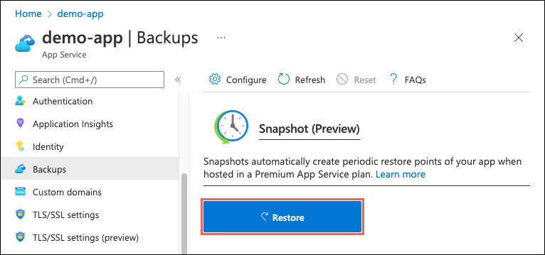
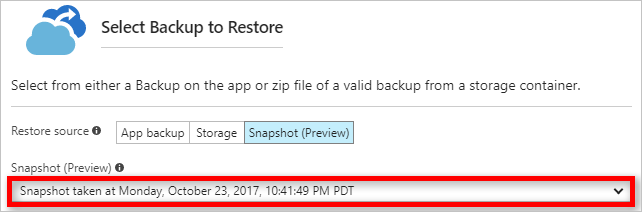
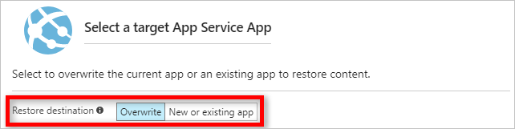
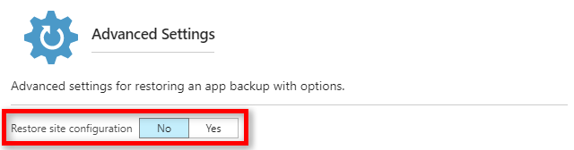

# Restore an app in Azure from a snapshot
This article shows you how to restore an app in [Azure App Service](../app-service/overview.md) from a snapshot. You can restore your app to a previous state, based on one of your app's snapshots. You do not need to enable snapshots backup, the platform automatically saves a snapshot of all apps for data recovery purposes.

Snapshots are incremental shadow copies, and they offer several advantages over regular [backups](manage-backup.md):
- No file copy errors due to file locks.
- No storage size limitation.
- No configuration required.

Restoring from snapshots is available to apps running in **Premium** tier or higher. For information about scaling
up your app, see [Scale up an app in Azure](web-sites-scale.md).

## Limitations

- The feature is currently in preview.
- You can only restore to the same app or to a slot belonging to that app.
- App Service stops the target app or target slot while doing the restore.
- App Service keeps three months worth of snapshots for platform data recovery purposes.
- You can only restore snapshots for the last 30 days.
- App Services running on an App Service Environment do not support snapshots.
 

## Restore an app from a snapshot

1. On the **Settings** page of your app in the [Azure portal](https://portal.azure.com), click **Backups** to display the **Backups** page. Then click **Restore** under the **Snapshot(Preview)** section.
   
    

2. In the **Restore** page, select the snapshot to restore.
   
    
   
3. Specify the destination for the app restore in **Restore destination**.
   
    
   
   > [!WARNING]
   > If you choose **Overwrite**, all existing data in your app's current file system is erased and overwritten. Before you click **OK**,
   > make sure that it is what you want to do.
   > 
   > 
      
   > [!Note]
   > Due to current technical limitations, you can only restore to apps in the same scale unit. This limitation will be removed in a future release.
   > 
   > 
   
    You can select **Existing App** to restore to a slot. Before you use this option, you should have already created a slot in your app.

4. You can choose to restore your site configuration.
   
    

5. Click **OK**.
