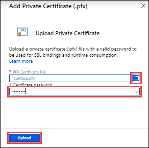
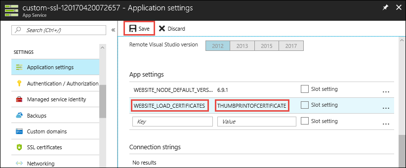

# Use an SSL certificate in your application code in Azure App Service

This how-to guide shows how to use public or private certificates in your application code. An example of the use case is that your app accesses an external service that requires certificate authentication.

This approach to using certificates in your code makes use of the SSL functionality in App Service, which requires your app to be in **Basic** tier or above. Alternatively, you can [include the certificate file in your app repository](#load-certificate-from-file), but it's not a recommended practice for private certificates.

When you let App Service manage your SSL certificates, you can maintain the certificates and your application code separately and safeguard your sensitive data.

## Upload a private certificate

Before uploading a private certificate, make sure [it satisfies all the requirements](app-service-web-tutorial-custom-ssl.md#prepare-a-private-certificate), except that it doesn't need to be configured for Server Authentication.

When you're ready to upload, run the following command in the <a target="_blank" href="https://shell.azure.com" >Cloud Shell</a>.

```azurecli-interactive
az webapp config ssl upload --name <app-name> --resource-group <resource-group-name> --certificate-file <path-to-PFX-file> --certificate-password <PFX-password> --query thumbprint
```

Copy the certificate thumbprint and see [Make the certificate accessible](#make-the-certificate-accessible).

## Upload a public certificate

Public certificates are supported in the *.cer* format. To upload a public certificate, the <a href="https://portal.azure.com" target="_blank">Azure portal</a>, and navigate to your app.

Click **SSL settings** > **Public Certificates (.cer)** > **Upload Public Certificate** from the left navigation of your app.

In **Name**, type a name for the certificate. In **CER Certificate file**, select your CER file.

Click **Upload**.



Once the certificate is uploaded, copy the certificate thumbprint and see [Make the certificate accessible](#make-the-certificate-accessible).

## Import an App Service certificate

See [Buy and configure an SSL certificate for Azure App Service](web-sites-purchase-ssl-web-site.md).

Once the certificate is imported, copy the certificate thumbprint and see [Make the certificate accessible](#make-the-certificate-accessible).

## Make the certificate accessible

To use an uploaded or imported certificate in your app code, make its thumbprint accessible with the `WEBSITE_LOAD_CERTIFICATES` app setting, by running the following command in the <a target="_blank" href="https://shell.azure.com" >Cloud Shell</a>:

```azurecli-interactive
az webapp config appsettings set --name <app-name> --resource-group <resource-group-name> --settings WEBSITE_LOAD_CERTIFICATES=<comma-separated-certificate-thumbprints>
```

To make all your certificates accessible, set the value to `*`.

> [!NOTE]
> This setting places the specified certificates in the [Current User\My](/windows-hardware/drivers/install/local-machine-and-current-user-certificate-stores) store for most pricing tiers, but in the **Isolated** tier (i.e. app runs in an [App Service Environment](environment/intro.md)), it places the certificates in the [Local Machine\My](/windows-hardware/drivers/install/local-machine-and-current-user-certificate-stores) store.
>



When finished, click **Save**.

The configured certificates are now ready to be used by your code.

## Load the certificate in code

Once your certificate is accessible, you access it in C# code by the certificate thumbprint. The following code loads a certificate with the thumbprint `E661583E8FABEF4C0BEF694CBC41C28FB81CD870`.

```csharp
using System;
using System.Security.Cryptography.X509Certificates;

...
X509Store certStore = new X509Store(StoreName.My, StoreLocation.CurrentUser);
certStore.Open(OpenFlags.ReadOnly);
X509Certificate2Collection certCollection = certStore.Certificates.Find(
                            X509FindType.FindByThumbprint,
                            // Replace below with your certificate's thumbprint
                            "E661583E8FABEF4C0BEF694CBC41C28FB81CD870",
                            false);
// Get the first cert with the thumbprint
if (certCollection.Count > 0)
{
    X509Certificate2 cert = certCollection[0];
    // Use certificate
    Console.WriteLine(cert.FriendlyName);
}
certStore.Close();
...
```

<a name="file"></a>
## Load certificate from file

If you need to load a certificate file from your application directory, it's better to upload it using [FTPS](deploy-ftp.md) instead of [Git](deploy-local-git.md), for example. You should keep sensitive data like a private certificate out of source control.

Even though you're loading the file directly in your .NET code, the library still verifies if the current user profile is loaded. To load the current user profile, set the `WEBSITE_LOAD_USER_PROFILE` app setting with the following command in the <a target="_blank" href="https://shell.azure.com" >Cloud Shell</a>.

```azurecli-interactive
az webapp config appsettings set --name <app-name> --resource-group <resource-group-name> --settings WEBSITE_LOAD_USER_PROFILE=1
```

Once this setting is set, the following C# example loads a certificate called `mycert.pfx` from the `certs` directory of your app's repository.

```csharp
using System;
using System.Security.Cryptography.X509Certificates;

...
// Replace the parameter with "~/<relative-path-to-cert-file>".
string certPath = Server.MapPath("~/certs/mycert.pfx");

X509Certificate2 cert = GetCertificate(certPath, signatureBlob.Thumbprint);
...
```
