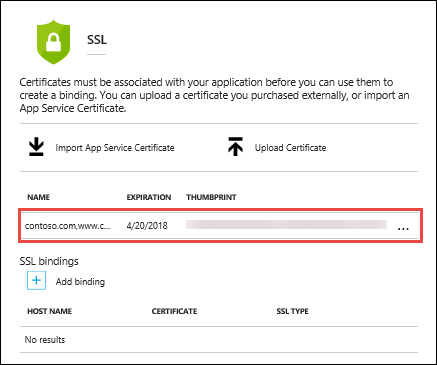

# Use an SSL certificate in your application code in Azure App Service

This how-to guide shows how to use one of SSL certificates you have uploaded or imported into your App Service app in your application code. An example of the use case is that your app accesses an external service that requires certificate authentication. 

This approach to using SSL certificates in your code makes use of the SSL functionality in App Service, which requires your app to be in **Basic** tier or above. An alternative is to include the certificate file in your application directory and load it directly (see [Alternative: load certificate as a file](#file)). However, this alternative does not let you hide the private key in the certificate from the application code or the developer. Furthermore, if your application code is in an open source repository, keeping a certificate with a private key in the repository is not an option.

When you let App Service manage your SSL certificates, you can maintain the certificates and your application code separately and safeguard your sensitive data.

## Prerequisites

To complete this how-to guide:

- [Create an App Service app](/azure/app-service/)
- [Map a custom DNS name to your web app](app-service-web-tutorial-custom-domain.md)
- [Upload an SSL certificate](app-service-web-tutorial-custom-ssl.md) or [import an App Service Certificate](web-sites-purchase-ssl-web-site.md) to your web app


## Load your certificates

To use a certificate that is uploaded to or imported into App Service, first make it accessible to your application code. You do this with the `WEBSITE_LOAD_CERTIFICATES` app setting.

In the <a href="https://portal.azure.com" target="_blank">Azure portal</a>, open your web app page.

In the left navigation, click **SSL certificates**.



All your uploaded and imported SSL certificates for this web app are shown here with their thumbprints. Copy the thumbprint of the certificate you want to use.

In the left navigation, click **Application settings**.

Add an app setting called `WEBSITE_LOAD_CERTIFICATES` and set its value to the thumbprint of the certificate. To make multiple certificates accessible, use comma-separated thumbprint values. To make all certificates accessible, set the value to `*`. Take note that this will place the certificate into the `CurrentUser\My` store.


When finished, click **Save**.

The configured certificate is now ready to be used by your code.

## Use certificate in C# code

Once your certificate is accessible, you access it in C# code by the certificate thumbprint. The following code loads a certificate with the thumbprint `E661583E8FABEF4C0BEF694CBC41C28FB81CD870`.

```csharp
using System;
using System.Security.Cryptography.X509Certificates;

...
X509Store certStore = new X509Store(StoreName.My, StoreLocation.CurrentUser);
certStore.Open(OpenFlags.ReadOnly);
X509Certificate2Collection certCollection = certStore.Certificates.Find(
                            X509FindType.FindByThumbprint,
                            // Replace below with your certificate's thumbprint
                            "E661583E8FABEF4C0BEF694CBC41C28FB81CD870",
                            false);
// Get the first cert with the thumbprint
if (certCollection.Count > 0)
{
    X509Certificate2 cert = certCollection[0];
    // Use certificate
    Console.WriteLine(cert.FriendlyName);
}
certStore.Close();
...
```

<a name="file"></a>
## Alternative: load certificate as a file

This section shows how to and load a certificate file that is in your application directory. 

The following C# example loads a certificate called `mycert.pfx` from the `certs` directory of your app's repository.

```csharp
using System;
using System.Security.Cryptography.X509Certificates;

...
// Replace the parameter with "~/<relative-path-to-cert-file>".
string certPath = Server.MapPath("~/certs/mycert.pfx");

X509Certificate2 cert = GetCertificate(certPath, signatureBlob.Thumbprint);
...
```

