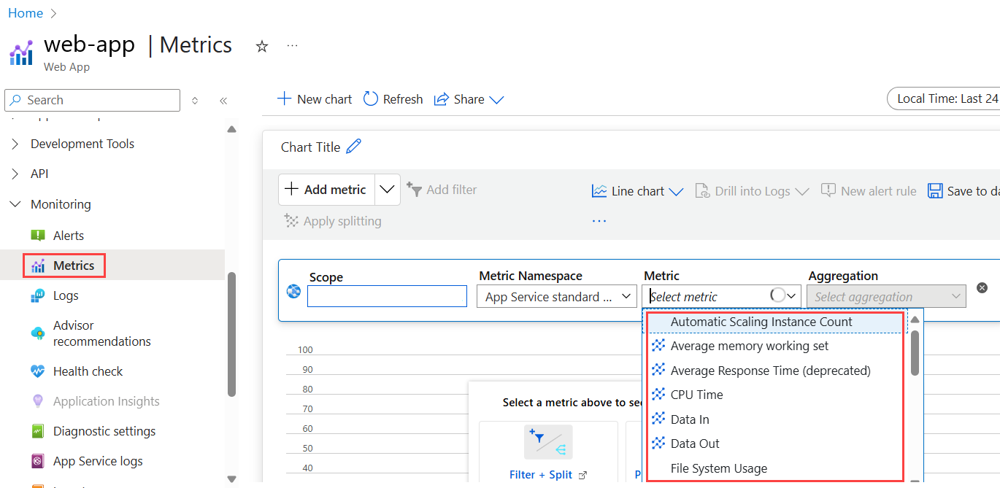

# Troubleshoot slow web app performance issues in Azure App Service
This article helps you troubleshoot slow web app performance issues in [Azure App Service](http://go.microsoft.com/fwlink/?LinkId=529714).

If you need more help at any point in this article, you can contact the Azure experts on [the MSDN Azure and the Stack Overflow forums](https://azure.microsoft.com/support/forums/). Alternatively, you can also file an Azure support incident. Go to the [Azure Support site](https://azure.microsoft.com/support/options/) and click on **Get Support**.

## Symptom
When you browse the web app, the pages load slowly and sometimes timeout.

## Cause
This problem is often caused by application level issues, such as:

* network requests taking a long time
* application code or database queries being inefficient
* application using high memory/CPU
* application crashing due to an exception

## Troubleshooting steps
Troubleshooting can be divided into three distinct tasks, in sequential order:

1. [Observe and monitor application behavior](#observe)
2. [Collect data](#collect)
3. [Mitigate the issue](#mitigate)

[App Service Web Apps](app-service-web-overview.md) gives you various options at each step.

<a name="observe" />

### 1. Observe and monitor application behavior
#### Track Service health
Microsoft Azure publicizes each time there is a service interruption or performance degradation. You can track the health of the service on the [Azure portal](https://portal.azure.com/). For more information, see [Track service health](../monitoring-and-diagnostics/insights-service-health.md).

#### Monitor your web app
This option enables you to find out if your application is having any issues. In your web app’s blade, click the **Requests and errors** tile. The **Metric** blade shows you all the metrics you can add.

Some of the metrics that you might want to monitor for your web app are

* Average memory working set
* Average response time
* CPU time
* Memory working set
* Requests

For more information, see:

* [Monitor Web Apps in Azure App Service](web-sites-monitor.md)
* [Receive alert notifications](../monitoring-and-diagnostics/insights-receive-alert-notifications.md)

#### Monitor web endpoint status
If you are running your web app in the **Standard** pricing tier, Web Apps lets you monitor two endpoints from three geographic locations.

Endpoint monitoring configures web tests from geo-distributed locations that test response time and uptime of web URLs. The test performs an HTTP GET operation on the web URL to determine the response time and uptime from each location. Each configured location runs a test every five minutes.

Uptime is monitored using HTTP response codes, and response time is measured in milliseconds. A monitoring test fails if the HTTP response code is greater than or equal to 400 or if the response takes more than 30 seconds. An endpoint is considered available if its monitoring tests succeed from all the specified locations.

To set it up, see [Monitor apps in Azure App Service](web-sites-monitor.md).

Also, see [Keeping Azure Web Sites up plus Endpoint Monitoring - with Stefan Schackow](https://channel9.msdn.com/Shows/Azure-Friday/Keeping-Azure-Web-Sites-up-plus-Endpoint-Monitoring-with-Stefan-Schackow) for a video on endpoint monitoring.

#### Application performance monitoring using Extensions
You can also monitor your application performance by using a *site extension*.

Each App Service web app provides an extensible management end point that allows you to use a powerful set of tools deployed as site extensions. Extensions include: 

- Source code editors like [Azure DevOps](https://www.visualstudio.com/products/what-is-visual-studio-online-vs.aspx). 
- Management tools for connected resources such as a MySQL database connected to a web app.

[Azure Application Insights](https://azure.microsoft.com/services/application-insights/) is a performance monitoring site extension that's also available. To use Application Insights, you rebuild your code with an SDK. You can also install an extension that provides access to additional data. The SDK lets you write code to monitor the usage and performance of your app in more detail. For more information, see [Monitor performance in web applications](../application-insights/app-insights-web-monitor-performance.md).

<a name="collect" />

### 2. Collect data
The Web Apps environment provides diagnostic functionality for logging information from both the web server and the web application. The information is separated into web server diagnostics and application diagnostics.

#### Enable web server diagnostics
You can enable or disable the following kinds of logs:

* **Detailed Error Logging** - Detailed error information for HTTP status codes that indicate a failure (status code 400 or greater). This may contain information that can help determine why the server returned the error code.
* **Failed Request Tracing** - Detailed information on failed requests, including a trace of the IIS components used to process the request and the time taken in each component. This can be useful if you are attempting to improve web app performance or isolate what is causing a specific HTTP error.
* **Web Server Logging** - Information about HTTP transactions using the W3C extended log file format. This is useful when determining overall web app metrics, such as the number of requests handled or how many requests are from a specific IP address.

#### Enable application diagnostics
There are several options to collect application performance data from Web Apps, profile your application live from Visual Studio, or modify your application code to log more information and traces. You can choose the options based on how much access you have to the application and what you observed from the monitoring tools.

##### Use Application Insights Profiler
You can enable the Application Insights Profiler to start capturing detailed performance traces. You can access traces captured up to five days ago when you need to investigate problems happened in the past. You can choose this option as long as you have access to the web app's Application Insights resource on Azure portal.

Application Insights Profiler provides statistics on response time for each web call and traces that indicates which line of code caused the slow responses. Sometimes the App Service app is slow because certain code is not written in a performant way. Examples include sequential code that can be run in parallel and undesired database lock contentions. Removing these bottlenecks in the code increases the app's performance, but they are hard to detect without setting up elaborate traces and logs. The traces collected by Application Insights Profiler helps identifying the lines of code that slows down the application and overcome this challenge for App Service apps.

 For more information, see [Profiling live Azure web apps with Application Insights](../application-insights/app-insights-profiler.md).

##### Use Remote Profiling
In Azure App Service, Web Apps, API Apps, and WebJobs can be remotely profiled. Choose this option if you have access to the web app resource and you know how to reproduce the issue, or if you know the exact time interval the performance issue happens.

Remote Profiling is useful if the CPU usage of the process is high and your process is running slower than expected, or the latency of HTTP requests are higher than normal, you can remotely profile your process and get the CPU sampling call stacks to analyze the process activity and code hot paths.

For more information, see [Remote Profiling support in Azure App Service](https://azure.microsoft.com/blog/remote-profiling-support-in-azure-app-service).

##### Set up diagnostic traces manually
If you have access to the web application source code, Application diagnostics enables you to capture information produced by a web application. ASP.NET applications can use the `System.Diagnostics.Trace` class to log information to the application diagnostics log. However, you need to change the code and redeploy your application. This method is recommended if your app is running on a testing environment.

For detailed instructions on how to configure your application for logging, see [Enable diagnostics logging for web apps in Azure App Service](web-sites-enable-diagnostic-log.md).

#### Use the Azure App Service support portal
Web Apps provides you with the ability to troubleshoot issues related to your web app by looking at HTTP logs, event logs, process dumps, and more. You can access all this information using our Support portal at **http://&lt;your app name>.scm.azurewebsites.net/Support**

The Azure App Service support portal provides you with three separate tabs to support the three steps of a common troubleshooting scenario:

1. Observe current behavior
2. Analyze by collecting diagnostics information and running the built-in analyzers
3. Mitigate

If the issue is happening right now, click **Analyze** > **Diagnostics** > **Diagnose Now** to create a diagnostic session for you, which collects HTTP logs, event viewer logs, memory dumps, PHP error logs, and PHP process report.

Once the data is collected, the support portal runs an analysis on the data and provides you with an HTML report.

In case you want to download the data, by default, it would be stored in the D:\home\data\DaaS folder.

For more information on the Azure App Service support portal, see [New Updates to Support Site Extension for Azure Websites](https://azure.microsoft.com/blog/new-updates-to-support-site-extension-for-azure-websites).

#### Use the Kudu Debug Console
Web Apps comes with a debug console that you can use for debugging, exploring, uploading files, as well as JSON endpoints for getting information about your environment. This console is called the *Kudu Console* or the *SCM Dashboard* for your web app.

You can access this dashboard by going to the link **https://&lt;Your app name>.scm.azurewebsites.net/**.

Some of the things that Kudu provides are:

* environment settings for your application
* log stream
* diagnostic dump
* debug console in which you can run Powershell cmdlets and basic DOS commands.

Another useful feature of Kudu is that, in case your application is throwing first-chance exceptions, you can use Kudu and the SysInternals tool Procdump to create memory dumps. These memory dumps are snapshots of the process and can often help you troubleshoot more complicated issues with your web app.

For more information on features available in Kudu, see
[Azure DevOps tools you should know about](https://azure.microsoft.com/blog/windows-azure-websites-online-tools-you-should-know-about/).

<a name="mitigate" />

### 3. Mitigate the issue
#### Scale the web app
In Azure App Service, for increased performance and throughput,  you can adjust the scale at which you are running your application. Scaling up a web app involves two related actions: changing your App Service plan to a higher pricing tier, and configuring certain settings after you have switched to the higher pricing tier.

For more information on scaling, see [Scale a web app in Azure App Service](web-sites-scale.md).

Additionally, you can choose to run your application on more than one instance. Scaling out not only provides you with more processing capability, but also gives you some amount of fault tolerance. If the process goes down on one instance, the other instances continue to serve requests.

You can set the scaling to be Manual or Automatic.

#### Use AutoHeal
AutoHeal recycles the worker process for your app based on settings you choose (like configuration changes, requests, memory-based limits, or the time needed to execute a request). Most of the time, recycle the process is the fastest way to recover from a problem. Though you can always restart the web app from directly within the Azure portal, AutoHeal does it automatically for you. All you need to do is add some triggers in the root web.config for your web app. These settings would work in the same way even if your application is not a .Net app.

For more information, see [Auto-Healing Azure Web Sites](https://azure.microsoft.com/blog/auto-healing-windows-azure-web-sites/).

#### Restart the web app
Restarting is often the simplest way to recover from one-time issues. On the [Azure portal](https://portal.azure.com/), on your web app’s blade, you have the options to stop or restart your app.

 

You can also manage your web app using Azure Powershell. For more information, see
[Using Azure PowerShell with Azure Resource Manager](../powershell-azure-resource-manager.md).
