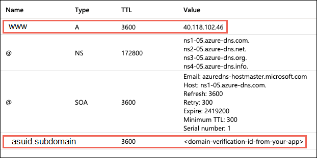

# Map an existing custom DNS name to Azure App Service

[Azure App Service](overview.md) provides a highly scalable, self-patching web hosting service. This guide shows you how to map an existing custom Domain Name System (DNS) name to App Service. To migrate a live site and its DNS domain name to App Service with no downtime, see [Migrate an active DNS name to Azure](manage-custom-dns-migrate-domain.md).

The DNS record type you need to add with your domain provider depends on the domain you want to add to App Service.

| Scenario | Example | Recommended DNS record |
| - | - | - | - |
| Root domain | contoso.com | [A record](https://en.wikipedia.org/wiki/List_of_DNS_record_types#A). Don't use the CNAME record for the root record (for information, see [RFC 1912 Section 2.4](https://datatracker.ietf.org/doc/html/rfc1912#section-2.4)). |
| Subdomain | www.contoso.com, my.contoso.com | [CNAME record](https://en.wikipedia.org/wiki/CNAME_record). You can map a subdomain to the app's IP address directly with an A record, but it's possible for [the IP address to change](overview-inbound-outbound-ips.md#when-inbound-ip-changes). The CNAME maps to the app's default hostname instead, which is less susceptible to change. | 
| [Wildcard](https://en.wikipedia.org/wiki/Wildcard_DNS_record) | *.contoso.com | [CNAME record](https://en.wikipedia.org/wiki/CNAME_record). |

> [!NOTE]
> For an end-to-end tutorial that shows you how to configure a `www` subdomain and a managed certificate, see [Tutorial: Secure your Azure App Service app with a custom domain and a managed certificate](tutorial-secure-domain-certificate.md).

## Prerequisites

* [Create an App Service app](./index.yml), or use an app that you created for another tutorial. The web app's [App Service plan](overview-hosting-plans.md) must be a paid tier and not **Free (F1)**. See [Scale up an app](manage-scale-up.md#scale-up-your-pricing-tier) to update the tier.
* Make sure you can edit the DNS records for your custom domain. To edit DNS records, you need access to the DNS registry for your domain provider, such as GoDaddy. For example, to add DNS entries for `contoso.com` and `www.contoso.com`, you must be able to configure the DNS settings for the `contoso.com` root domain. Your custom domains must be in a public DNS zone; private DNS zones are not supported.
* If you don't have a custom domain yet, you can [purchase an App Service domain](manage-custom-dns-buy-domain.md) instead.

## 1. Configure a custom domain

1. In the [Azure portal](https://portal.azure.com), navigate to your app's management page.
1. In the left menu for your app, select **Custom domains**.
1. Select **Add custom domain**.

    :::image type="content" source="./media/app-service-web-tutorial-custom-domain/add-custom-domain.png" alt-text="A screenshot showing how to open the Add custom domain dialog." border="true":::

1. For **Domain provider**, select **All other domain services** to configure a third-party domain.

    > [!NOTE]
    > To configure an App Service domain, see [Buy a custom domain name for Azure App Service](manage-custom-dns-buy-domain.md).

1. For **TLS/SSL certificate**, select **App Service Managed Certificate** if your app is in **Basic** tier or higher. If you want to remain in **Shared** tier, or if you want to use your own certificate, select **Add certificate later**.

1. For **TLS/SSL type**, select the binding type you want.

    [!INCLUDE [Certificate binding types](../../includes/app-service-ssl-binding-types.md)]

1. For Domain, specify a fully qualified domain name you want based on the domain you own. The **Hostname record type** box defaults to the recommended DNS record to use, depending on whether the domain is a root domain (like `contoso.com`), a subdomain (like `www.contoso.com`, or a wildcard domain `*.contoso.com`).

1. Don't select **Validate** yet.

1. For each custom domain in App Service, you need two DNS records with your domain provider. The **Domain validation** section shows you two DNS records that you must add with your domain provider. Select the respective **Copy** button to help you with the next step.

    The following screenshot shows the default selections for a `www.contoso.com` domain, which shows a CNAME record and a TXT record to add.

    :::image type="content" source="./media/app-service-web-tutorial-custom-domain/configure-custom-domain.png" alt-text="A screenshot showing how to configure a new custom domain, along with a managed certificate." border="true":::

    > [!WARNING]
    > While it's not absolutely required to add the TXT record, it's highly recommended for security. The TXT record is a *domain verification ID* that helps avoid subdomain takeovers from other App Service apps. For custom domains you previously configured without this verification ID, you should protect them from the same risk by adding the verification ID (the TXT record) to your DNS configuration. For more information on this common high-severity threat, see [Subdomain takeover](../security/fundamentals/subdomain-takeover.md).

## 2. Create the DNS records

[!INCLUDE [Access DNS records with domain provider](../../includes/app-service-web-access-dns-records-no-h.md)]

Select the type of record to create and follow the instructions. You can use either a [CNAME record](https://en.wikipedia.org/wiki/CNAME_record) or an [A record](https://en.wikipedia.org/wiki/List_of_DNS_record_types#A) to map a custom DNS name to App Service. When your function app is hosted in a [Consumption plan](../azure-functions/consumption-plan.md), only the CNAME option is supported.

### [Root domain (e.g. contoso.com)](#tab/root)

Create two records according to the following table:

| Record type | Host | Value | Comments |
| - | - | - | - |
| A | `@` | The app's IP address shown in the **Add custom domain** dialog. | The domain mapping itself (`@` typically represents the root domain). |
| TXT | `asuid` | The domain verification ID shown in the **Add custom domain** dialog. | For root domain, App Service accesses `asuid` TXT record to verify your ownership of the custom domain. |

### [Subdomain (e.g. www.contoso.com)](#tab/subdomain)

#### With an A record

Create two records according to the following table:

|Record type|Host|Value|Comments|
|--- |--- |--- |--- |
|A|\<subdomain\> (for example, www)|IP address shown in the **Add custom domain** dialog.| The domain mapping itself. |
|TXT|asuid.\<subdomain\> (for example, asuid.www)|The domain verification ID shown in the **Add custom domain** dialog.| App Service accesses the `asuid.<subdomain>` TXT record to verify your ownership of the custom domain. |

#### With a CNAME record

Create two records according to the following table:

| Record type | Host | Value | Comments |
| - | - | - |
| CNAME | `<subdomain>` (for example, `www`) | `<app-name>.azurewebsites.net` | The domain mapping itself. |
| TXT | `asuid.<subdomain>` (for example, `asuid.www`) | The domain verification ID shown in the **Add custom domain** dialog. | App Service accesses the `asuid.<subdomain>` TXT record to verify your ownership of the custom domain. |

### [Wildcard (CNAME)](#tab/wildcard)

For a wildcard name like `*` in `*.contoso.com`, create two records according to the following table:

| Record type | Host | Value | Comments |
| - | - | - | - |
| CNAME | `*` | `<app-name>.azurewebsites.net` | The domain mapping itself. |
| TXT | `asuid` | The domain verification ID shown in the **Add custom domain** dialog. | App Service accesses the `asuid` TXT record to verify your ownership of the custom domain. |

-----

## 3. Validate and complete

1. Back in the **Add custom domain** dialog in the Azure portal, select **Validate**.

    :::image type="content" source="./media/app-service-web-tutorial-custom-domain/configure-custom-domain-validate.png" alt-text="A screenshot showing how to validate your DNS record settings in the Add a custom domain dialog." border="true":::

1. If the **Domain validation** section shows green check marks next for both domain records, then you've configured them correctly. Select **Add**. If you see any errors or warnings, fix it in the DNS record settings on your domain provider's website.

    :::image type="content" source="./media/app-service-web-tutorial-custom-domain/configure-custom-domain-add.png" alt-text="A screenshot showing the Add button activated after validation." border="true":::

    > [!NOTE]
    > If you configured the TXT record but not the A or CNAME record, App Service treats it as a [domain migration](manage-custom-dns-migrate-domain.md) scenario and allows the validation to succeed, but you won't see green check marks next to the records.

1. You should see the custom domain added to the list. You may also see a red X with **No binding**. 

    If you selected **App Service Managed Certificate** earlier, wait a few minutes for App Service to create the managed certificate for your custom domain. When the process is complete, the red X becomes a green check mark with **Secured**. If you selected **Add certificate later**, this red X will remain until you [add a private certificate for the domain](configure-ssl-certificate.md) and [configure the binding](configure-ssl-bindings.md).

    :::image type="content" source="./media/app-service-web-tutorial-custom-domain/add-custom-domain-complete.png" alt-text="A screenshot showing the custom domains page with the new secured custom domain." border="true":::

    > [!NOTE]
    > Unless you configure a certificate binding for your custom domain, Any HTTPS request from a browser to the domain will receive an error or warning, depending on the browser.
    
## 4. Test in a browser

Browse to the DNS names that you configured earlier.

If you receive an HTTP 404 (Not Found) error when you browse to the URL of your custom domain, the two most-likely causes are:

- The browser client has cached the old IP address of your domain. Clear the cache, and test DNS resolution again. On a Windows machine, you clear the cache with `ipconfig /flushdns`.
- You configured an IP-based certificate binding, and the app's IP address has changed because of it. [Remap the A record](configure-ssl-bindings.md#2-remap-records-for-ip-based-ssl) in your DNS entries to the new IP address.

If you receive a `Page not secure` warning or error, it's because your domain doesn't have a certificate binding yet. [Add a private certificate for the domain](configure-ssl-certificate.md) and [configure the binding](configure-ssl-bindings.md).

## (Optional) Automate with scripts

[!INCLUDE [automate-with-scripts](../../includes/app-service-web-tutorial-custom-domain-scripts.md)]

## Next steps

> [!div class="nextstepaction"]
> [Purchase an App Service domain](manage-custom-dns-buy-domain.md).

> [!div class="nextstepaction"]
> [Secure a custom DNS name with a TLS/SSL binding in Azure App Service](configure-ssl-bindings.md)
