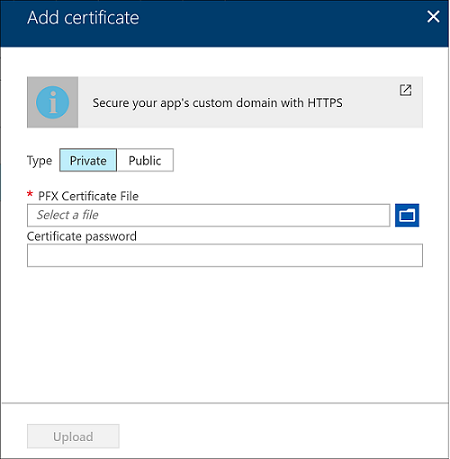
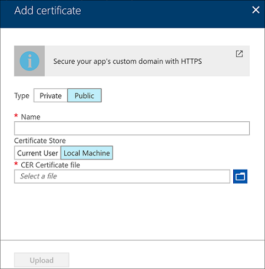

# Tutorial: Bind an existing custom SSL certificate to Azure Web Apps

Azure Web Apps provides a highly scalable, self-patching web hosting service. This tutorial shows you how to bind a custom SSL certificate that you purchased from a trusted certificate authority to [Azure Web Apps](app-service-web-overview.md). When you're finished, you'll be able to access your web app at the HTTPS endpoint of your custom DNS domain.


In this tutorial, you learn how to:

> [!div class="checklist"]
> * Upgrade your app's pricing tier
> * Bind your custom certificate to App Service
> * Renew certificates
> * Enforce HTTPS
> * Enforce TLS 1.1/1.2
> * Automate TLS management with scripts

> [!NOTE]
> If you need to get a custom SSL certificate, you can get one in the Azure portal directly and bind it to your web app. Follow the [App Service Certificates tutorial](web-sites-purchase-ssl-web-site.md).

## Prerequisites

To complete this tutorial:

- [Create an App Service app](/azure/app-service/)
- [Map a custom DNS name to your web app](app-service-web-tutorial-custom-domain.md)
- Acquire an SSL certificate from a trusted certificate authority
- Have the private key you used to sign the SSL certificate request

<a name="requirements"></a>

### Requirements for your SSL certificate

To use a certificate in App Service, the certificate must meet all the following requirements:

* Signed by a trusted certificate authority
* Exported as a password-protected PFX file
* Contains private key at least 2048 bits long
* Contains all intermediate certificates in the certificate chain

> [!NOTE]
> **Elliptic Curve Cryptography (ECC) certificates** can work with App Service but are not covered by this article. Work with your certificate authority on the exact steps to create ECC certificates.

[!INCLUDE [Prepare your web app](../../includes/app-service-ssl-prepare-app.md)]

<a name="upload"></a>

## Bind your SSL certificate

You are ready to upload your SSL certificate to your web app.

### Merge intermediate certificates

If your certificate authority gives you multiple certificates in the certificate chain, you need to merge the certificates in order. 

To do this, open each certificate you received in a text editor. 

Create a file for the merged certificate, called _mergedcertificate.crt_. In a text editor, copy the content of each certificate into this file. The order of your certificates should follow the order in the certificate chain, beginning with your certificate and ending with the root certificate. It looks like the following example:

```
-----BEGIN CERTIFICATE-----
<your entire Base64 encoded SSL certificate>
-----END CERTIFICATE-----

-----BEGIN CERTIFICATE-----
<The entire Base64 encoded intermediate certificate 1>
-----END CERTIFICATE-----

-----BEGIN CERTIFICATE-----
<The entire Base64 encoded intermediate certificate 2>
-----END CERTIFICATE-----

-----BEGIN CERTIFICATE-----
<The entire Base64 encoded root certificate>
-----END CERTIFICATE-----
```

### Export certificate to PFX

Export your merged SSL certificate with the private key that your certificate request was generated with.

If you generated your certificate request using OpenSSL, then you have created a private key file. To export your certificate to PFX, run the following command. Replace the placeholders _&lt;private-key-file>_ and _&lt;merged-certificate-file>_ with the paths to your private key and your merged certificate file.

```bash
openssl pkcs12 -export -out myserver.pfx -inkey <private-key-file> -in <merged-certificate-file>  
```

When prompted, define an export password. You'll use this password when uploading your SSL certificate to App Service later.

If you used IIS or _Certreq.exe_ to generate your certificate request, install the certificate to your local machine, and then [export the certificate to PFX](https://technet.microsoft.com/library/cc754329(v=ws.11).aspx).

### Upload your SSL certificate

To upload your SSL certificate, click **SSL settings** in the left navigation of your web app.

Click **Upload Certificate**. 

In **PFX Certificate File**, select your PFX file. In **Certificate password**, type the password that you created when you exported the PFX file.

Click **Upload**.



When App Service finishes uploading your certificate, it appears in the **SSL settings** page.


### Bind your SSL certificate

In the **SSL bindings** section, click **Add binding**.

In the **Add SSL Binding** page, use the dropdowns to select the domain name to secure, and the certificate to use.

> [!NOTE]
> If you have uploaded your certificate but don't see the domain name(s) in the **Hostname** dropdown, try refreshing the browser page.
>
>

In **SSL Type**, select whether to use **[Server Name Indication (SNI)](http://en.wikipedia.org/wiki/Server_Name_Indication)** or IP-based SSL.

- **SNI-based SSL** - Multiple SNI-based SSL bindings may be added. This option allows multiple SSL certificates to secure multiple domains on the same IP address. Most modern browsers (including Internet Explorer, Chrome, Firefox, and Opera) support SNI (find more comprehensive browser support information at [Server Name Indication](http://wikipedia.org/wiki/Server_Name_Indication)).
- **IP-based SSL** - Only one IP-based SSL binding may be added. This option allows only one SSL certificate to secure a dedicated public IP address. To secure multiple domains, you must secure them all using the same SSL certificate. This is the traditional option for SSL binding.

Click **Add Binding**.


When App Service finishes uploading your certificate, it appears in the **SSL bindings** sections.


## Remap A record for IP SSL

If you don't use IP-based SSL in your web app, skip to [Test HTTPS for your custom domain](#test).

By default, your web app uses a shared public IP address. When you bind a certificate with IP-based SSL, App Service creates a new, dedicated IP address for your web app.

If you have mapped an A record to your web app, update your domain registry with this new, dedicated IP address.

Your web app's **Custom domain** page is updated with the new, dedicated IP address. [Copy this IP address](app-service-web-tutorial-custom-domain.md#info), then [remap the A record](app-service-web-tutorial-custom-domain.md#map-an-a-record) to this new IP address.

<a name="test"></a>

## Test HTTPS

All that's left to do now is to make sure that HTTPS works for your custom domain. In various browsers, browse
to `https://<your.custom.domain>` to see that it serves up your web app.


> [!NOTE]
> If your web app gives you certificate validation errors, you're probably using a self-signed certificate.
>
> If that's not the case, you may have left out intermediate certificates when you export your certificate to the PFX file.

<a name="bkmk_enforce"></a>

## Renew certificates

Your inbound IP address can change when you delete a binding, even if that binding is IP-based. This is especially important when you renew a certificate that's already in an IP-based binding. To avoid a change in your app's IP address, follow these steps in order:

1. Upload the new certificate.
2. Bind the new certificate to the custom domain you want without deleting the old one. This action replaces the binding instead of removing the old one.
3. Delete the old certificate. 

## Enforce HTTPS

By default, anyone can still access your web app using HTTP. You can redirect all HTTP requests to the HTTPS port.

In your web app page, in the left navigation, select **SSL settings**. Then, in **HTTPS Only**, select **On**.


When the operation is complete, navigate to any of the HTTP URLs that point to your app. For example:

- `http://<app_name>.azurewebsites.net`
- `http://contoso.com`
- `http://www.contoso.com`

## Enforce TLS versions

Your app allows [TLS](https://wikipedia.org/wiki/Transport_Layer_Security) 1.2 by default, which is the recommended TLS level by industry standards, such as [PCI DSS](https://wikipedia.org/wiki/Payment_Card_Industry_Data_Security_Standard). To enforce different TLS versions, follow these steps:

In your web app page, in the left navigation, select **SSL settings**. Then, in **TLS version**, select the minimum TLS version you want. This setting controls the inbound calls only. 


When the operation is complete, your app rejects all connections with lower TLS versions.

## Automate with scripts

You can automate SSL bindings for your web app with scripts, using the [Azure CLI](/cli/azure/install-azure-cli) or [Azure PowerShell](/powershell/azure/overview).

### Azure CLI

The following command uploads an exported PFX file and gets the thumbprint.

```bash
thumbprint=$(az webapp config ssl upload \
    --name <app_name> \
    --resource-group <resource_group_name> \
    --certificate-file <path_to_PFX_file> \
    --certificate-password <PFX_password> \
    --query thumbprint \
    --output tsv)
```

The following command adds an SNI-based SSL binding, using the thumbprint from the previous command.

```bash
az webapp config ssl bind \
    --name <app_name> \
    --resource-group <resource_group_name>
    --certificate-thumbprint $thumbprint \
    --ssl-type SNI \
```

The following command enforces minimum TLS version of 1.2.

```bash
az webapp config set \
    --name <app_name> \
    --resource-group <resource_group_name>
    --min-tls-version 1.2
```

### Azure PowerShell

The following command uploads an exported PFX file and adds an SNI-based SSL binding.

```PowerShell
New-AzureRmWebAppSSLBinding `
    -WebAppName <app_name> `
    -ResourceGroupName <resource_group_name> `
    -Name <dns_name> `
    -CertificateFilePath <path_to_PFX_file> `
    -CertificatePassword <PFX_password> `
    -SslState SniEnabled
```
## Public certificates (optional)
You can upload [public certificates](https://blogs.msdn.microsoft.com/appserviceteam/2017/11/01/app-service-certificates-now-supports-public-certificates-cer/) to your web app so the app can access an external service that requires certificate authentication.  For more details on loading and using a public certificate in your app, see [Use an SSL certificate in your application code in Azure App Service](https://docs.microsoft.com/azure/app-service/app-service-web-ssl-cert-load).  You can use public certificates with apps in App Service Environments also. If you need to store the certificate in the LocalMachine certificate store, you need to use a web app on App Service Environment. For more information, see [How to configure public certificates to your Web App](https://blogs.msdn.microsoft.com/appserviceteam/2017/11/01/app-service-certificates-now-supports-public-certificates-cer).



## Next steps

In this tutorial, you learned how to:

> [!div class="checklist"]
> * Upgrade your app's pricing tier
> * Bind your custom certificate to App Service
> * Renew certificates
> * Enforce HTTPS
> * Enforce TLS 1.1/1.2
> * Automate TLS management with scripts

Advance to the next tutorial to learn how to use Azure Content Delivery Network.

> [!div class="nextstepaction"]
> [Add a Content Delivery Network (CDN) to an Azure App Service](../cdn/cdn-add-to-web-app.md)

For more information, see [Use an SSL certificate in your application code in Azure App Service](app-service-web-ssl-cert-load.md).
