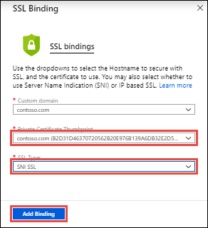
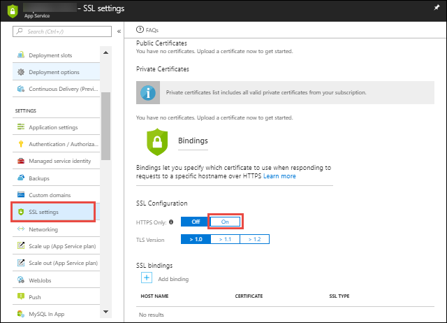
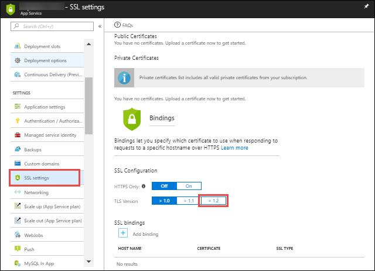

# Tutorial: Upload and bind SSL certificates to Azure App Service

[Azure App Service](overview.md) provides a highly scalable, self-patching web hosting service. This tutorial shows you how to secure a custom domain in App Service with a certificate that you purchased from a trusted certificate authority. It also shows you how to upload any private and public certificates your app needs. When you're finished, you'll be able to access your app at the HTTPS endpoint of your custom DNS domain.


In this tutorial, you learn how to:

> [!div class="checklist"]
> * Upgrade your app's pricing tier
> * Secure a custom domain with a certificate
> * Upload a private certificate
> * Upload a public certificate
> * Renew certificates
> * Enforce HTTPS
> * Enforce TLS 1.1/1.2
> * Automate TLS management with scripts

## Prerequisites

To complete this tutorial:

- [Create an App Service app](/azure/app-service/)
- [Map a custom DNS name to your App Service app](app-service-web-tutorial-custom-domain.md) (if securing a custom domain)
- Acquire a certificate from a trusted certificate authority
- Have the private key you used to sign the certificate request (for private certificates)

<a name="requirements"></a>

## Prepare a private certificate

To secure a domain, the certificate must meet all the following requirements:

* Configured for Server Authentication
* Signed by a trusted certificate authority
* Exported as a password-protected PFX file
* Contains private key at least 2048 bits long
* Contains all intermediate certificates in the certificate chain

> [!TIP]
> If you need to get a custom SSL certificate, you can get one in the Azure portal directly and import it to your app. Follow the [App Service Certificates tutorial](web-sites-purchase-ssl-web-site.md).

> [!NOTE]
> **Elliptic Curve Cryptography (ECC) certificates** can work with App Service but are not covered by this article. Work with your certificate authority on the exact steps to create ECC certificates.

Once you obtain a certificate from your certificate provider, follow the steps in this section to make it ready for App Service.

### Merge intermediate certificates

If your certificate authority gives you multiple certificates in the certificate chain, you need to merge the certificates in order.

To do this, open each certificate you received in a text editor.

Create a file for the merged certificate, called _mergedcertificate.crt_. In a text editor, copy the content of each certificate into this file. The order of your certificates should follow the order in the certificate chain, beginning with your certificate and ending with the root certificate. It looks like the following example:

```
-----BEGIN CERTIFICATE-----
<your entire Base64 encoded SSL certificate>
-----END CERTIFICATE-----

-----BEGIN CERTIFICATE-----
<The entire Base64 encoded intermediate certificate 1>
-----END CERTIFICATE-----

-----BEGIN CERTIFICATE-----
<The entire Base64 encoded intermediate certificate 2>
-----END CERTIFICATE-----

-----BEGIN CERTIFICATE-----
<The entire Base64 encoded root certificate>
-----END CERTIFICATE-----
```

### Export certificate to PFX

Export your merged SSL certificate with the private key that your certificate request was generated with.

If you generated your certificate request using OpenSSL, then you have created a private key file. To export your certificate to PFX, run the following command. Replace the placeholders _&lt;private-key-file>_ and _&lt;merged-certificate-file>_ with the paths to your private key and your merged certificate file.

```bash
openssl pkcs12 -export -out myserver.pfx -inkey <private-key-file> -in <merged-certificate-file>  
```

When prompted, define an export password. You'll use this password when uploading your SSL certificate to App Service later.

If you used IIS or _Certreq.exe_ to generate your certificate request, install the certificate to your local machine, and then [export the certificate to PFX](https://technet.microsoft.com/library/cc754329(v=ws.11).aspx).

You're now ready upload the certificate to App Service.

[!INCLUDE [Prepare your web app](../../includes/app-service-ssl-prepare-app.md)]

<a name="upload"></a>

## Secure a custom domain

> [!TIP]
> If you need to get a custom SSL certificate, you can get one in the Azure portal directly and bind it to your app. Follow the [App Service Certificates tutorial](web-sites-purchase-ssl-web-site.md).

To secure a [custom domain](app-service-web-tutorial-custom-domain.md) with a third-party certificate, you upload the [prepared private certificate](#prepare-a-private-certificate) and then bind it to the custom domain, but App Service simplifies the process for you. Do the following steps:

Click **Custom domains** in the left navigation of your app, then click **Add binding** for the domain you want to secure. If you don't see **Add binding** for a domain, then it's already secure and should have a **Secure** SSL state.


Click **Upload Certificate**.

In **PFX Certificate File**, select your PFX file. In **Certificate password**, type the password that you created when you exported the PFX file.

Click **Upload**.


Wait for Azure to upload your certificate and launch the SSL bindings dialog.

In the SSL bindings dialog, select the certificate you uploaded and the SSL type, and then click **Add Binding**.

> [!NOTE]
> The following SSL types are supported:
>
> - **[SNI-based SSL](https://en.wikipedia.org/wiki/Server_Name_Indication)** - Multiple SNI-based SSL bindings may be added. This option allows multiple SSL certificates to secure multiple domains on the same IP address. Most modern browsers (including Internet Explorer, Chrome, Firefox, and Opera) support SNI (find more comprehensive browser support information at [Server Name Indication](https://wikipedia.org/wiki/Server_Name_Indication)).
> - **IP-based SSL** - Only one IP-based SSL binding may be added. This option allows only one SSL certificate to secure a dedicated public IP address. To secure multiple domains, you must secure them all using the same SSL certificate. This is the traditional option for SSL binding.



The domain's SSL state should now be changed to **Secure**.


> [!NOTE]
> A **Secure** state in the **Custom domains** means that it is secured with a certificate, but App Service doesn't check if the certificate is self-signed or expired, for example, which can also cause browsers to show an error or warning.

## Remap A record for IP SSL

If you don't use IP-based SSL in your app, skip to [Test HTTPS for your custom domain](#test).

By default, your app uses a shared public IP address. When you bind a certificate with IP-based SSL, App Service creates a new, dedicated IP address for your app.

If you have mapped an A record to your app, update your domain registry with this new, dedicated IP address.

Your app's **Custom domain** page is updated with the new, dedicated IP address. [Copy this IP address](app-service-web-tutorial-custom-domain.md#info), then [remap the A record](app-service-web-tutorial-custom-domain.md#map-an-a-record) to this new IP address.

<a name="test"></a>

## Test HTTPS

All that's left to do now is to make sure that HTTPS works for your custom domain. In various browsers, browse
to `https://<your.custom.domain>` to see that it serves up your app.


> [!NOTE]
> If your app gives you certificate validation errors, you're probably using a self-signed certificate.
>
> If that's not the case, you may have left out intermediate certificates when you export your certificate to the PFX file.

## Renew certificates

Your inbound IP address can change when you delete a binding, even if that binding is IP-based. This is especially important when you renew a certificate that's already in an IP-based binding. To avoid a change in your app's IP address, follow these steps in order:

1. Upload the new certificate.
2. Bind the new certificate to the custom domain you want without deleting the old one. This action replaces the binding instead of removing the old one.
3. Delete the old certificate. 

<a name="bkmk_enforce"></a>

## Enforce HTTPS

By default, anyone can still access your app using HTTP. You can redirect all HTTP requests to the HTTPS port.

In your app page, in the left navigation, select **SSL settings**. Then, in **HTTPS Only**, select **On**.



When the operation is complete, navigate to any of the HTTP URLs that point to your app. For example:

- `http://<app_name>.azurewebsites.net`
- `http://contoso.com`
- `http://www.contoso.com`

## Enforce TLS versions

Your app allows [TLS](https://wikipedia.org/wiki/Transport_Layer_Security) 1.2 by default, which is the recommended TLS level by industry standards, such as [PCI DSS](https://wikipedia.org/wiki/Payment_Card_Industry_Data_Security_Standard). To enforce different TLS versions, follow these steps:

In your app page, in the left navigation, select **SSL settings**. Then, in **TLS version**, select the minimum TLS version you want. This setting controls the inbound calls only. 



When the operation is complete, your app rejects all connections with lower TLS versions.

## Automate with scripts

You can automate SSL bindings for your app with scripts, using the [Azure CLI](/cli/azure/install-azure-cli) or [Azure PowerShell](/powershell/azure/overview).

### Azure CLI

The following command uploads an exported PFX file and gets the thumbprint.

```azurecli-interactive
thumbprint=$(az webapp config ssl upload \
    --name <app-name> \
    --resource-group <resource-group-name> \
    --certificate-file <path-to-PFX-file> \
    --certificate-password <PFX-password> \
    --query thumbprint \
    --output tsv)
```

The following command adds an SNI-based SSL binding, using the thumbprint from the previous command.

```azurecli-interactive
az webapp config ssl bind \
    --name <app-name> \
    --resource-group <resource-group-name>
    --certificate-thumbprint $thumbprint \
    --ssl-type SNI \
```

The following command enforces minimum TLS version of 1.2.

```azurecli-interactive
az webapp config set \
    --name <app-name> \
    --resource-group <resource-group-name>
    --min-tls-version 1.2
```

### Azure PowerShell

[!INCLUDE [updated-for-az](../../includes/updated-for-az.md)]

The following command uploads an exported PFX file and adds an SNI-based SSL binding.

```powershell
New-AzWebAppSSLBinding `
    -WebAppName <app_name> `
    -ResourceGroupName <resource_group_name> `
    -Name <dns_name> `
    -CertificateFilePath <path_to_PFX_file> `
    -CertificatePassword <PFX_password> `
    -SslState SniEnabled
```

## Use certificates in your code

If your app needs to connect to remote resources, and the remote resource requires certificate authentication, you can upload public or private certificates to your app. You don't need to bind these certificates to any custom domain in your app. For more information, see [Use an SSL certificate in your application code in Azure App Service](app-service-web-ssl-cert-load.md).

## Next steps

In this tutorial, you learned how to:

> [!div class="checklist"]
> * Upgrade your app's pricing tier
> * Bind your custom certificate to App Service
> * Renew certificates
> * Enforce HTTPS
> * Enforce TLS 1.1/1.2
> * Automate TLS management with scripts

Advance to the next tutorial to learn how to use Azure Content Delivery Network.

> [!div class="nextstepaction"]
> [Add a Content Delivery Network (CDN) to an Azure App Service](../cdn/cdn-add-to-web-app.md)

For more information, see [Use an SSL certificate in your application code in Azure App Service](app-service-web-ssl-cert-load.md).
