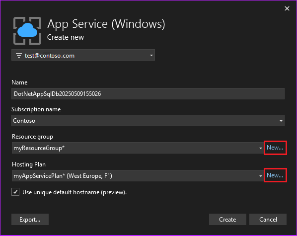
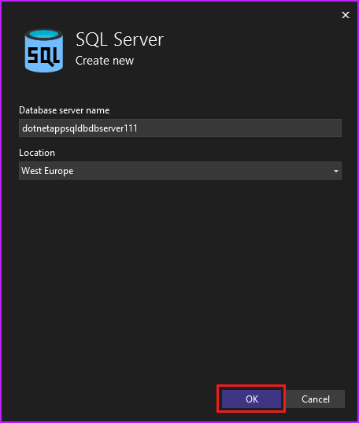
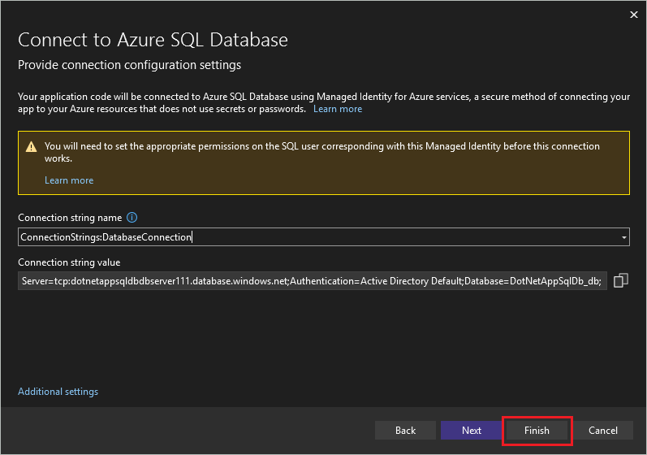
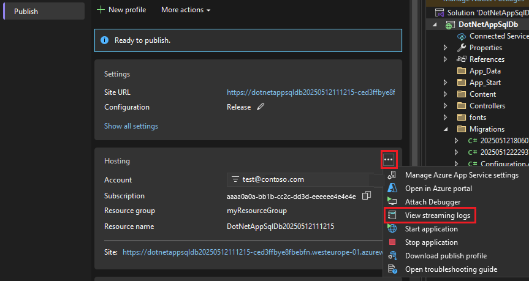

# Tutorial: Deploy an ASP.NET app with Azure SQL database to Azure

[Azure App Service](overview.md) provides a highly scalable, self-patching web hosting service. This tutorial shows you how to deploy a data-driven ASP.NET app in App Service and connect it to [Azure SQL Database](/azure/azure-sql/database/sql-database-paas-overview).

When you finish the tutorial, you have an ASP.NET app connected to an Azure SQL database running in Azure. The following example shows the app interface.


In this tutorial, you:

> [!div class="checklist"]
>
> - Publish a data-driven web app to Azure.
> - Create an Azure SQL database to hold the app data.
> - Connect the ASP.NET app to the Azure SQL database.
> - Configure a managed identity and Microsoft Entra ID authentication for the database connection.
> - Update the data model and redeploy the app.
> - Stream application logs from Azure to Visual Studio.

## Prerequisites

- [!INCLUDE [quickstarts-free-trial-note](~/reusable-content/ce-skilling/azure/includes/quickstarts-free-trial-note.md)]
- Install <a href="https://www.visualstudio.com/downloads/" target="_blank">Visual Studio 2022</a> with the **ASP.NET and web development** and **Azure development** workloads.
  - You can add the workloads to an existing Visual Studio installation by selecting **Get Tools and Features** in the Visual Studio **Tools** menu.
  - Make sure you have the latest updates for Visual Studio 2022 by selecting **Help** > **Check for updates** and installing the latest version if necessary.

## Create and run the app

The sample project contains a basic [ASP.NET MVC](https://www.asp.net/mvc) create-read-update-delete (CRUD) app that uses [Entity Framework Code First](/aspnet/mvc/overview/getting-started/getting-started-with-ef-using-mvc/creating-an-entity-framework-data-model-for-an-asp-net-mvc-application).

1. Download the [sample project](https://github.com/Azure-Samples/dotnet-sqldb-tutorial/archive/master.zip) and extract the *dotnet-sqldb-tutorial-master.zip* file.

1. Open the extracted *dotnet-sqldb-tutorial-master/DotNetAppSqlDb.sln* file in Visual Studio.

1. Press **F5** to run the app and open it in your default browser.

   > [!NOTE] 
   > If necessary, [install any missing NuGet packages](/nuget/consume-packages/install-use-packages-visual-studio).

1. In the app, select **Create New** and create a couple of *to-do* items.

   

1. Test the **Edit**, **Details**, and **Delete** links.

## Publish the app to Azure

To publish the app to Azure, you create and configure a Publish profile that has an Azure App Service and App Service Plan to host the app. You then create an Azure SQL Server and Azure SQL database to contain the app data, and configure a database context to connect the app with the database.

1. In Visual Studio **Solution Explorer**, right-click the **DotNetAppSqlDb** project and select **Publish**.

   

1. On the **Publish** screen, select **Azure** as your target and select **Next**.

1. On the next screen, make sure that **Azure App Service (Windows)** is selected and select **Next**.

### Sign in and add an Azure App Service

1. On the next **Publish** screen, sign in to your Microsoft account and the subscription you want to use.

1. Next to **App Service**, select **Create new**.

   

### Configure the Azure App Service

1. On the **App Service (Windows)** screen, configure the App Service **Name**, **Resource group**, and **Hosting Plan**.

   

1. Under **Name**, you can keep the generated web app name, or change it to another name with characters `a-z`, `0-9`, and `-`. The web app name must be unique across all Azure apps.

1. Next to **Resource group**, select **New**, and name the resource group **myResourceGroup**.

   [!INCLUDE [resource-group](~/reusable-content/ce-skilling/azure/includes/resource-group.md)]

1. Next to **Hosting Plan**, select **New**.

   [!INCLUDE [app-service-plan](../../includes/app-service-plan.md)]

1. Complete the **Hosting Plan** screen, and then select **OK**.

   | Setting  | Suggested value | For more information |
   | ----------------- | ------------ | ----|
   |**App Service Plan**| *myAppServicePlan* | [App Service plans](../app-service/overview-hosting-plans.md) |
   |**Location**| **East US** | [Azure regions](https://azure.microsoft.com/regions/?ref=microsoft.com&utm_source=microsoft.com&utm_medium=docs&utm_campaign=visualstudio) |
   |**Size**| **Free** | [Pricing tiers](https://azure.microsoft.com/pricing/details/app-service/?ref=microsoft.com&utm_source=microsoft.com&utm_medium=docs&utm_campaign=visualstudio)|

   

1. On the **App Service (Windows)** screen, select **Create**, and wait for the Azure resources to be created.

1. The **Publish** screen shows the resources you configured. Select **Finish**, and then select **Close**.

   

### Create a server and database

Before you can create a database, you need a [logical SQL server](/azure/azure-sql/database/logical-servers). A logical SQL server is a logical construct that contains a group of databases managed as a group.

1. On the **Publish** screen for the **DotNetAppSqlDb** app, in the **Service Dependencies** section, select the ellipsis **...** next to **SQL Server Database**, and select **Connect**.

   > [!NOTE]
   > Be sure to configure the SQL Database from the **Publish** tab, not the **Connected Services** tab.

   

1. On the **Connect to dependency** screen, select **Azure SQL Database** and then select **Next**.

1. On the **Configure Azure SQL Database** screen, select **Create new**.

1. On the **Azure SQL Database** screen, next to **Database server**, select **New**.

1. Change the server name to a value you want. The server name must be unique across all servers in Azure SQL. 

1. Select **OK**.

   

1. On the **Azure SQL Database** screen, keep the default generated **Database Name**. Select **Create** and wait for the database resources to be created.

   

1. When the database resources are created, select **Next**.

1. On the **Connect to Azure SQL Database** screen, select **Finish**.

   

   > [!NOTE]
   > If you see **Local user secrets files** instead, make sure you used the **Publish** page, not the **Connected Services** page, to configure SQL Database.

Your Azure SQL Database connection is now set up to use Managed Identity for Azure services, a secure method of connecting your app to your Azure resources that doesn't use secrets or passwords. You now need to set the appropriate permissions on the SQL user corresponding with this managed identity for the connection to work.

## Configure managed identity

When the Azure SQL Database creation wizard set up the Azure SQL server with a managed identity and Entra ID Default authentication, it added your Entra ID account as the Azure SQL admin. If you're signed in to the same account in Visual Studio, you can use the same connection string to connect to the database in both Visual Studio and Azure.

1. From the **Tools** menu, select **NuGet Package Manager** > **Package Manager Console**.

1. In the **Package Manager Console**, install the following packages:

   ```powershell
   Install-Package Microsoft.Data.SqlClient
   Install-Package Microsoft.EntityFramework.SqlServer
   ```

1. In a PowerShell command line, run the following command to sign in to SQL Database, replacing `<server-name>` with your server name and `<entra-id-user>` with the Microsoft Entra user name you used to set up the database in Visual Studio. That Entra user has admin access to the database server by default.

   ```azurepowershell
   sqlcmd -S <servername>.database.windows.net -d DotNetAppSqlDb_db -U <entra-id-user> -G -l 30
   ```
   Follow the prompts to sign in.

1. At the SQL prompt, run the following commands to grant the minimum permissions your app needs, replacing `<app-name>` with your app name.

   ```sql
   CREATE USER [<app-name>] FROM EXTERNAL PROVIDER;
   ALTER ROLE db_datareader ADD MEMBER [<app-name>];
   ALTER ROLE db_datawriter ADD MEMBER [<app-name>];
   ALTER ROLE db_ddladmin ADD MEMBER [<app-name>];
   GO
   ```

## Update the database context

The app uses a database context to connect with the database, which is referenced in the *Models/MyDatabaseContext.cs* file. In this section, you update the code to refer to the Entity Framework 6 SQL Server provider, which depends on the modern [Microsoft.Data.SqlClient](https://github.com/dotnet/SqlClient) ADO.NET provider.

The Entity Framework 6 provider replaces the built-in `System.Data.SqlClient` SQL Server provider, and includes support for Microsoft Entra ID authentication methods. For more information, see [Microsoft.EntityFramework.SqlServer}](https://www.nuget.org/packages/Microsoft.EntityFramework.SqlServer).

`[DbConfigurationType(typeof(MicrosoftSqlDbConfiguration))]` works locally to use `Microsoft.Data.SqlClient` for the database context, but because `System.Data.SqlClient` is hardcoded as the provider in Azure App Service, you need to extend `MicrosoftSqlDbConfiguration` to redirect references to `System.Data.SqlClient` to `Microsoft.Data.SqlClient` instead.

1. In *web.config*, remove the `entityFramework/providers/provider` section and line: `<provider invariantName="System.Data.SqlClient" .../>`.

1. In *Models/MyDatabaseContext.cs*, add the following class:

   ```csharp
       public class AppServiceConfiguration : MicrosoftSqlDbConfiguration
       {
           public AppServiceConfiguration()
           {
               SetProviderFactory("System.Data.SqlClient", Microsoft.Data.SqlClient.SqlClientFactory.Instance);
               SetProviderServices("System.Data.SqlClient", MicrosoftSqlProviderServices.Instance);
               SetExecutionStrategy("System.Data.SqlClient", () => new MicrosoftSqlAzureExecutionStrategy());
           }
       }
   ```

1. Add the following attribute to *MyDatabaseContext.cs*:

   ```csharp
   [DbConfigurationType(typeof(AppServiceConfiguration))]
   ```

## Deploy the ASP.NET app

1. At the top of the **Publish** tab, select **Publish**. Your ASP.NET app deploys to Azure, and your default browser launches to the URL of the deployed app.

1. To test the app, add a few to-do items.

   

Congratulations! Your data-driven ASP.NET application is running live in Azure App Service.

## Use SQL Server Object Explorer

You can use Visual Studio **SQL Server Object Explorer** to easily explore and manage your Azure SQL database. In **SQL Server Object Explorer**, you can perform most common database operations, such as running queries or creating tables, views, and stored procedures.

### Allow client connection from your computer

By default, the Azure server allows connections to its databases only from Azure services, such as your Azure app. The new database opened its firewall to the App Service app you created.

To access the database from your local computer, such as from Visual Studio, the Azure server must open the firewall to allow access for the machine's public IP address.

If prompted to add access for your local client, make sure to select the option to **Allow your computer's public IP address**. This option creates a firewall rule to allow the public IP address of your local computer. The dialog box is already populated with your computer's current IP address.

If you don't get a prompt to add access for your local computer, you can go to your Azure SQL database in the Azure portal and select **Set server firewall** on the top menu bar. On the **Networking** page under **Firewall rules**, select the option to **Add your client IPv4 address**.

>[!NOTE]
>If your internet service provider changes your public IP address, you need to reconfigure the firewall to access the Azure database again.

### Connect to the Azure SQL database locally

1. From the **View** menu, select **SQL Server Object Explorer**.

1. At the top of the **SQL Server Object Explorer** window, select the icon to **Add SQL Server**.

1. On the **Connect** screen, your connection appears under the **Azure** node. Complete the information for your **Server Name**, **User Name**, **Password**, and **Database Name**, and select **Connect**.

   

1. Once Visual Studio finishes configuring the connection for your SQL Database instance, your database appears in **SQL Server Object Explorer**. Expand **\<your connection name>** > **Databases** > **\<your database name>** > to see the data.

1. Expand **Tables**, right-click the `ToDoes` table, and select **View Data** to interact with the database data.

   

## Update the app with Code First Migrations

You can use familiar tools in Visual Studio to update your database and app in Azure. In this step, you use Code First Migrations in Entity Framework to change your database schema and publish the change to Azure.

For more information about using Entity Framework Code First Migrations, see [Getting Started with Entity Framework 6 Code First using MVC 5](/aspnet/mvc/overview/getting-started/getting-started-with-ef-using-mvc/creating-an-entity-framework-data-model-for-an-asp-net-mvc-application).

### Update your data model

Open _Models\\Todo.cs_ in the code editor. Add the following property to the `ToDo` class:

```csharp
public bool Done { get; set; }
```
    
### Run Code First Migrations locally

Run a few commands to make updates to your local database.

1. From the **Tools** menu, select **NuGet Package Manager** > **Package Manager Console**.

1. In the Package Manager Console window, enable Code First Migrations:

    ```powershell
    Enable-Migrations
    ```
    
1. Add a migration:

    ```powershell
    Add-Migration AddProperty
    ```
    
1. Update the local database:

    ```powershell
    Update-Database
    ```
    
1. Press **Ctrl**+**F5** to run the app. Test the **Edit**, **Details**, and **Create New** links.

If the application loads without errors, Code First Migrations succeeded. However, your page still looks the same because your application logic isn't using this new property yet.

### Use the new property

Make some changes in your code to see the `Done` property in action. For this tutorial, you change only the `Index` and `Create` views to use the new property.

1. Open *Controllers\\TodosController.cs*, and in the `Create()` method on line 52, add `Done` to the list of properties in the `Bind` attribute. Your `Create()` method signature should look like the following code:

    ```csharp
    public ActionResult Create([Bind(Include = "Description,CreatedDate,Done")] Todo todo)
    ```
    

1. Open *Views\\Todos\\Create.cshtml*, and in the Razor code, note the `<div class="form-group">` element that uses `model.Description` and the `<div class="form-group">` element that uses `model.CreatedDate`.

   After these two elements, add the following `<div class="form-group">` element that uses `model.Done`:

    ```csharp
    <div class="form-group">
        @Html.LabelFor(model => model.Done, htmlAttributes: new { @class = "control-label col-md-2" })
        <div class="col-md-10">
            <div class="checkbox">
                @Html.EditorFor(model => model.Done)
                @Html.ValidationMessageFor(model => model.Done, "", new { @class = "text-danger" })
            </div>
        </div>
    </div>
    ```
    
1. Open *Views\\Todos\\Index.cshtml*, and just above the empty `<th></th>` element, add the following Razor code:

    ```csharp
    <th>
        @Html.DisplayNameFor(model => model.Done)
    </th>
    ```
    
1. Above the `<td>` element that contains the `Html.ActionLink()` helper methods, add another `<td>` element with the following Razor code:

    ```csharp
    <td>
        @Html.DisplayFor(modelItem => item.Done)
    </td>
    ```
    
1. Save all files, and press **Ctrl**+**F5** to run the app.

1. In the app, add a to-do item and select **Done**. The item should appear on your home page as a completed item. The **Edit** view doesn't show the **Done** field, because you didn't change the **Edit** view.

### Enable Code First Migrations in Azure

Now that your code change works, including database migration, you can publish it to your Azure app and update your Azure SQL database with Code First Migrations too.

1. In Visual Studio **Solution Explorer**, right-click your project and select **Publish**.

1. Select **More actions** > **Edit** to open the publish settings.

   

1. In the **MyDatabaseContext** dropdown, select the database connection for your Azure SQL database.

1. Select **Execute Code First Migrations (runs on application start)**, and then select **Save**.

   

### Publish your changes

Now that you enabled Code First Migrations in your Azure app, publish your code changes.

1. On the **Publish** page, select **Publish**.

1. In the published web app, try adding more to-do items again and selecting **Done**, and they should appear on your home page as completed items.

   All your existing to-do items are still displayed. When you republish your ASP.NET application, existing data in your Azure SQL database isn't lost. Also, Code First Migrations only changes the data schema and leaves your data intact.

   

## Stream application logs

You can stream tracing messages directly from your Azure app to Visual Studio.

Open _Controllers\TodosController.cs_, and note that each action starts with a `Trace.WriteLine()` method. This code shows you how to add trace messages to your Azure app.

### Enable log streaming

1. On the Visual Studio **Publish** page, scroll down to the  **Hosting** section.

1. Select the ellipsis **...** at upper right and select **View streaming logs**.

   

   The logs are now streamed into the **Output** window.

   

   You don't see any trace messages yet, because when you first select **View streaming logs**, your Azure app sets the trace level to `Error`, which logs only error events using the `Trace.TraceError()` method.
   
### Change trace levels

1. To change the trace levels to output other trace messages, in the **Hosting** section of the **Publish** page, select the **...** at upper right and then select **Open in Azure portal**.

1. On the Azure portal page for your app, select **App Service logs** under **Monitoring** in the left menu.

1. Under **Application logging (Filesystem)**, select **Verbose** under **Level**, and then select **Save**.

   > [!TIP]
   > You can experiment with different trace levels to see what types of messages are displayed for each level. For example, the **Information** level includes all logs created by `Trace.TraceInformation()`, `Trace.TraceWarning()`, and `Trace.TraceError()`, but not logs created by `Trace.WriteLine()`.

1. In your browser, go to your Azure to-do list application again and navigate around the app. Trace messages like the following examples now stream to the **Output** window in Visual Studio.

   ```console
   Application:2025-05-12T23:41:11  PID[17108] Verbose     GET /Todos/Index
   Application:2025-05-12T23:42:04  PID[17108] Verbose     GET /Todos/Index
   Application:2025-05-12T23:42:06  PID[17108] Verbose     POST /Todos/Create
   Application:2025-05-12T23:42:07  PID[17108] Verbose     GET /Todos/Index
   ```

### Stop log streaming

To stop the log-streaming service, select the **Stop monitoring** icon in the **Output** window.


[!INCLUDE [Clean up section](../../includes/clean-up-section-portal-web-app.md)]

## Related content

- [Configure an ASP.NET app for Azure App Service](configure-language-dotnet-framework.md)
- [Quickstart: Start using Cost analysis](/azure/cost-management-billing/costs/quick-acm-cost-analysis?WT.mc_id=costmanagementcontent_docsacmhorizontal_-inproduct-learn)

Go to the next tutorial to learn how to use managed identity to improve Azure SQL Database connection security.

> [!div class="nextstepaction"]
> [Tutorial: Connect to SQL Database from App Service without secrets using a managed identity](tutorial-connect-msi-sql-database.md)

