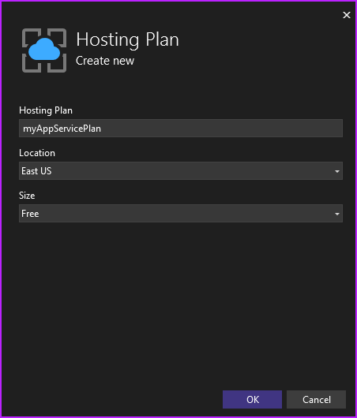
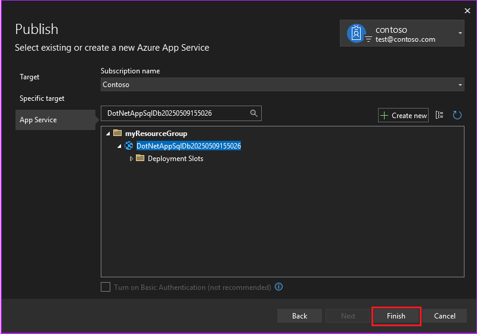

# Tutorial: Deploy an ASP.NET app to Azure with Azure SQL Database

[Azure App Service](overview.md) provides a highly scalable, self-patching web hosting service. This tutorial shows you how to deploy a data-driven ASP.NET app in App Service and connect it to [Azure SQL Database](/azure/azure-sql/database/sql-database-paas-overview).

When you finish the tutorial, you have an ASP.NET app connected to an Azure SQL database running in Azure. The following example shows the app interface.


In this tutorial, you:

> [!div class="checklist"]
>
> - Create a database in Azure SQL Database.
> - Connect an ASP.NET app to the Azure SQL database.
> - Deploy the app to Azure.
> - Update the data model and redeploy the app.
> - Stream logs from Azure to your machine.

## Prerequisites

- [!INCLUDE [quickstarts-free-trial-note](~/reusable-content/ce-skilling/azure/includes/quickstarts-free-trial-note.md)]
- Install <a href="https://www.visualstudio.com/downloads/" target="_blank">Visual Studio 2022</a> with the **ASP.NET and web development** and **Azure development** workloads. You can add the workloads to an existing Visual Studio installation by selecting **Tools** > **Get Tools and Features** in Visual Studio.

## Create and run the app

The sample project contains a basic [ASP.NET MVC](https://www.asp.net/mvc) create-read-update-delete (CRUD) app using [Entity Framework Code First](/aspnet/mvc/overview/getting-started/getting-started-with-ef-using-mvc/creating-an-entity-framework-data-model-for-an-asp-net-mvc-application).

1. Download the [sample project](https://github.com/Azure-Samples/dotnet-sqldb-tutorial/archive/master.zip) and extract the  *dotnet-sqldb-tutorial-master.zip* file.

1. Open the extracted *dotnet-sqldb-tutorial-master/DotNetAppSqlDb.sln* file in Visual Studio.

1. Press `F5` to run the app and open it in your default browser.

   > [!NOTE] 
   > If necessary, [install any missing NuGet packages](/nuget/consume-packages/install-use-packages-visual-studio).

1. In the app, select **Create New** and create a couple of *to-do* items.

   

1. Test the **Edit**, **Details**, and **Delete** links.

## Publish the app to Azure

The app uses a database context to connect with the database. The database context in this sample is a connection string named `MyDbConnection`.

The connection string is set in the *Web.config* file and referenced in the *Models/MyDatabaseContext.cs* file. The Azure app uses the connection string name to connect to the Azure SQL database.

1. In Visual Studio **Solution Explorer**, right-click the **DotNetAppSqlDb** project and select **Publish**.

   

1. Select **Azure** as your target and select **Next**.

1. Make sure that **Azure App Service (Windows)** is selected and select **Next**.

### Sign in and add an Azure App Service

1. In the **Publish** dialog, click **Sign In**, and sign in to your Microsoft account and the subscription you want to use.

1. Next to **App Service**, select **Create new**.

   

### Configure the Azure App Service

On the **App Service (Windows)** screen, configure the App Service **Name**, **Resource group**, and **Hosting Plan**.

1. Under **Name**, you can keep the generated web app name, or change it to another unique name with characters `a-z`, `0-9`, and `-`.

   The web app name is part of the default URL for your app, `<app_name>.azurewebsites.net`, and must be unique across all apps in Azure.

1. Next to **Resource group**, select **New**, and name the resource group **myResourceGroup**.

   [!INCLUDE [resource-group](~/reusable-content/ce-skilling/azure/includes/resource-group.md)]

1. Next to **Hosting Plan**, select **New**, complete the **Hosting Plan** screen as follows, and then select **OK**.

   | Setting  | Suggested value | For more information |
   | ----------------- | ------------ | ----|
   |**App Service Plan**| *myAppServicePlan* | [App Service plans](../app-service/overview-hosting-plans.md) |
   |**Location**| **East US** | [Azure regions](https://azure.microsoft.com/regions/?ref=microsoft.com&utm_source=microsoft.com&utm_medium=docs&utm_campaign=visualstudio) |
   |**Size**| **Free** | [Pricing tiers](https://azure.microsoft.com/pricing/details/app-service/?ref=microsoft.com&utm_source=microsoft.com&utm_medium=docs&utm_campaign=visualstudio)|

   

   [!INCLUDE [app-service-plan](../../includes/app-service-plan.md)]

1. Select **Create**, and wait for the Azure resources to be created.

   

1. The **Publish** screen shows the resources you configured. Select **Finish**, and then select **Close**.

   

### Create a server and database

Before you can create a database, you need a [logical SQL server](/azure/azure-sql/database/logical-servers). A logical SQL server is a logical construct that contains a group of databases managed as a group.

1. On the **Publish** tab of the **DotNetAppSqlDb** screen, scroll down to the **Service Dependencies** section, select the **...** next to **SQL Server Database**, and select **Connect**.

   > [!NOTE]
   > Be sure to configure the SQL Database from the **Publish** tab, not the **Connected Services** tab.

   

1. Select **Azure SQL Database** and then select **Next**.

1. On the **Configure Azure SQL Database** screen, select **Create new**.

1. On the **Azure SQL Database** screen, next to **Database server**, select **New**.

   Change the server name to a value you want. The server name is used as part of the default URL for your server, `<server_name>.database.windows.net`. It must be unique across all servers in Azure SQL. 

1. Add an administrator username and password. For password requirements, see [Password policy](/sql/relational-databases/security/password-policy).

   Remember this username and password. You need them to manage the server later.

   

   > [!IMPORTANT]
   > Your password in the connection strings is masked in both Visual Studio and App Service), but maintaining it still adds to the attack surface of your app. App Service can use [managed service identities](overview-managed-identity.md) to eliminate this risk by removing the need to maintain secrets in your code or app configuration. For more information, see [Tutorial: Connect to SQL Database from App Service without secrets using a managed identity](tutorial-connect-msi-sql-database.md).

1. Select **OK**.

1. On the **Azure SQL Database** screen, keep the default generated **Database Name**. Select **Create** and wait for the database resources to be created.

   

### Connect the database

1. When the database resources are created, select **Next**.

1. Under **Connection string Name**, enter the name of the connection string referenced in *Models/MyDatabaseContext.cs*, in this case *MyDbConnection*.

1. Select **Next**, and then select **Finish**.

   > [!NOTE]
   > If you see **Local user secrets files** instead, you might have configured SQL Database from the **Connected Services** page instead of the **Publish** page.

### Deploy the ASP.NET app

1. At the top of the **Publish** tab, select **Publish**. Your ASP.NET app deploys to Azure, and your default browser launches to the URL of the deployed app.

1. Add a few to-do items.

   

Congratulations! Your data-driven ASP.NET application is running live in Azure App Service.

## Access the database locally

**SQL Server Object Explorer** in Visual Studio lets you easily explore and manage your new Azure SQL database. The new database opened its firewall to the App Service app you created, but to access it from your local computer, such as from Visual Studio, you must open a firewall for your local machine's public IP address.

>[!NOTE]
>If your internet service provider changes your public IP address, you need to reconfigure the firewall to access the Azure database again.

### Create a database connection

1. From the **View** menu, select **SQL Server Object Explorer**.

1. At the top of the **SQL Server Object Explorer** window, select the icon to **Add SQL Server**.

### Configure the database connection

1. In the **Connect** dialog, expand the **Azure** node to view all your Azure SQL Database instances.

1. Select the database you created earlier. The connection you created earlier is automatically filled at the bottom.

1. Type your database administrator password and select **Connect**.

   

### Allow client connection from your computer

The **Create a new firewall rule** dialog opens. By default, a server allows connections to its databases only from Azure services, such as your Azure app. To connect to your database from outside of Azure, create a firewall rule at the server level.

This firewall rule allows the public IP address of your local computer. The dialog box is already populated with your computer's public IP address.

1. Make sure **Add my client IP** is selected and select **OK**.

   

    Once Visual Studio finishes creating the firewall setting for your SQL Database instance, your connection appears in **SQL Server Object Explorer**.

In **SQL Server Object Explorer**, you can perform most common database operations, such as running queries or creating views and stored procedures.

Expand your connection's > **Databases** > **\<your database>** > **Tables**. Right-click the `Todoes` table and select **View Data**.

   

## Update app with Code First Migrations

You can use the familiar tools in Visual Studio to update your database and app in Azure. In this step, you use Code First Migrations in Entity Framework to make a change to your database schema and publish it to Azure.

For more information about using Entity Framework Code First Migrations, see [Getting Started with Entity Framework 6 Code First using MVC 5](/aspnet/mvc/overview/getting-started/getting-started-with-ef-using-mvc/creating-an-entity-framework-data-model-for-an-asp-net-mvc-application).

#### Update your data model

Open _Models\Todo.cs_ in the code editor. Add the following property to the `ToDo` class:

```csharp
public bool Done { get; set; }
```
    
#### Run Code First Migrations locally

Run a few commands to make updates to your local database.

1. From the **Tools** menu, click **NuGet Package Manager** > **Package Manager Console**.

1. In the Package Manager Console window, enable Code First Migrations:

    ```powershell
    Enable-Migrations
    ```
    
1. Add a migration:

    ```powershell
    Add-Migration AddProperty
    ```
    
1. Update the local database:

    ```powershell
    Update-Database
    ```
    
1. Type `Ctrl+F5` to run the app. Test the edit, details, and create links.

If the application loads without errors, then Code First Migrations has succeeded. However, your page still looks the same because your application logic isn't using this new property yet.

#### Use the new property

Make some changes in your code to use the `Done` property. For simplicity in this tutorial, you're only going to change the `Index` and `Create` views to see the property in action.

1. Open _Controllers\TodosController.cs_.

1. Find the `Create()` method on line 52 and add `Done` to the list of properties in the `Bind` attribute. When you're done, your `Create()` method signature looks like the following code:

    ```csharp
    public ActionResult Create([Bind(Include = "Description,CreatedDate,Done")] Todo todo)
    ```
    
1. Open _Views\Todos\Create.cshtml_.

1. In the Razor code, you should see a `<div class="form-group">` element that uses `model.Description`, and then another `<div class="form-group">` element that uses `model.CreatedDate`. Immediately following these two elements, add another `<div class="form-group">` element that uses `model.Done`:

    ```csharp
    <div class="form-group">
        @Html.LabelFor(model => model.Done, htmlAttributes: new { @class = "control-label col-md-2" })
        <div class="col-md-10">
            <div class="checkbox">
                @Html.EditorFor(model => model.Done)
                @Html.ValidationMessageFor(model => model.Done, "", new { @class = "text-danger" })
            </div>
        </div>
    </div>
    ```
    
1. Open _Views\Todos\Index.cshtml_.

1. Search for the empty `<th></th>` element. Just above this element, add the following Razor code:

    ```csharp
    <th>
        @Html.DisplayNameFor(model => model.Done)
    </th>
    ```
    
1. Find the `<td>` element that contains the `Html.ActionLink()` helper methods. _Above_ this `<td>`, add another `<td>` element with the following Razor code:

    ```csharp
    <td>
        @Html.DisplayFor(modelItem => item.Done)
    </td>
    ```
    
    That's all you need to see the changes in the `Index` and `Create` views.

1. Type `Ctrl+F5` to run the app.

You can now add a to-do item and check **Done**. Then it should show up in your homepage as a completed item. Remember that the `Edit` view doesn't show the `Done` field, because you didn't change the `Edit` view.

#### Enable Code First Migrations in Azure

Now that your code change works, including database migration, you publish it to your Azure app and update your SQL Database with Code First Migrations too.

1. Just like before, right-click your project and select **Publish**.

1. Click **More actions** > **Edit** to open the publish settings.

    

1. In the **MyDatabaseContext** dropdown, select the database connection for your Azure SQL Database.

1. Select **Execute Code First Migrations (runs on application start)**, then click **Save**.

    

#### Publish your changes

Now that you enabled Code First Migrations in your Azure app, publish your code changes.

1. In the publish page, click **Publish**.

1. Try adding to-do items again and select **Done**, and they should show up in your homepage as a completed item.

    

All your existing to-do items are still displayed. When you republish your ASP.NET application, existing data in your SQL Database isn't lost. Also, Code First Migrations only changes the data schema and leaves your existing data intact.

## Stream application logs

You can stream tracing messages directly from your Azure app to Visual Studio.

Open _Controllers\TodosController.cs_.

Each action starts with a `Trace.WriteLine()` method. This code is added to show you how to add trace messages to your Azure app.

#### Enable log streaming

1. In the publish page, scroll down to the  **Hosting** section.

1. At the right-hand corner, click **...** > **View Streaming Logs**.

    

    The logs are now streamed into the **Output** window.

    

    However, you don't see any of the trace messages yet. That's because when you first select **View Streaming Logs**, your Azure app sets the trace level to `Error`, which only logs error events (with the `Trace.TraceError()` method).

#### Change trace levels

1. To change the trace levels to output other trace messages, go back to the publish page.

1. In the  **Hosting** section, click **...** > **Open in Azure portal**.

1. In the portal management page for your app, from the left menu, select **App Service logs**.

1. Under **Application Logging (File System)**, select **Verbose** in **Level**. Click **Save**.

    > [!TIP]
    > You can experiment with different trace levels to see what types of messages are displayed for each level. For example, the **Information** level includes all logs created by `Trace.TraceInformation()`, `Trace.TraceWarning()`, and `Trace.TraceError()`, but not logs created by `Trace.WriteLine()`.

1. In your browser, navigate to your app again at *http://&lt;your app name>.azurewebsites.net*, then try clicking around the to-do list application in Azure. The trace messages are now streamed to the **Output** window in Visual Studio.

    ```console
    Application: 2017-04-06T23:30:41  PID[8132] Verbose     GET /Todos/Index
    Application: 2017-04-06T23:30:43  PID[8132] Verbose     GET /Todos/Create
    Application: 2017-04-06T23:30:53  PID[8132] Verbose     POST /Todos/Create
    Application: 2017-04-06T23:30:54  PID[8132] Verbose     GET /Todos/Index
    ```
    
#### Stop log streaming

To stop the log-streaming service, click the **Stop monitoring** button in the **Output** window.


[!INCLUDE [Clean up section](../../includes/clean-up-section-portal-web-app.md)]

## Related content

- [Configure ASP.NET app](configure-language-dotnet-framework.md)
- [Start analyzing costs with Cost Management](../cost-management-billing/costs/quick-acm-cost-analysis.md?WT.mc_id=costmanagementcontent_docsacmhorizontal_-inproduct-learn)

Advance to the next tutorial to learn how to use managed identity to improve your Azure SQL Database connection security.

> [!div class="nextstepaction"]
> [Tutorial: Connect to SQL Database from App Service without secrets using a managed identity](tutorial-connect-msi-sql-database.md)

