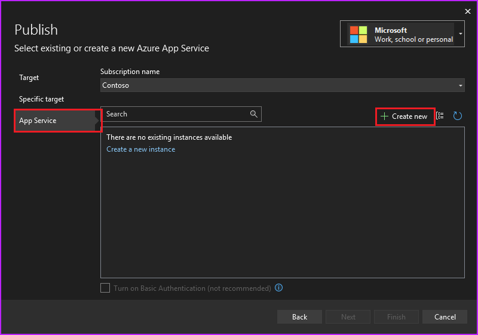
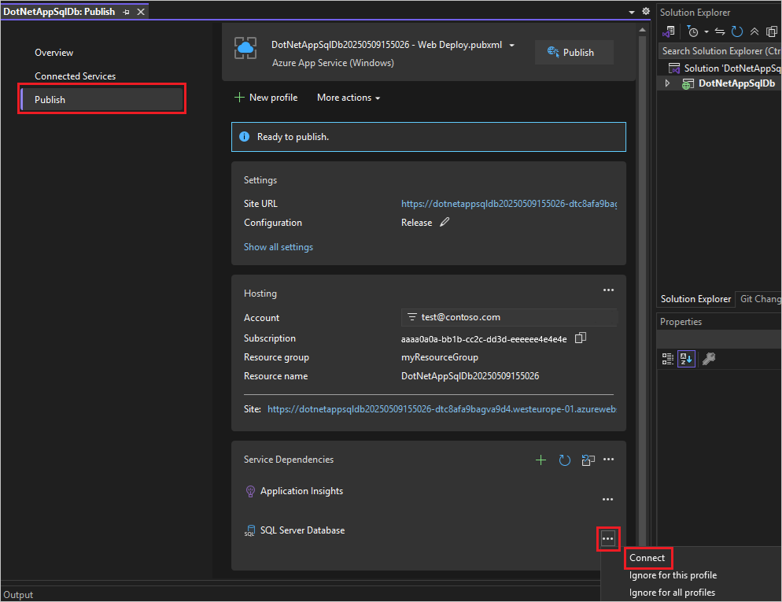
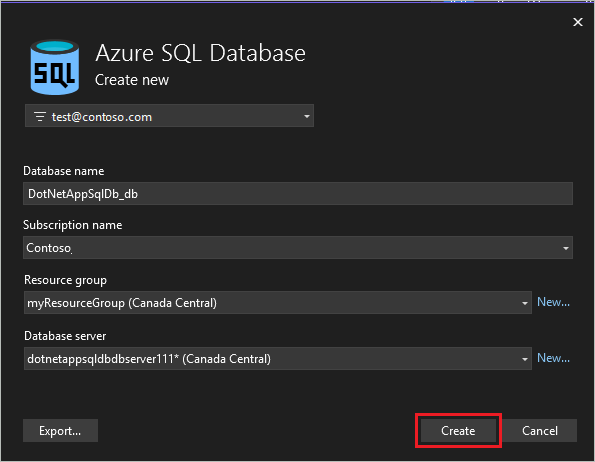
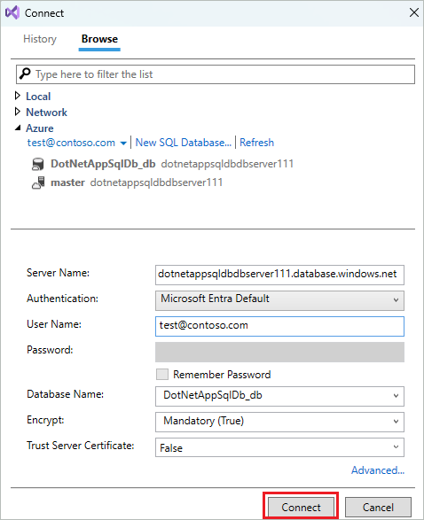

# Tutorial: Deploy an ASP.NET app to Azure with Azure SQL Database

[Azure App Service](overview.md) provides a highly scalable, self-patching web hosting service. This tutorial shows you how to deploy a data-driven ASP.NET app in App Service and connect it to [Azure SQL Database](/azure/azure-sql/database/sql-database-paas-overview). When you're finished, you have an ASP.NET app running in Azure and connected to SQL Database.


In this tutorial, you learn how to:

> [!div class="checklist"]
>
> * Create a database in Azure SQL Database
> * Connect an ASP.NET app to SQL Database
> * Deploy the app to Azure
> * Update the data model and redeploy the app
> * Stream logs from Azure to your terminal

[!INCLUDE [quickstarts-free-trial-note](../../includes/quickstarts-free-trial-note.md)]

## Prerequisites

To complete this tutorial:

Install <a href="https://www.visualstudio.com/downloads/" target="_blank">Visual Studio 2022</a> with the **ASP.NET and web development** and **Azure development** workloads.

If you've installed Visual Studio already, add the workloads in Visual Studio by clicking **Tools** > **Get Tools and Features**.

## Download the sample

1. [Download the sample project](https://github.com/Azure-Samples/dotnet-sqldb-tutorial/archive/master.zip).

1. Extract (unzip) the  *dotnet-sqldb-tutorial-master.zip* file.

The sample project contains a basic [ASP.NET MVC](https://www.asp.net/mvc) create-read-update-delete (CRUD) app using [Entity Framework Code First](/aspnet/mvc/overview/getting-started/getting-started-with-ef-using-mvc/creating-an-entity-framework-data-model-for-an-asp-net-mvc-application).

### Run the app

1. Open the *dotnet-sqldb-tutorial-master/DotNetAppSqlDb.sln* file in Visual Studio.

1. Type `F5` to run the app. The app is displayed in your default browser.

   > [!NOTE] 
   > If you only installed Visual Studio and the prerequisites, you may have to [install missing packages via NuGet](/nuget/consume-packages/install-use-packages-visual-studio).

1. Select the **Create New** link and create a couple *to-do* items.

    

1. Test the **Edit**, **Details**, and **Delete** links.

The app uses a database context to connect with the database. In this sample, the database context uses a connection string named `MyDbConnection`. The connection string is set in the *Web.config* file and referenced in the *Models/MyDatabaseContext.cs* file. The connection string name is used later in the tutorial to connect the Azure app to an Azure SQL Database.

## Publish ASP.NET application to Azure

1. In the **Solution Explorer**, right-click your **DotNetAppSqlDb** project and select **Publish**.

    

1. Select **Azure** as your target and click **Next**.

1. Make sure that **Azure App Service (Windows)** is selected and click **Next**.

#### Sign in and add an app

1. In the **Publish** dialog, click **Sign In**.

1. Sign in to your Azure subscription. If you're already signed into a Microsoft account, make sure that account holds your Azure subscription. If the signed-in Microsoft account doesn't have your Azure subscription, click it to add the correct account.

1. In the **App Service instances** pane, click **+**.

    

#### Configure the web app name

You can keep the generated web app name, or change it to another unique name (valid characters are `a-z`, `0-9`, and `-`). The web app name is used as part of the default URL for your app (`<app_name>.azurewebsites.net`, where `<app_name>` is your web app name). The web app name needs to be unique across all apps in Azure.

> [!NOTE]
> Don't select **Create** yet.


#### Create a resource group

[!INCLUDE [resource-group](../../includes/resource-group.md)]

1. Next to **Resource Group**, click **New**.

   

1. Name the resource group **myResourceGroup**.

#### Create an App Service plan

[!INCLUDE [app-service-plan](../../includes/app-service-plan.md)]

1. Next to **Hosting Plan**, click **New**.

1. In the **Configure App Service Plan** dialog, configure the new App Service plan with the following settings and click **OK**:

   | Setting  | Suggested value | For more information |
   | ----------------- | ------------ | ----|
   |**App Service Plan**| myAppServicePlan | [App Service plans](../app-service/overview-hosting-plans.md) |
   |**Location**| West Europe | [Azure regions](https://azure.microsoft.com/regions/?ref=microsoft.com&utm_source=microsoft.com&utm_medium=docs&utm_campaign=visualstudio) |
   |**Size**| Free | [Pricing tiers](https://azure.microsoft.com/pricing/details/app-service/?ref=microsoft.com&utm_source=microsoft.com&utm_medium=docs&utm_campaign=visualstudio)|

   

1. Click **Create** and wait for the Azure resources to be created.

1. The **Publish** dialog shows the resources you've configured. Click **Finish**.

   


#### Create a server and database

Before creating a database, you need a [logical SQL server](/azure/azure-sql/database/logical-servers). A logical SQL server is a logical construct that contains a group of databases managed as a group.

1. In the **Publish** dialog, scroll down to the **Service Dependencies** section. Next to **SQL Server Database**, click **Configure**.

    > [!NOTE]
    > Be sure to configure the SQL Database from the **Publish** page instead of the **Connected Services** page.

   

1. Select **Azure SQL Database** and click **Next**.

1. In the **Configure Azure SQL Database** dialog, click **+**.

1. Next to **Database server**, click **New**.

   The server name is used as part of the default URL for your server, `<server_name>.database.windows.net`. It must be unique across all servers in Azure SQL. Change the server name to a value you want.

1. Add an administrator username and password. For password complexity requirements, see [Password Policy](/sql/relational-databases/security/password-policy).

   Remember this username and password. You need them to manage the server later.

   

   > [!IMPORTANT]
   > Even though your password in the connection strings is masked (in Visual Studio and also in App Service), the fact that it's maintained somewhere adds to the attack surface of your app. App Service can use [managed service identities](overview-managed-identity.md) to eliminate this risk by removing the need to maintain secrets in your code or app configuration at all. For more information, see [Next steps](#next-steps).

1. Click **OK**.

1. In the **Azure SQL Database** dialog, keep the default generated **Database Name**. Select **Create** and wait for the database resources to be created.

    

#### Configure database connection

1. When the wizard finishes creating the database resources, click **Next**.

1. In the **Database connection string Name**, type _MyDbConnection_. This name must match the connection string that is referenced in _Models/MyDatabaseContext.cs_.

1. In **Database connection user name** and **Database connection password**, type the administrator username and password you used in [Create a server](#create-a-server-and-database).

1. Make sure **Azure App Settings** is selected and click **Finish**.

    > [!NOTE]
    > If you see **Local user secrets files** instead, you must have configured SQL Database from the **Connected Services** page instead of the **Publish** page.

    

1. Wait for configuration wizard to finish and click **Close**.

#### Deploy your ASP.NET app

1. In the **Publish** tab, scroll back up to the top and click **Publish**. Once your ASP.NET app is deployed to Azure. Your default browser is launched with the URL to the deployed app.

1. Add a few to-do items.

    

    Congratulations! Your data-driven ASP.NET application is running live in Azure App Service.

## Access the database locally

Visual Studio lets you explore and manage your new database in Azure easily in the **SQL Server Object Explorer**. The new database already opened its firewall to the App Service app that you created. But to access it from your local computer (such as from Visual Studio), you must open a firewall for your local machine's public IP address. If your internet service provider changes your public IP address, you need to reconfigure the firewall to access the Azure database again.

#### Create a database connection

1. From the **View** menu, select **SQL Server Object Explorer**.

1. At the top of **SQL Server Object Explorer**, click the **Add SQL Server** button.

#### Configure the database connection

1. In the **Connect** dialog, expand the **Azure** node. All your SQL Database instances in Azure are listed here.

1. Select the database that you created earlier. The connection you created earlier is automatically filled at the bottom.

1. Type the database administrator password you created earlier and click **Connect**.

    

#### Allow client connection from your computer

The **Create a new firewall rule** dialog is opened. By default, a server only allows connections to its databases from Azure services, such as your Azure app. To connect to your database from outside of Azure, create a firewall rule at the server level. The firewall rule allows the public IP address of your local computer.

The dialog is already filled with your computer's public IP address.

1. Make sure that **Add my client IP** is selected and click **OK**.

    

    Once Visual Studio finishes creating the firewall setting for your SQL Database instance, your connection shows up in **SQL Server Object Explorer**.

    Here, you can perform the most common database operations, such as run queries, create views and stored procedures, and more.

1. Expand your connection > **Databases** > **&lt;your database>** > **Tables**. Right-click on the `Todoes` table and select **View Data**.

    

## Update app with Code First Migrations

You can use the familiar tools in Visual Studio to update your database and app in Azure. In this step, you use Code First Migrations in Entity Framework to make a change to your database schema and publish it to Azure.

For more information about using Entity Framework Code First Migrations, see [Getting Started with Entity Framework 6 Code First using MVC 5](/aspnet/mvc/overview/getting-started/getting-started-with-ef-using-mvc/creating-an-entity-framework-data-model-for-an-asp-net-mvc-application).

#### Update your data model

Open _Models\Todo.cs_ in the code editor. Add the following property to the `ToDo` class:

```csharp
public bool Done { get; set; }
```
    
#### Run Code First Migrations locally

Run a few commands to make updates to your local database.

1. From the **Tools** menu, click **NuGet Package Manager** > **Package Manager Console**.

1. In the Package Manager Console window, enable Code First Migrations:

    ```powershell
    Enable-Migrations
    ```
    
1. Add a migration:

    ```powershell
    Add-Migration AddProperty
    ```
    
1. Update the local database:

    ```powershell
    Update-Database
    ```
    
1. Type `Ctrl+F5` to run the app. Test the edit, details, and create links.

If the application loads without errors, then Code First Migrations has succeeded. However, your page still looks the same because your application logic isn't using this new property yet.

#### Use the new property

Make some changes in your code to use the `Done` property. For simplicity in this tutorial, you're only going to change the `Index` and `Create` views to see the property in action.

1. Open _Controllers\TodosController.cs_.

1. Find the `Create()` method on line 52 and add `Done` to the list of properties in the `Bind` attribute. When you're done, your `Create()` method signature looks like the following code:

    ```csharp
    public ActionResult Create([Bind(Include = "Description,CreatedDate,Done")] Todo todo)
    ```
    
1. Open _Views\Todos\Create.cshtml_.

1. In the Razor code, you should see a `<div class="form-group">` element that uses `model.Description`, and then another `<div class="form-group">` element that uses `model.CreatedDate`. Immediately following these two elements, add another `<div class="form-group">` element that uses `model.Done`:

    ```csharp
    <div class="form-group">
        @Html.LabelFor(model => model.Done, htmlAttributes: new { @class = "control-label col-md-2" })
        <div class="col-md-10">
            <div class="checkbox">
                @Html.EditorFor(model => model.Done)
                @Html.ValidationMessageFor(model => model.Done, "", new { @class = "text-danger" })
            </div>
        </div>
    </div>
    ```
    
1. Open _Views\Todos\Index.cshtml_.

1. Search for the empty `<th></th>` element. Just above this element, add the following Razor code:

    ```csharp
    <th>
        @Html.DisplayNameFor(model => model.Done)
    </th>
    ```
    
1. Find the `<td>` element that contains the `Html.ActionLink()` helper methods. _Above_ this `<td>`, add another `<td>` element with the following Razor code:

    ```csharp
    <td>
        @Html.DisplayFor(modelItem => item.Done)
    </td>
    ```
    
    That's all you need to see the changes in the `Index` and `Create` views.

1. Type `Ctrl+F5` to run the app.

You can now add a to-do item and check **Done**. Then it should show up in your homepage as a completed item. Remember that the `Edit` view doesn't show the `Done` field, because you didn't change the `Edit` view.

#### Enable Code First Migrations in Azure

Now that your code change works, including database migration, you publish it to your Azure app and update your SQL Database with Code First Migrations too.

1. Just like before, right-click your project and select **Publish**.

1. Click **More actions** > **Edit** to open the publish settings.

    

1. In the **MyDatabaseContext** dropdown, select the database connection for your Azure SQL Database.

1. Select **Execute Code First Migrations (runs on application start)**, then click **Save**.

    

#### Publish your changes

Now that you enabled Code First Migrations in your Azure app, publish your code changes.

1. In the publish page, click **Publish**.

1. Try adding to-do items again and select **Done**, and they should show up in your homepage as a completed item.

    

All your existing to-do items are still displayed. When you republish your ASP.NET application, existing data in your SQL Database isn't lost. Also, Code First Migrations only changes the data schema and leaves your existing data intact.

## Stream application logs

You can stream tracing messages directly from your Azure app to Visual Studio.

Open _Controllers\TodosController.cs_.

Each action starts with a `Trace.WriteLine()` method. This code is added to show you how to add trace messages to your Azure app.

#### Enable log streaming

1. In the publish page, scroll down to the  **Hosting** section.

1. At the right-hand corner, click **...** > **View Streaming Logs**.

    

    The logs are now streamed into the **Output** window.

    

    However, you don't see any of the trace messages yet. That's because when you first select **View Streaming Logs**, your Azure app sets the trace level to `Error`, which only logs error events (with the `Trace.TraceError()` method).

#### Change trace levels

1. To change the trace levels to output other trace messages, go back to the publish page.

1. In the  **Hosting** section, click **...** > **Open in Azure portal**.

1. In the portal management page for your app, from the left menu, select **App Service logs**.

1. Under **Application Logging (File System)**, select **Verbose** in **Level**. Click **Save**.

    > [!TIP]
    > You can experiment with different trace levels to see what types of messages are displayed for each level. For example, the **Information** level includes all logs created by `Trace.TraceInformation()`, `Trace.TraceWarning()`, and `Trace.TraceError()`, but not logs created by `Trace.WriteLine()`.

1. In your browser, navigate to your app again at *http://&lt;your app name>.azurewebsites.net*, then try clicking around the to-do list application in Azure. The trace messages are now streamed to the **Output** window in Visual Studio.

    ```console
    Application: 2017-04-06T23:30:41  PID[8132] Verbose     GET /Todos/Index
    Application: 2017-04-06T23:30:43  PID[8132] Verbose     GET /Todos/Create
    Application: 2017-04-06T23:30:53  PID[8132] Verbose     POST /Todos/Create
    Application: 2017-04-06T23:30:54  PID[8132] Verbose     GET /Todos/Index
    ```
    
#### Stop log streaming

To stop the log-streaming service, click the **Stop monitoring** button in the **Output** window.


[!INCLUDE [Clean up section](../../includes/clean-up-section-portal-web-app.md)]

## Next steps

In this tutorial, you learned how to:

> [!div class="checklist"]
>
> * Create a database in Azure SQL Database
> * Connect an ASP.NET app to SQL Database
> * Deploy the app to Azure
> * Update the data model and redeploy the app
> * Stream logs from Azure to your terminal

Advance to the next tutorial to learn how to easily improve the security of your connection Azure SQL Database.

> [!div class="nextstepaction"]
> [Tutorial: Connect to SQL Database from App Service without secrets using a managed identity](tutorial-connect-msi-sql-database.md)

More resources:

> [!div class="nextstepaction"]
> [Configure ASP.NET app](configure-language-dotnet-framework.md)

Want to optimize and save on your cloud spending?

> [!div class="nextstepaction"]
> [Start analyzing costs with Cost Management](../cost-management-billing/costs/quick-acm-cost-analysis.md?WT.mc_id=costmanagementcontent_docsacmhorizontal_-inproduct-learn)
