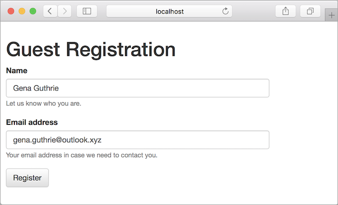
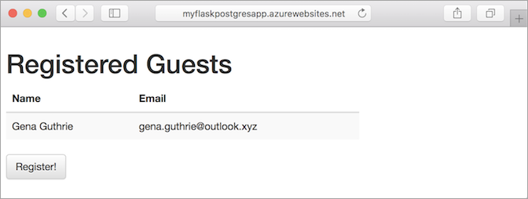
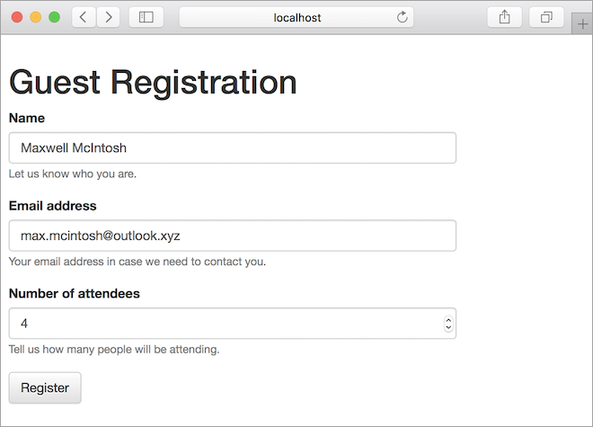

# Build a Python and PostgreSQL web app in Azure

[Azure App Service](app-service-web-overview.md) provides a highly scalable, self-patching web hosting service. This tutorial shows how to create a basic Python web app in Azure. You connect this app to a PostgreSQL database. When you are done, you have a Python Flask application running on App Service.


In this tutorial, you learn how to:

> [!div class="checklist"]
> * Create a PostgreSQL database in Azure
> * Connect a Python app to MySQL
> * Deploy the app to Azure
> * Update the data model and redeploy the app
> * Manage the app in the Azure portal

You can follow the steps below on macOS. Linux and Windows instructions are the same in most cases, but the differences are not detailed in this tutorial.

## Prerequisites

To complete this tutorial:

1. [Install Git](https://git-scm.com/)
1. [Install Python](https://www.python.org/downloads/)
1. [Install and run PostgreSQL](https://www.postgresql.org/download/)

[!INCLUDE [quickstarts-free-trial-note](../../includes/quickstarts-free-trial-note.md)]

## Test local PostgreSQL installation and create a database

Open the terminal window and run `psql` to connect to your local PostgreSQL server.

```bash
sudo -u postgres psql
```

If your connection is successful, your PostgreSQL database is running. If not, make sure that your local PostgresQL database is started by following the steps at [Downloads - PostgreSQL Core Distribution](https://www.postgresql.org/download/).

Create a database called *eventregistration* and set up a separate database user named *manager* with password *supersecretpass*.

```bash
CREATE DATABASE eventregistration;
CREATE USER manager WITH PASSWORD 'supersecretpass';
GRANT ALL PRIVILEGES ON DATABASE eventregistration TO manager;
```
Type `\q` to exit the PostgreSQL client. 

<a name="step2"></a>

## Create local Python Flask application

In this step, you set up the local Python Flask project.

### Clone the sample application

Open the terminal window, and `CD` to a working directory.

Run the following commands to clone the sample repository and go to the *0.1-initialapp* release.

```bash
git clone https://github.com/Azure-Samples/docker-flask-postgres.git
cd docker-flask-postgres
git checkout tags/0.1-initialapp
```

This sample repository contains a [Flask](http://flask.pocoo.org/) application. 

### Run the application

> [!NOTE] 
> In a later step you simplify this process by building a Docker container to use with the production database.

Install the required packages and start the application.

```bash
pip install virtualenv
virtualenv venv
source venv/bin/activate
pip install -r requirements.txt
cd app
FLASK_APP=app.py DBHOST="localhost" DBUSER="manager" DBNAME="eventregistration" DBPASS="supersecretpass" flask db upgrade
FLASK_APP=app.py DBHOST="localhost" DBUSER="manager" DBNAME="eventregistration" DBPASS="supersecretpass" flask run
```

When the app is fully loaded, you see something similar to the following message:

```bash
INFO  [alembic.runtime.migration] Context impl PostgresqlImpl.
INFO  [alembic.runtime.migration] Will assume transactional DDL.
INFO  [alembic.runtime.migration] Running upgrade  -> 791cd7d80402, empty message
 * Serving Flask app "app"
 * Running on http://127.0.0.1:5000/ (Press CTRL+C to quit)
```

Navigate to `http://localhost:5000` in a browser. Click **Register!** and create a test user.



The Flask sample application stores user data in the database. If you are successful at registering a user, your app is writing data to the local PostgreSQL database.

To stop the Flask server at anytime, type Ctrl+C in the terminal. 

[!INCLUDE [cloud-shell-try-it.md](../../includes/cloud-shell-try-it.md)]

## Create a production PostgreSQL database

In this step, you create a PostgreSQL database in Azure. When your app is deployed to Azure, it uses this cloud database.

### Create a resource group

[!INCLUDE [Create resource group](../../includes/app-service-web-create-resource-group-no-h.md)] 

### Create an Azure Database for PostgreSQL server

Create a PostgreSQL server with the [az postgres server create](/cli/azure/postgres/server?view=azure-cli-latest#az_postgres_server_create) command.

In the following command, substitute a unique server name for the *\<postgresql_name>* placeholder and a user name for the *\<admin_username>* placeholder. The server name is used as part of your PostgreSQL endpoint (`https://<postgresql_name>.postgres.database.azure.com`), so the name needs to be unique across all servers in Azure. The user name is for the initial database admin user account. You are prompted to pick a password for this user.

```azurecli-interactive
az postgres server create --resource-group myResourceGroup --name <postgresql_name> --admin-user <admin_username>  --storage-size 51200
```

When the Azure Database for PostgreSQL server is created, the Azure CLI shows information similar to the following example:

```json
{
  "administratorLogin": "<my_admin_username>",
  "fullyQualifiedDomainName": "<postgresql_name>.postgres.database.azure.com",
  "id": "/subscriptions/00000000-0000-0000-0000-000000000000/resourceGroups/myResourceGroup/providers/Microsoft.DBforPostgreSQL/servers/<postgresql_name>",
  "location": "westus",
  "name": "<postgresql_name>",
  "resourceGroup": "myResourceGroup",
  "sku": {
    "capacity": 100,
    "family": null,
    "name": "PGSQLS3M100",
    "size": null,
    "tier": "Basic"
  },
  "sslEnforcement": null,
  "storageMb": 2048,
  "tags": null,
  "type": "Microsoft.DBforPostgreSQL/servers",
  "userVisibleState": "Ready",
  "version": null
}
```

### Create a firewall rule for the Azure Database for PostgreSQL server

Run the following Azure CLI command to allow access to the database from all IP addresses.

```azurecli-interactive
az postgres server firewall-rule create --resource-group myResourceGroup --server-name <postgresql_name> --start-ip-address=0.0.0.0 --end-ip-address=255.255.255.255 --name AllowAllIPs
```

The Azure CLI confirms the firewall rule creation with output similar to the following example:

```json
{
  "endIpAddress": "255.255.255.255",
  "id": "/subscriptions/00000000-0000-0000-0000-000000000000/resourceGroups/myResourceGroup/providers/Microsoft.DBforPostgreSQL/servers/<postgresql_name>/firewallRules/AllowAllIPs",
  "name": "AllowAllIPs",
  "resourceGroup": "myResourceGroup",
  "startIpAddress": "0.0.0.0",
  "type": "Microsoft.DBforPostgreSQL/servers/firewallRules"
}
```

## Connect your Python Flask application to the database

In this step, you connect your Python Flask sample application to the Azure Database for PostgreSQL server you created.

### Create an empty database and set up a new database application user

Create a database user with access to a single database only. You use these credentials to avoid giving the application full access to the server.

Connect to the database (you're prompted for your admin password).

```bash
psql -h <postgresql_name>.postgres.database.azure.com -U <my_admin_username>@<postgresql_name> postgres
```

Create the database and user from the PostgreSQL CLI.

```bash
CREATE DATABASE eventregistration;
CREATE USER manager WITH PASSWORD 'supersecretpass';
GRANT ALL PRIVILEGES ON DATABASE eventregistration TO manager;
```

Type `\q` to exit the PostgreSQL client.

### Test the application locally against the Azure PostgreSQL database

Going back now to the *app* folder of the cloned Github repository, you can run the Python Flask application by updating the database environment variables.

```bash
FLASK_APP=app.py DBHOST="<postgresql_name>.postgres.database.azure.com" DBUSER="manager@<postgresql_name>" DBNAME="eventregistration" DBPASS="supersecretpass" flask db upgrade
FLASK_APP=app.py DBHOST="<postgresql_name>.postgres.database.azure.com" DBUSER="manager@<postgresql_name>" DBNAME="eventregistration" DBPASS="supersecretpass" flask run
```

When the app is fully loaded, you see something similar to the following message:

```bash
INFO  [alembic.runtime.migration] Context impl PostgresqlImpl.
INFO  [alembic.runtime.migration] Will assume transactional DDL.
INFO  [alembic.runtime.migration] Running upgrade  -> 791cd7d80402, empty message
 * Serving Flask app "app"
 * Running on http://127.0.0.1:5000/ (Press CTRL+C to quit)
```

Navigate to http://localhost:5000 in a browser. Click **Register!** and create a test registration. You are now writing data to the database in Azure.


## Upload the Docker container to a container registry

In this step, you deploy the PostgreSQL-connected Python application to Azure App Service.

### Create an App Service plan

[!INCLUDE [Create app service plan](../../includes/app-service-web-create-app-service-plan-linux-no-h.md)]

<a name="create"></a>
### Create a web app

[!INCLUDE [Create web app no h](../../includes/app-service-web-create-web-app-python-no-h.md)] 

### Configure database settings

Earlier in the tutorial, you defined environment variables to connect to your PostgreSQL database.

In App Service, you set environment variables as _app settings_ by using the [az webapp config appsettings set](/cli/azure/webapp/config/appsettings?view=azure-cli-latest#az_webapp_config_appsettings_set) command.

The following example specifies the database connection details as app settings. It also uses the *PORT* variable to map PORT 5000 from your Docker Container to receive HTTP traffic on PORT 80.

```azurecli-interactive
az webapp config appsettings set --name <app_name> --resource-group myResourceGroup --settings DBHOST="<postgresql_name>.postgres.database.azure.com" DBUSER="manager@<postgresql_name>" DBPASS="supersecretpass" DBNAME="eventregistration" PORT=5000
```

### Push to Azure from Git

[!INCLUDE [app-service-plan-no-h](../../includes/app-service-web-git-push-to-azure-no-h.md)]

```bash
Counting objects: 5, done.
Delta compression using up to 4 threads.
Compressing objects: 100% (5/5), done.
Writing objects: 100% (5/5), 489 bytes | 0 bytes/s, done.
Total 5 (delta 3), reused 0 (delta 0)
remote: Updating branch 'master'.
remote: Updating submodules.
remote: Preparing deployment for commit id '6c7c716eee'.
remote: Running custom deployment command...
remote: Running deployment command...
remote: Handling node.js deployment.
.
.
.
remote: Deployment successful.
To https://<app_name>.scm.azurewebsites.net/<app_name>.git
 * [new branch]      master -> master
``` 

### Browse to the Azure web app 

Browse to the deployed web app using your web browser. 

```bash 
http://<app_name>.azurewebsites.net 
```
> [!NOTE]
> The web app takes some time to load because the container has to be downloaded and started after the container configuration is changed.

You see previously registered guests that were saved to the Azure production database in the previous step.



**Congratulations!** You're running a Docker container-based Python Flask app in Azure App Service.

## Update data model and redeploy

In this step, you add the number of attendees to each event registration by updating the Guest model.

Check out the *0.2-migration* release with the following git command:

```bash
git checkout tags/0.2-migration
```

This release already made the necessary changes to views, controllers, and model. It also includes a database migration generated via *alembic* (`flask db migrate`). You can see all changes made via the following git command:

```bash
git diff 0.1-initialapp 0.2-migration
```

### Test your changes locally

Run the following commands to test your changes locally by running the Flask server.

```bash
source venv/bin/activate
cd app
FLASK_APP=app.py DBHOST="localhost" DBUSER="manager" DBNAME="eventregistration" DBPASS="supersecretpass" flask db upgrade
FLASK_APP=app.py DBHOST="localhost" DBUSER="manager" DBNAME="eventregistration" DBPASS="supersecretpass" flask run
```

Navigate to http://localhost:5000 in your browser to view the changes. Create a test registration.



### Publish changes to Azure

In the local terminal window, commit all the changes in Git, and then push the code changes to Azure.

```bash
git add .
git commit -m "updated data model"
git push azure master
```

Navigate to your Azure web app and try out the new functionality again. Create another event registration.

```bash 
http://<app_name>.azurewebsites.net 
```


## Manage your Azure web app

Go to the [Azure portal](https://portal.azure.com) to see the web app you created.

From the left menu, click **App Services**, then click the name of your Azure web app.


By default, the portal shows your web app's **Overview** page. This page gives you a view of how your app is doing. Here, you can also perform basic management tasks like browse, stop, start, restart, and delete. The tabs on the left side of the page show the different configuration pages you can open.


## Next steps

Advance to the next tutorial to learn how to map a custom DNS name to your web app.

> [!div class="nextstepaction"]
> [Map an existing custom DNS name to Azure Web Apps](../app-service-web-tutorial-custom-domain.md)
