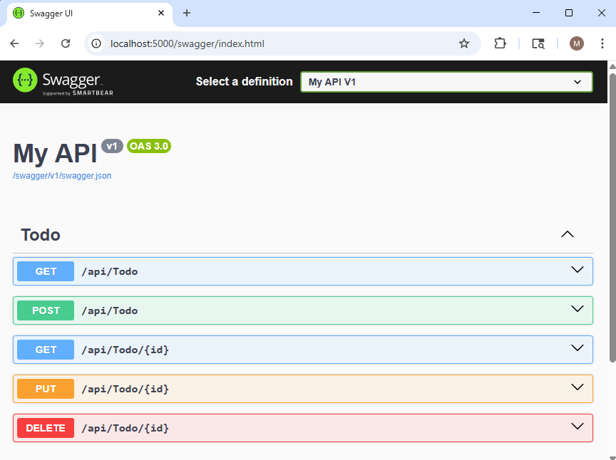
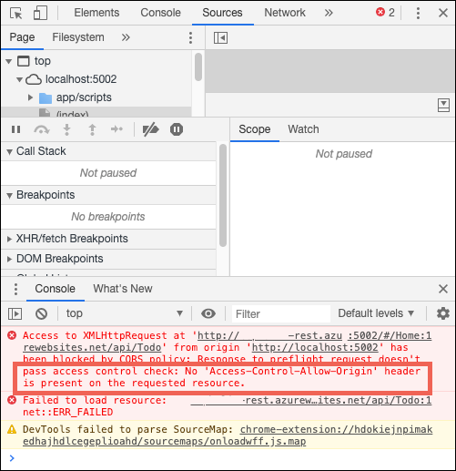
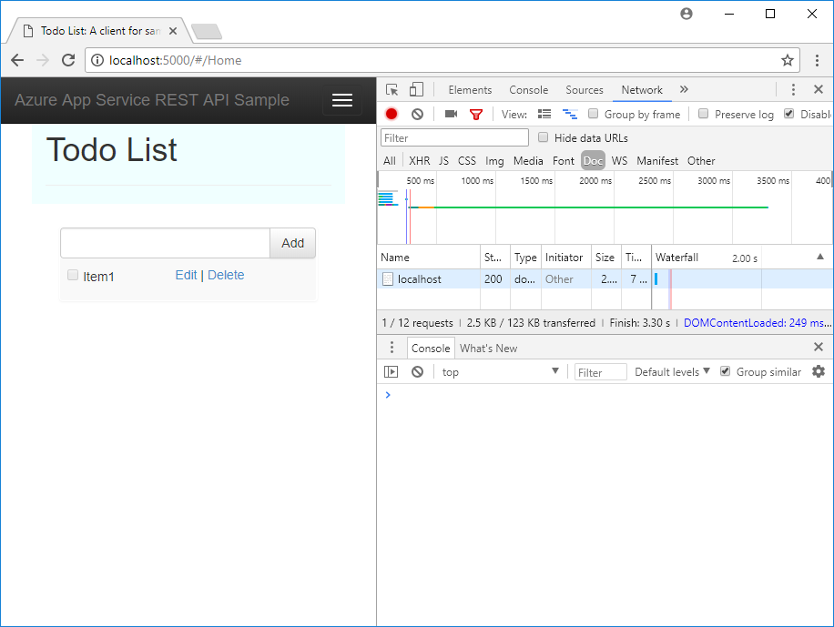

# Tutorial: Host a RESTful API with CORS in Azure App Service

[Azure App Service](overview.md) provides a highly scalable, self-patching web hosting service. In addition, App Service has built-in support for [Cross-Origin Resource Sharing (CORS)](https://wikipedia.org/wiki/Cross-Origin_Resource_Sharing) for RESTful APIs. This tutorial shows how to deploy an ASP.NET Core API app to App Service with CORS support. You configure the app using command-line tools and deploy the app using Git. 

In this tutorial, you learn how to:

> [!div class="checklist"]
> * Create App Service resources using Azure CLI
> * Deploy a RESTful API to Azure using Git
> * Enable App Service CORS support

You can follow the steps in this tutorial on macOS, Linux, Windows.

[!INCLUDE [quickstarts-free-trial-note](../../includes/quickstarts-free-trial-note.md)]

## Prerequisites

To complete this tutorial:

* <a href="https://git-scm.com/" target="_blank">Install Git</a>
 * <a href="https://dotnet.microsoft.com/download/dotnet-core/3.1" target="_blank">Install the latest .NET Core 3.1 SDK</a>

## Create local ASP.NET Core app

In this step, you set up the local ASP.NET Core project. App Service supports the same workflow for APIs written in other languages.

### Clone the sample application

1. In the terminal window, `cd` to a working directory.  

1. Clone the sample repository and change to the repository root. 

    ```bash
    git clone https://github.com/Azure-Samples/dotnet-core-api
    cd dotnet-core-api
    ```

    This repository contains an app that's created based on the following tutorial: [ASP.NET Core Web API help pages using Swagger](/aspnet/core/tutorials/web-api-help-pages-using-swagger?tabs=visual-studio). It uses a Swagger generator to serve the [Swagger UI](https://swagger.io/swagger-ui/) and the Swagger JSON endpoint.

1. Make sure the default branch is `main`.

    ```bash
    git branch -m main
    ```
    
    > [!TIP]
    > The branch name change isn't required by App Service. However, since many repositories are changing their default branch to `main` (see [Change deployment branch](deploy-local-git.md#change-deployment-branch)), this tutorial also shows you how to deploy a repository from `main`.

### Run the application

1. Run the following commands to install the required packages, run database migrations, and start the application.

    ```bash
    dotnet restore
    dotnet run
    ```

1. Navigate to `http://localhost:5000/swagger` in a browser to play with the Swagger UI.

    

1. Navigate to `http://localhost:5000/api/todo` and see a list of ToDo JSON items.

1. Navigate to `http://localhost:5000` and play with the browser app. Later, you will point the browser app to a remote API in App Service to test CORS functionality. Code for the browser app is found in the repository's _wwwroot_ directory.

1. To stop ASP.NET Core at any time, press `Ctrl+C` in the terminal.

[!INCLUDE [cloud-shell-try-it.md](../../includes/cloud-shell-try-it.md)]

## Deploy app to Azure

In this step, you deploy your .NET Core application to App Service.

### Configure local git deployment

[!INCLUDE [Configure a deployment user](../../includes/configure-deployment-user-no-h.md)]

### Create a resource group

[!INCLUDE [Create resource group](../../includes/app-service-web-create-resource-group-no-h.md)]

### Create an App Service plan

[!INCLUDE [Create app service plan](../../includes/app-service-web-create-app-service-plan-no-h.md)]

### Create a web app

[!INCLUDE [Create web app](../../includes/app-service-web-create-web-app-dotnetcore-win-no-h.md)] 

### Push to Azure from Git

[!INCLUDE [app-service-plan-no-h](../../includes/app-service-web-git-push-to-azure-no-h.md)]

   <pre>
   Enumerating objects: 83, done.
   Counting objects: 100% (83/83), done.
   Delta compression using up to 8 threads
   Compressing objects: 100% (78/78), done.
   Writing objects: 100% (83/83), 22.15 KiB | 3.69 MiB/s, done.
   Total 83 (delta 26), reused 0 (delta 0)
   remote: Updating branch 'master'.
   remote: Updating submodules.
   remote: Preparing deployment for commit id '509236e13d'.
   remote: Generating deployment script.
   remote: Project file path: .\TodoApi.csproj
   remote: Generating deployment script for ASP.NET MSBuild16 App
   remote: Generated deployment script files
   remote: Running deployment command...
   remote: Handling ASP.NET Core Web Application deployment with MSBuild16.
   remote: .
   remote: .
   remote: .
   remote: Finished successfully.
   remote: Running post deployment command(s)...
   remote: Triggering recycle (preview mode disabled).
   remote: Deployment successful.
   To https://&lt;app_name&gt;.scm.azurewebsites.net/&lt;app_name&gt;.git
   * [new branch]      master -> master
   </pre>

### Browse to the Azure app

1. Navigate to `http://<app_name>.azurewebsites.net/swagger` in a browser and play with the Swagger UI.

    

1. Navigate to `http://<app_name>.azurewebsites.net/swagger/v1/swagger.json` to see the _swagger.json_ for your deployed API.

1. Navigate to `http://<app_name>.azurewebsites.net/api/todo` to see your deployed API working.

## Add CORS functionality

Next, you enable the built-in CORS support in App Service for your API.

### Test CORS in sample app

1. In your local repository, open _wwwroot/index.html_.

1. In Line 51, set the `apiEndpoint` variable to the URL of your deployed API (`http://<app_name>.azurewebsites.net`). Replace _\<appname>_ with your app name in App Service.

1. In your local terminal window, run the sample app again.

    ```bash
    dotnet run
    ```

1. Navigate to the browser app at `http://localhost:5000`. Open the developer tools window in your browser (`Ctrl`+`Shift`+`i` in Chrome for Windows) and inspect the **Console** tab. You should now see the error message, `No 'Access-Control-Allow-Origin' header is present on the requested resource`.

    

    The domain mismatch between the browser app (`http://localhost:5000`) and remote resource (`http://<app_name>.azurewebsites.net`) is recognized by your browser as a cross-origin resource request. Also, the fact that your REST API the App Service app is not sending the `Access-Control-Allow-Origin` header, the browser has prevented cross-domain content from loading.

    In production, your browser app would have a public URL instead of the localhost URL, but the way to enable CORS to a localhost URL is the same as a public URL.

### Enable CORS 

In the Cloud Shell, enable CORS to your client's URL by using the [`az webapp cors add`](/cli/azure/webapp/cors#az-webapp-cors-add) command. Replace the _&lt;app-name>_ placeholder.

```azurecli-interactive
az webapp cors add --resource-group myResourceGroup --name <app-name> --allowed-origins 'http://localhost:5000'
```

You can add multiple allowed origins by running the command multiple times or by adding a comma-separate list in `--allowed-origins`. To allow all origins, use `--allowed-origins '*'`.

### Test CORS again

Refresh the browser app at `http://localhost:5000`. The error message in the **Console** window is now gone, and you can see the data from the deployed API and interact with it. Your remote API now supports CORS to your browser app running locally. 



Congratulations, you're running an API in Azure App Service with CORS support.

## Frequently asked questions

- [App Service CORS vs. your CORS](#app-service-cors-vs-your-cors)
- [How do I set allowed origins to a wildcard subdomain?](#how-do-i-set-allowed-origins-to-a-wildcard-subdomain)
- [How do I enable the ACCESS-CONTROL-ALLOW-CREDENTIALS header on the response?](#how-do-i-enable-the-access-control-allow-credentials-header-on-the-response)

#### App Service CORS vs. your CORS

You can use your own CORS utilities instead of App Service CORS for more flexibility. For example, you may want to specify different allowed origins for different routes or methods. Since App Service CORS lets you specify one set of accepted origins for all API routes and methods, you would want to use your own CORS code. See how ASP.NET Core does it at [Enabling Cross-Origin Requests (CORS)](/aspnet/core/security/cors).

The built-in App Service CORS feature does not have options to allow only specific HTTP methods or verbs for each origin that you specify. It will automatically allow all methods and headers for each origin defined. This behavior is similar to [ASP.NET Core CORS](/aspnet/core/security/cors) policies when you use the options `.AllowAnyHeader()` and `.AllowAnyMethod()` in the code.

> [!NOTE]
> Don't try to use App Service CORS and your own CORS code together. When used together, App Service CORS takes precedence and your own CORS code has no effect.
>
>

#### How do I set allowed origins to a wildcard subdomain?

A wildcard subdomain like `*.contoso.com` is more restrictive than the wildcard origin `*`. However, the app's CORS management page in the Azure portal doesn't let you set a wildcard subdomain as an allowed origin. However, you can do it using the Azure CLI, like so:

```azurecli-interactive
az webapp cors add --resource-group <group-name> --name <app-name> --allowed-origins 'https://*.contoso.com'
```

#### How do I enable the ACCESS-CONTROL-ALLOW-CREDENTIALS header on the response?

If your app requires credentials such as cookies or authentication tokens to be sent, the browser may require the `ACCESS-CONTROL-ALLOW-CREDENTIALS` header on the response. To enable this in App Service, set `properties.cors.supportCredentials` to `true`.

```azurecli-interactive
az resource update --name web --resource-group <group-name> \
  --namespace Microsoft.Web --resource-type config \
  --parent sites/<app-name> --set properties.cors.supportCredentials=true
```

This operation is not allowed when allowed origins include the wildcard origin `'*'`. Specifying `AllowAnyOrigin` and `AllowCredentials` is an insecure configuration and can result in cross-site request forgery. To allow credentials, try replacing the wildcard origin with [wildcard subdomains](#how-do-i-set-allowed-origins-to-a-wildcard-subdomain). 

[!INCLUDE [cli-samples-clean-up](../../includes/cli-samples-clean-up.md)]

<a name="next"></a>
## Next steps

What you learned:

> [!div class="checklist"]
> * Create App Service resources using Azure CLI
> * Deploy a RESTful API to Azure using Git
> * Enable App Service CORS support

Advance to the next tutorial to learn how to authenticate and authorize users.

> [!div class="nextstepaction"]
> [Tutorial: Authenticate and authorize users end-to-end](tutorial-auth-aad.md)
