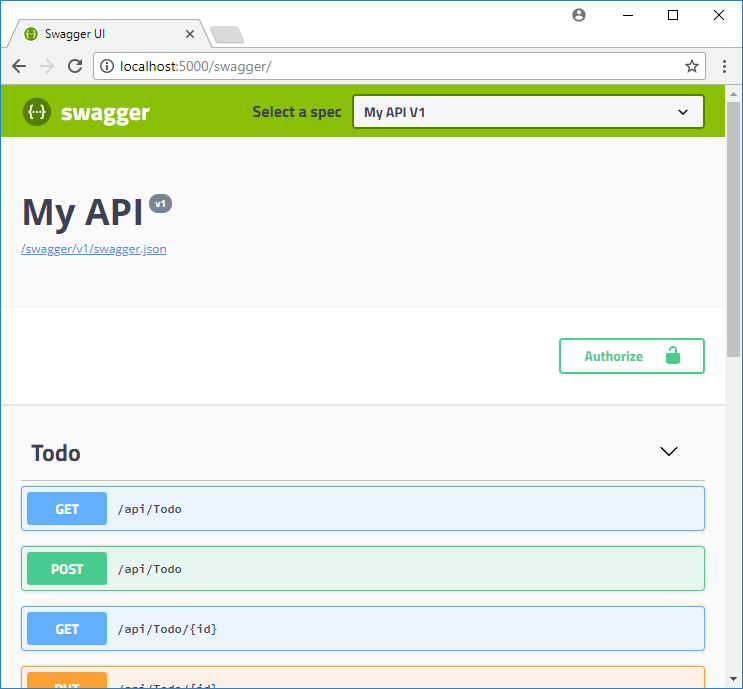

# Tutorial: Host a RESTful API with CORS in Azure App Service

[Azure App Service](overview.md) provides a highly scalable, self-patching web hosting service. In addition, App Service has built-in support for [Cross-Origin Resource Sharing (CORS)](https://wikipedia.org/wiki/Cross-Origin_Resource_Sharing) for RESTful APIs. This tutorial shows how to deploy an ASP.NET Core API app to App Service with CORS support. You configure the app using command-line tools and deploy the app using Git. 

In this tutorial, you learn how to:

> [!div class="checklist"]
> * Create App Service resources using Azure CLI
> * Deploy a RESTful API to Azure using Git
> * Enable App Service CORS support

You can follow the steps in this tutorial on macOS, Linux, Windows.

[!INCLUDE [quickstarts-free-trial-note](../../includes/quickstarts-free-trial-note.md)]

## Prerequisites

To complete this tutorial:

* [Install Git](https://git-scm.com/).
* [Install .NET Core](https://www.microsoft.com/net/core/).

## Create local ASP.NET Core app

In this step, you set up the local ASP.NET Core project. App Service supports the same workflow for APIs written in other languages.

### Clone the sample application

In the terminal window, `cd` to a working directory.  

Run the following command to clone the sample repository. 

```bash
git clone https://github.com/Azure-Samples/dotnet-core-api
```

This repository contains an app that's created based on the following tutorial: [ASP.NET Core Web API help pages using Swagger](/aspnet/core/tutorials/web-api-help-pages-using-swagger?tabs=visual-studio). It uses a Swagger generator to serve the [Swagger UI](https://swagger.io/swagger-ui/) and the Swagger JSON endpoint.

### Run the application

Run the following commands to install the required packages, run database migrations, and start the application.

```bash
cd dotnet-core-api
dotnet restore
dotnet run
```

Navigate to `http://localhost:5000/swagger` in a browser to play with the Swagger UI.



Navigate to `http://localhost:5000/api/todo` and see a list of ToDo JSON items.

Navigate to `http://localhost:5000` and play with the browser app. Later, you will point the browser app to a remote API in App Service to test CORS functionality. Code for the browser app is found in the repository's _wwwroot_ directory.

To stop ASP.NET Core at any time, press `Ctrl+C` in the terminal.

[!INCLUDE [cloud-shell-try-it.md](../../includes/cloud-shell-try-it.md)]

## Deploy app to Azure

In this step, you deploy your SQL Database-connected .NET Core application to App Service.

### Configure local git deployment

[!INCLUDE [Configure a deployment user](../../includes/configure-deployment-user-no-h.md)]

### Create a resource group

[!INCLUDE [Create resource group](../../includes/app-service-web-create-resource-group-no-h.md)]

### Create an App Service plan

[!INCLUDE [Create app service plan](../../includes/app-service-web-create-app-service-plan-no-h.md)]

### Create a web app

[!INCLUDE [Create web app](../../includes/app-service-web-create-web-app-dotnetcore-win-no-h.md)] 

### Push to Azure from Git

[!INCLUDE [app-service-plan-no-h](../../includes/app-service-web-git-push-to-azure-no-h.md)]

```bash
Counting objects: 98, done.
Delta compression using up to 8 threads.
Compressing objects: 100% (92/92), done.
Writing objects: 100% (98/98), 524.98 KiB | 5.58 MiB/s, done.
Total 98 (delta 8), reused 0 (delta 0)
remote: Updating branch 'master'.
remote: .
remote: Updating submodules.
remote: Preparing deployment for commit id '0c497633b8'.
remote: Generating deployment script.
remote: Project file path: ./DotNetCoreSqlDb.csproj
remote: Generated deployment script files
remote: Running deployment command...
remote: Handling ASP.NET Core Web Application deployment.
remote: .
remote: .
remote: .
remote: Finished successfully.
remote: Running post deployment command(s)...
remote: Deployment successful.
remote: App container will begin restart within 10 seconds.
To https://<app_name>.scm.azurewebsites.net/<app_name>.git
 * [new branch]      master -> master
```

### Browse to the Azure app

Navigate to `http://<app_name>.azurewebsites.net/swagger` in a browser and play with the Swagger UI.


Navigate to `http://<app_name>.azurewebsites.net/swagger/v1/swagger.json` to see the _swagger.json_ for your deployed API.

Navigate to `http://<app_name>.azurewebsites.net/api/todo` to see your deployed API working.

## Add CORS functionality

Next, you enable the built-in CORS support in App Service for your API.

### Test CORS in sample app

In your local repository, open _wwwroot/index.html_.

In Line 51, set the `apiEndpoint` variable to the URL of your deployed API (`http://<app_name>.azurewebsites.net`). Replace _\<appname>_ with your app name in App Service.

In your local terminal window, run the sample app again.

```bash
dotnet run
```

Navigate to the browser app at `http://localhost:5000`. Open the developer tools window in your browser (`Ctrl`+`Shift`+`i` in Chrome for Windows) and inspect the **Console** tab. You should now see the error message, `No 'Access-Control-Allow-Origin' header is present on the requested resource`.


Because of the domain mismatch between the browser app (`http://localhost:5000`) and remote resource (`http://<app_name>.azurewebsites.net`), and the fact that your API in App Service is not sending the `Access-Control-Allow-Origin` header, your browser has prevented cross-domain content from loading in your browser app.

In production, your browser app would have a public URL instead of the localhost URL, but the way to enable CORS to a localhost URL is the same as a public URL.

### Enable CORS 

In the Cloud Shell, enable CORS to your client's URL by using the [`az resource update`](/cli/azure/resource#az-resource-update) command. Replace the _&lt;appname>_ placeholder.

```azurecli-interactive
az resource update --name web --resource-group myResourceGroup --namespace Microsoft.Web --resource-type config --parent sites/<app_name> --set properties.cors.allowedOrigins="['http://localhost:5000']" --api-version 2015-06-01
```

You can set more than one client URL in `properties.cors.allowedOrigins` (`"['URL1','URL2',...]"`). You can also enable all client URLs with `"['*']"`.

> [!NOTE]
> If your app requires credentials such as cookies or authentication tokens to be sent, the browser may require the `ACCESS-CONTROL-ALLOW-CREDENTIALS` header on the response. To enable this in App Service, set `properties.cors.supportCredentials` to `true` in your CORS config. This cannot be enabled when `allowedOrigins` includes `'*'`.

### Test CORS again

Refresh the browser app at `http://localhost:5000`. The error message in the **Console** window is now gone, and you can see the data from the deployed API and interact with it. Your remote API now supports CORS to your browser app running locally. 


Congratulations, you're running an API in Azure App Service with CORS support.

## App Service CORS vs. your CORS

You can use your own CORS utilities instead of App Service CORS for more flexibility. For example, you may want to specify different allowed origins for different routes or methods. Since App Service CORS lets you specify one set of accepted origins for all API routes and methods, you would want to use your own CORS code. See how ASP.NET Core does it at [Enabling Cross-Origin Requests (CORS)](/aspnet/core/security/cors).

> [!NOTE]
> Don't try to use App Service CORS and your own CORS code together. When used together, App Service CORS takes precedence and your own CORS code has no effect.
>
>

[!INCLUDE [cli-samples-clean-up](../../includes/cli-samples-clean-up.md)]

<a name="next"></a>
## Next steps

What you learned:

> [!div class="checklist"]
> * Create App Service resources using Azure CLI
> * Deploy a RESTful API to Azure using Git
> * Enable App Service CORS support

Advance to the next tutorial to learn how to authenticate and authorize users.

> [!div class="nextstepaction"]
> [Tutorial: Authenticate and authorize users end-to-end](app-service-web-tutorial-auth-aad.md)
