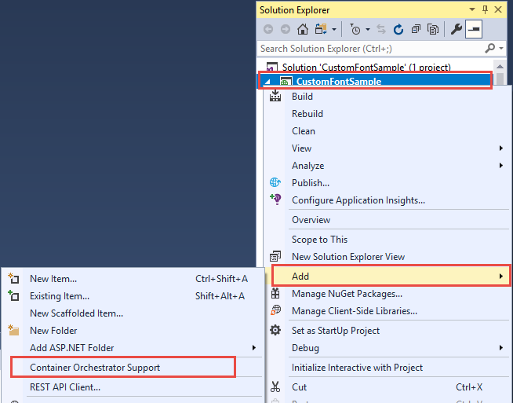
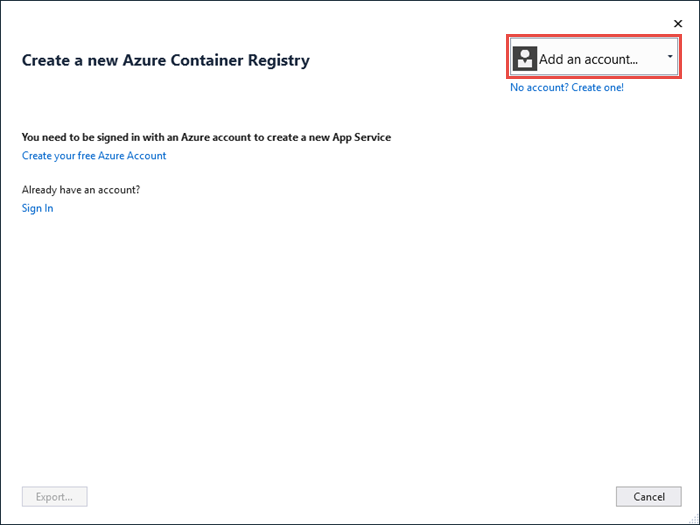
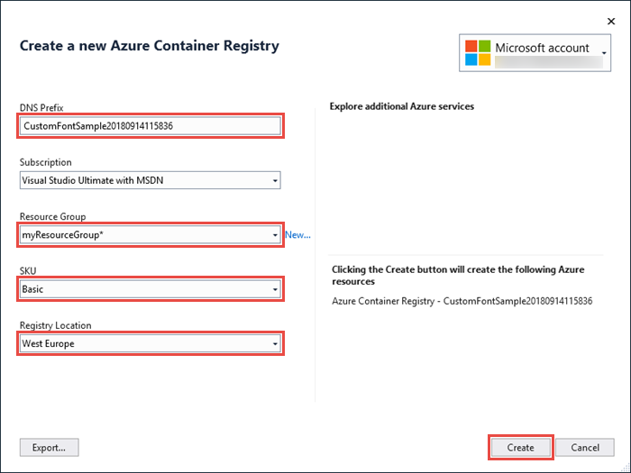
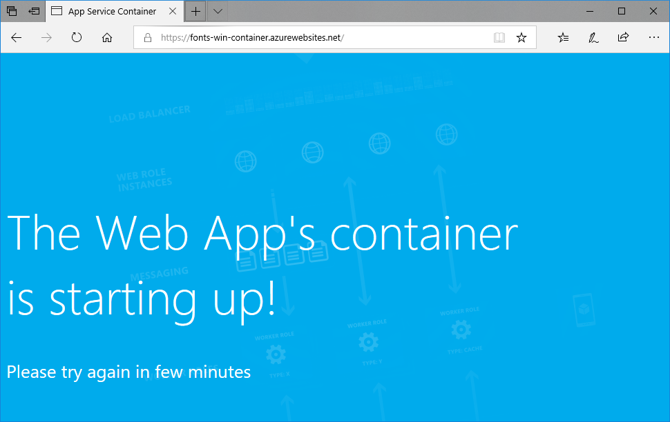

# Migrate an ASP.NET app to Azure App Service using a Windows container (Preview)

[Azure App Service](overview.md) provides pre-defined application stacks on Windows like ASP.NET or Node.js, running on IIS. The preconfigured Windows environment locks down the operating system from administrative access, software installations, changes to the global assembly cache, and so on (see [Operating system functionality on Azure App Service](operating-system-functionality.md)). However, using a custom Windows container in App Service lets you make OS changes that your app needs, so it's easy to migrate on-premises app that requires custom OS and software configuration. This tutorial demonstrates how to migrate to App Service an ASP.NET app that uses custom fonts installed in the Windows font library. You deploy a custom-configured Windows image from Visual Studio to [Azure Container Registry](https://docs.microsoft.com/azure/container-registry/), and then run it in App Service.


## Prerequisites

To complete this tutorial:

- <a href="https://hub.docker.com/" target="_blank">Sign up for a Docker Hub account</a>
- <a href="https://docs.docker.com/docker-for-windows/install/" target="_blank">Install Docker for Windows</a>.
- <a href="https://docs.microsoft.com/virtualization/windowscontainers/quick-start/quick-start-windows-10" target="_blank">Switch Docker to run Windows containers</a>.
- <a href="https://www.visualstudio.com/downloads/" target="_blank">Install Visual Studio 2019</a> with the **ASP.NET and web development** and **Azure development** workloads. If you've installed Visual Studio 2019 already:
    - Install the latest updates in Visual Studio by clicking **Help** > **Check for Updates**.
    - Add the workloads in Visual Studio by clicking **Tools** > **Get Tools and Features**.

## Set up the app locally

### Download the sample

In this step, you set up the local .NET project.

- [Download the sample project](https://github.com/Azure-Samples/custom-font-win-container/archive/master.zip).
- Extract (unzip) the  *custom-font-win-container.zip* file.

The sample project contains a simple ASP.NET application that uses a custom font that is installed into the Windows font library. It's not necessary to install fonts, but it's an example of an app that is integrated with the underlying OS. To migrate such an app to App Service, you either rearchitect your code to remove the integration, or migrate it as-is in a custom Windows container.

### Install the font

In Windows Explorer, navigate to _custom-font-win-container-master/CustomFontSample_, right-click _FrederickatheGreat-Regular.ttf_, and select **Install**.

This font is publicly available from [Google Fonts](https://fonts.google.com/specimen/Fredericka+the+Great).

### Run the app

Open the *custom-font-win-container/CustomFontSample.sln* file in Visual Studio. 

Type `Ctrl+F5` to run the app without debugging. The app is displayed in your default browser. 


Because it uses an installed font, the app can't run in the App Service sandbox. However, you can deploy it using a Windows container instead, because you can install the font in the Windows container.

### Configure Windows container

In Solution Explorer, right-click the **CustomFontSample** project and select **Add** > **Container Orchestration Support**.



Select **Docker Compose** > **OK**.

Your project is now set up to run in a Windows container. A _Dockerfile_ is added to the **CustomFontSample** project, and a **docker-compose** project is added to the solution. 

From the Solution Explorer, open **Dockerfile**.

You need to use a [supported parent image](app-service-web-get-started-windows-container.md#use-a-different-parent-image). Change the parent image by replacing the `FROM` line with the following code:

```Dockerfile
FROM mcr.microsoft.com/dotnet/framework/aspnet:4.7.2-windowsservercore-ltsc2019
```

At the end of the file, add the following line and save the file:

```Dockerfile
RUN ${source:-obj/Docker/publish/InstallFont.ps1}
```

You can find _InstallFont.ps1_ in the **CustomFontSample** project. It's a simple script that installs the font. You can find a more complex version of the script in the [Script Center](https://gallery.technet.microsoft.com/scriptcenter/fb742f92-e594-4d0c-8b79-27564c575133).

> [!NOTE]
> To test the Windows container locally, make sure that Docker is started on your local machine.
>

## Publish to Azure Container Registry

[Azure Container Registry](https://docs.microsoft.com/azure/container-registry/) can store your images for container deployments. You can configure App Service to use images hosted in Azure Container Registry.

### Open publish wizard

In the Solution Explorer, right-click the **CustomFontSample** project and select **Publish**.


### Create registry and publish

In the publish wizard, select **Container Registry** > **Create New Azure Container Registry** > **Publish**.


### Sign in with Azure account

In the **Create a new Azure Container Registry** dialog, select **Add an account**, and sign in to your Azure subscription. If you're already signed in, select the account containing the desired subscription from the dropdown.



### Configure the registry

Configure the new container registry based on the suggested values in the following table. When finished, click **Create**.

| Setting  | Suggested value | For more information |
| ----------------- | ------------ | ----|
|**DNS Prefix**| Keep the generated registry name, or change it to another unique name. |  |
|**Resource Group**| Click **New**, type **myResourceGroup**, and click **OK**. |  |
|**SKU**| Basic | [Pricing tiers](https://azure.microsoft.com/pricing/details/container-registry/)|
|**Registry Location**| West Europe | |



A terminal window is opened and displays the image deployment progress. Wait for the deployment to complete.

## Sign in to Azure

Sign in to the Azure portal at https://portal.azure.com.

## Create a web app

From the left menu, select **Create a resource** > **Web** > **Web App for Containers**.

### Configure app basics

In the **Basics** tab, configure the settings according to the following table, then click **Next: Docker**.

| Setting  | Suggested value | For more information |
| ----------------- | ------------ | ----|
|**Subscription**| Make sure the correct subscription is selected. |  |
|**Resource Group**| Select **Create new**, type **myResourceGroup**, and click **OK**. |  |
|**Name**| Type a unique name. | The URL of the web app is `http://<app-name>.azurewebsites.net`, where `<app-name>` is your app name. |
|**Publish**| Docker container | |
|**Operating System**| Windows | |
|**Region**| West Europe | |
|**Windows Plan**| Select **Create new**, type **myAppServicePlan**, and click **OK**. | |

Your **Basics** tab should look like this:


### Configure Windows container

In the **Docker** tab, configure your custom Windows container as shown in the following table, and select **Review + create**.

| Setting  | Suggested value |
| ----------------- | ------------ |
|**Image Source**| Azure Container Register |
|**Registry**| Select [the registry you created earlier](#publish-to-azure-container-registry). |
|**Image**| customfontsample |
|**Tag**| latest |

### Complete app creation

Click **Create** and wait for Azure to create the required resources.

## Browse to the web app

When the Azure operation is complete, a notification box is displayed.


1. Click **Go to resource**.

2. In the app page, click the link under **URL**.

A new browser page is opened to the following page:



Wait a few minutes and try again, until you get the homepage with the beautiful font you expect:


**Congratulations!** You've migrated an ASP.NET application to Azure App Service in a Windows container.

## See container start-up logs

It may take some time for the Windows container to load. To see the progress, navigate to the following URL by replacing *\<app-name>* with the name of your app.
```
https://<app-name>.scm.azurewebsites.net/api/logstream
```

The streamed logs looks like this:

```
14/09/2018 23:16:19.889 INFO - Site: fonts-win-container - Creating container for image: customfontsample20180914115836.azurecr.io/customfontsample:latest.
14/09/2018 23:16:19.928 INFO - Site: fonts-win-container - Create container for image: customfontsample20180914115836.azurecr.io/customfontsample:latest succeeded. Container Id 329ecfedbe370f1d99857da7352a7633366b878607994ff1334461e44e6f5418
14/09/2018 23:17:23.405 INFO - Site: fonts-win-container - Start container succeeded. Container: 329ecfedbe370f1d99857da7352a7633366b878607994ff1334461e44e6f5418
14/09/2018 23:17:28.637 INFO - Site: fonts-win-container - Container ready
14/09/2018 23:17:28.637 INFO - Site: fonts-win-container - Configuring container
14/09/2018 23:18:03.823 INFO - Site: fonts-win-container - Container ready
14/09/2018 23:18:03.823 INFO - Site: fonts-win-container - Container start-up and configuration completed successfully
```

