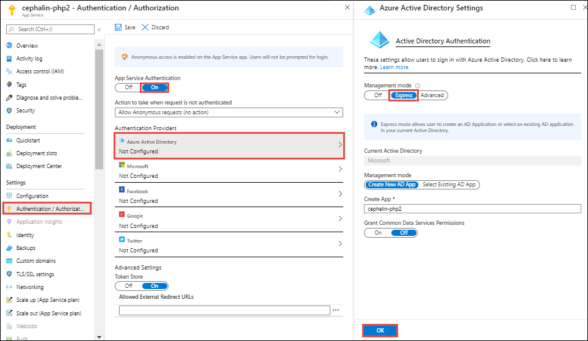

# Configure your App Service or Azure Functions app to use Azure AD login

[!INCLUDE [app-service-mobile-selector-authentication](../../includes/app-service-mobile-selector-authentication.md)]

This article shows you how to configure Azure App Service or Azure Functions to use Azure Active Directory (Azure AD) as an authentication provider.

> [!NOTE]
> The express settings flow sets up an AAD V1 application registration. If you wish to use [Azure Active Directory v2.0](../active-directory/develop/v2-overview.md) (including [MSAL](../active-directory/develop/msal-overview.md)), please follow the [advanced configuration instructions](#advanced).

Follow these best practices when setting up your app and authentication:

- Give each App Service app its own permissions and consent.
- Configure each App Service app with its own registration.
- Avoid permission sharing between environments by using separate app registrations for separate deployment slots. When testing new code, this practice can help prevent issues from affecting the production app.

> [!NOTE]
> This feature is currently not available on Linux Consumption plan for Azure Functions

## Configure with express settings

> [!NOTE]
> The **Express** option is not available for government clouds.

1. In the [Azure portal], search for and select **App Services**, and then select your app.
2. From the left navigation, select **Authentication / Authorization** > **On**.
3. Select **Azure Active Directory** > **Express**.

   If you want to choose an existing app registration instead:

   1. Choose **Select Existing AD app**, then click **Azure AD App**.
   2. Choose an existing app registration and click **OK**.

3. Select **OK** to register the App Service app in Azure Active Directory. A new app registration is created.

    

4. (Optional) By default, App Service provides authentication but doesn't restrict authorized access to your site content and APIs. You must authorize users in your app code. To restrict app access only to users authenticated by Azure Active Directory, set **Action to take when request is not authenticated** to **Log in with Azure Active Directory**. When you set this functionality, your app requires all requests to be authenticated. It also redirects all unauthenticated to Azure Active Directory for authentication.

    > [!CAUTION]
    > Restricting access in this way applies to all calls to your app, which might not be desirable for apps that have a publicly available home page, as in many single-page applications. For such applications, **Allow anonymous requests (no action)** might be preferred, with the app manually starting login itself. For more information, see [Authentication flow](overview-authentication-authorization.md#authentication-flow).
5. Select **Save**.

## Configure with advanced settings

You can configure app settings manually if you want to use an app registration from a different Azure AD tenant. To complete this custom configuration:

1. Create a registration in Azure AD.
2. Provide some of the registration details to App Service.

### Create an app registration in Azure AD for your App Service app

You'll need the following information when you configure your App Service app:

- Client ID
- Tenant ID
- Client secret (optional)
- Application ID URI

Perform the following steps:

1. Sign in to the [Azure portal], search for and select **App Services**, and then select your app. Note your app's **URL**. You'll use it to configure your Azure Active Directory app registration.
1. Select **Azure Active Directory** > **App registrations** > **New registration**.
1. In the **Register an application** page, enter a **Name** for your app registration.
1. In **Redirect URI**, select **Web** and type `<app-url>/.auth/login/aad/callback`. For example, `https://contoso.azurewebsites.net/.auth/login/aad/callback`.
1. Select **Create**.
1. After the app registration is created, copy the **Application (client) ID** and the **Directory (tenant) ID** for later.
1. Select **Authentication**. Under **Implicit grant**, enable **ID tokens** to allow OpenID Connect user sign-ins from App Service.
1. (Optional) Select **Branding**. In **Home page URL**, enter the URL of your App Service app and select **Save**.
1. Select **Expose an API** > **Set**. For single-tenant app, paste in the URL of your App Service app and select **Save** and for multi-tenant app, paste in the URL which is based on one of tenant verified domains and then select **Save**.

   > [!NOTE]
   > This value is the **Application ID URI** of the app registration. If your web app requires access to an API in the cloud, you need the **Application ID URI** of the web app when you configure the cloud App Service resource. You can use this, for example, if you want the cloud service to explicitly grant access to the web app.

1. Select **Add a scope**.
   1. In **Scope name**, enter *user_impersonation*.
   1. In the text boxes, enter the consent scope name and description you want users to see on the consent page. For example, enter *Access my app*.
   1. Select **Add scope**.
1. (Optional) To create a client secret, select **Certificates & secrets** > **New client secret** > **Add**. Copy the client secret value shown in the page. It won't be shown again.
1. (Optional) To add multiple **Reply URLs**, select **Authentication**.

### Enable Azure Active Directory in your App Service app

1. In the [Azure portal], search for and select **App Services**, and then select your app.
1. In the left pane, under **Settings**, select **Authentication / Authorization** > **On**.
1. (Optional) By default, App Service authentication allows unauthenticated access to your app. To enforce user authentication, set **Action to take when request is not authenticated** to **Log in with Azure Active Directory**.
1. Under **Authentication Providers**, select **Azure Active Directory**.
1. In **Management mode**, select **Advanced** and configure App Service authentication according to the following table:

    |Field|Description|
    |-|-|
    |Client ID| Use the **Application (client) ID** of the app registration. |
    |Issuer Url| Use `<authentication-endpoint>/<tenant-id>/v2.0`, and replace *\<authentication-endpoint>* with the [authentication endpoint for your cloud environment](../active-directory/develop/authentication-national-cloud.md#azure-ad-authentication-endpoints) (e.g., "https://login.microsoft.com" for global Azure), also replacing *\<tenant-id>* with the **Directory (tenant) ID** in which the app registration was created. This value is used to redirect users to the correct Azure AD tenant, as well as to download the appropriate metadata to determine the appropriate token signing keys and token issuer claim value for example. The `/v2.0` section may be omitted for applications using AAD v1. |
    |Client Secret (Optional)| Use the client secret you generated in the app registration.|
    |Allowed Token Audiences| If this is a cloud or server app and you want to allow authentication tokens from a web app, add the **Application ID URI** of the web app here. The configured **Client ID** is *always* implicitly considered to be an allowed audience. |

2. Select **OK**, and then select **Save**.

You're now ready to use Azure Active Directory for authentication in your App Service app.

## Configure a native client application

You can register native clients to allow authentication to Web API's hosted in your app using a client library such as the **Active Directory Authentication Library**.

1. In the [Azure portal], select **Active Directory** > **App registrations** > **New registration**.
1. In the **Register an application** page, enter a **Name** for your app registration.
1. In **Redirect URI**, select **Public client (mobile & desktop)** and type the URL `<app-url>/.auth/login/aad/callback`. For example, `https://contoso.azurewebsites.net/.auth/login/aad/callback`.

    > [!NOTE]
    > For a Microsoft Store application, use the [package SID](../app-service-mobile/app-service-mobile-dotnet-how-to-use-client-library.md#package-sid) as the URI instead.
1. Select **Create**.
1. After the app registration is created, copy the value of **Application (client) ID**.
1. Select **API permissions** > **Add a permission** > **My APIs**.
1. Select the app registration you created earlier for your App Service app. If you don't see the app registration, make sure that you've added the **user_impersonation** scope in [Create an app registration in Azure AD for your App Service app](#register).
1. Under **Delegated permissions**, select **user_impersonation**, and then select **Add permissions**.

You have now configured a native client application that can access your App Service app on behalf of a user.

## Configure a daemon client application for service-to-service calls

Your application can acquire a token to call a Web API hosted in your App Service or Function app on behalf of itself (not on behalf of a user). This scenario is useful for non-interactive daemon applications that perform tasks without a logged in user. It uses the standard OAuth 2.0 [client credentials](../active-directory/azuread-dev/v1-oauth2-client-creds-grant-flow.md) grant.

1. In the [Azure portal], select **Active Directory** > **App registrations** > **New registration**.
1. In the **Register an application** page, enter a **Name** for your daemon app registration.
1. For a daemon application, you don't need a Redirect URI so you can keep that empty.
1. Select **Create**.
1. After the app registration is created, copy the value of **Application (client) ID**.
1. Select **Certificates & secrets** > **New client secret** > **Add**. Copy the client secret value shown in the page. It won't be shown again.

You can now [request an access token using the client ID and client secret](../active-directory/azuread-dev/v1-oauth2-client-creds-grant-flow.md#first-case-access-token-request-with-a-shared-secret) by setting the `resource` parameter to the **Application ID URI** of the target app. The resulting access token can then be presented to the target app using the standard [OAuth 2.0 Authorization header](../active-directory/azuread-dev/v1-oauth2-client-creds-grant-flow.md#use-the-access-token-to-access-the-secured-resource), and App Service Authentication / Authorization will validate and use the token as usual to now indicate that the caller (an application in this case, not a user) is authenticated.

At present, this allows _any_ client application in your Azure AD tenant to request an access token and authenticate to the target app. If you also want to enforce _authorization_ to allow only certain client applications, you must perform some additional configuration.

1. [Define an App Role](../active-directory/develop/howto-add-app-roles-in-azure-ad-apps.md) in the manifest of the app registration representing the App Service or Function app you want to protect.
1. On the app registration representing the client that needs to be authorized, select **API permissions** > **Add a permission** > **My APIs**.
1. Select the app registration you created earlier. If you don't see the app registration, make sure that you've [added an App Role](../active-directory/develop/howto-add-app-roles-in-azure-ad-apps.md).
1. Under **Application permissions**, select the App Role you created earlier, and then select **Add permissions**.
1. Make sure to click **Grant admin consent** to authorize the client application to request the permission.
1. Similar to the previous scenario (before any roles were added), you can now [request an access token](../active-directory/azuread-dev/v1-oauth2-client-creds-grant-flow.md#first-case-access-token-request-with-a-shared-secret) for the same target `resource`, and the access token will include a `roles` claim containing the App Roles that were authorized for the client application.
1. Within the target App Service or Function app code, you can now validate that the expected roles are present in the token (this is not performed by App Service Authentication / Authorization). For more information, see [Access user claims](app-service-authentication-how-to.md#access-user-claims).

You have now configured a daemon client application that can access your App Service app using its own identity.

## Next steps

[!INCLUDE [app-service-mobile-related-content-get-started-users](../../includes/app-service-mobile-related-content-get-started-users.md)]
* [Tutorial: Authenticate and authorize users end-to-end in Azure App Service](app-service-web-tutorial-auth-aad.md)
<!-- URLs. -->

[Azure portal]: https://portal.azure.com/
