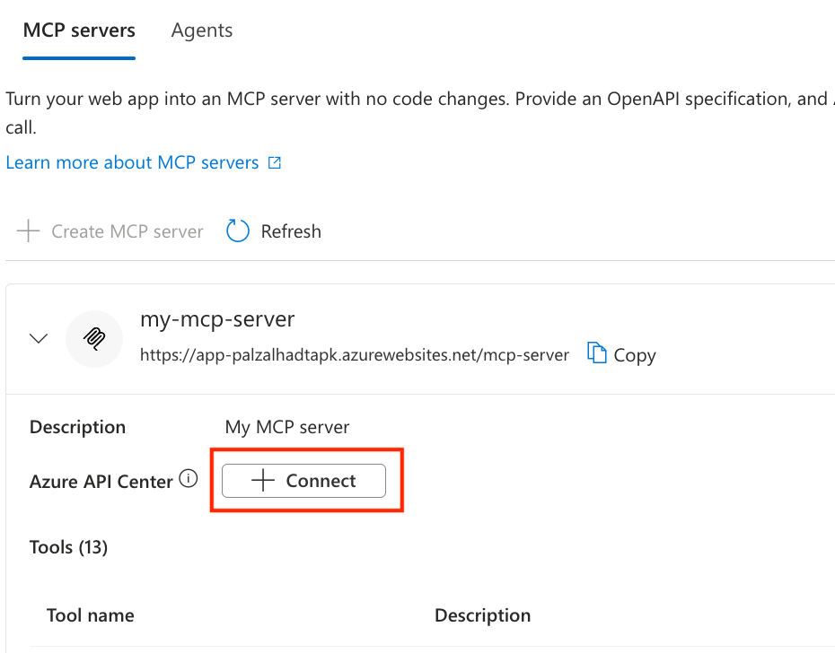

# Configure App Service built-in MCP (Preview)

App Service built-in MCP turns an existing REST API hosted on Azure App Service into a [Model Context Protocol (MCP)](https://modelcontextprotocol.io/introduction) server without writing or deploying any MCP code. The platform reads an OpenAPI specification you provide and generates an MCP tool for each operation. It then serves the MCP endpoint over [streamable HTTP](https://modelcontextprotocol.io/specification/2025-06-18/basic/transports#streamable-http) on a path you choose.

> [!IMPORTANT]
> App Service built-in MCP is in preview.

## When to use built-in MCP

Use built-in MCP when:

- You already have a REST API running on App Service and want to expose it to an MCP-compatible AI client (GitHub Copilot Chat, Cursor, Windsurf, Claude Desktop) without code changes.
- You have an OpenAPI 3.x specification (JSON or YAML) that describes the operations you want to expose.
- You want the platform to handle MCP protocol negotiation, tool discovery, hot-reload of the spec, and client cancellation.
- You want App Service Authentication to enforce identity for MCP requests, the same way it enforces identity for your existing HTTP routes.

Use a custom MCP server (built with an MCP SDK and deployed as your application code) instead when:

- You need MCP tool behavior that doesn't map cleanly to a single REST operation—for example, multi-step workflows, in-memory aggregation, or tools that don't have an HTTP backing endpoint.
- You need to expose MCP [resources](https://modelcontextprotocol.io/specification/2025-06-18/server/resources) or [prompts](https://modelcontextprotocol.io/specification/2025-06-18/server/prompts) in addition to tools.
- You need to host more than one MCP server on a single app.

For a comparison of all MCP hosting options on Azure, see [Choose an Azure service for your MCP server](/azure/container-apps/mcp-choosing-azure-service).

## Prerequisites

- An App Service app on a dedicated pricing tier (Basic or higher). Built-in MCP isn't supported on Free, Shared, Consumption, or Flex Consumption plans.
- An OpenAPI 3.x specification (JSON or YAML) that describes the operations you want to expose as MCP tools. See [Step 1: Provide your OpenAPI spec](#step-1-provide-your-openapi-spec) for generation options.

## Step 1: Provide your OpenAPI spec

Built-in MCP needs an OpenAPI 3.x document (JSON or YAML). Most web frameworks can produce one for you:

- **ASP.NET Core minimal APIs**—use the built-in [`Microsoft.AspNetCore.OpenApi`](/aspnet/core/fundamentals/openapi/overview) package (default in .NET 9 and later).
- **ASP.NET Core controllers**—use [Swashbuckle](/aspnet/core/tutorials/getting-started-with-swashbuckle).
- **FastAPI**—autogenerated at `/openapi.json`.
- **Express / NestJS**—use [`@nestjs/swagger`](https://docs.nestjs.com/openapi/introduction) or [`express-openapi`](https://www.npmjs.com/package/express-openapi).
- **Spring Boot**—use [`springdoc-openapi`](https://springdoc.org/).
- **Java / Quarkus**—use [SmallRye OpenAPI](https://quarkus.io/guides/openapi-swaggerui).

If your API is already running and exposes an OpenAPI endpoint, you don't need to add a new library—download the spec from that endpoint (for example, with `curl`) and save it locally so you can upload it when you enable built-in MCP.

A minimal spec that exposes one operation looks like:

```json
{
  "openapi": "3.0.3",
  "info": { "title": "Zava Orders", "version": "1.0.0" },
  "paths": {
    "/orders/{id}": {
      "get": {
        "operationId": "get_order",
        "summary": "Get an order by ID",
        "parameters": [
          { "name": "id", "in": "path", "required": true,
            "schema": { "type": "string" } }
        ],
        "responses": {
          "200": { "description": "OK" }
        }
      }
    }
  }
}
```

Use clear, action-oriented `operationId` values (`list_orders`, `create_order`, `cancel_order`). The AI client uses them as tool names when choosing which tool to call. For details on how operations map to MCP tools, see [How does built-in MCP map REST operations to MCP tools?](#how-does-built-in-mcp-map-rest-operations-to-mcp-tools).

## Step 2: Enable built-in MCP

1. In the [Azure portal](https://portal.azure.com), navigate to your App Service app.
1. In the left menu, under **Settings**, select **AI (preview)**.
1. Select the **MCP servers** tab.
1. Select **+ Create MCP server**, then fill in:
   - **Display name**—the server identifier shown to clients.
   - **Endpoint path**—the relative URL where the MCP server is served (default `/mcp`). The full URL preview appears below the field.
   - **Description**—optional, shown to MCP clients.
   - **API spec path**—the path on the app's file system where the spec file is stored. Defaults to `/home/data/.ai/apispec.json`; edit it if you want the spec stored somewhere else.
   - **OpenAPI specification › JSON or YAML file**—select **Browse** and upload your OpenAPI JSON or YAML file. The portal writes the contents to the location you set in **API spec path**. Files larger than 15 KB might be truncated unless [access to the Kudu site is enabled](resources-kudu.md) on the app.
   - **Authentication**—optional. If App Service Authentication isn't enabled on the app, use this section to provide identity provider metadata so MCP clients can complete OAuth. Provide:
     - **Source**—comma-separated OAuth scopes the MCP client should request.
     - **Well-known OpenID configuration URL** *or* **Issuer**—the OpenID Connect discovery URL or token issuer URL for your identity provider.
1. Select **Create MCP**.

> [!div class="mx-imgBorder"]
> 

After you save, the **MCP servers** tab shows the configured server with its endpoint, tool count, and an enable/disable toggle. Expand the server to enable or disable individual tools.

> [!div class="mx-imgBorder"]
> 

> [!NOTE]
> Azure CLI and Bicep support for built-in MCP isn't documented yet. This article will cover both once the schema is finalized for the preview.

## Step 3: Connect an MCP client

After you save the configuration, the MCP endpoint is available at:

```text
https://<app-name>.azurewebsites.net/<endpoint path you provided>
```

Configure your MCP client with that URL. For [GitHub Copilot Chat in Visual Studio Code](configure-authentication-mcp-server-vscode.md), add an entry to your `.vscode/mcp.json`:

```json
{
  "servers": {
    "my-mcp-server": {
      "type": "http",
      "url": "https://<app-name>.azurewebsites.net/<endpoint path you provided>"
    }
  }
}
```

When the client connects, it calls `initialize`, then `tools/list` to discover the operations your OpenAPI spec exposes, then `tools/call` for each invocation.

## Authentication

Built-in MCP doesn't issue tokens or implement an authorization server. [App Service Authentication](overview-authentication-authorization.md) enforces identity on the same app and works with any identity provider App Service Authentication supports (Microsoft Entra, and any other configured OpenID Connect (OIDC) provider). Two configurations are supported:

- **App Service Authentication is enabled (recommended).** MCP requests go through the same identity checks as any other route, and the platform publishes [protected resource metadata](https://datatracker.ietf.org/doc/html/rfc9728) at `/.well-known/oauth-protected-resource` so MCP clients can complete OAuth automatically. **Required follow-up:** complete the steps in [Configure built-in MCP server authorization](configure-authentication-mcp.md) to register the MCP audience and scopes with your identity provider.
- **App Service Authentication isn't enabled.** Provide identity provider metadata in the **Authentication** section of the **Create MCP server** panel (see [Step 2](#step-2-enable-built-in-mcp)). This option suits cases where you already validate tokens in your application code and don't want App Service Authentication to inject headers or middleware.

In both cases, your application code is still responsible for validating the bearer token on each request. Built-in MCP doesn't enforce authorization on the underlying HTTP routes.

> [!CAUTION]
> Avoid exposing a built-in MCP server publicly without authentication. Once an MCP client connects, every enabled tool is callable.

## Frequently asked questions

### How does built-in MCP map REST operations to MCP tools?

Each OpenAPI operation becomes one MCP tool:

- **Tool name**—derived from the operation's `operationId`. If `operationId` is missing, the platform falls back to `{method}_{path}` (for example, `get__orders__id_`). Use explicit, action-oriented `operationId` values to give the AI client clearer tool names.
- **Tool description**—the operation's `summary` first, then `description` if `summary` is missing.
- **Tool annotations**—built-in MCP maps the HTTP method to MCP [tool annotations](https://modelcontextprotocol.io/specification/2025-06-18/server/tools#tool-annotations):

  | HTTP method | `readOnlyHint` | `idempotentHint` | `destructiveHint` |
  |---|---|---|---|
  | `GET`, `HEAD` | `true` | `true` | `false` |
  | `PUT`, `PATCH` | `false` | `true` | `false` |
  | `DELETE` | `false` | `true` | `true` |
  | `POST` | `false` | `false` | `false` |

### How does the platform handle spec updates?

When the spec at the configured **API spec path** changes—because you uploaded a new version through the portal—the platform:

1. Detects the change.
1. Reparses the spec and recomputes the tool list.
1. Hashes the new tool list (SHA-256) and compares it to the previous hash.
1. If the hash changed, sends a `notifications/tools/list_changed` event to every connected MCP client.

You don't need to restart the app or recreate the MCP server to pick up spec changes.

### What does the platform serve at `/.well-known/oauth-protected-resource`?

The platform publishes [protected resource metadata (PRM)](https://datatracker.ietf.org/doc/html/rfc9728) so MCP clients can discover where to obtain an access token. The contents come from:

- **App Service Authentication**, when enabled on the app. The platform publishes the configured identity provider's metadata.
- **The MCP server's Authentication section**, when App Service Authentication isn't enabled. See [Step 2](#step-2-enable-built-in-mcp).

If neither is configured, the platform doesn't publish the endpoint and clients aren't challenged for OAuth.

### What are the limits?

| Limit | Value |
|---|---|
| MCP servers per app | 1 (preview) |
| Description length | 256 characters |
| Tool name length | 1–128 characters (per the [MCP spec](https://modelcontextprotocol.io/specification/2025-06-18/server/tools)) |
| Supported transport | Streamable HTTP |

## Register your MCP server in Azure API Center

You can register your built-in MCP server as an asset in [Azure API Center](/azure/api-center/overview) to track all of your APIs in a centralized location for discovery, reuse, and governance. Registration is optional—built-in MCP works without it—but it's the recommended way to keep MCP servers visible alongside the rest of your API estate.

The portal makes registration a one-select flow:

1. On the **MCP servers** tab, expand your server.
1. Next to **Azure API Center**, select **+ Connect**.

   > [!div class="mx-imgBorder"]
   > 

1. In the **Connect API Center** pane, choose a **Subscription** and an existing **API Center**, or select **Create new** to create a new one. App Service fills in default values (kind, lifecycle stage, environment, deployment) on your behalf so you don't have to set them up manually.

1. Select **Connect**. The server detail now links to the API Center asset.

To change the asset metadata (kind, lifecycle stage, version, custom properties, definitions, deployments), edit the asset directly in API Center. To register an MCP server in API Center without going through App Service—or to register one that App Service built-in MCP didn't create—see [Register and discover remote MCP servers in your API inventory](/azure/api-center/register-discover-mcp-server).

To disconnect the MCP server from API Center, delete the corresponding MCP server asset in your API Center. The link on the App Service **MCP servers** tab clears once the asset is removed.

## Troubleshooting

**The MCP client gets a 404 at the configured endpoint.**

- Confirm the **Endpoint path** starts with `/` and doesn't collide with an existing route in your app.
- Confirm the server is enabled on the **MCP servers** tab.

**The MCP client connects but `tools/list` returns an empty array.**

- Confirm a spec is configured at the **API spec path** for the server.
- Confirm at least one tool is enabled on the expanded server view.
- Validate the spec with an OpenAPI 3.x linter—operations missing required fields (such as a response schema) are skipped.

**The MCP client gets a 401 with a `WWW-Authenticate` challenge.**

- This error is expected when App Service Authentication is enabled and the client doesn't have a valid token. The challenge points the client at the protected resource metadata endpoint, which in turn points at your identity provider. See [Configure built-in MCP server authorization](configure-authentication-mcp.md).

**The MCP client gets a 403 from a tool call but `tools/list` succeeds.**

- The OAuth token is valid for MCP discovery but doesn't have the scope or role your application requires for the underlying HTTP route. Check the upstream HTTP status surfaced in the `CallToolResult`.

## Next steps

- [Configure built-in MCP server authorization](configure-authentication-mcp.md)
- [Secure MCP calls from Visual Studio Code with Microsoft Entra authentication](configure-authentication-mcp-server-vscode.md)
- [App Service as Model Context Protocol (MCP) servers](scenario-ai-model-context-protocol-server.md)
- [Choose an Azure service for your MCP server](/azure/container-apps/mcp-choosing-azure-service)
