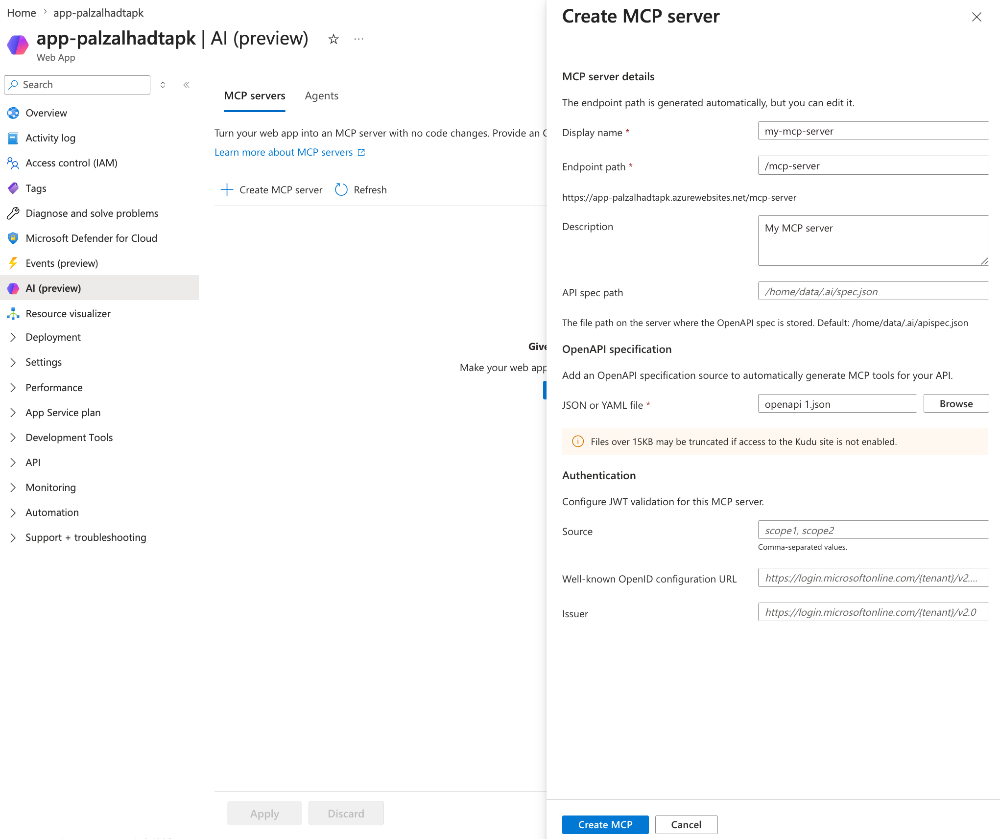
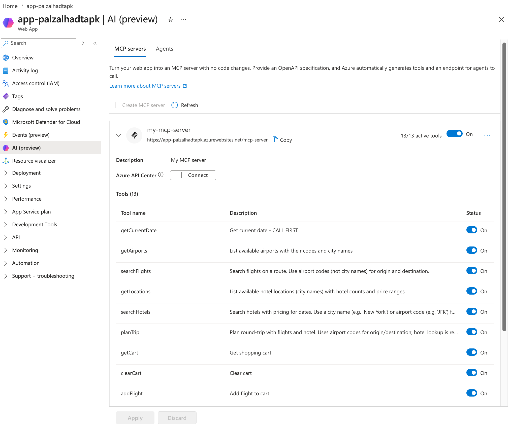

# Configure App Service built-in MCP (Preview)

App Service built-in MCP turns an existing REST API hosted on Azure App Service into a [Model Context Protocol (MCP)](https://modelcontextprotocol.io/introduction) server without writing or deploying any MCP code. The platform reads an OpenAPI specification you publish with your app, generates an MCP tool for each operation, and serves the MCP endpoint over [streamable HTTP](https://modelcontextprotocol.io/specification/2025-06-18/basic/transports#streamable-http) on a path you choose.

> [!IMPORTANT]
> App Service built-in MCP is in preview.

## When to use built-in MCP

Use built-in MCP when:

- You already have a REST API running on App Service and want to expose it to an MCP-compatible AI client (GitHub Copilot Chat, Cursor, Windsurf, Claude Desktop) without code changes.
- You can publish an OpenAPI 3.x specification that describes the operations you want to expose.
- You want the platform to handle MCP protocol negotiation, tool discovery, hot-reload of the spec, and client cancellation.
- You want App Service Authentication to enforce identity for MCP requests, the same way it enforces identity for your existing HTTP routes.

Use a custom MCP server (built with an MCP SDK and deployed as your application code) instead when:

- You need MCP tool behavior that doesn't map cleanly to a single REST operation — for example, multi-step workflows, in-memory aggregation, or tools that don't have an HTTP backing endpoint.
- You need to expose MCP [resources](https://modelcontextprotocol.io/specification/2025-06-18/server/resources) or [prompts](https://modelcontextprotocol.io/specification/2025-06-18/server/prompts) in addition to tools.
- You need to support more than five MCP servers from a single app.

For a comparison of all MCP hosting options on Azure, see [Choose an Azure service for your MCP server](/azure/container-apps/mcp-choosing-azure-service).

## How it works

When you enable built-in MCP on an App Service app:

1. You provide an OpenAPI specification one of two ways:
   - **Point to a spec already in your site.** If your app deploys an OpenAPI document as part of its content (for example, `/home/data/.ai/spec.json` or any other path under the app), set `ApiSpecPath` to that location and the platform reads it from the app's file system.
   - **Upload a spec directly.** Upload an OpenAPI JSON or YAML file through the portal and the platform stores it for the app — no redeploy needed and your app doesn't need to expose the spec itself.
1. Each OpenAPI operation becomes an MCP tool. By default, the tool name is derived from the operation's `operationId` (or from `{method}_{path}` when no `operationId` is set) and the description comes from the operation's `summary` or `description`. You can override either per tool to give the AI client clearer, more action-oriented names and descriptions without changing the underlying spec.
1. The platform serves the MCP endpoint at the path you configure (default `/.ai/mcp/{serverName}`) using streamable HTTP.
1. When an MCP client calls a tool, the platform translates the call into an HTTP request against your app's existing route, forwards the response back to the client, and returns the result as an MCP `CallToolResult`.
1. When you update the OpenAPI spec, the platform detects the change, recomputes the tool list, and notifies connected clients with a `tools/list_changed` notification.

Built-in MCP runs in the App Service request pipeline alongside [App Service Authentication](overview-authentication-authorization.md). When authentication is enabled on the app, MCP requests are subject to the same identity checks as any other request. Built-in MCP also publishes [protected resource metadata (PRM)](https://datatracker.ietf.org/doc/html/rfc9728) at `/.well-known/oauth-protected-resource` so MCP clients can discover the identity provider.

## Prerequisites

- An App Service app on a dedicated pricing tier (Basic or higher). Built-in MCP isn't supported on Free, Shared, Consumption, or Flex Consumption plans.
- An OpenAPI 3.x specification (JSON) that describes the operations you want to expose as MCP tools.
- A way to make the spec available to the platform — either by deploying it as part of your app's content (referenced by `ApiSpecPath`) or by uploading it through the portal.

## Step 1 — Publish your OpenAPI spec

Place a valid OpenAPI 3.x JSON or YAML document at a path your app can read. The platform default is:

```
/home/data/.ai/spec.json
```

A minimal spec that exposes one operation looks like:

```json
{
  "openapi": "3.0.3",
  "info": { "title": "Contoso Orders", "version": "1.0.0" },
  "paths": {
    "/orders/{id}": {
      "get": {
        "operationId": "get_order",
        "summary": "Get an order by ID",
        "parameters": [
          { "name": "id", "in": "path", "required": true,
            "schema": { "type": "string" } }
        ],
        "responses": {
          "200": { "description": "OK" }
        }
      }
    }
  }
}
```

The `operationId` becomes the MCP tool name. Use clear, action-oriented IDs (`list_orders`, `create_order`, `cancel_order`) — the AI client uses them to choose tools.

Built-in MCP maps REST verbs to MCP [tool annotations](https://modelcontextprotocol.io/specification/2025-06-18/server/tools#tool-annotations):

| HTTP method | `readOnlyHint` | `idempotentHint` | `destructiveHint` |
|---|---|---|---|
| `GET`, `HEAD` | `true` | `true` | `false` |
| `PUT`, `PATCH` | `false` | `true` | `false` |
| `DELETE` | `false` | `true` | `true` |
| `POST` | `false` | `false` | `false` |

## Step 2 — Enable built-in MCP

Built-in MCP is configured through the `aiIntegration` property on your `Microsoft.Web/sites` resource. The preview ships with **Portal**, **Azure CLI** (using `az rest`), and **Bicep** as supported configuration paths. No dedicated `az webapp` subcommand or Azure PowerShell cmdlet is available in this preview.

### [Portal](#tab/portal)

1. In the [Azure portal](https://portal.azure.com), navigate to your App Service app.
1. In the left menu, under **Settings**, select **AI (Preview)**.
1. Select the **MCP servers** tab.
1. Select **+ Add MCP server**, then provide:
   - **Name** — the server identifier (used in the endpoint path, for example `orders`).
   - **Description** — a short description shown to MCP clients.
   - **Endpoint** — a relative URL where the MCP server is served (default `/mcp/<name>`).
   - **Tools** — choose **All tools** to expose every operation in your spec, or select specific operations.
1. Select **Save**.

> [!div class="mx-imgBorder"]
> 

After you save, the **MCP servers** tab shows each configured server with its endpoint, tool count, and an enable/disable toggle. Expand a row to see the tool list and toggle individual tools. Select a tool to override its name or description — the override is what the AI client sees, the underlying OpenAPI spec is unchanged.

> [!div class="mx-imgBorder"]
> 

### [Azure CLI](#tab/cli)

The preview API doesn't ship with a dedicated `az webapp` subcommand. Use `az rest` to PATCH the `aiIntegration` property on the site resource.

```azurecli-interactive
RESOURCE_GROUP=<resource-group>
APP_NAME=<app-name>
SUBSCRIPTION=$(az account show --query id -o tsv)
API_VERSION=<api-version>   # TODO: confirm the public preview api-version

az rest \
  --method PATCH \
  --uri "https://management.azure.com/subscriptions/$SUBSCRIPTION/resourceGroups/$RESOURCE_GROUP/providers/Microsoft.Web/sites/$APP_NAME?api-version=$API_VERSION" \
  --body '{
    "properties": {
      "aiIntegration": {
        "ApiSpecPath": "/home/data/.ai/spec.json",
        "Mcp": {
          "Servers": [
            {
              "Name": "orders",
              "Description": "Contoso Orders MCP server",
              "Enabled": true,
              "Endpoint": "/mcp/orders",
              "ToolList": ["*"],
              "ToolOverrides": [
                {
                  "OperationId": "get_order",
                  "Name": "lookup_order",
                  "Description": "Look up a Contoso order by its ID and return status, line items, and shipping info."
                }
              ]
            }
          ]
        }
      }
    }
  }'
```

Field reference for `aiIntegration`:

| Field | Type | Description |
|---|---|---|
| `ApiSpecPath` | string | Absolute path on the app's file system where the OpenAPI spec lives. Defaults to `/home/data/.ai/spec.json`. |
| `Mcp.Servers[]` | array | Up to five MCP servers per app. |
| `Mcp.Servers[].Name` | string | Server identifier. Must be unique within the app. |
| `Mcp.Servers[].Description` | string | Short description (≤ 256 characters). |
| `Mcp.Servers[].Enabled` | bool | When `false`, the server isn't registered. Defaults to `true`. |
| `Mcp.Servers[].Endpoint` | string | Relative URL where the MCP endpoint is served. |
| `Mcp.Servers[].ToolList` | array of strings | `["*"]` exposes every operation in the spec, `[]` exposes none, or list specific tool names to filter. |
| `Mcp.Servers[].ToolOverrides[]` | array | Optional. Per-tool overrides for the name and description shown to MCP clients. The underlying OpenAPI spec is unchanged. <!-- TODO: confirm the public preview property name. --> |
| `Mcp.Servers[].ToolOverrides[].OperationId` | string | The OpenAPI `operationId` (or `{method}_{path}`) of the tool to override. |
| `Mcp.Servers[].ToolOverrides[].Name` | string | Optional. Replaces the tool name shown to MCP clients (1–128 characters). |
| `Mcp.Servers[].ToolOverrides[].Description` | string | Optional. Replaces the tool description shown to MCP clients (≤ 256 characters). |
| `SiteAuth` | object | Optional. Identity provider metadata used to publish protected resource metadata when App Service Authentication isn't enabled. See [Authentication](#authentication). |

To remove built-in MCP from an app, PATCH the same property with `null`:

```azurecli-interactive
az rest \
  --method PATCH \
  --uri "https://management.azure.com/subscriptions/$SUBSCRIPTION/resourceGroups/$RESOURCE_GROUP/providers/Microsoft.Web/sites/$APP_NAME?api-version=$API_VERSION" \
  --body '{ "properties": { "aiIntegration": null } }'
```

### [Bicep](#tab/bicep)

Add the `aiIntegration` property to your `Microsoft.Web/sites` resource:

```bicep
// TODO: confirm the public preview api-version
resource site 'Microsoft.Web/sites@<api-version>' = {
  name: appName
  location: location
  properties: {
    serverFarmId: appServicePlanId
    aiIntegration: {
      ApiSpecPath: '/home/data/.ai/spec.json'
      Mcp: {
        Servers: [
          {
            Name: 'orders'
            Description: 'Contoso Orders MCP server'
            Enabled: true
            Endpoint: '/mcp/orders'
            ToolList: [ '*' ]
            ToolOverrides: [
              {
                OperationId: 'get_order'
                Name: 'lookup_order'
                Description: 'Look up a Contoso order by its ID and return status, line items, and shipping info.'
              }
            ]
          }
        ]
      }
    }
  }
}
```

---

## Step 3 — Connect an MCP client

After you save the configuration, the MCP endpoint is available at:

```
https://<app-name>.azurewebsites.net<endpoint>
```

For the example above, that's `https://contoso.azurewebsites.net/mcp/orders`.

Configure your MCP client with that URL. For [GitHub Copilot Chat in Visual Studio Code](configure-authentication-mcp-server-vscode.md), add an entry to your `.vscode/mcp.json`:

```json
{
  "servers": {
    "contoso-orders": {
      "type": "http",
      "url": "https://contoso.azurewebsites.net/mcp/orders"
    }
  }
}
```

When the client connects, it calls `initialize`, then `tools/list` to discover the operations your OpenAPI spec exposes, then `tools/call` for each invocation.

## Authentication

Built-in MCP doesn't issue tokens or implement an authorization server. Identity is enforced by App Service Authentication on the same app. Two configurations are supported:

- **App Service Authentication is enabled** — MCP requests are subject to the same identity checks as any other route. The platform publishes protected resource metadata at `/.well-known/oauth-protected-resource` based on the configured identity provider, so MCP clients can complete OAuth automatically. This is the recommended configuration. See [Configure built-in MCP server authorization](configure-authentication-mcp.md).
- **App Service Authentication is not enabled** — provide your own identity provider metadata in the `SiteAuth` block (`WellKnownOpenIdConfiguration` and `Scopes`, or explicit `Issuer` / `JwksUri` / `Audience`). The platform publishes PRM only; your application code is responsible for validating the bearer token on each request.

> [!CAUTION]
> Don't expose a built-in MCP server publicly without authentication. Once an MCP client connects, every operation in the published `ToolList` is callable.

## Filter which operations are exposed

The `ToolList` field on each server controls which OpenAPI operations are exposed:

- `["*"]` — expose every operation in the spec.
- `[]` — expose no operations. Useful for temporarily disabling tool discovery without removing the server.
- `["get_order", "list_orders"]` — expose only the listed `operationId` values.

Use this to keep destructive or admin-only operations off the MCP surface while still serving them to your existing HTTP clients.

## Run multiple MCP servers from one app

You can configure up to **five** MCP servers per App Service app, each with its own endpoint, tool filter, and description. This is useful when you want to:

- Expose different subsets of the same OpenAPI spec to different audiences (for example, a read-only `orders-readonly` server and a full-access `orders-admin` server).
- Group operations by domain so an MCP client sees focused tool lists.

All servers share the app's authentication configuration.

## Update the OpenAPI spec

When you update the spec file at `ApiSpecPath`, the platform:

1. Detects the file change.
1. Reparses the spec and recomputes the tool list.
1. Hashes the new tool list (SHA-256) and compares it to the previous hash.
1. If the hash changed, sends a `notifications/tools/list_changed` event to every connected MCP client.

You don't need to restart the app or update the `aiIntegration` configuration to pick up spec changes.

## Limits

| Limit | Value |
|---|---|
| MCP servers per app | 5 |
| Description length | 256 characters |
| Tool name length | 1–128 characters (per the [MCP spec](https://modelcontextprotocol.io/specification/2025-06-18/server/tools)) |
| Supported MCP protocol versions | `2025-11-25`, `2025-06-18`, `2025-03-26` |
| Supported transport | Streamable HTTP |

## Troubleshooting

**The MCP client gets a 404 at the configured endpoint.**

- Confirm the `Endpoint` value starts with `/` and doesn't collide with an existing route in your app.
- Confirm the server's `Enabled` field is `true`.

**The MCP client connects but `tools/list` returns an empty array.**

- Confirm the OpenAPI spec exists at `ApiSpecPath`.
- Confirm `ToolList` isn't set to `[]`.
- Validate the spec with an OpenAPI 3.x linter — operations missing required fields (such as a response schema) are skipped.

**The MCP client gets a 401 with a `WWW-Authenticate` challenge.**

- This is expected when App Service Authentication is enabled and the client doesn't have a valid token. The challenge points the client at the protected resource metadata endpoint, which in turn points at your identity provider. See [Configure built-in MCP server authorization](configure-authentication-mcp.md).

**The MCP client gets a 403 from a tool call but `tools/list` succeeds.**

- The OAuth token is valid for MCP discovery but doesn't have the scope or role your application requires for the underlying HTTP route. Check the upstream HTTP status surfaced in the `CallToolResult`.

## Next steps

- [Configure built-in MCP server authorization](configure-authentication-mcp.md)
- [Secure MCP calls from Visual Studio Code with Microsoft Entra authentication](configure-authentication-mcp-server-vscode.md)
- [App Service as Model Context Protocol (MCP) servers](scenario-ai-model-context-protocol-server.md)
- [Choose an Azure service for your MCP server](/azure/container-apps/mcp-choosing-azure-service)
