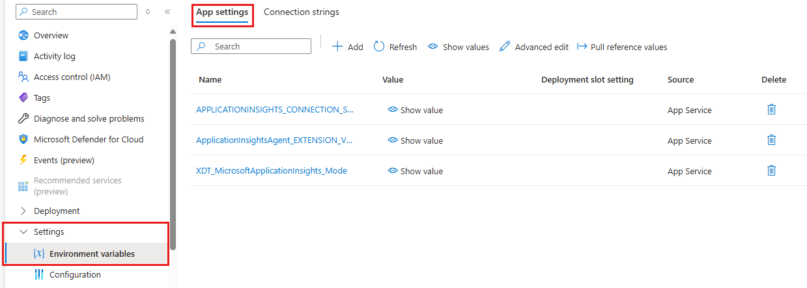
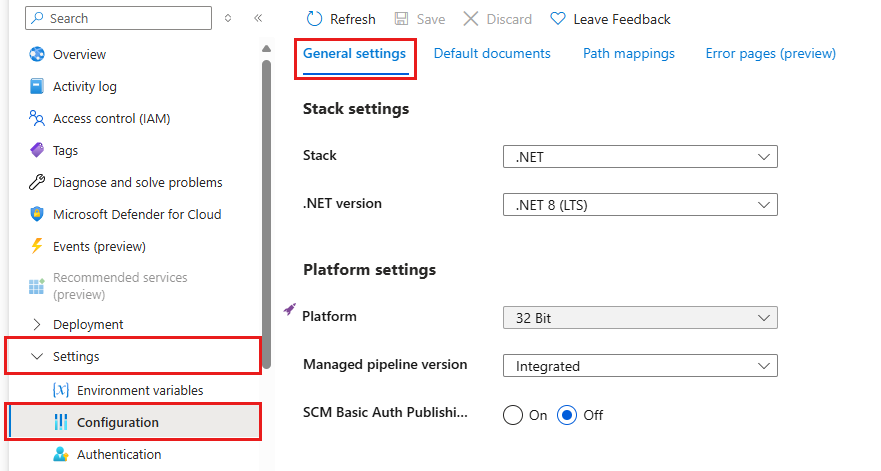
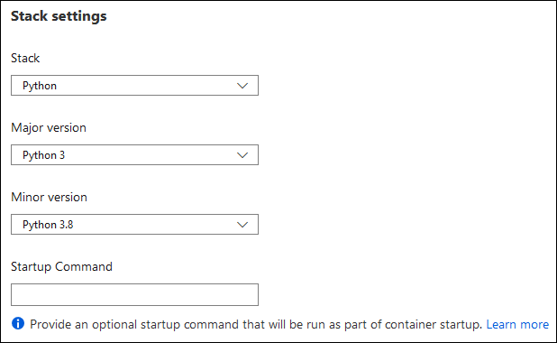
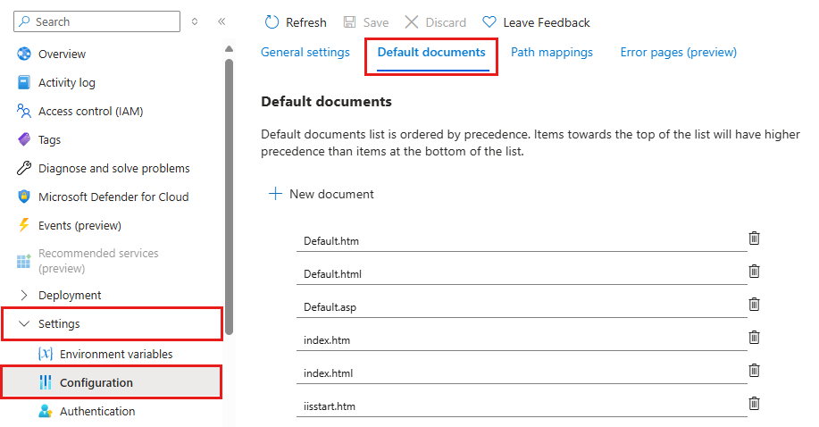
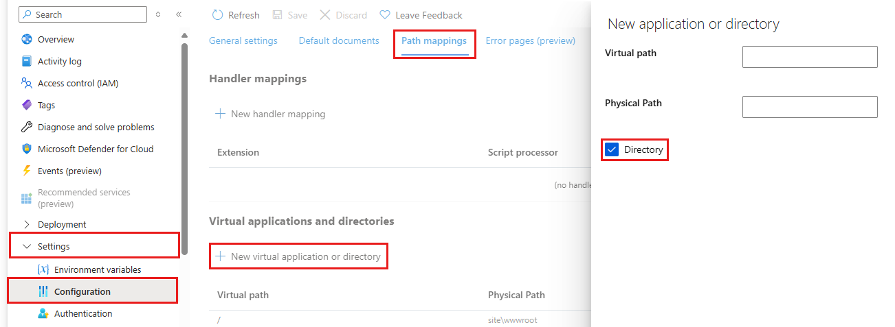
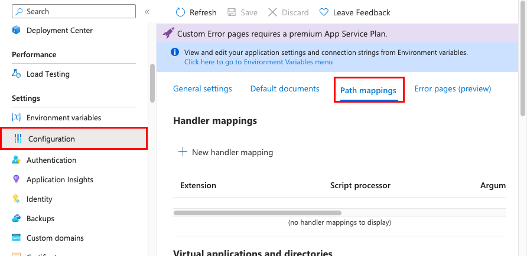

# Configure an App Service app

This article explains how to configure common settings for web apps, mobile back end, or API app. For Azure Functions, see [App settings reference for Azure Functions](../azure-functions/functions-app-settings.md).

## Configure app settings

In App Service, app settings are variables passed as environment variables to the application code. For Linux apps and custom containers, App Service passes app settings to the container using the `--env` flag to set the environment variable in the container. In either case, they're injected into your app environment at app startup. When you add, remove, or edit app settings, App Service triggers an app restart. 

For ASP.NET and ASP.NET Core developers, setting app settings in App Service are like setting them in `<appSettings>` in *Web.config* or *appsettings.json*, but the values in App Service override the ones in *Web.config* or *appsettings.json*. You can keep development settings (for example, local MySQL password) in *Web.config* or *appsettings.json* and production secrets (for example, Azure MySQL database password) safely in App Service. The same code uses your development settings when you debug locally, and it uses your production secrets when deployed to Azure.

Other language stacks, likewise, get the app settings as environment variables at runtime. For language-stack specific steps, see:

- [ASP.NET Core](configure-language-dotnetcore.md#access-environment-variables)
- [Node.js](configure-language-nodejs.md#access-environment-variables)
- [PHP](configure-language-php.md#access-environment-variables)
- [Python](configure-language-python.md#access-app-settings-as-environment-variables)
- [Java](configure-language-java.md#configure-data-sources)
- [Ruby](configure-language-ruby.md#access-environment-variables)
- [Custom containers](configure-custom-container.md#configure-environment-variables)

App settings are always encrypted when stored (encrypted-at-rest).

> [!NOTE]
> App settings can also be resolved from [Key Vault](../key-vault/index.yml) using [Key Vault references](app-service-key-vault-references.md).

# [Azure portal](#tab/portal)

1. In the [Azure portal], search for and select **App Services**, and then select your app. 

    

1. In the app's left menu, select **Configuration** > **Application settings**.

    

    By default, values for app settings are hidden in the portal for security. To see a hidden value of an app setting, select its **Value** field. To see the hidden values of all app settings, select the **Show values** button.

1. To add a new app setting, select **New application setting**. To edit a setting, select the **Edit** button on the right side.

1. In the dialog, you can [stick the setting to the current slot](deploy-staging-slots.md#which-settings-are-swapped).

    App setting names can't contain periods (`.`). If an app setting contains a period, the period is replaced with an underscore in the container.

    > [!NOTE]
    > In a default Linux app service or a custom Linux container, any nested JSON key structure in the app setting name like `ApplicationInsights:InstrumentationKey` needs to be configured in App Service as `ApplicationInsights__InstrumentationKey` for the key name. In other words, any `:` should be replaced by `__` (double underscore).
    >

1. When finished, select **Update**. Don't forget to select **Save** back in the **Configuration** page.

# [Azure CLI](#tab/cli)

Add or edit an app setting with [az webapp config app settings set](/cli/azure/webapp/config/appsettings#az-webapp-config-appsettings-set):

```azurecli-interactive
az webapp config appsettings set --name <app-name> --resource-group <group-name> --settings <setting-name>="<value>"
```
    
Replace `<setting-name>` with the name of the setting, and `<value>` with the value to assign to it.
        
Show all settings and their values with [az webapp config appsettings list](/cli/azure/webapp/config/appsettings#az-webapp-config-appsettings-list):
    
```azurecli-interactive
az webapp config appsettings list --name <app-name> --resource-group <group-name>
```
    
Remove one or more settings with [az webapp config app settings delete](/cli/azure/webapp/config/appsettings#az-webapp-config-appsettings-delete):

```azurecli-interactive
az webapp config appsettings delete --name <app-name> --resource-group <group-name> --setting-names {<setting-name1>,<setting-name2>,...}
```

# [Azure PowerShell](#tab/ps)

Set one or more app settings with [Set-AzWebApp](/powershell/module/az.websites/set-azwebapp):

```azurepowershell-interactive
Set-AzWebApp -ResourceGroupName <group-name> -Name <app-name> -AppSettings @{"<setting-name1>"="<value1>"; "<setting-name2>"="<value2>";...}
```

This cmdlet replaces the entire set of app settings with the ones you specify. To add or edit an app setting within an existing set, include the existing app settings in your input Hashtable by using the [Get-AzWebApp](/powershell/module/az.websites/get-azwebapp) cmdlet. For example:

```azurepowershell-interactive
# Get app configuration
$webapp=Get-AzWebApp -ResourceGroupName <group-name> -Name <app-name>

# Copy app settings to a new Hashtable
$appSettings = @{}
ForEach ($item in $webapp.SiteConfig.AppSettings) {
$appSettings[$item.Name] = $item.Value
}

# Add or edit one or more app settings
$appSettings['<setting-name1>'] = '<value1>'
$appSettings['<setting-name2>'] = '<value2>'

# Save changes
Set-AzWebApp -ResourceGroupName <group-name> -Name <app-name> -AppSettings $appSettings
```

To check if an app setting is slot-specific, use [Get-AzWebAppSlotConfigName](/powershell/module/az.websites/get-azwebappslotconfigname):

```azurepowershell-interactive
Get-AzWebAppSlotConfigName -ResourceGroupName <group-name> -Name <app-name> | select AppSettingNames
```

To make one or more app settings slot-specific, use [Set-AzWebAppSlotConfigName](/powershell/module/az.websites/set-azwebappslotconfigname):

```azurepowershell-interactive
Set-AzWebAppSlotConfigName -ResourceGroupName <group-name> -Name <app-name> -AppSettingNames <setting-name1>,<setting-name2>,...
```

-----

### Edit app settings in bulk

# [Azure portal](#tab/portal)

Select the **Advanced edit** button. Edit the settings in the text area. When finished, select **Update**. Don't forget to select **Save** back in the **Configuration** page.

App settings have the following JSON formatting:

```json
[
  {
    "name": "<key-1>",
    "value": "<value-1>",
    "slotSetting": false
  },
  {
    "name": "<key-2>",
    "value": "<value-2>",
    "slotSetting": false
  },
  ...
]
```

# [Azure CLI](#tab/cli)

Run [az webapp config app settings set](/cli/azure/webapp/config/appsettings#az-webapp-config-appsettings-set) with the name of the JSON file. 

```azurecli-interactive
az webapp config appsettings set --resource-group <group-name> --name <app-name> --settings "@fileName.json"
```

> [!TIP] 
> Wrapping the file name with quotes is only required in PowerShell.

 The file format needed is a JSON array of settings where the slot setting field is optional. For example:

```json
[
  {
    "name": "key1",
    "slotSetting": false,
    "value": "value1"
  },
  {
    "name": "key2",
    "value": "value2"
  }
]
```

For convenience, you can save existing settings into a JSON file with [az webapp config appsettings list](/cli/azure/webapp/config/appsettings#az-webapp-config-appsettings-list). The following example can be run in Bash.
    
```azurecli-interactive
# Save the settings
az webapp config appsettings list --name <app-name> --resource-group <group-name> > settings.json

# Edit the JSON file
...

# Update the app with the JSON file
az webapp config appsettings set --resource-group <group-name> --name <app-name> --settings @settings.json
```

# [Azure PowerShell](#tab/ps)

It's not possible to edit app settings in bulk by using a JSON file with Azure PowerShell.

-----

## Configure connection strings

In the [Azure portal], search for and select **App Services**, and then select your app. In the app's left menu, select **Configuration** > **Application settings**.


For ASP.NET and ASP.NET Core developers, setting connection strings in App Service are like setting them in `<connectionStrings>` in *Web.config*, but the values you set in App Service override the ones in *Web.config*. You can keep development settings (for example, a database file) in *Web.config* and production secrets (for example, SQL Database credentials) safely in App Service. The same code uses your development settings when you debug locally, and it uses your production secrets when deployed to Azure.

For other language stacks, it's better to use [app settings](#configure-app-settings) instead, because connection strings require special formatting in the variable keys in order to access the values. 

> [!NOTE]
> There is one case where you may want to use connection strings instead of app settings for non-.NET languages: certain Azure database types are backed up along with the app _only_ if you configure a connection string for the database in your App Service app. For more information, see [Create a custom backup](manage-backup.md#create-a-custom-backup). If you don't need this automated backup, then use app settings.

At runtime, connection strings are available as environment variables, prefixed with the following connection types:

* SQLServer: `SQLCONNSTR_`  
* MySQL: `MYSQLCONNSTR_` 
* SQLAzure: `SQLAZURECONNSTR_` 
* Custom: `CUSTOMCONNSTR_`
* PostgreSQL: `POSTGRESQLCONNSTR_`  

For example, a MySQL connection string named *connectionstring1* can be accessed as the environment variable `MYSQLCONNSTR_connectionString1`. For language-stack specific steps, see:

- [ASP.NET Core](configure-language-dotnetcore.md#access-environment-variables)
- [Node.js](configure-language-nodejs.md#access-environment-variables)
- [PHP](configure-language-php.md#access-environment-variables)
- [Python](configure-language-python.md#access-environment-variables)
- [Java](configure-language-java.md#configure-data-sources)
- [Ruby](configure-language-ruby.md#access-environment-variables)
- [Custom containers](configure-custom-container.md#configure-environment-variables)

Connection strings are always encrypted when stored (encrypted-at-rest).

> [!NOTE]
> Connection strings can also be resolved from [Key Vault](../key-vault/index.yml) using [Key Vault references](app-service-key-vault-references.md).

# [Azure portal](#tab/portal)

1. In the [Azure portal], search for and select **App Services**, and then select your app. 

    

1. In the app's left menu, select **Configuration** > **Application settings**.

    

    By default, values for connection strings are hidden in the portal for security. To see a hidden value of a connection string, select its **Value** field. To see the hidden values of all connection strings, select the **Show value** button.

1. To add a new connection string, select **New connection string**. To edit a connection string, select the **Edit** button on the right side.

1. In the dialog, you can [stick the connection string to the current slot](deploy-staging-slots.md#which-settings-are-swapped).

1. When finished, select **Update**. Don't forget to select **Save** back in the **Configuration** page.

# [Azure CLI](#tab/cli)

Add or edit an app setting with [az webapp config connection-string set](/cli/azure/webapp/config/connection-string#az-webapp-config-connection-string-set):

```azurecli-interactive
az webapp config connection-string set --name <app-name> --resource-group <group-name> --connection-string-type <type> --settings <string-name>='<value>'
```
    
Replace `<string-name>` with the name of the connection string, and `<value>` with the value to assign to it. For possible values of `<type>` (for example, `SQLAzure`), see the [CLI command documentation](/cli/azure/webapp/config/connection-string#az-webapp-config-connection-string-set).

Show all connection strings and their values with [az webapp config connection-string list](/cli/azure/webapp/config/connection-string#az-webapp-config-connection-string-list):
    
```azurecli-interactive
az webapp config connection-string list --name <app-name> --resource-group <group-name>
```
    
Remove one or more connection strings with [az webapp config connection-string delete](/cli/azure/webapp/config/appsettings#az-webapp-config-appsettings-delete):

```azurecli-interactive
az webapp config connection-string delete --name <app-name> --resource-group <group-name> --setting-names {<string-name1>,<string-name2>,...}
```

# [Azure PowerShell](#tab/ps)

Set one or more connection strings with [Set-AzWebApp](/powershell/module/az.websites/set-azwebapp):

```azurepowershell-interactive
$PropertiesObject = @{
  "<string-name1>" = @{
    value="<connection-string1>";
    type="<type>"};
  "<string-name2>" = @{
    value="<connection-string2>";
    type="<type>"}
}

Set-AzWebApp -ResourceGroupName <group-name> -Name <app-name> -ConnectionStrings $PropertiesObject
```

Each connection string contains a name (`<string-name1>`), a value (`<connection-string1>`), and the type, which is a numerical value that corresponds to one of the [ConnectionStringType](/dotnet/api/microsoft.azure.management.websites.models.connectionstringtype) enum fields. For example, For SQL Azure, specify `type="2"`.

This cmdlet replaces the entire set of connection strings with the ones you specify. To add or edit an app setting within an existing set, include the existing app settings in your input hashtable by using the [Get-AzWebApp](/powershell/module/az.websites/get-azwebapp) cmdlet. For example:

```azurepowershell-interactive
# Get app configuration
$webapp=Get-AzWebApp -ResourceGroupName <group-name> -Name <app-name>

# Copy connection strings to a new hashtable
$connStrings = @{}
ForEach ($item in $webapp.SiteConfig.ConnectionStrings) {
$connStrings[$item.Name] = @{value=$item.Value; type=item.Type}
}

# Add or edit one or more connection strings
$connStrings['<string-name1>'] = @{value='<connection-string1>', type='<type>'}
$connStrings['<string-name2>'] = @{value='<connection-string2>', type='<type>'}

# Save changes
Set-AzWebApp -ResourceGroupName <group-name> -Name <app-name> -ConnectionStrings $connStrings
```

To check if a connection string is slot-specific, use [Get-AzWebAppSlotConfigName](/powershell/module/az.websites/get-azwebappslotconfigname):

```azurepowershell-interactive
Get-AzWebAppSlotConfigName -ResourceGroupName <group-name> -Name <app-name> | select ConnectionStringNames
```

To make one or more connection strings slot-specific, use [Set-AzWebAppSlotConfigName](/powershell/module/az.websites/set-azwebappslotconfigname):

```azurepowershell-interactive
Set-AzWebAppSlotConfigName -ResourceGroupName <group-name> -Name <app-name> -ConnectionStringNames <string-name1>,<string-name2>,...
```

-----

### Edit connection strings in bulk

# [Azure portal](#tab/portal)

Select the **Advanced edit** button. Edit the connection strings in the text area. When finished, select **Update**. Don't forget to select **Save** back in the **Configuration** page.

Connection strings have the following JSON formatting:

```json
[
  {
    "name": "name-1",
    "value": "conn-string-1",
    "type": "SQLServer",
    "slotSetting": false
  },
  {
    "name": "name-2",
    "value": "conn-string-2",
    "type": "PostgreSQL",
    "slotSetting": false
  },
  ...
]
```

# [Azure CLI](#tab/cli)

Run [az webapp config connection-string set](/cli/azure/webapp/config/connection-string#az-webapp-config-connection-string-set) with the name of the JSON file. 

```azurecli-interactive
az webapp config connection-string set --resource-group <group-name> --name <app-name> --settings "@fileName.json"
```

> [!TIP] 
> Wrapping the file name with quotes is only required in PowerShell.

The file format needed is a JSON array of connection strings where the slot setting field is optional. For example:

```json
[
  {
    "name": "name-1",
    "value": "conn-string-1",
    "type": "SQLServer",
    "slotSetting": false
  },
  {
    "name": "name-2",
    "value": "conn-string-2",
    "type": "PostgreSQL",
  },
  ...
]
```

For convenience, you can save existing connection strings into a JSON file with [az webapp config connection-string list](/cli/azure/webapp/config/connection-string#az-webapp-config-connection-string-list). The following example can be run in Bash.
    
```azurecli-interactive
# Save the connection strings
az webapp config connection-string list --resource-group <group-name> --name <app-name> > settings.json

# Edit the JSON file
...

# Update the app with the JSON file
az webapp config connection-string set --resource-group <group-name> --name <app-name> --settings @settings.json
```

# [Azure PowerShell](#tab/ps)

It's not possible to edit connection strings in bulk by using a JSON file with Azure PowerShell.

-----

<a name="platform"></a>

## Configure language stack settings

- [ASP.NET Core](configure-language-dotnetcore.md)
- [Node.js](configure-language-nodejs.md)
- [PHP](configure-language-php.md)
- [Python](configure-language-python.md)
- [Java](configure-language-java.md)
- [Ruby](configure-language-ruby.md)

<a name="alwayson"></a>

## Configure general settings

# [Azure portal](#tab/portal)

In the [Azure portal], search for and select **App Services**, and then select your app. In the app's left menu, select **Configuration** > **General settings**.



Here, you can configure some common settings for the app. Some settings require you to [scale up to higher pricing tiers](manage-scale-up.md).

- **Stack settings**: The software stack to run the app, including the language and SDK versions.

    For Linux apps, you can select the language runtime version and set an optional **Startup command** or a startup command file.

    

- **Platform settings**: Lets you configure settings for the hosting platform, including:
    - **Platform bitness**: 32-bit or 64-bit. For Windows apps only. 
    - **FTP state**: Allow only FTPS or disable FTP altogether.
    - **HTTP version**: Set to **2.0** to enable support for [HTTPS/2](https://wikipedia.org/wiki/HTTP/2) protocol.
    > [!NOTE]
    > Most modern browsers support HTTP/2 protocol over TLS only, while non-encrypted traffic continues to use HTTP/1.1. To ensure that client browsers connect to your app with HTTP/2, secure your custom DNS name. For more information, see [Secure a custom DNS name with a TLS/SSL binding in Azure App Service](configure-ssl-bindings.md).
    - **Web sockets**: For [ASP.NET SignalR] or [socket.io](https://socket.io/), for example.
    - **Always On**: Keeps the app loaded even when there's no traffic. When **Always On** isn't turned on (default), the app is unloaded after 20 minutes without any incoming requests. The unloaded app can cause high latency for new requests because of its warm-up time. When **Always On** is turned on, the front-end load balancer sends a GET request to the application root every five minutes. The continuous ping prevents the app from being unloaded.
    
        Always On is required for continuous WebJobs or for WebJobs that are triggered using a CRON expression.
    - **ARR affinity**: In a multi-instance deployment, ensure that the client is routed to the same instance for the life of the session. You can set this option to **Off** for stateless applications.
    - **HTTPS Only**: When enabled, all HTTP traffic is redirected to HTTPS.
    - **Minimum TLS version**: Select the minimum TLS encryption version required by your app.
- **Debugging**: Enable remote debugging for [ASP.NET](troubleshoot-dotnet-visual-studio.md#remotedebug), [ASP.NET Core](/visualstudio/debugger/remote-debugging-azure), or [Node.js](configure-language-nodejs.md#debug-remotely) apps. This option turns off automatically after 48 hours.
- **Incoming client certificates**: require client certificates in [mutual authentication](app-service-web-configure-tls-mutual-auth.md).

# [Azure CLI](#tab/cli)

You can set many of the common configurable options using [az webapp config set](/cli/azure/webapp/config#az-webapp-config-set). The following example shows a subset of the configurable options.

```azurecli-interactive
az webapp config set --resource-group <group-name> --name <app-name> --use-32bit-worker-process [true|false] --web-sockets-enabled [true|false] --always-on [true|false]--http20-enabled --auto-heal-enabled [true|false] --remote-debugging-enabled [true|false] --number-of-workers
```

To show the existing settings, use the [az webapp config show](/cli/azure/webapp/config#az-webapp-config-show) command.

# [Azure PowerShell](#tab/ps)

You can set many of the common configurable options using [Set-AzWebApp](/powershell/module/az.websites/set-azwebapp). The following example shows a subset of the configurable options.

```azurecli-interactive
Set-AzWebApp -ResourceGroupName <group-name> -Name <app-name> -Use32BitWorkerProcess [True|False] -WebSocketsEnabled [True|False] -AlwaysOn [True|False] -NumberOfWorkers
```

To show the existing settings, use the [Get-AzWebApp](/powershell/module/az.websites/get-azwebapp) command.

-----
## Configure default documents

This setting is only for Windows apps.

The default document is the web page that's displayed at the root URL of an App Service app. The first matching file in the list is used. If the app uses modules that route based on URL instead of serving static content, there's no need for default documents.

# [Azure portal](#tab/portal)

1. In the [Azure portal], search for and select **App Services**, and then select your app. 
1. In the app's left menu, select **Configuration** > **Default documents**.

    

1. To add a default document, select **New document**. To remove a default document, select **Delete** to its right.

# [Azure CLI](#tab/cli)

Add a default document by using [az resource update](/cli/azure/resource#az-resource-update):

```azurecli-interactive
az resource update --resource-group <group-name> --resource-type "Microsoft.Web/sites/config" --name <app-name>/config/web --add properties.defaultDocuments <filename>
```

# [Azure PowerShell](#tab/ps)

Add a default document by modifying the updating app's PowerShell object:

```azurepowershell-interactive
$webapp = Get-AzWebApp -ResourceGroupName <group-name> -Name <app-name>
$webapp.SiteConfig.DefaultDocuments.Add("<filename>")
Set-AzWebApp $webapp
```

-----

<a name="redirect-to-a-custom-directory" aria-hidden="true"></a>

## Map a URL path to a directory

By default, App Service starts your app from the root directory of your app code. But certain web frameworks don't start in the root directory. For example, [Laravel](https://laravel.com/) starts in the `public` subdirectory. Such an app would be accessible at `http://contoso.com/public`, for example, but you typically want to direct `http://contoso.com` to the `public` directory instead. If your app's startup file is in a different folder, or if your repository has more than one application, you can edit or add virtual applications and directories.

# [Azure portal](#tab/portal)

1. In the [Azure portal], search for and select **App Services**, and then select your app. 
1. In the app's left menu, select **Configuration** > **Path mappings**
1. Select **New virtual application or directory**. 

    - To map a virtual directory to a physical path, leave the **Directory** check box selected. Specify the virtual directory and the corresponding relative (physical) path to the website root (`D:\home`).
    - To mark a virtual directory as a web application, clear the **Directory** check box.
      
    

1. Select **OK**.

# [Azure CLI](#tab/cli)

The following example sets the root path `/` to the `public` subdirectory (which works for Laravel), and also adds a second virtual application at the `/app2` path. To run it, create a file called `json.txt` with the following contents.

```txt
[
  {
    "physicalPath"':' "site\\wwwroot\\public",
    "preloadEnabled"':' false,
    "virtualDirectories"':' null,
    "virtualPath"':' "/"
  },
  {
    "physicalPath"':' "site\\wwwroot\\app2",
    "preloadEnabled"':' false,
    "virtualDirectories"':' null,
    "virtualPath"':' "/app2"
  }
]
```

Change `<group-name>` and `<app-name>` for your resources and run the following command. Be aware of escape characters when running this command. For more information on escape characters, see [Tips for using the Azure CLI successfully](/cli/azure/use-cli-effectively).

```azurecli-interactive
az resource update --resource-group <group-name> --resource-type Microsoft.Web/sites/config --name <app-name>/config/web --set properties.virtualApplications="@json.txt"
```

# [Azure PowerShell](#tab/ps)

The following example sets the root path `/` to the `public` subdirectory (which works for Laravel), and also adds a second virtual application at the `/app2` path. To run it, change `<group-name>` and `<app-name>`.

```azurepowershell-interactive
$webapp=Get-AzWebApp -ResourceGroupName <group-name> -Name <app-name>

# Set default / path to public subdirectory
$webapp.SiteConfig.VirtualApplications[0].PhysicalPath= "site\wwwroot\public"

# Add a virtual application
$virtualApp = New-Object Microsoft.Azure.Management.WebSites.Models.VirtualApplication
$virtualApp.VirtualPath = "/app2"
$virtualApp.PhysicalPath = "site\wwwroot\app2"
$virtualApp.PreloadEnabled = $false
$webapp.SiteConfig.VirtualApplications.Add($virtualApp)

# Save settings
Set-AzWebApp $webapp
```

-----

## Configure handler mappings

For Windows apps, you can customize the IIS handler mappings and virtual applications and directories. Handler mappings let you add custom script processors to handle requests for specific file extensions. 

To add a custom handler:

1. In the [Azure portal], search for and select **App Services**, and then select your app. 
1. In the app's left menu, select **Configuration** > **Path mappings**.

    

1. Select **New handler mapping**. Configure the handler as follows:

    - **Extension**. The file extension you want to handle, such as *\*.php* or *handler.fcgi*.
    - **Script processor**. The absolute path of the script processor to you. Requests to files that match the file extension are processed by the script processor. Use the path `D:\home\site\wwwroot` to refer to your app's root directory.
    - **Arguments**. Optional command-line arguments for the script processor.

1. Select **OK**.

## Configure custom containers

- [Configure a custom container for Azure App Service](configure-custom-container.md)
- [Add custom storage for your containerized app](configure-connect-to-azure-storage.md)

## Next steps

- [Environment variables and app settings reference](reference-app-settings.md)
- [Configure a custom domain name in Azure App Service]
- [Set up staging environments in Azure App Service]
- [Secure a custom DNS name with a TLS/SSL binding in Azure App Service](configure-ssl-bindings.md)
- [Enable diagnostic logs](troubleshoot-diagnostic-logs.md)
- [Scale an app in Azure App Service]
- [Monitoring basics in Azure App Service]
- [Change applicationHost.config settings with applicationHost.xdt](https://github.com/projectkudu/kudu/wiki/Xdt-transform-samples)

<!-- URL List -->

[ASP.NET SignalR]: https://www.asp.net/signalr
[Azure portal]: https://portal.azure.com/
[Configure a custom domain name in Azure App Service]: ./app-service-web-tutorial-custom-domain.md
[Set up staging environments in Azure App Service]: ./deploy-staging-slots.md
[How to: Monitor web endpoint status]: ./web-sites-monitor.md
[Monitoring basics in Azure App Service]: ./web-sites-monitor.md
[pipeline mode]: https://www.iis.net/learn/get-started/introduction-to-iis/introduction-to-iis-architecture#Application
[Scale an app in Azure App Service]: ./manage-scale-up.md
