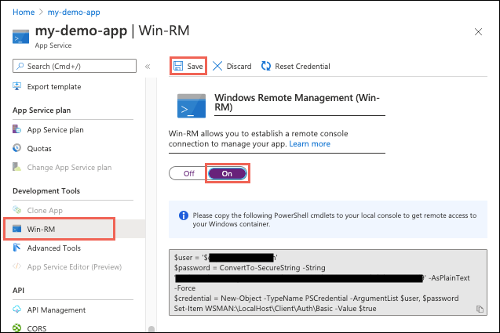

# Configure a custom container for Azure App Service

This article shows you how to configure a custom container to run on Azure App Service.

This guide provides key concepts and instructions for containerization of Windows or Linux apps in App Service. If you've never used Azure App Service, follow the [custom container quickstart](quickstart-custom-container.md) and [tutorial](tutorial-custom-container.md) first. For Linux, there's also a [multi-container app quickstart](quickstart-multi-container.md) and [tutorial](tutorial-multi-container-app.md).

## I don't see the updated container

If you change your Docker container settings to point to a new container, it may take a few minutes before the app serves HTTP requests from the new container. While the new container is being pulled and started, App Service continues to serve requests from the old container. Only when the new container is started and ready to receive requests does App Service start sending requests to it.

## How container images are stored

The first time you run a custom Docker image in App Service, App Service does a `docker pull` and pulls all image layers. These layers are stored on disk, like if you were using Docker on-premises. Each time the app restarts, App Service does a `docker pull`, but only pulls layers that have changed. If there have been no changes, App Service uses existing layers on the local disk.

If the app changes compute instances for any reason, such as scaling up and down the pricing tiers, App Service must pull down all layers again. The same is true if you scale out to add additional instances. There are also rare cases where the app instances may change without a scale operation.

## Configure port number

By default, App Service assumes your custom container is listening on port 80. The web server in your custom image may use a port other than 80. You tell Azure about the port that your custom container uses by using the `WEBSITES_PORT` app setting. The GitHub page for the [Python sample in this tutorial](https://github.com/Azure-Samples/docker-django-webapp-linux) shows that you need to set `WEBSITES_PORT` to _8000_. You can set it by running [`az webapp config appsettings set`](/cli/azure/webapp/config/appsettings?view=azure-cli-latest#az-webapp-config-appsettings-set) command in the Cloud Shell. For example:

```azurecli-interactive
az webapp config appsettings set --resource-group <resource-group-name> --name <app-name> --settings WEBSITES_PORT=8000
```

App Service currently allows your container to expose only one port for HTTP requests. 

## Configure environment variables

Your custom container may use environment variables that need to be supplied externally. You can pass them in by running [`az webapp config appsettings set`](/cli/azure/webapp/config/appsettings?view=azure-cli-latest#az-webapp-config-appsettings-set) command in the Cloud Shell. For example:

```azurecli-interactive
az webapp config appsettings set --resource-group <resource-group-name> --name <app-name> --settings DB_HOST="myownserver.mysql.database.azure.com"
```

When your app runs, App Service injects the app setting into the process as an environment variable automatically. This method works both for single-container apps or multi-container apps (Linux), where the environment variables are specified in the *docker-compose.yml* file.

## Use persistent shared storage

You can use the */home* directory in your app's file system to persist files across restarts and share them across instances. The `/home` in your app is provided to enable your container app to access persistent storage.

When persistent storage is disabled, then writes to the `/home` directory aren't persisted across app restarts or across multiple instances. The only exception is the `/home/LogFiles` directory, which is used to store the Docker and container logs. When persistent storage is enabled, all writes to the `/home` directory are persisted and can be accessed by all instances of a scaled-out app.

By default, persistent storage is *enabled* and the setting is not exposed in the Application Settings. To disable it, set the `WEBSITES_ENABLE_APP_SERVICE_STORAGE` app setting by running [`az webapp config appsettings set`](/cli/azure/webapp/config/appsettings?view=azure-cli-latest#az-webapp-config-appsettings-set) command in the Cloud Shell. For example:

```azurecli-interactive
az webapp config appsettings set --resource-group <resource-group-name> --name <app-name> --settings WEBSITES_ENABLE_APP_SERVICE_STORAGE=false
```

> [!NOTE]
> You can also [configure your own persistent storage](configure-connect-to-azure-storage.md).

## Detect HTTPS session

App Service terminates TLS/SSL at the front ends. That means that TLS/SSL requests never get to your app. You don't need to, and shouldn't implement any support for TLS/SSL into your app. 

The front ends are located inside Azure data centers. If you use TLS/SSL with your app, your traffic across the Internet will always be safely encrypted.

::: zone pivot="container-windows"

## Connect to container with Win-RM

You can connect to your Windows container remotely for administrative tasks use Win-RM. Follow the steps below to enable it:

1. In the [Azure portal](https://portal.azure.com), navigate to your App Service app.
1. From your app's left navigation, select **Win-RM** > **On** and click **Save**.

    
1. Confirm the selection by clicking **Yes**.

1. From your app's left navigation, select **Overview** > **Restart**.

The Win-RM page shows you the PowerShell commands to run on your local machine in order to connect to your Windows container. However, you can also just run the following PowerShell command in the [Cloud Shell PowerShell window](../cloud-shell/quickstart-powershell.md):

```azurepowershell-interactive
Enter-AzureRmWebAppContainerPSSession -ResourceGroupName <group-name> -Name <app-name>
```

> [!NOTE]
> Any change you make to the container within the WinRM session does *not* persist when your app is restarted (except for changes in a [persistent shared storage](#use-persistent-shared-storage)), because it's not part of the Docker image. When your app restarts, App Service recreates the Docker container from your deployed image. 
>
> To persist your changes, such as registry settings and software installation, you need to make them in the Dockerfile for your image. For example, in the tutorial [Migrate custom software to Azure App Service using a custom container](tutorial-custom-container.md?pivots=container-windows), the custom font project uses this method to [install a custom font in Dockerfile](tutorial-custom-container.md?pivots=container-windows#configure-windows-container).

## Access diagnostic logs

App Service logs actions by the Docker host as well as activities from within the container. There are several ways to access Docker logs:

- [In Azure portal](#in-azure-portal)
- [From the Kudu console](#from-the-kudu-console)
- [With the Kudu API](#with-the-kudu-api)

### In Azure portal

Docker logs are displayed in the portal, in the **Container Settings** page of your app. The logs are truncated, but you can download all the logs clicking **Download**. 

### From the Kudu console 

Navigate to `https://<app-name>.scm.azurewebsites.net/DebugConsole` and click the **LogFiles** folder to see the individual log files. To download the entire **LogFiles** directory, click the **Download** icon to the left of the directory name. You can also access this folder using an FTP client.

The naming convention for the Docker log is YYYY_MM_DD_RDxxxxxxxxxxxx_docker.log. If you try to download the Docker log that is currently in use using an FTP client, you may get an error because of a file lock.

### With the Kudu API

Navigate directly to `https://<app-name>.scm.azurewebsites.net/api/logs/docker` to see metadata for the Docker logs. You may see more than one log file listed, and the `href` property lets you download the log file directly. 

To download all the logs together in one ZIP file, access `https://<app-name>.scm.azurewebsites.net/api/logs/docker/zip`.

## Customize container memory

By default all Windows Containers deployed in Azure App Service are limited to 1 GB RAM. You can change this value by providing the `WEBSITE_MEMORY_LIMIT_MB` app setting. You can set it by running [`az webapp config appsettings set`](/cli/azure/webapp/config/appsettings?view=azure-cli-latest#az-webapp-config-appsettings-set) command in the Cloud Shell. For example:

```azurecli-interactive
az webapp config appsettings set --resource-group <resource-group-name> --name <app-name> --settings WEBSITE_MEMORY_LIMIT_MB=2000
```

The value is defined in MB and must be less and equal to the total physical memory of the host.

## Customize the number of compute cores

By default, a Windows container runs with all available cores for your chosen pricing tier. You may want to reduce the number of cores that your staging slot uses, for example. To reduce the number of cores used by a container, set the `WEBSITE_CPU_CORES_LIMIT` app setting to the preferred number of cores. You can set it by running [`az webapp config appsettings set`](/cli/azure/webapp/config/appsettings?view=azure-cli-latest#az-webapp-config-appsettings-set) command in the Cloud Shell. For example:

```azurecli-interactive
az webapp config appsettings set --resource-group <resource-group-name> --name <app-name> --slot staging --settings WEBSITE_CPU_CORES_LIMIT=1
```

> [!NOTE]
> Updating the app setting triggers automatic restart, causing minimal downtime. For a production app, consider swapping it into a staging slot, change the app setting in the staging slot, and then swap it back into production.

Verify your adjusted number by going to the Kudu Console (`https://<app-name>.scm.azurewebsites.net`) and typing in the following commands using PowerShell. Each command outputs a number.

```PowerShell
Get-ComputerInfo | ft CsNumberOfLogicalProcessors # Total number of enabled logical processors. Disabled processors are excluded.
Get-ComputerInfo | ft CsNumberOfProcessors # Number of physical processors.
```

The processors may be multicore or hyperthreading processors. Information on how many cores are available per SKU can be found in [](https://azure.microsoft.com/en-us/pricing/details/app-service/windows/), in the **Premium Container (Windows) Plan** section.

## Customize health ping behavior

App Service considers a container to be successfully started when the container starts and responds to an HTTP ping. If the container starts but does not respond to a ping after a certain amount of time, App Service logs an event in the Docker log, saying that the container didn't start. 

If your application is resource-intensive, the container might not respond to the HTTP ping in time. To control the actions when HTTP pings fail, set the `CONTAINER_AVAILABILITY_CHECK_MODE` app setting. You can set it by running [`az webapp config appsettings set`](/cli/azure/webapp/config/appsettings?view=azure-cli-latest#az-webapp-config-appsettings-set) command in the Cloud Shell. For example:

```azurecli-interactive
az webapp config appsettings set --resource-group <resource-group-name> --name <app-name> --settings CONTAINER_AVAILABILITY_CHECK_MODE="ReportOnly"
```

The following table shows the possible values:

| Value | Descriptions |
| - | - |
| **Repair** | The default value. Restart the container after three consecutive availability checks |
| **ReportOnly** | Don't restart the container but report in the Docker logs for the container after three consecutive availability checks. |
| **Off** | Don't check for availability. |

::: zone-end

::: zone pivot="container-linux"

## Enable SSH

SSH enables secure communication between a container and a client. In order for a custom container to support SSH, you must add it into the Dockerfile itself.

> [!TIP]
> All built-in Linux containers have added the SSH instructions in their image repositories. You can go through the following instructions with the [Node.js 10.14 repository](https://github.com/Azure-App-Service/node/blob/master/10.14) to see how it's enabled there.

- Use the [RUN](https://docs.docker.com/engine/reference/builder/#run) instruction to install the SSH server and set the password for the root account to `"Docker!"`. For example, for an image based on [Alpine Linux](https://hub.docker.com/_/alpine), you need the following commands:

    ```Dockerfile
    RUN apk add openssh \
         && echo "root:Docker!" | chpasswd 
    ```

    This configuration doesn't allow external connections to the container. SSH is available only through `https://<app-name>.scm.azurewebsites.net` and authenticated with the publishing credentials.

- Add [this sshd_config file](https://github.com/Azure-App-Service/node/blob/master/10.14/sshd_config) to your image repository, and use the [COPY](https://docs.docker.com/engine/reference/builder/#copy) instruction to copy the file to the */etc/ssh/* directory. For more information about *sshd_config* files, see [OpenBSD documentation](https://man.openbsd.org/sshd_config).

    ```Dockerfile
    COPY sshd_config /etc/ssh/
    ```

    > [!NOTE]
    > The *sshd_config* file must include the following items:
    > - `Ciphers` must include at least one item in this list: `aes128-cbc,3des-cbc,aes256-cbc`.
    > - `MACs` must include at least one item in this list: `hmac-sha1,hmac-sha1-96`.

- Use the [EXPOSE](https://docs.docker.com/engine/reference/builder/#expose) instruction to open port 2222 in the container. Although the root password is known, port 2222 is inaccessible from the internet. It's accessible only by containers within the bridge network of a private virtual network.

    ```Dockerfile
    EXPOSE 80 2222
    ```

- In the start-up script for your container, start the SSH server.

    ```bash
    /usr/sbin/sshd
    ```

    For an example, see how the default [Node.js 10.14 container](https://github.com/Azure-App-Service/node/blob/master/10.14/startup/init_container.sh) starts the SSH server.

## Access diagnostic logs

[!INCLUDE [Access diagnostic logs](../../includes/app-service-web-logs-access-linux-no-h.md)]

## Change the Docker image of a custom container

To change an existing custom container app from the current Docker image to a new image, use the following command:

```azurecli-interactive
az webapp config container set --name <app-name> --resource-group <group-name> --docker-custom-image-name <docker-hub-repo>/<image>
```

## Use an image from a private registry

To use an image from a private registry, such as Azure Container Registry, run the following command:

```azurecli-interactive
az webapp config container set --name <app-name> --resource-group <group-name> --docker-custom-image-name <image-name> --docker-registry-server-url <private-repo-url> --docker-registry-server-user <username> --docker-registry-server-password <password>
```

For *\<username>* and *\<password>*, supply the login credentials for your private registry account.

## Configure multi-container apps

- [Use persistent storage in Docker Compose](#use-persistent-storage-in-docker-compose)
- [Preview limitations](#preview-limitations)
- [Docker Compose options](#docker-compose-options)

### Use persistent storage in Docker Compose

Multi-container apps like WordPress need persistent storage to function properly. To enable it, your Docker Compose configuration must point to a storage location *outside* your container. Storage locations inside your container don't persist changes beyond app restart.

Enable persistent storage by setting the `WEBSITES_ENABLE_APP_SERVICE_STORAGE` app setting, using the [az webapp config appsettings set](/cli/azure/webapp/config/appsettings?view=azure-cli-latest#az-webapp-config-appsettings-set) command in Cloud Shell.

```azurecli-interactive
az webapp config appsettings set --resource-group <resource-group-name> --name <app-name> --settings WEBSITES_ENABLE_APP_SERVICE_STORAGE=TRUE
```

In your *docker-compose.yml* file, map the `volumes` option to `${WEBAPP_STORAGE_HOME}`. 

`WEBAPP_STORAGE_HOME` is an environment variable in App Service that is mapped to persistent storage for your app. For example:

```yaml
wordpress:
  image: wordpress:latest
  volumes:
  - ${WEBAPP_STORAGE_HOME}/site/wwwroot:/var/www/html
  - ${WEBAPP_STORAGE_HOME}/phpmyadmin:/var/www/phpmyadmin
  - ${WEBAPP_STORAGE_HOME}/LogFiles:/var/log
```

### Preview limitations

Multi-container is currently in preview. The following App Service platform features are not supported:

- Authentication / Authorization
- Managed Identities

### Docker Compose options

The following lists show supported and unsupported Docker Compose configuration options:

#### Supported options

- command
- entrypoint
- environment
- image
- ports
- restart
- services
- volumes

#### Unsupported options

- build (not allowed)
- depends_on (ignored)
- networks (ignored)
- secrets (ignored)
- ports other than 80 and 8080 (ignored)

> [!NOTE]
> Any other options not explicitly called out are ignored in Public Preview.

[!INCLUDE [robots933456](../../includes/app-service-web-configure-robots933456.md)]

::: zone-end

## Next steps

> [!div class="nextstepaction"]
> [Tutorial: Migrate custom software to Azure App Service using a custom container](tutorial-custom-container.md)

::: zone pivot="container-linux"

> [!div class="nextstepaction"]
> [Tutorial: Multi-container WordPress app](tutorial-multi-container-app.md)

::: zone-end
