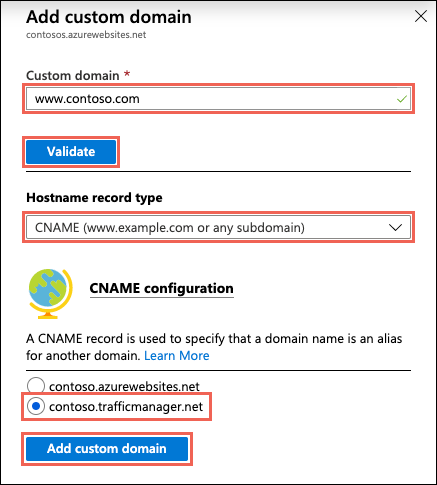

# Configure a custom domain name in Azure App Service with Traffic Manager integration

[!INCLUDE [web-selector](../../includes/websites-custom-domain-selector.md)]

> [!NOTE]
> For Cloud Services, see 
[Configuring a custom domain name for an Azure cloud service](../cloud-services/cloud-services-custom-domain-name-portal.md).

When you use [Azure Traffic Manager](../traffic-manager/index.yml) to load balance traffic to [Azure App Service](overview.md), the App Service app can be accessed using **\<traffic-manager-endpoint>.trafficmanager.net**. You can assign a custom domain name, such as www\.contoso.com, with your App Service app in order to provide a more recognizable domain name for your users.

This article shows you how to configure a custom domain name with an App Service app that's integrated with [Traffic Manager](../traffic-manager/traffic-manager-overview.md).

> [!NOTE]
> Only [CNAME](https://en.wikipedia.org/wiki/CNAME_record) records are supported when you configure a domain name using the Traffic Manager endpoint. Because A records are not supported, a root domain mapping, such as contoso.com is also not supported.
> 

## Prepare the app

To map a custom DNS name to an app that's integrated with Azure Traffic Manager, the web app's [App Service plan](https://azure.microsoft.com/pricing/details/app-service/) must be in **Standard** tier or higher. In this step, you make sure that the App Service app is in the supported pricing tier.

### Check the pricing tier

In the [Azure portal](https://portal.azure.com), search for and select **App Services**.

On the **App Services** page, select the name of your Azure app.

In the left navigation of the app page, select **Scale up (App Service plan)**.

The app's current tier is highlighted by a blue border. Check to make sure that the app is in **Standard** tier or above (any tier in the **Production** or **Isolated** category). If yes, close the **Scale up** page and skip to [Create the CNAME mapping](#create-the-cname-mapping).

### Scale up the App Service plan

If you need to scale up your app, select any of the pricing tiers in the **Production** category. For additional options, click **See additional options**.

Click **Apply**.

## Create Traffic Manager endpoint

Following the steps at [Add or Delete Endpoints](../traffic-manager/traffic-manager-manage-endpoints.md), add your App Service app as an endpoint in your Traffic Manager profile.

Once your App Service app is in a supported pricing tier, it shows up in the list of available App Service targets when you add the endpoint. If your app isn't listed, [verify the pricing tier of your app](#prepare-the-app).

## Create the CNAME mapping
> [!NOTE]
> To configure an [App Service domain that you purchased](manage-custom-dns-buy-domain.md), skip this section and go to [Enable custom domain](#enable-custom-domain).
> 

[!INCLUDE [Access DNS records with domain provider](../../includes/app-service-web-access-dns-records-no-h.md)]

While the specifics of each domain provider vary, you map *from* a [non-root custom domain name](#what-about-root-domains) (such as **www.contoso.com**) *to* the Traffic Manager domain name (**contoso.trafficmanager.net**) that's integrated with your app. 

> [!NOTE]
> If a record is already in use and you need to preemptively bind your apps to it, you can create an additional CNAME record. For example, to preemptively bind **www\.contoso.com** to your app, create a CNAME record from **awverify.www** to **contoso.trafficmanager.net**. You can then add "www\.contoso.com" to your app without the need to change the "www" CNAME record. For more information, see [Migrate an active DNS name to Azure App Service](manage-custom-dns-migrate-domain.md).

Once you have finished adding or modifying DNS records at your domain provider, save the changes.

### What about root domains?

Since Traffic Manager only supports custom domain mapping with CNAME records, and because DNS standards don't support CNAME records for mapping root domains (for example, **contoso.com**), Traffic Manager doesn't support mapping to root domains. To work around this issue, use a URL redirect from at the app level. In ASP.NET Core, for example, you can use [URL Rewriting](/aspnet/core/fundamentals/url-rewriting). Then, use Traffic Manager to load balance the subdomain (**www.contoso.com**). Another approach is you can [create an alias record for your domain name apex to reference an Azure Traffic Manager profile](../dns/tutorial-alias-tm.md). An example is contoso.com. Instead of using a redirecting service, you can configure Azure DNS to reference a Traffic Manager profile directly from your zone. 

For high availability scenarios, you can implement a load-balancing DNS setup without Traffic Manager by creating multiple *A records* that point from the root domain to each app copy's IP address. Then, [map the same root domain to all the app copies](app-service-web-tutorial-custom-domain.md#2-create-the-dns-records). Since the same domain name cannot be mapped to two different apps in the same region, this setup only works when your app copies are in different regions.

## Enable custom domain
After the records for your domain name have propagated, use the browser to verify that your custom domain name resolves to your App Service app.

> [!NOTE]
> It can take some time for your CNAME to propagate through the DNS system. You can use a service such as <a href="https://www.digwebinterface.com/">https://www.digwebinterface.com/</a> to verify that the CNAME is available.
> 
> 

1. Once domain resolution succeeds, to back to your app page in the [Azure portal](https://portal.azure.com)
2. From the left navigation, select **Custom domains** > **Add hostname**.
4. Type the custom domain name that you mapped earlier and select **Validate**.
5. Make sure that **Hostname record type** is set to **CNAME (www\.example.com or any subdomain)**.

6. Since the App Service app is now integrated with a Traffic Manager endpoint, you should see the Traffic Manager domain name under **CNAME configuration**. Select it and click **Add custom domain**.

    

## Next steps

> [!div class="nextstepaction"]
> [Secure a custom DNS name with an TLS/SSL binding in Azure App Service](configure-ssl-bindings.md)
