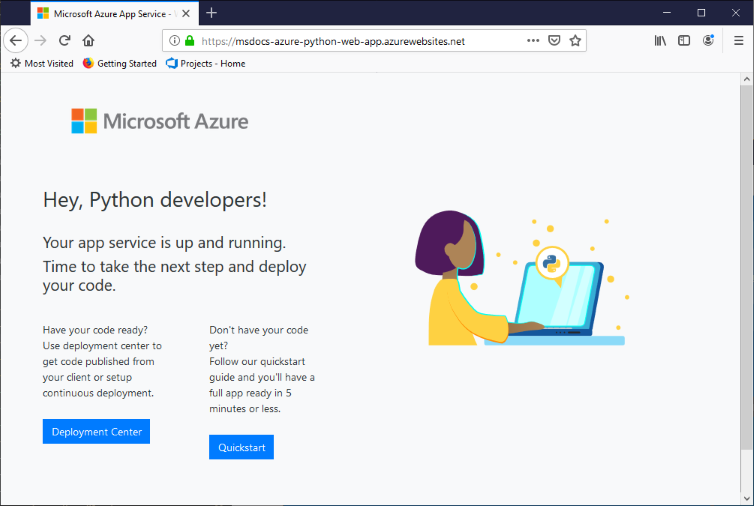

# Configure a Linux Python app for Azure App Service

This article describes how [Azure App Service](overview.md) runs Python apps, how you can migrate existing apps to Azure, and how you can customize the behavior of App Service when needed. Python apps must be deployed with all the required [pip](https://pypi.org/project/pip/) modules.

The App Service deployment engine automatically activates a virtual environment and runs `pip install -r requirements.txt` for you when you deploy a [Git repository](deploy-local-git.md), or a [zip package](deploy-zip.md).

This guide provides key concepts and instructions for Python developers who use a built-in Linux container in App Service. If you've never used Azure App Service, first follow the [Python quickstart](quickstart-python.md) and [Python with PostgreSQL tutorial](tutorial-python-postgresql-app.md).

You can use either the [Azure portal](https://portal.azure.com) or the Azure CLI for configuration:

- **Azure portal**, use the app's **Settings** > **Configuration** page as described on [Configure an App Service app in the Azure portal](configure-common.md).

- **Azure CLI**: you have two options.

    - Run commands in the [Azure Cloud Shell](../cloud-shell/overview.md).
    - Run commands locally by installing the latest version of the [Azure CLI](/cli/azure/install-azure-cli), then sign in to Azure using [az login](/cli/azure/reference-index#az_login).
    
> [!NOTE]
> Linux is currently the recommended option for running Python apps in App Service. For information on the Windows option, see [Python on the Windows flavor of App Service](/visualstudio/python/managing-python-on-azure-app-service).

## Configure Python version

- **Azure portal**: use the **General settings** tab on the **Configuration** page as described on [Configure general settings](configure-common.md#configure-general-settings) for Linux containers.

- **Azure CLI**:

    -  Show the current Python version with [az webapp config show](/cli/azure/webapp/config#az_webapp_config_show):
    
        ```azurecli
        az webapp config show --resource-group <resource-group-name> --name <app-name> --query linuxFxVersion
        ```
        
        Replace `<resource-group-name>` and `<app-name>` with the names appropriate for your web app.
    
    - Set the Python version with [az webapp config set](/cli/azure/webapp/config#az_webapp_config_set)
        
        ```azurecli
        az webapp config set --resource-group <resource-group-name> --name <app-name> --linux-fx-version "PYTHON|3.7"
        ```
    
    - Show all Python versions that are supported in Azure App Service with [az webapp list-runtimes](/cli/azure/webapp#az_webapp_list_runtimes):
    
        ```azurecli
        az webapp list-runtimes --linux | grep PYTHON
        ```
    
You can run an unsupported version of Python by building your own container image instead. For more information, see [use a custom Docker image](tutorial-custom-container.md?pivots=container-linux).

<!-- <a> element here to preserve external links-->
<a name="access-environment-variables"></a>

## Customize build automation

App Service's build system, called Oryx, performs the following steps when you deploy your app using Git or zip packages:

1. Run a custom pre-build script if specified by the `PRE_BUILD_COMMAND` setting. (The script can itself run other Python and Node.js scripts, pip and npm commands, and Node-based tools like yarn, for example, `yarn install` and `yarn build`.)

1. Run `pip install -r requirements.txt`. The *requirements.txt* file must be present in the project's root folder. Otherwise, the build process reports the error: "Could not find setup.py or requirements.txt; Not running pip install."

1. If *manage.py* is found in the root of the repository (indicating a Django app), run *manage.py collectstatic*. However, if the `DISABLE_COLLECTSTATIC` setting is `true`, this step is skipped.

1. Run custom post-build script if specified by the `POST_BUILD_COMMAND` setting. (Again, the script can run other Python and Node.js scripts, pip and npm commands, and Node-based tools.)

By default, the `PRE_BUILD_COMMAND`, `POST_BUILD_COMMAND`, and `DISABLE_COLLECTSTATIC` settings are empty. 

- To disable running collectstatic when building Django apps, set the `DISABLE_COLLECTSTATIC` setting to true.

- To run pre-build commands, set the `PRE_BUILD_COMMAND` setting to contain either a command, such as `echo Pre-build command`, or a path to a script file relative to your project root, such as `scripts/prebuild.sh`. All commands must use relative paths to the project root folder.

- To run post-build commands, set the `POST_BUILD_COMMAND` setting to contain either a command, such as `echo Post-build command`, or a path to a script file relative to your project root, such as `scripts/postbuild.sh`. All commands must use relative paths to the project root folder.

For additional settings that customize build automation, see [Oryx configuration](https://github.com/microsoft/Oryx/blob/master/doc/configuration.md). 

To access the build and deployment logs, see [Access deployment logs](#access-deployment-logs).

For more information on how App Service runs and builds Python apps in Linux, see [How Oryx detects and builds Python apps](https://github.com/microsoft/Oryx/blob/master/doc/runtimes/python.md).

> [!NOTE]
> The `PRE_BUILD_SCRIPT_PATH` and `POST_BUILD_SCRIPT_PATH` settings are identical to `PRE_BUILD_COMMAND` and `POST_BUILD_COMMAND` and are supported for legacy purposes.
> 
> A setting named `SCM_DO_BUILD_DURING_DEPLOYMENT`, if it contains `true` or 1, triggers an Oryx build happens during deployment. The setting is true when deploying using git, the Azure CLI command `az webapp up`, and Visual Studio Code.

> [!NOTE]
> Always use relative paths in all pre- and post-build scripts because the build container in which Oryx runs is different from the runtime container in which the app runs. Never rely on the exact placement of your app project folder within the container (for example, that it's placed under *site/wwwroot*).

## Migrate existing applications to Azure

Existing web applications can be redeployed to Azure as follows:

1. **Source repository**: Maintain your source code in a suitable repository like GitHub, which enables you to set up continuous deployment later in this process.
    1. Your *requirements.txt* file must be at the root of your repository for App Service to automatically install the necessary packages.    

1. **Database**: If you app depends on a database, provision the necessary resources on Azure as well. See [Tutorial: Deploy a Django web app with PostgreSQL - create a database](tutorial-python-postgresql-app.md#3-create-postgres-database-in-azure) for an example.

1. **App service resources**: Create a resource group, App Service Plan, and App Service web app to host your application. You can most easily do this by doing an initial deployment of your code through the Azure CLI command `az webapp up`, as shown on [Tutorial: Deploy a Django web app with PostgreSQL - deploy the code](tutorial-python-postgresql-app.md#4-deploy-the-code-to-azure-app-service). Replace the names of the resource group, App Service Plan, and the web app to be more suitable for your application.

1. **Environment variables**: If your application requires any environment variables, create equivalent [App Service application settings](configure-common.md#configure-app-settings). These App Service settings appear to your code as environment variables, as described on [Access environment variables](#access-app-settings-as-environment-variables).
    - Database connections, for example, are often managed through such settings, as shown in [Tutorial: Deploy a Django web app with PostgreSQL - configure variables to connect the database](tutorial-python-postgresql-app.md#42-configure-environment-variables-to-connect-the-database).
    - See [Production settings for Django apps](#production-settings-for-django-apps) for specific settings for typical Django apps.

1. **App startup**: Review the section, [Container startup process](#container-startup-process) later in this article to understand how App Service attempts to run your app. App Service uses the Gunicorn web server by default, which must be able to find your app object or *wsgi.py* folder. If needed, you can [Customize the startup command](#customize-startup-command).

1. **Continuous deployment**: Set up continuous deployment, as described on [Continuous deployment to Azure App Service](deploy-continuous-deployment.md) if using Azure Pipelines or Kudu deployment, or [Deploy to App Service using GitHub Actions](./deploy-continuous-deployment.md) if using GitHub actions.

1. **Custom actions**: To perform actions within the App Service container that hosts your app, such as Django database migrations, you can [connect to the container through SSH](configure-linux-open-ssh-session.md). For an example of running Django database migrations, see [Tutorial: Deploy a Django web app with PostgreSQL - run database migrations](tutorial-python-postgresql-app.md#43-run-django-database-migrations).
    - When using continuous deployment, you can perform those actions using post-build commands as described earlier under [Customize build automation](#customize-build-automation).

With these steps completed, you should be able to commit changes to your source repository and have those updates automatically deployed to App Service.

### Production settings for Django apps

For a production environment like Azure App Service, Django apps should follow Django's [Deployment checklist](https://docs.djangoproject.com/en/3.1/howto/deployment/checklist/) (djangoproject.com).

The following table describes the production settings that are relevant to Azure. These settings are defined in the app's *setting.py* file.

| Django setting | Instructions for Azure |
| --- | --- |
| `SECRET_KEY` | Store the value in an App Service setting as described on [Access app settings as environment variables](#access-app-settings-as-environment-variables). You can alternately [store the value as a "secret" in Azure Key Vault](../key-vault/secrets/quick-create-python.md). |
| `DEBUG` | Create a `DEBUG` setting on App Service with the value 0 (false), then load the value as an environment variable. In your development environment, create a `DEBUG` environment variable with the value 1 (true). |
| `ALLOWED_HOSTS` | In production, Django requires that you include app's URL in the `ALLOWED_HOSTS` array of *settings.py*. You can retrieve this URL at runtime with the code, `os.environ['WEBSITE_HOSTNAME']`. App Service automatically sets the `WEBSITE_HOSTNAME` environment variable to the app's URL. |
| `DATABASES` | Define settings in App Service for the database connection and load them as environment variables to populate the [`DATABASES`](https://docs.djangoproject.com/en/3.1/ref/settings/#std:setting-DATABASES) dictionary. You can alternately store the values (especially the username and password) as [Azure Key Vault secrets](../key-vault/secrets/quick-create-python.md). |

## Serve static files for Django apps

If your Django web app includes static front-end files, first follow the instructions on [Managing static files](https://docs.djangoproject.com/en/3.1/howto/static-files/) in the Django documentation.

For App Service, you then make the following modifications:

1. Consider using environment variables (for local development) and App Settings (when deploying to the cloud) to dynamically set the Django `STATIC_URL` and `STATIC_ROOT` variables. For example:    

    ```python
    STATIC_URL = os.environ.get("DJANGO_STATIC_URL", "/static/")
    STATIC_ROOT = os.environ.get("DJANGO_STATIC_ROOT", "./static/")    
    ```

    `DJANGO_STATIC_URL` and `DJANGO_STATIC_ROOT` can be changed as necessary for your local and cloud environments. For example, if the build process for your static files places them in a folder named `django-static`, then you can set `DJANGO_STATIC_URL` to `/django-static/` to avoid using the default.

1. If you have a pre-build script that generates static files in a different folder, include that folder in the Django `STATICFILES_DIRS` variable so that Django's `collectstatic` process finds them. For example, if you run `yarn build` in your front-end folder, and yarn generates a `build/static` folder containing static files, then include that folder as follows:

    ```python
    FRONTEND_DIR = "path-to-frontend-folder" 
    STATICFILES_DIRS = [os.path.join(FRONTEND_DIR, 'build', 'static')]    
    ```

    Here, `FRONTEND_DIR`, to build a path to where a build tool like yarn is run. You can again use an environment variable and App Setting as desired.

1. Add `whitenoise` to your *requirements.txt* file. [Whitenoise](http://whitenoise.evans.io/en/stable/) (whitenoise.evans.io) is a Python package that makes it simple for a production Django app to serve it's own static files. Whitenoise specifically serves those files that are found in the folder specified by the Django `STATIC_ROOT` variable.

1. In your *settings.py* file, add the following line for Whitenoise:

    ```python
    STATICFILES_STORAGE = ('whitenoise.storage.CompressedManifestStaticFilesStorage')
    ```

1. Also modify the `MIDDLEWARE` and `INSTALLED_APPS` lists to include Whitenoise:

    ```python
    MIDDLEWARE = [
        "whitenoise.middleware.WhiteNoiseMiddleware",
        # Other values follow
    ]

    INSTALLED_APPS = [
        "whitenoise.runserver_nostatic",
        # Other values follow
    ]
    ```

## Container characteristics

When deployed to App Service, Python apps run within a Linux Docker container that's defined in the [App Service Python GitHub repository](https://github.com/Azure-App-Service/python). You can find the image configurations inside the version-specific directories.

This container has the following characteristics:

- Apps are run using the [Gunicorn WSGI HTTP Server](https://gunicorn.org/), using the additional arguments `--bind=0.0.0.0 --timeout 600`.
    - You can provide configuration settings for Gunicorn through a *gunicorn.conf.py* file in the project root, as described on [Gunicorn configuration overview](https://docs.gunicorn.org/en/stable/configure.html#configuration-file) (docs.gunicorn.org). You can alternately [customize the startup command](#customize-startup-command).

    - To protect your web app from accidental or deliberate DDOS attacks, Gunicorn is run behind an Nginx reverse proxy as described on [Deploying Gunicorn](https://docs.gunicorn.org/en/latest/deploy.html) (docs.gunicorn.org).

- By default, the base container image includes only the Flask web framework, but the container supports other frameworks that are WSGI-compliant and compatible with Python 3.6+, such as Django.

- To install additional packages, such as Django, create a [*requirements.txt*](https://pip.pypa.io/en/stable/user_guide/#requirements-files) file in the root of your project that specifies your direct dependencies. App Service then installs those dependencies automatically when you deploy your project.

    The *requirements.txt* file *must* be in the project root for dependencies to be installed. Otherwise, the build process reports the error: "Could not find setup.py or requirements.txt; Not running pip install." If you encounter this error, check the location of your requirements file.

- App Service automatically defines an environment variable named `WEBSITE_HOSTNAME` with the web app's URL, such as `msdocs-hello-world.azurewebsites.net`. It also defines `WEBSITE_SITE_NAME` with the name of your app, such as `msdocs-hello-world`. 
   
- npm and Node.js are installed in the container so you can run Node-based build tools, such as yarn.

## Container startup process

During startup, the App Service on Linux container runs the following steps:

1. Use a [custom startup command](#customize-startup-command), if provided.
2. Check for the existence of a [Django app](#django-app), and launch Gunicorn for it if detected.
3. Check for the existence of a [Flask app](#flask-app), and launch Gunicorn for it if detected.
4. If no other app is found, start a default app that's built into the container.

The following sections provide additional details for each option.

### Django app

For Django apps, App Service looks for a file named `wsgi.py` within your app code, and then runs Gunicorn using the following command:

```bash
# <module> is the name of the folder that contains wsgi.py
gunicorn --bind=0.0.0.0 --timeout 600 <module>.wsgi
```

If you want more specific control over the startup command, use a [custom startup command](#customize-startup-command), replace `<module>` with the name of folder that contains *wsgi.py*, and add a `--chdir` argument if that module is not in the project root. For example, if your *wsgi.py* is located under *knboard/backend/config* from your project root, use the arguments `--chdir knboard/backend config.wsgi`.

To enable production logging, add the `--access-logfile` and `--error-logfile` parameters as shown in the examples for [custom startup commands](#customize-startup-command).

### Flask app

For Flask, App Service looks for a file named *application.py* or *app.py* and starts Gunicorn as follows:

```bash
# If application.py
gunicorn --bind=0.0.0.0 --timeout 600 application:app

# If app.py
gunicorn --bind=0.0.0.0 --timeout 600 app:app
```

If your main app module is contained in a different file, use a different name for the app object, or you want to provide additional arguments to Gunicorn, use a [custom startup command](#customize-startup-command).

### Default behavior

If the App Service doesn't find a custom command, a Django app, or a Flask app, then it runs a default read-only app, located in the _opt/defaultsite_ folder and shown in the following image.

If you deployed code and still see the default app, see [Troubleshooting - App doesn't appear](#app-doesnt-appear).

[](#app-doesnt-appear)

Again, if you expect to see a deployed app instead of the default app, see [Troubleshooting - App doesn't appear](#app-doesnt-appear).

## Customize startup command

As noted earlier in this article, you can provide configuration settings for Gunicorn through a *gunicorn.conf.py* file in the project root, as described on [Gunicorn configuration overview](https://docs.gunicorn.org/en/stable/configure.html#configuration-file).

If such configuration is not sufficient, you can control the container's startup behavior by providing either a custom startup command or multiple commands in a startup command file. A startup command file can use whatever name you choose, such as *startup.sh*, *startup.cmd*, *startup.txt*, and so on.

All commands must use relative paths to the project root folder.

To specify a startup command or command file:

- **Azure portal**: select the app's **Configuration** page, then select **General settings**. In the **Startup Command** field, place either the full text of your startup command or the name of your startup command file. Then select **Save** to apply the changes. See [Configure general settings](configure-common.md#configure-general-settings) for Linux containers.

- **Azure CLI**: use the [az webapp config set](/cli/azure/webapp/config#az_webapp_config_set) command with the `--startup-file` parameter to set the startup command or file:

    ```azurecli
    az webapp config set --resource-group <resource-group-name> --name <app-name> --startup-file "<custom-command>"
    ```
        
    Replace `<custom-command>` with either the full text of your startup command or the name of your startup command file.
        
App Service ignores any errors that occur when processing a custom startup command or file, then continues its startup process by looking for Django and Flask apps. If you don't see the behavior you expect, check that your startup command or file is error-free and that a startup command file is deployed to App Service along with your app code. You can also check the [Diagnostic logs](#access-diagnostic-logs) for additional information. Also check the app's **Diagnose and solve problems** page on the [Azure portal](https://portal.azure.com).

### Example startup commands

- **Added Gunicorn arguments**: The following example adds the `--workers=4` to a Gunicorn command line for starting a Django app: 

    ```bash
    # <module-path> is the relative path to the folder that contains the module
    # that contains wsgi.py; <module> is the name of the folder containing wsgi.py.
    gunicorn --bind=0.0.0.0 --timeout 600 --workers=4 --chdir <module_path> <module>.wsgi
    ```    

    For more information, see [Running Gunicorn](https://docs.gunicorn.org/en/stable/run.html) (docs.gunicorn.org).

- **Enable production logging for Django**: Add the `--access-logfile '-'` and `--error-logfile '-'` arguments to the command line:

    ```bash    
    # '-' for the log files means stdout for --access-logfile and stderr for --error-logfile.
    gunicorn --bind=0.0.0.0 --timeout 600 --workers=4 --chdir <module_path> <module>.wsgi --access-logfile '-' --error-logfile '-'
    ```    

    These logs will appear in the [App Service log stream](#access-diagnostic-logs).

    For more information, see [Gunicorn logging](https://docs.gunicorn.org/en/stable/settings.html#logging) (docs.gunicorn.org).
    
- **Custom Flask main module**: by default, App Service assumes that a Flask app's main module is *application.py* or *app.py*. If your main module uses a different name, then you must customize the startup command. For example, yf you have a Flask app whose main module is *hello.py* and the Flask app object in that file is named `myapp`, then the command is as follows:

    ```bash
    gunicorn --bind=0.0.0.0 --timeout 600 hello:myapp
    ```
    
    If your main module is in a subfolder, such as `website`, specify that folder with the `--chdir` argument:
    
    ```bash
    gunicorn --bind=0.0.0.0 --timeout 600 --chdir website hello:myapp
    ```
    
- **Use a non-Gunicorn server**: To use a different web server, such as [aiohttp](https://aiohttp.readthedocs.io/en/stable/web_quickstart.html), use the appropriate command as the startup command or in the startup command file:

    ```bash
    python3.7 -m aiohttp.web -H localhost -P 8080 package.module:init_func
    ```

## Access app settings as environment variables

App settings are values stored in the cloud specifically for your app as described on [Configure app settings](configure-common.md#configure-app-settings). These settings are available to your app code as environment variables and accessed using the standard [os.environ](https://docs.python.org/3/library/os.html#os.environ) pattern.

For example, if you've created app setting called `DATABASE_SERVER`, the following code retrieves that setting's value:

```python
db_server = os.environ['DATABASE_SERVER']
```

## Detect HTTPS session

In App Service, [SSL termination](https://wikipedia.org/wiki/TLS_termination_proxy) (wikipedia.org) happens at the network load balancers, so all HTTPS requests reach your app as unencrypted HTTP requests. If your app logic needs to check if the user requests are encrypted or not, inspect the `X-Forwarded-Proto` header.

```python
if 'X-Forwarded-Proto' in request.headers and request.headers['X-Forwarded-Proto'] == 'https':
# Do something when HTTPS is used
```

Popular web frameworks let you access the `X-Forwarded-*` information in your standard app pattern. In [CodeIgniter](https://codeigniter.com/), the [is_https()](https://github.com/bcit-ci/CodeIgniter/blob/master/system/core/Common.php#L338-L365) checks the value of `X_FORWARDED_PROTO` by default.

## Access diagnostic logs

[!INCLUDE [Access diagnostic logs](../../includes/app-service-web-logs-access-linux-no-h.md)]

To access logs through the Azure portal, select **Monitoring** > **Log stream** on the left side menu for your app.

## Access deployment logs

When you deploy your code, App Service performs the build process described earlier in the section [Customize build automation](#customize-build-automation). Because the build runs in its own container, build logs are stored separately from the app's diagnostic logs.

Use the following steps to access the deployment logs:

1. On the Azure portal for your web app, select **Deployment** > **Deployment Center (Preview)** on the left menu.
1. On the **Logs** tab, select the **Commit ID** for the most recent commit.
1. On the **Log details** page that appears, select the **Show Logs...** link that appears next to "Running oryx build...".

Build issues such as incorrect dependencies in *requirements.txt* and errors in pre- or post-build scripts will appear in these logs. Errors also appear if your requirements file is not exactly named *requirements.txt* or does not appear in the root folder of your project.

## Open SSH session in browser

[!INCLUDE [Open SSH session in browser](../../includes/app-service-web-ssh-connect-builtin-no-h.md)]

When you're successfully connected to the SSH session, you should see the message "SSH CONNECTION ESTABLISHED" at the bottom of the window. If you see errors such as "SSH_CONNECTION_CLOSED" or a message that the container is restarting, an error may be preventing the app container from starting. See [Troubleshooting](#troubleshooting) for steps to investigate possible issues.

## Troubleshooting

In general, the first step in troubleshooting is to use App Service Diagnostics:

1. On the Azure portal for your web app, select **Diagnose and solve problems** from the left menu.
1. Select **Availability and performance**.
1. Examine the information in the **Application Logs**, **Container crash**, and **Container Issues** options, where the most common issues will appear.

Next, examine both the [deployment logs](#access-deployment-logs) and the [app logs](#access-diagnostic-logs) for any error messages. These logs often identify specific issues that can prevent app deployment or app startup. For example, the build can fail if your *requirements.txt* file has the wrong filename or isn't present in your project root folder.

The following sections provide additional guidance for specific issues.

- [App doesn't appear - default app shows](#app-doesnt-appear)
- [App doesn't appear - "service unavailable" message](#service-unavailable)
- [Could not find setup.py or requirements.txt](#could-not-find-setuppy-or-requirementstxt)
- [ModuleNotFoundError on startup](#modulenotfounderror-when-app-starts)
- [Database is locked](#database-is-locked)
- [Passwords don't appear in SSH session when typed](#other-issues)
- [Commands in the SSH session appear to be cut off](#other-issues)
- [Static assets don't appear in a Django app](#other-issues)
- [Fatal SSL Connection is Required](#other-issues)

#### App doesn't appear

- **You see the default app after deploying your own app code.** The [default app](#default-behavior) appears because you either haven't deployed your app code to App Service, or App Service failed to find your app code and ran the default app instead.

    - Restart the App Service, wait 15-20 seconds, and check the app again.
    
    - Be sure you're using App Service for Linux rather than a Windows-based instance. From the Azure CLI, run the command `az webapp show --resource-group <resource-group-name> --name <app-name> --query kind`, replacing `<resource-group-name>` and `<app-name>` accordingly. You should see `app,linux` as output; otherwise, recreate the App Service and choose Linux.
    
    - Use [SSH](#open-ssh-session-in-browser) to connect directly to the App Service container and verify that your files exist under *site/wwwroot*. If your files don't exist, use the following steps:
      1. Create an app setting named `SCM_DO_BUILD_DURING_DEPLOYMENT` with the value of 1, redeploy your code, wait a few minutes, then try to access the app again. For more information on creating app settings, see [Configure an App Service app in the Azure portal](configure-common.md).
      1. Review your deployment process, [check the deployment logs](#access-deployment-logs), correct any errors, and redeploy the app.
    
    - If your files exist, then App Service wasn't able to identify your specific startup file. Check that your app is structured as App Service expects for [Django](#django-app) or [Flask](#flask-app), or use a [custom startup command](#customize-startup-command).

- <a name="service-unavailable"></a>**You see the message "Service Unavailable" in the browser.** The browser has timed out waiting for a response from App Service, which indicates that App Service started the Gunicorn server, but the app itself did not start. This condition could indicate that the Gunicorn arguments are incorrect, or that there's an error in the app code.

    - Refresh the browser, especially if you're using the lowest pricing tiers in your App Service Plan. The app may take longer to start up when using free tiers, for example, and becomes responsive after you refresh the browser.

    - Check that your app is structured as App Service expects for [Django](#django-app) or [Flask](#flask-app), or use a [custom startup command](#customize-startup-command).

    - Examine the [app log stream](#access-diagnostic-logs) for any error messages. The logs will show any errors in the app code.

#### Could not find setup.py or requirements.txt

- **The log stream shows "Could not find setup.py or requirements.txt; Not running pip install."**: The Oryx build process failed to find your *requirements.txt* file.

    - Connect to the web app's container via [SSH](#open-ssh-session-in-browser) and verify that *requirements.txt* is named correctly and exists directly under *site/wwwroot*. If it doesn't exist, make site the file exists in your repository and is included in your deployment. If it exists in a separate folder, move it to the root.

#### ModuleNotFoundError when app starts

If you see an error like `ModuleNotFoundError: No module named 'example'`, this means that Python could not find one or more of your modules when the application started. This most often occurs if you deploy your virtual environment with your code. Virtual environments are not portable, so a virtual environment should not be deployed with your application code. Instead, let Oryx create a virtual environment and install your packages on the web app by creating an app setting, `SCM_DO_BUILD_DURING_DEPLOYMENT`, and setting it to `1`. This will force Oryx to install your packages whenever you deploy to App Service. For more information, please see [this article on virtual environment portability](https://azure.github.io/AppService/2020/12/11/cicd-for-python-apps.html).

### Database is locked

When attempting to run database migrations with a Django app, you may see "sqlite3. OperationalError: database is locked." The error indicates that your application is using a SQLite database for which Django is configured by default, rather than using a cloud database such as PostgreSQL for Azure.

Check the `DATABASES` variable in the app's *settings.py* file to ensure that your app is using a cloud database instead of SQLite.

If you're encountering this error with the sample in [Tutorial: Deploy a Django web app with PostgreSQL](tutorial-python-postgresql-app.md), check that you completed the steps in [Configure environment variables to connect the database](tutorial-python-postgresql-app.md#42-configure-environment-variables-to-connect-the-database).

#### Other issues

- **Passwords don't appear in the SSH session when typed**: For security reasons, the SSH session keeps your password hidden as you type. The characters are being recorded, however, so type your password as usual and press **Enter** when done.

- **Commands in the SSH session appear to be cut off**: The editor may not be word-wrapping commands, but they should still run correctly.

- **Static assets don't appear in a Django app**: Ensure that you have enabled the [whitenoise module](http://whitenoise.evans.io/en/stable/django.html)

- **You see the message, "Fatal SSL Connection is Required"**: Check any usernames and passwords used to access resources (such as databases) from within the app.

## Next steps

> [!div class="nextstepaction"]
> [Tutorial: Python app with PostgreSQL](tutorial-python-postgresql-app.md)

> [!div class="nextstepaction"]
> [Tutorial: Deploy from private container repository](tutorial-custom-container.md?pivots=container-linux)

> [!div class="nextstepaction"]
> [App Service Linux FAQ](faq-app-service-linux.md)
