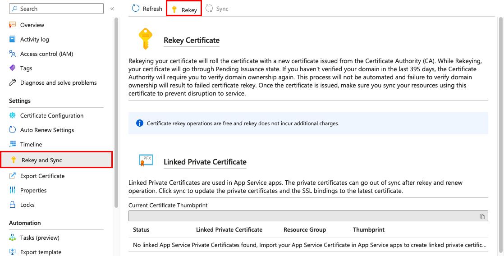

# Create and manage an App Service certificate for your web app

This article shows how to create an App Service certificate and manage it (such as renew, sync, and delete). Once you have an App Service certificate, you can then import it into an App Service app. An App Service certificate is a private certificate that's managed by Azure. It combines the simplicity of automated certificate management and the flexibility of renewal and export options. 

If you purchase an App Service certificate from Azure, Azure manages the following tasks:

- Handles the purchase process from GoDaddy.
- Performs domain verification of the certificate.
- Maintains the certificate in [Azure Key Vault](../key-vault/general/overview.md).
- Manages [certificate renewal](#renew-an-app-service-certificate).
- Synchronizes the certificate automatically with the imported copies in App Service apps.

> [!NOTE]
> After you upload a certificate to an app, the certificate is stored in a deployment unit that's bound to the App Service plan's resource group, region, and operating system combination, internally called a *webspace*. That way, the certificate is accessible to other apps in the same resource group and region combination. Certificates uploaded or imported to App Service are shared with App Services in the same deployment unit. 

## Prerequisites

- [Create an App Service app](./index.yml). The app's [App Service plan](overview-hosting-plans.md) must be in the **Basic**, **Standard**, **Premium**, or **Isolated** tier. See [Scale up an app](manage-scale-up.md#scale-up-your-pricing-tier) to update the tier.

> [!NOTE]
> Currently, App Service certificates aren't supported in Azure National Clouds.

## Buy and configure an App Service certificate

#### Start certificate purchase

1. Go to the [App Service Certificate creation page](https://portal.azure.com/#create/Microsoft.SSL), and start your purchase for an App Service certificate.

   > [!NOTE]
   > App Service Certificates purchased from Azure are issued by GoDaddy. For some domains, you must explicitly allow GoDaddy as a certificate issuer by creating a [CAA domain record](https://wikipedia.org/wiki/DNS_Certification_Authority_Authorization) with the value: `0 issue godaddy.com`

   :::image type="content" source="./media/configure-ssl-certificate/purchase-app-service-cert.png" alt-text="Screenshot of 'Create App Service Certificate' pane with purchase options.":::

1. To help you configure the certificate, use the following table. When you're done, select **Review + Create**, then select **Create**.

   | Setting | Description |
   |-|-|
   | **Subscription** | The Azure subscription to associate with the certificate. |
   | **Resource group** | The resource group that will contain the certificate. You can either create a new resource group or select the same resource group as your App Service app. |
   | **SKU** | Determines the type of certificate to create, either a standard certificate or a [wildcard certificate](https://wikipedia.org/wiki/Wildcard_certificate). |
   | **Naked Domain Host Name** | Specify the root domain. The issued certificate secures *both* the root domain and the `www` subdomain. In the issued certificate, the **Common Name** field specifies the root domain, and the **Subject Alternative Name** field specifies the `www` domain. To secure any subdomain only, specify the fully qualified domain name for the subdomain, for example, `mysubdomain.contoso.com`.|
   | **Certificate name** | The friendly name for your App Service certificate. |
   | **Enable auto renewal** | Select whether to automatically renew the certificate before expiration. Each renewal extends the certificate expiration by one year and the cost is charged to your subscription. |

1. When deployment is complete, select **Go to resource**.

#### Store certificate in Azure Key Vault

[Key Vault](../key-vault/general/overview.md) is an Azure service that helps safeguard cryptographic keys and secrets used by cloud applications and services. For App Service certificates, the storage of choice is Key Vault. After you finish the certificate purchase process, you must complete a few more steps before you start using this certificate.

1. On the [App Service Certificates page](https://portal.azure.com/#blade/HubsExtension/Resources/resourceType/Microsoft.CertificateRegistration%2FcertificateOrders), select the certificate. On the certificate menu, select **Certificate Configuration** > **Step 1: Store**.

    :::image type="content" source="media/configure-ssl-certificate/configure-key-vault.png" alt-text="Screenshot of 'Certificate Configuration' pane with 'Step 1: Store' selected.":::

1. On the **Key Vault Status** page, select **Select from Key Vault**.

1. If you create a new vault, set up the vault based on the following table, and make sure to use the same subscription and resource group as your App Service app. 

   | Setting | Description |
   |-|-|
   | **Resource group** | Recommended: The same resource group as your App Service certificate. |
   | **Key vault name** | A unique name that uses only alphanumeric characters and dashes. |
   | **Region** | The same location as your App Service app. |
   | **Pricing tier** | For information, see [Azure Key Vault pricing details](https://azure.microsoft.com/pricing/details/key-vault/). |
   | **Days to retain deleted vaults** | The number of days after deletion, in which objects remain recoverable (see [Azure Key Vault soft-delete overview](../key-vault/general/soft-delete-overview.md)). Set a value between 7 and 90. |
   | **Purge protection** | Prevents objects soft-deleted st objects to be manually purged. Enabling this option forces all deleted objects to remain in soft-deleted state for the entire duration of the retention period. |

1. Select **Next** and select **Vault access policy**. Currently, App Service certificates support only Key Vault access policies, not the RBAC model.
1. Select **Review + create**, then select **Create**.
1. After the key vault is created, don't select **Go to resource** but wait for the **Select key vault from Azure Key Vault page** to reload.
1. Select **Select**.
1. After you select the vault, close the **Key Vault Repository** page. The **Step 1: Store** option should show a green check mark to indicate success. Keep the page open for the next step.

#### Confirm domain ownership

1. From the same **Certificate Configuration** page in the previous section, select **Step 2: Verify**.

    :::image type="content" source="media/configure-ssl-certificate/verify-domain.png" alt-text="Screenshot of 'Certificate Configuration' pane with 'Step 2: Verify' selected.":::

1. Select **App Service Verification**. However, because you previously mapped the domain to your web app per the [Prerequisites](#prerequisites), the domain is already verified. To finish this step, just select **Verify**, and then select **Refresh** until the message **Certificate is Domain Verified** appears.

The following domain verification methods are supported: 

| Method | Description |
|--------|-------------|
| **App Service Verification** | The most convenient option when the domain is already mapped to an App Service app in the same subscription because the App Service app has already verified the domain ownership. Review the last step in [Confirm domain ownership](#confirm-domain-ownership). |
| **Domain Verification** | Confirm an [App Service domain that you purchased from Azure](manage-custom-dns-buy-domain.md). Azure automatically adds the verification TXT record for you and completes the process. |
| **Mail Verification** | Confirm the domain by sending an email to the domain administrator. Instructions are provided when you select the option. |
| **Manual Verification** | Confirm the domain by using either a DNS TXT record or an HTML page, which applies only to **Standard** certificates per the following note.  The steps are provided after you select the option. The HTML page option doesn't work for web apps with "HTTPS Only' enabled. |

> [!IMPORTANT]
> With the **Standard** certificate, you get a certificate for the requested top-level domain *and* the `www` subdomain, for example, `contoso.com` and `www.contoso.com`. However, **App Service Verification** and **Manual Verification** both use HTML page verification, which doesn't support the `www` subdomain when issuing, rekeying, or renewing a certificate. For the **Standard** certificate, use **Domain Verification** and **Mail Verification** to include the `www` subdomain with the requested top-level domain in the certificate.

Once your certificate is domain-verified, [you're ready to import it into an App Service app](configure-ssl-certificate.md#import-an-app-service-certificate).

## Renew an App Service certificate

By default, App Service certificates have a one-year validity period. Before and nearer to the expiration date, you can automatically or manually renew App Service certificates in one-year increments. The renewal process effectively gives you a new App Service certificate with the expiration date extended to one year from the existing certificate's expiration date.

> [!NOTE]
> Starting September 23 2021, if you haven't verified the domain in the last 395 days, App Service certificates require domain verification during a renew or rekey process. The new certificate order remains in "pending issuance" mode during the renew or rekey process until you complete the domain verification.
> 
> Unlike the free App Service managed certificate, domain re-verification for App Service certificates *isn't* automated. Failure to verify domain ownership results in failed renewals. For more information about how to verify your App Service certificate, review [Confirm domain ownership](#confirm-domain-ownership).
>
> The renewal process requires that the well-known [service principal for App Service has the required permissions on your key vault](deploy-resource-manager-template.md#deploy-web-app-certificate-from-key-vault). These permissions are set up for you when you import an App Service certificate through the Azure portal. Make sure that you don't remove these permissions from your key vault.

1. To change the automatic renewal setting for your App Service certificate at any time, on the [App Service Certificates page](https://portal.azure.com/#blade/HubsExtension/Resources/resourceType/Microsoft.CertificateRegistration%2FcertificateOrders), select the certificate. 

1. On the left menu, select **Auto Renew Settings**.

1. Select **On** or **Off**, and select **Save**.

   If you turn on automatic renewal, certificates can start automatically renewing 32 days before expiration.

   > [!div class="mx-imgBorder"]
   > 

1. To manually renew the certificate instead, select **Manual Renew**. You can request to manually renew your certificate 60 days before expiration.

1. After the renew operation completes, select **Sync**.

   The sync operation automatically updates the hostname bindings for the certificate in App Service without causing any downtime to your apps.

   > [!NOTE]
   > If you don't select **Sync**, App Service automatically syncs your certificate within 24 hours.

## Rekey and App Service certificate

If you think your certificate's private key is compromised, you can rekey your certificate. This action rolls the certificate with a new certificate issued from the certificate authority.

1. On the [App Service Certificates page](https://portal.azure.com/#blade/HubsExtension/Resources/resourceType/Microsoft.CertificateRegistration%2FcertificateOrders), select the certificate. From the left menu, select **Rekey and Sync**.

1. To start the process, select **Rekey**. This process can take 1-10 minutes to complete.

   > [!div class="mx-imgBorder"]
   > 

1. You might also be required to [reconfirm domain ownership](#confirm-domain-ownership).

1. After the rekey operation completes, select **Sync**.

   The sync operation automatically updates the hostname bindings for the certificate in App Service without causing any downtime to your apps.

   > [!NOTE]
   > If you don't select **Sync**, App Service automatically syncs your certificate within 24 hours.

## Export an App Service certificate

Because an App Service certificate is a [Key Vault secret](../key-vault/general/about-keys-secrets-certificates.md), you can export a copy as a PFX file, which you can use for other Azure services or outside of Azure.

> [!IMPORTANT]
> The exported certificate is an unmanaged artifact. App Service doesn't sync such artifacts when the App Service Certificate is [renewed](#renew-an-app-service-certificate). You must export and install the renewed certificate where necessary.

#### [Azure portal](#tab/portal)

1. On the [App Service Certificates page](https://portal.azure.com/#blade/HubsExtension/Resources/resourceType/Microsoft.CertificateRegistration%2FcertificateOrders), select the certificate.

1. On the left menu, select **Export Certificate**.

1. Select **Open Key Vault Secret**.

1. Select the certificate's current version.

1. Select **Download as a certificate**.

#### [Azure CLI](#tab/cli)

Run the following commands in [Azure Cloud Shell](https://shell.azure.com), or run them locally if you [installed Azure CLI](/cli/azure/install-azure-cli). Replace the placeholders with the names that you used when you [bought the App Service certificate](#start-certificate-purchase).

```azurecli-interactive
secretname=$(az resource show \
    --resource-group <group-name> \
    --resource-type "Microsoft.CertificateRegistration/certificateOrders" \
    --name <app-service-cert-name> \
    --query "properties.certificates.<app-service-cert-name>.keyVaultSecretName" \
    --output tsv)

az keyvault secret download \
    --file appservicecertificate.pfx \
    --vault-name <key-vault-name> \
    --name $secretname \
    --encoding base64
```

#### [Azure PowerShell](#tab/powershell)

```azurepowershell-interactive
$ascName = <app-service-cert-name>
$ascResource = Get-AzResource -ResourceType "Microsoft.CertificateRegistration/certificateOrders" -Name $ascName -ResourceGroupName <group-name> -ExpandProperties
$keyVaultSecretName = $ascResource.Properties.certificates[0].$ascName.KeyVaultSecretName
$CertBase64 = Get-AzKeyVaultSecret -VaultName <key-vault-name> -Name $keyVaultSecretName -AsPlainText
$CertBytes = [Convert]::FromBase64String($CertBase64)
Set-Content -Path appservicecertificate.pfx -Value $CertBytes -AsByteStream
```

---

The downloaded PFX file is a raw PKCS12 file that contains both the public and private certificates and has an import password that's an empty string. You can locally install the file by leaving the password field empty. You can't [upload the file as-is into App Service](configure-ssl-certificate.md#upload-a-private-certificate) because the file isn't [password protected](configure-ssl-certificate.md#private-certificate-requirements).

## Delete an App Service certificate

If you delete an App Service certificate, the delete operation is irreversible and final. The result is a revoked certificate, and any binding in App Service that uses this certificate becomes invalid.

1. On the [App Service Certificates page](https://portal.azure.com/#blade/HubsExtension/Resources/resourceType/Microsoft.CertificateRegistration%2FcertificateOrders), select the certificate.

1. From the left menu, select **Overview** > **Delete**.

1. When the confirmation box opens, enter the certificate name, and select **OK**.

## Frequently asked questions

#### My App Service certificate doesn't have any value in Key Vault

Your App Service certificate is most likely still not yet domain-verified. Until [domain ownership is confirmed](#confirm-domain-ownership), your App Service certificate isn't ready for use. As a key vault secret, it maintains an `Initialize` tag, and its value and content-type remain empty. When domain ownership is confirmed, the key vault secret shows a value and a content-type, and the tag changes to `Ready`.

#### I can't export my App Service certificate with PowerShell

Your App Service certificate is most likely still not yet domain-verified. Until [domain ownership is confirmed](#confirm-domain-ownership), your App Service certificate isn't ready for use. 

#### What changes does the App Service certificate creation process make to my existing Key Vault?

The creation process makes the following changes:

- Adds two access policies in the vault:
    - **Microsoft.Azure.WebSites** (or `Microsoft Azure App Service`)
    - **Microsoft certificate reseller CSM Resource Provider** (or `Microsoft.Azure.CertificateRegistration`)
- Creates a [delete lock](../azure-resource-manager/management/lock-resources.md) on the vault called: `AppServiceCertificateLock` to prevent accidental deletion of the key vault.

## More resources

* [Secure a custom DNS name with a TLS/SSL binding in Azure App Service](configure-ssl-bindings.md)
* [Enforce HTTPS](configure-ssl-bindings.md#enforce-https)
* [Enforce TLS 1.1/1.2](configure-ssl-bindings.md#enforce-tls-versions)
* [Use a TLS/SSL certificate in your code in Azure App Service](configure-ssl-certificate-in-code.md)
* [FAQ : App Service Certificates](./faq-configuration-and-management.yml)
