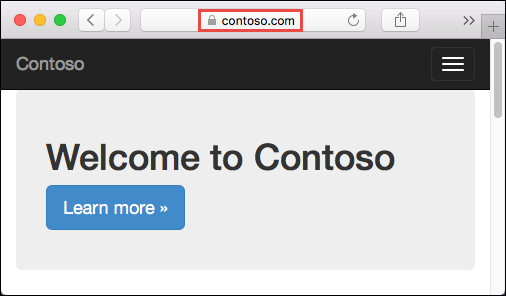
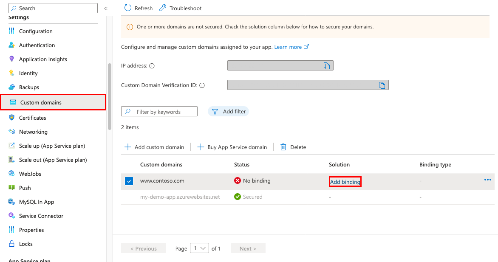
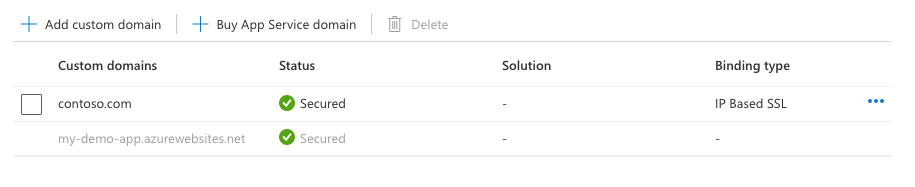
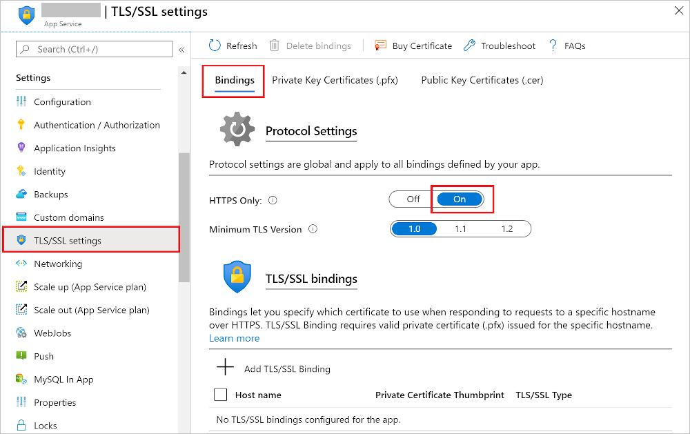
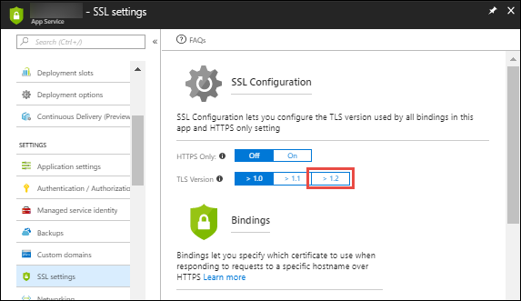

# Secure a custom DNS name with a TLS/SSL binding in Azure App Service

This article shows you how to secure the [custom domain](app-service-web-tutorial-custom-domain.md) in your [App Service app](https://docs.microsoft.com/azure/app-service/) or [function app](https://docs.microsoft.com/azure/azure-functions/) by creating a certificate binding. When you're finished, you can access your App Service app at the `https://` endpoint for your custom DNS name (for example, `https://www.contoso.com`). 

Securing a [custom domain](app-service-web-tutorial-custom-domain.md) with a certificate involves two steps:

- [Add a private certificate to App Service](configure-ssl-certificate.md) that satisfies all the [private certificate requirements](configure-ssl-certificate.md#private-certificate-requirements).
-  Create a TLS binding to the corresponding custom domain. This second step is covered by this article.

In this tutorial, you learn how to:

> [!div class="checklist"]
> * Upgrade your app's pricing tier
> * Secure a custom domain with a certificate
> * Enforce HTTPS
> * Enforce TLS 1.1/1.2
> * Automate TLS management with scripts

## Prerequisites

To follow this how-to guide:

- [Create an App Service app](/azure/app-service/)
- [Map a domain name to your app](app-service-web-tutorial-custom-domain.md) or [buy and configure it in Azure](manage-custom-dns-buy-domain.md)
- [Add a private certificate to your app](configure-ssl-certificate.md)

> [!NOTE]
> The easiest way to add a private certificate is to [create a free App Service Managed Certificate](configure-ssl-certificate.md#create-a-free-certificate-preview) (Preview).

[!INCLUDE [Prepare your web app](../../includes/app-service-ssl-prepare-app.md)]

## Secure a custom domain

Do the following steps:

In the <a href="https://portal.azure.com" target="_blank">Azure portal</a>, from the left menu, select **App Services** > **\<app-name>**.

From the left navigation of your app, start the **TLS/SSL Binding** dialog by:

- Selecting **Custom domains** > **Add binding**
- Selecting **TLS/SSL settings** > **Add TLS/SSL binding**

In **Custom Domain**, select the custom domain you want to add a binding for.

If your app already has a certificate for the selected custom domain, go to [Create binding](#create-binding) directly. Otherwise, keep going.

### Add a certificate for custom domain

If your app has no certificate for the selected custom domain, then you have two options:

- **Upload PFX Certificate** - Follow the workflow at [Upload a private certificate](configure-ssl-certificate.md#upload-a-private-certificate), then select this option here.
- **Import App Service Certificate** - Follow the workflow at [Import an App Service certificate](configure-ssl-certificate.md#import-an-app-service-certificate), then select this option here.

> [!NOTE]
> You can also [Create a free certificate](configure-ssl-certificate.md#create-a-free-certificate-preview) (Preview) or [Import a Key Vault certificate](configure-ssl-certificate.md#import-a-certificate-from-key-vault), but you must do it separately and then return to the **TLS/SSL Binding** dialog.

### Create binding

Use the following table to help you configure the TLS binding in the **TLS/SSL Binding** dialog, then click **Add Binding**.

| Setting | Description |
|-|-|
| Custom domain | The domain name to add the TLS/SSL binding for. |
| Private Certificate Thumbprint | The certificate to bind. |
| TLS/SSL Type | <ul><li>**[SNI SSL](https://en.wikipedia.org/wiki/Server_Name_Indication)** - Multiple SNI SSL bindings may be added. This option allows multiple TLS/SSL certificates to secure multiple domains on the same IP address. Most modern browsers (including Internet Explorer, Chrome, Firefox, and Opera) support SNI (for more information, see [Server Name Indication](https://wikipedia.org/wiki/Server_Name_Indication)).</li><li>**IP SSL** - Only one IP SSL binding may be added. This option allows only one TLS/SSL certificate to secure a dedicated public IP address. After you configure the binding, follow the steps in [Remap records for IP SSL](#remap-records-for-ip-ssl). IP SSL is supported only in **Standard** tier or above. </li></ul> |

Once the operation is complete, the custom domain's TLS/SSL state is changed to **Secure**.

> [!NOTE]
> A **Secure** state in the **Custom domains** means that it is secured with a certificate, but App Service doesn't check if the certificate is self-signed or expired, for example, which can also cause browsers to show an error or warning.

## Remap records for IP SSL

If you don't use IP SSL in your app, skip to [Test HTTPS for your custom domain](#test-https).

There are two changes you need to make, potentially:

- By default, your app uses a shared public IP address. When you bind a certificate with IP SSL, App Service creates a new, dedicated IP address for your app. If you mapped an A record to your app, update your domain registry with this new, dedicated IP address.

    Your app's **Custom domain** page is updated with the new, dedicated IP address. [Copy this IP address](app-service-web-tutorial-custom-domain.md#info), then [remap the A record](app-service-web-tutorial-custom-domain.md#map-an-a-record) to this new IP address.

- If you have an SNI SSL binding to `<app-name>.azurewebsites.net`, [remap any CNAME mapping](app-service-web-tutorial-custom-domain.md#map-a-cname-record) to point to `sni.<app-name>.azurewebsites.net` instead (add the `sni` prefix).

## Test HTTPS

In various browsers, browse to `https://<your.custom.domain>` to verify that it serves up your app.

Your application code can inspect the protocol via the "x-appservice-proto" header. The header will have a value of `http` or `https`. 

> [!NOTE]
> If your app gives you certificate validation errors, you're probably using a self-signed certificate.
>
> If that's not the case, you may have left out intermediate certificates when you export your certificate to the PFX file.

## Prevent IP changes

Your inbound IP address can change when you delete a binding, even if that binding is IP SSL. This is especially important when you renew a certificate that's already in an IP SSL binding. To avoid a change in your app's IP address, follow these steps in order:

1. Upload the new certificate.
2. Bind the new certificate to the custom domain you want without deleting the old one. This action replaces the binding instead of removing the old one.
3. Delete the old certificate. 

## Enforce HTTPS

By default, anyone can still access your app using HTTP. You can redirect all HTTP requests to the HTTPS port.

In your app page, in the left navigation, select **SSL settings**. Then, in **HTTPS Only**, select **On**.

When the operation is complete, navigate to any of the HTTP URLs that point to your app. For example:

- `http://<app_name>.azurewebsites.net`
- `http://contoso.com`
- `http://www.contoso.com`

## Enforce TLS versions

Your app allows [TLS](https://wikipedia.org/wiki/Transport_Layer_Security) 1.2 by default, which is the recommended TLS level by industry standards, such as [PCI DSS](https://wikipedia.org/wiki/Payment_Card_Industry_Data_Security_Standard). To enforce different TLS versions, follow these steps:

In your app page, in the left navigation, select **SSL settings**. Then, in **TLS version**, select the minimum TLS version you want. This setting controls the inbound calls only. 

When the operation is complete, your app rejects all connections with lower TLS versions.

## Handle TLS termination

In App Service, [TLS termination](https://wikipedia.org/wiki/TLS_termination_proxy) happens at the network load balancers, so all HTTPS requests reach your app as unencrypted HTTP requests. If your app logic needs to check if the user requests are encrypted or not, inspect the `X-Forwarded-Proto` header.

Language specific configuration guides, such as the [Linux Node.js configuration](containers/configure-language-nodejs.md#detect-https-session) guide, shows you how to detect an HTTPS session in your application code.

## Automate with scripts

### Azure CLI

[!code-azurecli[main](../../cli_scripts/app-service/configure-ssl-certificate/configure-ssl-certificate.sh?highlight=3-5 "Bind a custom TLS/SSL certificate to a web app")] 

### PowerShell

[!code-powershell[main](../../powershell_scripts/app-service/configure-ssl-certificate/configure-ssl-certificate.ps1?highlight=1-3 "Bind a custom TLS/SSL certificate to a web app")]

## More resources

* [Use a TLS/SSL certificate in your code in Azure App Service](configure-ssl-certificate-in-code.md)
* [FAQ : App Service Certificates](https://docs.microsoft.com/azure/app-service/faq-configuration-and-management/)
