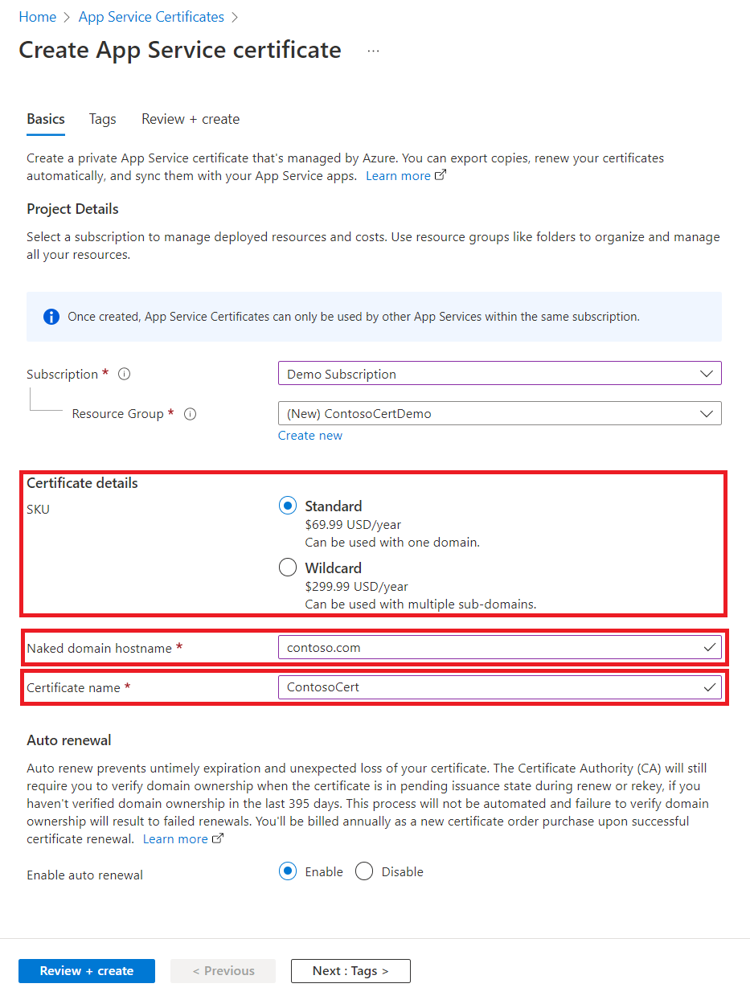
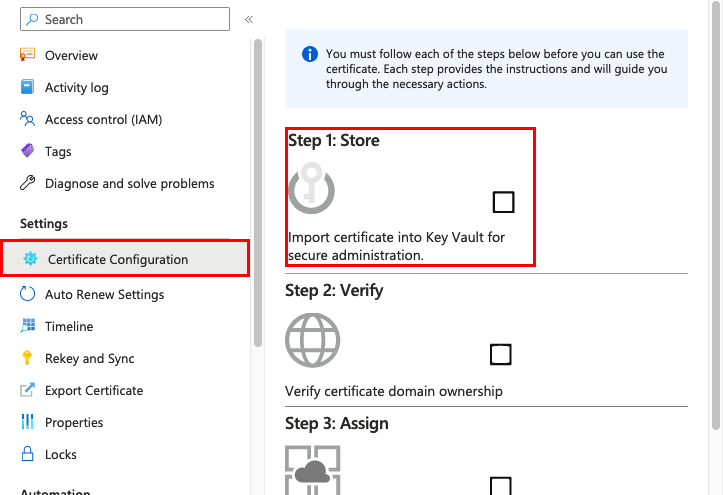
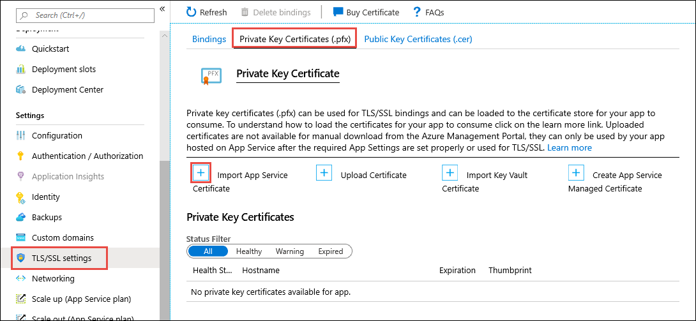
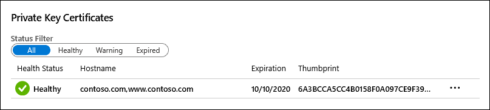
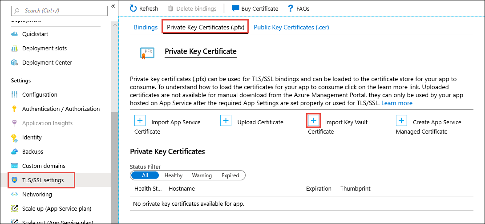
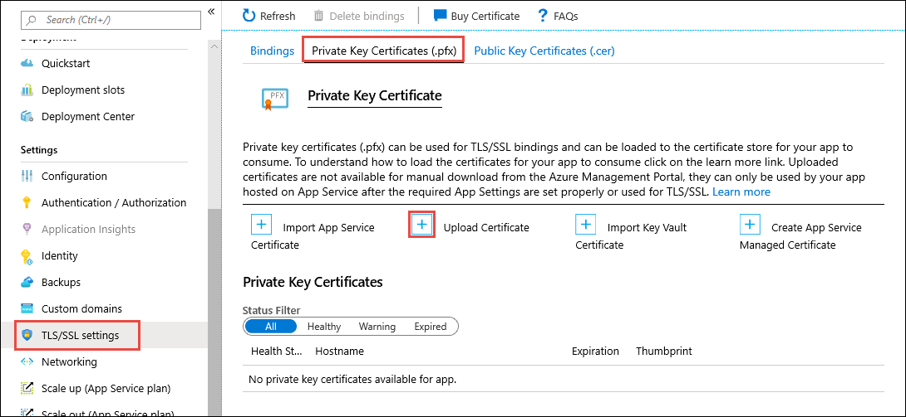
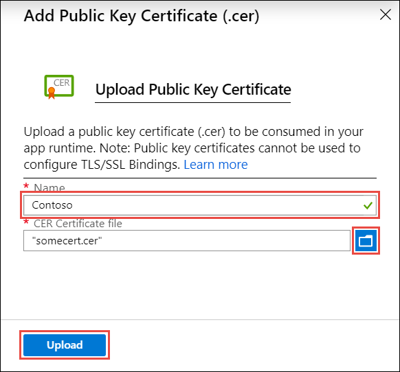
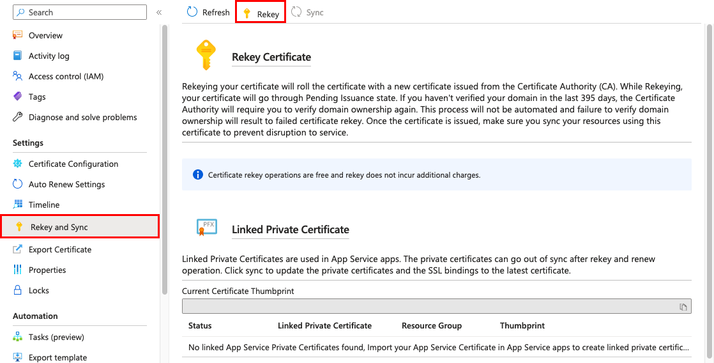
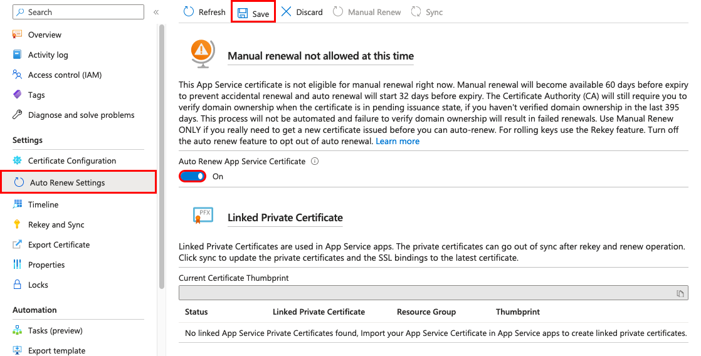
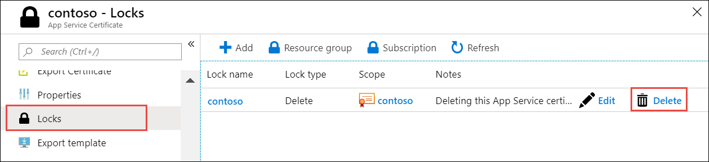

# Add a TLS/SSL certificate in Azure App Service

[Azure App Service](overview.md) provides a highly scalable, self-patching web hosting service. This article shows you how to create, upload, or import a private certificate or a public certificate into App Service. 

Once the certificate is added to your App Service app or [function app](../azure-functions/index.yml), you can [secure a custom DNS name with it](configure-ssl-bindings.md) or [use it in your application code](configure-ssl-certificate-in-code.md).

> [!NOTE]
> A certificate uploaded into an app is stored in a deployment unit that is bound to the app's resource group and region combination (internally called a *webspace*). This makes the certificate accessible to other apps in the same resource group and region combination. 

The following table lists the options you have for adding certificates in App Service:

|Option|Description|
|-|-|
| Create a free App Service Managed Certificate (Preview) | A private certificate that's free of charge and easy to use if you just need to secure your [custom domain](app-service-web-tutorial-custom-domain.md) in App Service. |
| Purchase an App Service certificate | A private certificate that's managed by Azure. It combines the simplicity of automated certificate management and the flexibility of renewal and export options. |
| Import a certificate from Key Vault | Useful if you use [Azure Key Vault](../key-vault/index.yml) to manage your [PKCS12 certificates](https://wikipedia.org/wiki/PKCS_12). See [Private certificate requirements](#private-certificate-requirements). |
| Upload a private certificate | If you already have a private certificate from a third-party provider, you can upload it. See [Private certificate requirements](#private-certificate-requirements). |
| Upload a public certificate | Public certificates are not used to secure custom domains, but you can load them into your code if you need them to access remote resources. |

## Prerequisites

- [Create an App Service app](./index.yml).
- For a private certificate, make sure that it satisfies all [requirements from App Service](#private-certificate-requirements).
- **Free certificate only**:
    - Map the domain you want a certificate for to App Service. For information, see [Tutorial: Map an existing custom DNS name to Azure App Service](app-service-web-tutorial-custom-domain.md).
    - For a root domain (like contoso.com), make sure your app doesn't have any [IP restrictions](app-service-ip-restrictions.md) configured. Both certificate creation and its periodic renewal for a root domain depends on your app being reachable from the internet.

## Private certificate requirements

The [free App Service Managed Certificate](#create-a-free-managed-certificate-preview) and the [App Service certificate](#import-an-app-service-certificate) already satisfy the requirements of App Service. If you choose to upload or import a private certificate to App Service, your certificate must meet the following requirements:

* Exported as a [password-protected PFX file](https://en.wikipedia.org/w/index.php?title=X.509&section=4#Certificate_filename_extensions), encrypted using triple DES.
* Contains private key at least 2048 bits long
* Contains all intermediate certificates in the certificate chain

To secure a custom domain in a TLS binding, the certificate has additional requirements:

* Contains an [Extended Key Usage](https://en.wikipedia.org/w/index.php?title=X.509&section=4#Extensions_informing_a_specific_usage_of_a_certificate) for server authentication (OID = 1.3.6.1.5.5.7.3.1)
* Signed by a trusted certificate authority

> [!NOTE]
> **Elliptic Curve Cryptography (ECC) certificates** can work with App Service but are not covered by this article. Work with your certificate authority on the exact steps to create ECC certificates.

[!INCLUDE [Prepare your web app](../../includes/app-service-ssl-prepare-app.md)]

## Create a free managed certificate (Preview)

> [!NOTE]
> Before creating a free managed certificate, make sure you have [fulfilled the prerequisites](#prerequisites) for your app.

The free App Service Managed Certificate is a turn-key solution for securing your custom DNS name in App Service. It's a fully functional TLS/SSL certificate that's managed by App Service and renewed automatically. The free certificate comes with the following limitations:

- Does not support wildcard certificates.
- Is not exportable.
- Is not supported on App Service Environment (ASE).
- Is not supported with root domains that are integrated with Traffic Manager.

> [!NOTE]
> The free certificate is issued by DigiCert. For some top-level domains, you must explicitly allow DigiCert as a certificate issuer by creating a [CAA domain record](https://wikipedia.org/wiki/DNS_Certification_Authority_Authorization) with the value: `0 issue digicert.com`.
> 

In the <a href="https://portal.azure.com" target="_blank">Azure portal</a>, from the left menu, select **App Services** > **\<app-name>**.

From the left navigation of your app, select **TLS/SSL settings** > **Private Key Certificates (.pfx)** > **Create App Service Managed Certificate**.


Select the custom domain to create a free certificate for and select **Create**. You can create only one certificate for each supported custom domain.

When the operation completes, you see the certificate in the **Private Key Certificates** list.


> [!IMPORTANT] 
> To secure a custom domain with this certificate, you still need to create a certificate binding. Follow the steps in [Create binding](configure-ssl-bindings.md#create-binding).
>

## Import an App Service Certificate

If you purchase an App Service Certificate from Azure, Azure manages the following tasks:

- Takes care of the purchase process from GoDaddy.
- Performs domain verification of the certificate.
- Maintains the certificate in [Azure Key Vault](../key-vault/general/overview.md).
- Manages certificate renewal (see [Renew certificate](#renew-certificate)).
- Synchronize the certificate automatically with the imported copies in App Service apps.

To purchase an App Service certificate, go to [Start certificate order](#start-certificate-order).

If you already have a working App Service certificate, you can:

- [Import the certificate into App Service](#import-certificate-into-app-service).
- [Manage the certificate](#manage-app-service-certificates), such as renew, rekey, and export it.
> [!NOTE]
> App Service Certificates are not supported in Azure National Clouds at this time.

### Start certificate order

Start an App Service certificate order in the <a href="https://portal.azure.com/#create/Microsoft.SSL" target="_blank">App Service Certificate create page</a>.



Use the following table to help you configure the certificate. When finished, click **Create**.

| Setting | Description |
|-|-|
| Name | A friendly name for your App Service certificate. |
| Naked Domain Host Name | Specify the root domain here. The issued certificate secures *both* the root domain and the `www` subdomain. In the issued certificate, the Common Name field contains the root domain, and the Subject Alternative Name field contains the `www` domain. To secure any subdomain only, specify the fully qualified domain name of the subdomain here (for example, `mysubdomain.contoso.com`).|
| Subscription | The subscription that will contain the certificate. |
| Resource group | The resource group that will contain the certificate. You can use a new resource group or select the same resource group as your App Service app, for example. |
| Certificate SKU | Determines the type of certificate to create, whether a standard certificate or a [wildcard certificate](https://wikipedia.org/wiki/Wildcard_certificate). |
| Legal Terms | Click to confirm that you agree with the legal terms. The certificates are obtained from GoDaddy. |

> [!NOTE]
> App Service Certificates purchased from Azure are issued by GoDaddy. For some top-level domains, you must explicitly allow GoDaddy as a certificate issuer by creating a [CAA domain record](https://wikipedia.org/wiki/DNS_Certification_Authority_Authorization) with the value: `0 issue godaddy.com`
> 

### Store in Azure Key Vault

Once the certificate purchase process is complete, there are few more steps you need to complete before you can start using this certificate. 

Select the certificate in the [App Service Certificates](https://portal.azure.com/#blade/HubsExtension/Resources/resourceType/Microsoft.CertificateRegistration%2FcertificateOrders) page, then click **Certificate Configuration** > **Step 1: Store**.



[Key Vault](../key-vault/general/overview.md) is an Azure service that helps safeguard cryptographic keys and secrets used by cloud applications and services. It's the storage of choice for App Service certificates.

In the **Key Vault Status** page, click **Key Vault Repository** to create a new vault or choose an existing vault. If you choose to create a new vault, use the following table to help you configure the vault and click Create. Create the new Key Vault inside the same subscription and resource group as your App Service app.

| Setting | Description |
|-|-|
| Name | A unique name that consists for alphanumeric characters and dashes. |
| Resource group | As a recommendation, select the same resource group as your App Service certificate. |
| Location | Select the same location as your App Service app. |
| Pricing tier | For information, see [Azure Key Vault pricing details](https://azure.microsoft.com/pricing/details/key-vault/). |
| Access policies| Defines the applications and the allowed access to the vault resources. You can configure it later, following the steps at [Assign a Key Vault access policy](../key-vault/general/assign-access-policy-portal.md). |
| Virtual Network Access | Restrict vault access to certain Azure virtual networks. You can configure it later, following the steps at [Configure Azure Key Vault Firewalls and Virtual Networks](../key-vault/general/network-security.md) |

Once you've selected the vault, close the **Key Vault Repository** page. The **Step 1: Store** option should show a green check mark for success. Keep the page open for the next step.

### Verify domain ownership

From the same **Certificate Configuration** page you used in the last step, click **Step 2: Verify**.


Select **App Service Verification**. Since you already mapped the domain to your web app (see [Prerequisites](#prerequisites)), it's already verified. Just click **Verify** to finish this step. Click the **Refresh** button until the message **Certificate is Domain Verified** appears.

> [!NOTE]
> Four types of domain verification methods are supported: 
> 
> - **App Service** - The most convenient option when the domain is already mapped to an App Service app in the same subscription. It takes advantage of the fact that the App Service app has already verified the domain ownership.
> - **Domain** - Verify an [App Service domain that you purchased from Azure](manage-custom-dns-buy-domain.md). Azure automatically adds the verification TXT record for you and completes the process.
> - **Mail** - Verify the domain by sending an email to the domain administrator. Instructions are provided when you select the option.
> - **Manual** - Verify the domain using either an HTML page (**Standard** certificate only) or a DNS TXT record. Instructions are provided when you select the option.

### Import certificate into App Service

In the <a href="https://portal.azure.com" target="_blank">Azure portal</a>, from the left menu, select **App Services** > **\<app-name>**.

From the left navigation of your app, select **TLS/SSL settings** > **Private Key Certificates (.pfx)** > **Import App Service Certificate**.



Select the certificate that you just purchased and select **OK**.

When the operation completes, you see the certificate in the **Private Key Certificates** list.



> [!IMPORTANT] 
> To secure a custom domain with this certificate, you still need to create a certificate binding. Follow the steps in [Create binding](configure-ssl-bindings.md#create-binding).
>

## Import a certificate from Key Vault

If you use Azure Key Vault to manage your certificates, you can import a PKCS12 certificate from Key Vault into App Service as long as it [satisfies the requirements](#private-certificate-requirements).

### Authorize App Service to read from the vault
By default, the App Service resource provider doesn’t have access to the Key Vault. In order to use a Key Vault for a certificate deployment, you need to [authorize the resource provider read access to the KeyVault](../key-vault/general/assign-access-policy-cli.md). 

`abfa0a7c-a6b6-4736-8310-5855508787cd`  is the resource provider service principal name for App Service, and it's the same for all Azure subscriptions. For Azure Government cloud environment, use `6a02c803-dafd-4136-b4c3-5a6f318b4714` instead as the resource provider service principal name.

### Import a certificate from your vault to your app

In the <a href="https://portal.azure.com" target="_blank">Azure portal</a>, from the left menu, select **App Services** > **\<app-name>**.

From the left navigation of your app, select **TLS/SSL settings** > **Private Key Certificates (.pfx)** > **Import Key Vault Certificate**.



Use the following table to help you select the certificate.

| Setting | Description |
|-|-|
| Subscription | The subscription that the Key Vault belongs to. |
| Key Vault | The vault with the certificate you want to import. |
| Certificate | Select from the list of PKCS12 certificates in the vault. All PKCS12 certificates in the vault are listed with their thumbprints, but not all are supported in App Service. |

When the operation completes, you see the certificate in the **Private Key Certificates** list. If the import fails with an error, the certificate doesn't meet the [requirements for App Service](#private-certificate-requirements).


> [!NOTE]
> If you update your certificate in Key Vault with a new certificate, App Service automatically syncs your certificate within 24 hours.

> [!IMPORTANT] 
> To secure a custom domain with this certificate, you still need to create a certificate binding. Follow the steps in [Create binding](configure-ssl-bindings.md#create-binding).
>

## Upload a private certificate

Once you obtain a certificate from your certificate provider, follow the steps in this section to make it ready for App Service.

### Merge intermediate certificates

If your certificate authority gives you multiple certificates in the certificate chain, you need to merge the certificates in order.

To do this, open each certificate you received in a text editor.

Create a file for the merged certificate, called _mergedcertificate.crt_. In a text editor, copy the content of each certificate into this file. The order of your certificates should follow the order in the certificate chain, beginning with your certificate and ending with the root certificate. It looks like the following example:

```
-----BEGIN CERTIFICATE-----
<your entire Base64 encoded SSL certificate>
-----END CERTIFICATE-----

-----BEGIN CERTIFICATE-----
<The entire Base64 encoded intermediate certificate 1>
-----END CERTIFICATE-----

-----BEGIN CERTIFICATE-----
<The entire Base64 encoded intermediate certificate 2>
-----END CERTIFICATE-----

-----BEGIN CERTIFICATE-----
<The entire Base64 encoded root certificate>
-----END CERTIFICATE-----
```

### Export certificate to PFX

Export your merged TLS/SSL certificate with the private key that your certificate request was generated with.

If you generated your certificate request using OpenSSL, then you have created a private key file. To export your certificate to PFX, run the following command. Replace the placeholders _&lt;private-key-file>_ and _&lt;merged-certificate-file>_ with the paths to your private key and your merged certificate file.

```bash
openssl pkcs12 -export -out myserver.pfx -inkey <private-key-file> -in <merged-certificate-file>  
```

When prompted, define an export password. You'll use this password when uploading your TLS/SSL certificate to App Service later.

If you used IIS or _Certreq.exe_ to generate your certificate request, install the certificate to your local machine, and then [export the certificate to PFX](/previous-versions/windows/it-pro/windows-server-2008-R2-and-2008/cc754329(v=ws.11)).

### Upload certificate to App Service

You're now ready upload the certificate to App Service.

In the <a href="https://portal.azure.com" target="_blank">Azure portal</a>, from the left menu, select **App Services** > **\<app-name>**.

From the left navigation of your app, select **TLS/SSL settings** > **Private Key Certificates (.pfx)** > **Upload Certificate**.



In **PFX Certificate File**, select your PFX file. In **Certificate password**, type the password that you created when you exported the PFX file. When finished, click **Upload**. 

When the operation completes, you see the certificate in the **Private Key Certificates** list.


> [!IMPORTANT] 
> To secure a custom domain with this certificate, you still need to create a certificate binding. Follow the steps in [Create binding](configure-ssl-bindings.md#create-binding).
>

## Upload a public certificate

Public certificates are supported in the *.cer* format. 

In the <a href="https://portal.azure.com" target="_blank">Azure portal</a>, from the left menu, select **App Services** > **\<app-name>**.

From the left navigation of your app, click **TLS/SSL settings** > **Public Certificates (.cer)** > **Upload Public Key Certificate**.

In **Name**, type a name for the certificate. In **CER Certificate file**, select your CER file.

Click **Upload**.



Once the certificate is uploaded, copy the certificate thumbprint and see [Make the certificate accessible](configure-ssl-certificate-in-code.md#make-the-certificate-accessible).

## Manage App Service certificates

This section shows you how to manage an App Service certificate you purchased in [Import an App Service certificate](#import-an-app-service-certificate).

- [Rekey certificate](#rekey-certificate)
- [Renew certificate](#renew-certificate)
- [Export certificate](#export-certificate)
- [Delete certificate](#delete-certificate)

### Rekey certificate

If you think your certificate's private key is compromised, you can rekey your certificate. Select the certificate in the [App Service Certificates](https://portal.azure.com/#blade/HubsExtension/Resources/resourceType/Microsoft.CertificateRegistration%2FcertificateOrders) page, then select **Rekey and Sync** from the left navigation.

Click **Rekey** to start the process. This process can take 1-10 minutes to complete.



Rekeying your certificate rolls the certificate with a new certificate issued from the certificate authority.

Once the rekey operation is complete, click **Sync**. The sync operation automatically updates the hostname bindings for the certificate in App Service without causing any downtime to your apps.

> [!NOTE]
> If you don't click **Sync**, App Service automatically syncs your certificate within 24 hours.

### Renew certificate

To turn on automatic renewal of your certificate at any time, select the certificate in the [App Service Certificates](https://portal.azure.com/#blade/HubsExtension/Resources/resourceType/Microsoft.CertificateRegistration%2FcertificateOrders) page, then click **Auto Renew Settings** in the left navigation. By default, App Service Certificates have a one-year validity period.

Select **On** and click **Save**. Certificates can start automatically renewing 30 days before expiration if you have automatic renewal turned on.



To manually renew the certificate instead, click **Manual Renew**. You can request to manually renew your certificate 60 days before expiration.

Once the renew operation is complete, click **Sync**. The sync operation automatically updates the hostname bindings for the certificate in App Service without causing any downtime to your apps.

> [!NOTE]
> If you don't click **Sync**, App Service automatically syncs your certificate within 24 hours.

### Export certificate

Because an App Service Certificate is a [Key Vault secret](../key-vault/general/about-keys-secrets-certificates.md), you can export a PFX copy of it and use it for other Azure services or outside of Azure.

To export the App Service Certificate as a PFX file, run the following commands in the [Cloud Shell](https://shell.azure.com). You can also run it locally if you [installed Azure CLI](/cli/azure/install-azure-cli). Replace the placeholders with the names you used when you [created the App Service certificate](#start-certificate-order).

```azurecli-interactive
secretname=$(az resource show \
    --resource-group <group-name> \
    --resource-type "Microsoft.CertificateRegistration/certificateOrders" \
    --name <app-service-cert-name> \
    --query "properties.certificates.<app-service-cert-name>.keyVaultSecretName" \
    --output tsv)

az keyvault secret download \
    --file appservicecertificate.pfx \
    --vault-name <key-vault-name> \
    --name $secretname \
    --encoding base64
```

The downloaded *appservicecertificate.pfx* file is a raw PKCS12 file that contains both the public and private certificates. In each prompt, use an empty string for the import password and the PEM pass phrase.

### Delete certificate 

Deletion of an App Service certificate is final and irreversible. Deletion of a App Service Certificate resource results in the certificate being revoked. Any binding in App Service with this certificate becomes invalid. To prevent accidental deletion, Azure puts a lock on the certificate. To delete an App Service certificate, you must first remove the delete lock on the certificate.

Select the certificate in the [App Service Certificates](https://portal.azure.com/#blade/HubsExtension/Resources/resourceType/Microsoft.CertificateRegistration%2FcertificateOrders) page, then select **Locks** in the left navigation.

Find the lock on your certificate with the lock type **Delete**. To the right of it, select **Delete**.



Now you can delete the App Service certificate. From the left navigation, select **Overview** > **Delete**. In the confirmation dialog, type the certificate name and select **OK**.

## Automate with scripts

### Azure CLI

[!code-azurecli[main](../../cli_scripts/app-service/configure-ssl-certificate/configure-ssl-certificate.sh?highlight=3-5 "Bind a custom TLS/SSL certificate to a web app")] 

### PowerShell

[!code-powershell[main](../../powershell_scripts/app-service/configure-ssl-certificate/configure-ssl-certificate.ps1?highlight=1-3 "Bind a custom TLS/SSL certificate to a web app")]

## More resources

* [Secure a custom DNS name with a TLS/SSL binding in Azure App Service](configure-ssl-bindings.md)
* [Enforce HTTPS](configure-ssl-bindings.md#enforce-https)
* [Enforce TLS 1.1/1.2](configure-ssl-bindings.md#enforce-tls-versions)
* [Use a TLS/SSL certificate in your code in Azure App Service](configure-ssl-certificate-in-code.md)
* [FAQ : App Service Certificates](./faq-configuration-and-management.md)
