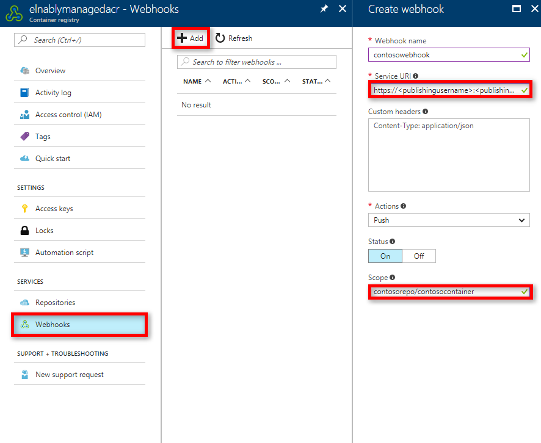
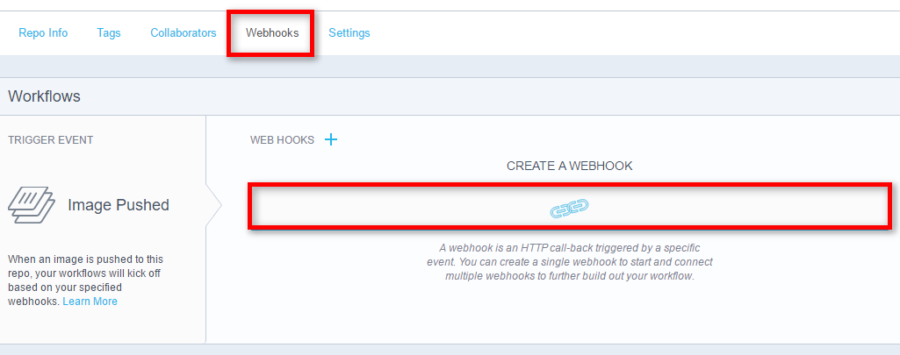
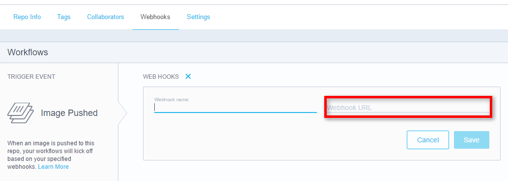

# Continuous deployment with Web App for Containers

In this tutorial, you configure continuous deployment for a custom container image from managed [Azure Container Registry](https://azure.microsoft.com/services/container-registry/) repositories or [Docker Hub](https://hub.docker.com).

## Sign in to Azure

Sign in to the [Azure portal](https://portal.azure.com).

## Enable the continuous deployment feature

Enable the continuous deployment feature by using [Azure CLI](https://docs.microsoft.com/cli/azure/install-azure-cli) and executing the following command:

```azurecli-interactive
az webapp deployment container config --name name --resource-group myResourceGroup --enable-cd true
```

In the [Azure portal](https://portal.azure.com/), select the **App Service** option on the left side of the page.

Select the name of the app for which you want to configure Docker Hub continuous deployment.

On the **Docker Container** page, select **On**, and then select **Save** to enable continuous deployment.


## Prepare the webhook URL

Obtain the webhook URL by using [Azure CLI](https://docs.microsoft.com/cli/azure/install-azure-cli) and executing the following command:

```azurecli-interactive
az webapp deployment container show-cd-url --name sname1 --resource-group rgname
```

For the webhook URL, you need the following endpoint: 
`https://<publishingusername>:<publishingpwd>@<sitename>.scm.azurewebsites.net/docker/hook`.

You can obtain your `publishingusername` and `publishingpwd` by downloading the web app publish profile using the Azure portal.


## Add a webhook

### Azure Container Registry

1. On your registry portal page, select **Webhooks**.
2. To create a new webhook, select **Add**. 
3. In the **Create webhook** pane, give your webhook a name. For the webhook URI, provide the URL obtained in the preceding section.

Make sure you define the scope as the repo that contains your container image.



When you update the image, the web app is updated automatically with the new image.

### Docker Hub

On your Docker Hub page, select **Webhooks**, and then **CREATE A WEBHOOK**.



For the webhook URL, provide the URL that you obtained earlier.



When you update the image, the web app is updated automatically with the new image.

## Next steps

* [Introduction to Azure App Service on Linux](./app-service-linux-intro.md)
* [Azure Container Registry](https://azure.microsoft.com/services/container-registry/)
* [Create a .NET Core web app in App Service on Linux](quickstart-dotnetcore.md)
* [Create a Ruby web app in App Service on Linux](quickstart-ruby.md)
* [Deploy a Docker/Go web app in Web App for Containers](quickstart-docker-go.md)
* [Azure App Service on Linux FAQ](./app-service-linux-faq.md)
* [Manage Web App for Containers using Azure CLI](./app-service-linux-cli.md)
