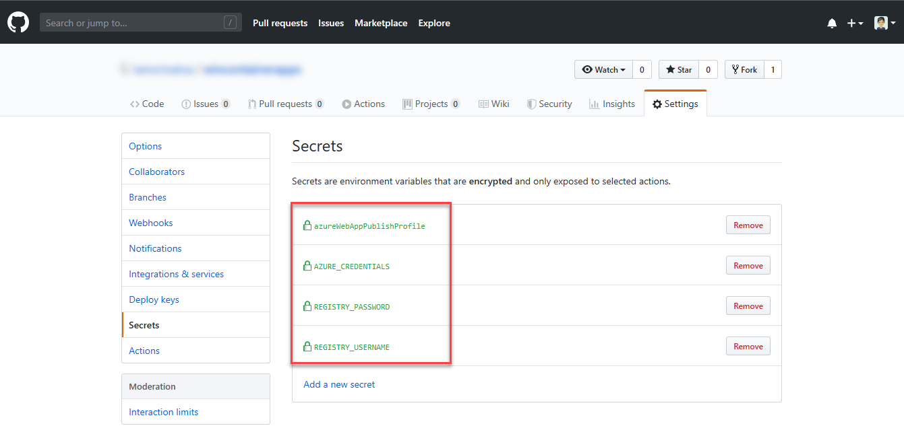

# GitHub Actions for deploying to Web App for Containers

[GitHub Actions](https://help.github.com/en/articles/about-github-actions) gives you the flexibility to build an automated software development lifecycle workflow. With the Azure App Service Actions for GitHub, you can automate your workflow to deploy [Azure Web Apps for Containers](https://azure.microsoft.com/services/app-service/containers/) using GitHub Actions.

> [!IMPORTANT]
> GitHub Actions is currently in beta. You must first [sign-up to join the preview](https://github.com/features/actions) using your GitHub account.
> 

A workflow is defined by a YAML (.yml) file in the `/.github/workflows/` path in your repository. This definition contains the various steps and parameters that make up the workflow.

For an Azure Web App container workflow, the file has three sections:

|Section  |Tasks  |
|---------|---------|
|**Authentication** | 1. Define a service principal <br /> 2. Create a GitHub secret |
|**Build** | 1. Set up the environment <br /> 2. Build the container image |
|**Deploy** | 1. Deploy the container image |

## Create a service principal

You can create a [service principal](https://docs.microsoft.com/azure/active-directory/develop/app-objects-and-service-principals#service-principal-object) by using the [az ad sp create-for-rbac](https://docs.microsoft.com/cli/azure/ad/sp?view=azure-cli-latest#az-ad-sp-create-for-rbac) command in the [Azure CLI](https://docs.microsoft.com/cli/azure/). You can run this command using [Azure Cloud Shell](https://shell.azure.com/) in the Azure portal or by selecting the **Try it** button.

```azurecli-interactive
az ad sp create-for-rbac --name "myApp" --role contributor --scopes /subscriptions/<SUBSCRIPTION_ID>/resourceGroups/<RESOURCE_GROUP>/providers/Microsoft.Web/sites/<APP_NAME> --sdk-auth
```

In this example, replace the placeholders in the resource with your subscription ID, resource group and web app name. The output is the role assignment credentials that provides access to your Web App. Copy this JSON object, which you can use to authenticate from GitHub.

> [!NOTE]
> You do not need to create a service principal if you decide to use publish profile for authentication.

> [!IMPORTANT]
> It is always a good practice to grant minimum access. This is why the scope in the previous example is limited to the specific web app and not the entire resource group.

## Configure the GitHub secret

The below example uses user-level credentials i.e. Azure Service Principal for deployment. Follow the steps to configure the secret:

1. In [GitHub](https://github.com/), browse your repository, select **Settings > Secrets > Add a new secret**

2. Paste the contents of the below `az cli` command as the value of secret variable. For example, `AZURE_CREDENTIALS`.

    
    ```azurecli
    az ad sp create-for-rbac --name "myApp" --role contributor \
                                --scopes /subscriptions/{subscription-id}/resourceGroups/{resource-group} \
                                --sdk-auth
                                
    # Replace {subscription-id}, {resource-group} with the subscription, resource group details
    ```

3. Now in the workflow file in your branch: `.github/workflows/workflow.yml` replace the secret in Azure login action with your secret.

4. Similarly, define the following additional secrets for the container registry credentials and set them in Docker login action. 

    - REGISTRY_USERNAME
    - REGISTRY_PASSWORD

5. You will see the secrets as shown below once defined.

    

## Build the Container image

The following example show part of the workflow that builds the docker image.

```yaml
on: [push]

name: Linux_Container_Node_Workflow

jobs:
  build-and-deploy:
    runs-on: ubuntu-latest
    steps:
    # checkout the repo
    - name: 'Checkout Github Action' 
      uses: actions/checkout@master
    
    - name: 'Login via Azure CLI'
      uses: azure/actions/login@v1
      with:
        creds: ${{ secrets.AZURE_CREDENTIALS }}
    
    - uses: azure/docker-login@v1
      with:
        login-server: contoso.azurecr.io
        username: ${{ secrets.REGISTRY_USERNAME }}
        password: ${{ secrets.REGISTRY_PASSWORD }}
    
    - run: |
        docker build . -t contoso.azurecr.io/nodejssampleapp:${{ github.sha }}
        docker push contoso.azurecr.io/nodejssampleapp:${{ github.sha }}
```

## Deploy to Web App Container

To deploy your image to a web app container, you will need to use the `Azure/appservice-actions/webapp@master` action. This action has 5 parameters:

| **Parameter**  | **Explanation**  |
|---------|---------|
| **app-name** | (Required) Name of the Azure Web App | 
| **slot-name** | (Optional) Enter an existing Slot other than the Production slot |
| **images** | (Required) Specify the fully qualified container image(s) name. For example, 'myregistry.azurecr.io/nginx:latest' or 'python:3.7.2-alpine/'. For multi-container scenario multiple container image names can be provided (multi-line separated) |
| **configuration-file** | (Optional) Path of the Docker-Compose file. Should be a fully qualified path or relative to the default working directory. Required for multi-container scenario |
| **container-command** | (Optional) Enter the start up command. For ex. dotnet run or dotnet filename.dll |

Below is the sample workflow to build and deploy a Node.js Web app to Azure Web App Container.

```yaml
on: [push]

name: Linux_Container_Node_Workflow

jobs:
  build-and-deploy:
    runs-on: ubuntu-latest
    steps:
    # checkout the repo
    - name: 'Checkout Github Action' 
      uses: actions/checkout@master
    
    - name: 'Login via Azure CLI'
      uses: azure/actions/login@v1
      with:
        creds: ${{ secrets.AZURE_CREDENTIALS }}
    
    - uses: azure/docker-login@v1
      with:
        login-server: contoso.azurecr.io
        username: ${{ secrets.REGISTRY_USERNAME }}
        password: ${{ secrets.REGISTRY_PASSWORD }}
    
    - run: |
        docker build . -t contoso.azurecr.io/nodejssampleapp:${{ github.sha }}
        docker push contoso.azurecr.io/nodejssampleapp:${{ github.sha }} 
      
    - uses: azure/webapps-container-deploy@v1
      with:
        app-name: 'node-rnc'
        images: 'contoso.azurecr.io/nodejssampleapp:${{ github.sha }}'
    
    - name: Azure logout
      run: |
        az logout
```

## Next steps

You can find our set of Actions grouped into different repositories on GitHub, each one containing documentation and examples to help you use GitHub for CI/CD and deploy your apps to Azure.

- [Azure login](https://github.com/Azure/actions)

- [Azure WebApp](https://github.com/Azure/webapps-deploy)

- [Azure WebApp for containers](https://github.com/Azure/webapps-container-deploy)

- [Docker login/logout](https://github.com/Azure/docker-login)

- [Events that trigger workflows](https://help.github.com/en/articles/events-that-trigger-workflows)

- [K8s deploy](https://github.com/Azure/k8s-deploy)

- [Starter Workflows](https://github.com/actions/starter-workflows)
