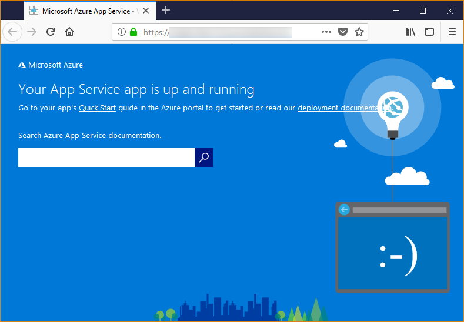

# Configure a Linux Python app for Azure App Service

This article describes how [Azure App Service](app-service-linux-intro.md) runs Python apps, and how you can customize the behavior of App Service when needed. Python apps must be deployed with all the required [pip](https://pypi.org/project/pip/) modules.

The App Service deployment engine automatically activates a virtual environment and runs `pip install -r requirements.txt` for you when you deploy a [Git repository](../deploy-local-git.md?toc=%2fazure%2fapp-service%2fcontainers%2ftoc.json), or a [Zip package](../deploy-zip.md?toc=%2fazure%2fapp-service%2fcontainers%2ftoc.json) with build processes switched on.

This guide provides key concepts and instructions for Python developers who use a built-in Linux container in App Service. If you've never used Azure App Service, you should follow the [Python quickstart](quickstart-python.md) and [Python with PostgreSQL tutorial](tutorial-python-postgresql-app.md) first.

> [!NOTE]
> Linux is currently the recommended option for running Python apps in App Service. For information on the Windows option, see [Python on the Windows flavor of App Service](https://docs.microsoft.com/visualstudio/python/managing-python-on-azure-app-service).
>

## Show Python version

To show the current Python version, run the following command in the [Cloud Shell](https://shell.azure.com):

```azurecli-interactive
az webapp config show --resource-group <resource-group-name> --name <app-name> --query linuxFxVersion
```

To show all supported Python versions, run the following command in the [Cloud Shell](https://shell.azure.com):

```azurecli-interactive
az webapp list-runtimes --linux | grep PYTHON
```

You can run an unsupported version of Python by building your own container image instead. For more information, see [use a custom Docker image](tutorial-custom-docker-image.md).

## Set Python version

Run the following command in the [Cloud Shell](https://shell.azure.com) to set the Python version to 3.7:

```azurecli-interactive
az webapp config set --resource-group <resource-group-name> --name <app-name> --linux-fx-version "PYTHON|3.7"
```

## Container characteristics

Python apps deployed to App Service on Linux run within a Docker container that's defined in the GitHub repository, [Python 3.6](https://github.com/Azure-App-Service/python/tree/master/3.6.6) or [Python 3.7](https://github.com/Azure-App-Service/python/tree/master/3.7.0).

This container has the following characteristics:

- Apps are run using the [Gunicorn WSGI HTTP Server](https://gunicorn.org/), using the additional arguments `--bind=0.0.0.0 --timeout 600`.

- By default, the base image includes the Flask web framework, but the container supports other frameworks that are WSGI-compliant and compatible with Python 3.7, such as Django.

- To install additional packages, such as Django, create a [*requirements.txt*](https://pip.pypa.io/en/stable/user_guide/#requirements-files) file in the root of your project using `pip freeze > requirements.txt`. Then, publish your project to App Service using Git deployment, which automatically runs `pip install -r requirements.txt` in the container to install your app's dependencies.

## Container startup process

During startup, the App Service on Linux container runs the following steps:

1. Use a [custom startup command](#customize-startup-command), if provided.
2. Check for the existence of a [Django app](#django-app), and launch Gunicorn for it if detected.
3. Check for the existence of a [Flask app](#flask-app), and launch Gunicorn for it if detected.
4. If no other app is found, start a default app that's built into the container.

The following sections provide additional details for each option.

### Django app

For Django apps, App Service looks for a file named `wsgi.py` within your app code, and then runs Gunicorn using the following command:

```bash
# <module> is the path to the folder that contains wsgi.py
gunicorn --bind=0.0.0.0 --timeout 600 <module>.wsgi
```

If you want more specific control over the startup command, use a [custom startup command](#customize-startup-command) and replace `<module>` with the name of the module that contains *wsgi.py*.

### Flask app

For Flask, App Service looks for a file named *application.py* or *app.py* and starts Gunicorn as follows:

```bash
# If application.py
gunicorn --bind=0.0.0.0 --timeout 600 application:app
# If app.py
gunicorn --bind=0.0.0.0 --timeout 600 app:app
```

If your main app module is contained in a different file, use a different name for the app object, or you want to provide additional arguments to Gunicorn, use a [custom startup command](#customize-startup-command).

### Default behavior

If the App Service doesn't find a custom command, a Django app, or a Flask app, then it runs a default read-only app, located in the _opt/defaultsite_ folder. The default app appears as follows:



## Customize startup command

You can control the container's startup behavior by providing a custom Gunicorn startup command. To do this, running the following command in the [Cloud Shell](https://shell.azure.com):

```azurecli-interactive
az webapp config set --resource-group <resource-group-name> --name <app-name> --startup-file "<custom-command>"
```

For example, if you have a Flask app whose main module is *hello.py* and the Flask app object in that file is named `myapp`, then *\<custom-command>* is as follows:

```bash
gunicorn --bind=0.0.0.0 --timeout 600 hello:myapp
```

If your main module is in a subfolder, such as `website`, specify that folder with the `--chdir` argument:

```bash
gunicorn --bind=0.0.0.0 --timeout 600 --chdir website hello:myapp
```

You can also add any additional arguments for Gunicorn to *\<custom-command>*, such as `--workers=4`. For more information, see [Running Gunicorn](https://docs.gunicorn.org/en/stable/run.html) (docs.gunicorn.org).

To use a non-Gunicorn server, such as [aiohttp](https://aiohttp.readthedocs.io/en/stable/web_quickstart.html), you can replace *\<custom-command>* with something like this:

```bash
python3.7 -m aiohttp.web -H localhost -P 8080 package.module:init_func
```

> [!Note]
> App Service ignores any errors that occur when processing a custom command file, then continues its startup process by looking for Django and Flask apps. If you don't see the behavior you expect, check that your startup file is deployed to App Service and that it doesn't contain any errors.

## Access environment variables

In App Service, you can [set app settings](../configure-common.md?toc=%2fazure%2fapp-service%2fcontainers%2ftoc.json#configure-app-settings) outside of your app code. Then you can access them using the standard [os.environ](https://docs.python.org/3/library/os.html#os.environ) pattern. For example, to access an app setting called `WEBSITE_SITE_NAME`, use the following code:

```python
os.environ['WEBSITE_SITE_NAME']
```

## Detect HTTPS session

In App Service, [SSL termination](https://wikipedia.org/wiki/TLS_termination_proxy) happens at the network load balancers, so all HTTPS requests reach your app as unencrypted HTTP requests. If your app logic needs to check if the user requests are encrypted or not, inspect the `X-Forwarded-Proto` header.

```python
if 'X-Forwarded-Proto' in request.headers and request.headers['X-Forwarded-Proto'] == 'https':
# Do something when HTTPS is used
```

Popular web frameworks let you access the `X-Forwarded-*` information in your standard app pattern. In [CodeIgniter](https://codeigniter.com/), the [is_https()](https://github.com/bcit-ci/CodeIgniter/blob/master/system/core/Common.php#L338-L365) checks the value of `X_FORWARDED_PROTO` by default.

## Access diagnostic logs

[!INCLUDE [Access diagnostic logs](../../../includes/app-service-web-logs-access-no-h.md)]

## Open SSH session in browser

[!INCLUDE [Open SSH session in browser](../../../includes/app-service-web-ssh-connect-builtin-no-h.md)]

## Troubleshooting

- **You see the default app after deploying your own app code.** The default app appears because you either haven't deployed your app code to App Service, or App Service failed to find your app code and ran the default app instead.
- Restart the App Service, wait 15-20 seconds, and check the app again.
- Be sure you're using App Service for Linux rather than a Windows-based instance. From the Azure CLI, run the command `az webapp show --resource-group <resource_group_name> --name <app_service_name> --query kind`, replacing `<resource_group_name>` and `<app_service_name>` accordingly. You should see `app,linux` as output; otherwise, recreate the App Service and choose Linux.
- Use SSH or the Kudu console to connect directly to the App Service and verify that your files exist under *site/wwwroot*. If your files don't exist, review your deployment process and redeploy the app.
- If your files exist, then App Service wasn't able to identify your specific startup file. Check that your app is structured as App Service expects for [Django](#django-app) or [Flask](#flask-app), or use a [custom startup command](#customize-startup-command).
- **You see the message "Service Unavailable" in the browser.** The browser has timed out waiting for a response from App Service, which indicates that App Service started the Gunicorn server, but the arguments that specify the app code are incorrect.
- Refresh the browser, especially if you're using the lowest pricing tiers in your App Service Plan. The app may take longer to start up when using free tiers, for example, and becomes responsive after you refresh the browser.
- Check that your app is structured as App Service expects for [Django](#django-app) or [Flask](#flask-app), or use a [custom startup command](#customize-startup-command).
- [Access the log stream](#access-diagnostic-logs).

## Next steps

> [!div class="nextstepaction"]
> [Tutorial: Python app with PostgreSQL](tutorial-python-postgresql-app.md)

> [!div class="nextstepaction"]
> [Tutorial: Deploy from private container repository](tutorial-custom-docker-image.md)

> [!div class="nextstepaction"]
> [App Service Linux FAQ](app-service-linux-faq.md)
