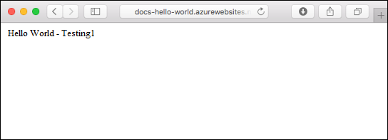

# Run a custom Docker Hub image in Azure Web App for Containers #

App Service provides pre-defined application stacks on Linux with support for specific versions, such as PHP 7.0 and Node.js 4.5. You can also use a custom Docker image to deploy your web app to an application stack that is not already defined in Azure. This quickstart shows how to create a web app and deploy a Python image to it. You create the web app using the [Azure CLI](https://docs.microsoft.com/cli/azure/get-started-with-azure-cli).

[!INCLUDE [cloud-shell-try-it.md](../../../includes/cloud-shell-try-it.md)]

[!INCLUDE [Configure deployment user](../../../includes/configure-deployment-user.md)] 

[!INCLUDE [Create resource group](../../../includes/app-service-web-create-resource-group.md)] 

[!INCLUDE [Create app service plan](../../../includes/app-service-web-create-app-service-plan-linux.md)] 

## Create a web app

Create a [web app](../../app-service-web/app-service-web-overview.md) in the `myAppServicePlan` App Service plan with the [az webapp create](/cli/azure/webapp#create) command. Don't forget to replace `<app name>` with a unique app name.

```azurecli-interactive
az webapp create --resource-group myResourceGroup --plan myAppServicePlan --name <app name> --deployment-container-image-name elnably/dockerimagetest
```

In the preceding command, `--deployment-container-image-name` points to the public Docker Hub image [https://hub.docker.com/r/elnably/dockerimagetest/](https://hub.docker.com/r/elnably/dockerimagetest/). You can inspect its content at [https://github.com/rachelappel/docker-image](https://github.com/rachelappel/docker-image).

When the web app has been created, the Azure CLI shows output similar to the following example:

```json
{
  "availabilityState": "Normal",
  "clientAffinityEnabled": true,
  "clientCertEnabled": false,
  "cloningInfo": null,
  "containerSize": 0,
  "dailyMemoryTimeQuota": 0,
  "defaultHostName": "<app name>.azurewebsites.net",
  "deploymentLocalGitUrl": "https://<username>@<app name>.scm.azurewebsites.net/<app name>.git",
  "enabled": true,
  < JSON data removed for brevity. >
}
```

## Browse to the app

Browse to the following URL using your web browser.

```bash
http://<app_name>.azurewebsites.net
```



**Congratulations!** You've deployed a custom Docker image to Web App for Containers.

## Next steps

> [!div class="nextstepaction"]
> [Build a Docker Python and PostgreSQL web app in Azure](tutorial-docker-python-postgresql-app.md)
