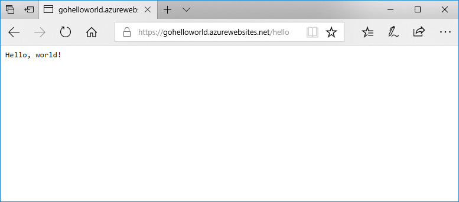

# Run a custom Linux container in Azure App Service

[App Service Linux](app-service-linux-intro.md) provides pre-defined application stacks on Linux with support for languages such as .NET, PHP, Node.js and others. You can also use a custom Docker image to run your web app on an application stack that is not already defined in Azure. This quickstart shows how to create a web app and deploy a Go image from Docker Hub. You create the web app using the [Azure CLI](https://docs.microsoft.com/cli/azure/get-started-with-azure-cli).



[!INCLUDE [quickstarts-free-trial-note](../../../includes/quickstarts-free-trial-note.md)]

[!INCLUDE [cloud-shell-try-it.md](../../../includes/cloud-shell-try-it.md)]

[!INCLUDE [Create resource group](../../../includes/app-service-web-create-resource-group-linux.md)]

[!INCLUDE [Create app service plan](../../../includes/app-service-web-create-app-service-plan-linux.md)]

## Create a web app

Create a [web app](../overview.md) in the `myAppServicePlan` App Service plan with the [az webapp create](/cli/azure/webapp?view=azure-cli-latest#az-webapp-create) command. Don't forget to replace `<app name>` with a globally unique app name (valid characters are `a-z`, `0-9`, and `-`).

```azurecli-interactive
az webapp create --resource-group myResourceGroup --plan myAppServicePlan --name <app name> --deployment-container-image-name microsoft/azure-appservices-go-quickstart
```

In the preceding command, `--deployment-container-image-name` points to the public Docker Hub image [microsoft/azure-appservices-go-quickstart](https://hub.docker.com/r/microsoft/azure-appservices-go-quickstart/).

When the web app has been created, the Azure CLI shows output similar to the following example:

```json
{
  "availabilityState": "Normal",
  "clientAffinityEnabled": true,
  "clientCertEnabled": false,
  "cloningInfo": null,
  "containerSize": 0,
  "dailyMemoryTimeQuota": 0,
  "defaultHostName": "<app name>.azurewebsites.net",
  "deploymentLocalGitUrl": "https://<username>@<app name>.scm.azurewebsites.net/<app name>.git",
  "enabled": true,
  < JSON data removed for brevity. >
}
```

## Browse to the app

```bash
http://<app_name>.azurewebsites.net/hello
```


**Congratulations!** You've deployed a custom Docker image running a Go application to Web App for Containers.

[!INCLUDE [Clean-up section](../../../includes/cli-script-clean-up.md)]

## Next steps

> [!div class="nextstepaction"]
> [Tutorial: Deploy from private container repository](tutorial-custom-docker-image.md)

> [!div class="nextstepaction"]
> [Configure a custom container](configure-custom-container.md)

> [!div class="nextstepaction"]
> [Tutorial: Multi-container WordPress app](tutorial-multi-container-app.md)
