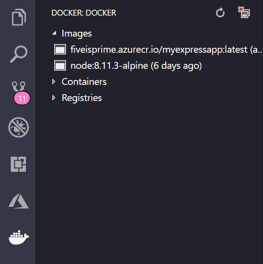

# Deploy to Azure using Docker

App Service on Linux provides pre-defined application stacks on Linux with support for languages such as .NET, PHP, Node.js and others. You can also use a custom Docker image to run your web app on an application stack that is not already defined in Azure. This quickstart shows you how to containerize an existing application using [Docker](https://www.docker.com/), then push the app image to a Docker registry and deploy it to [Azure Web App for Containers](https://azure.microsoft.com/services/app-service/containers/).

## Prerequisites

If you don't have an Azure account, [sign up today](https://azure.microsoft.com/free/?utm_source=campaign&utm_campaign=vscode-tutorial-docker-extension&mktingSource=vscode-tutorial-docker-extension) for a free account with $200 in Azure credits to try out any combination of services.

You need [Visual Studio Code](https://code.visualstudio.com/) installed along with [Docker](https://www.docker.com/community-edition).

You will also need to install the following extensions:

* [Docker extension](vscode:extension/PeterJausovec.vscode-docker). You can use this extension to simplify the management of local Docker images and commands and to deploy built app images to Azure.
* [Azure App Service extension](vscode:extension/ms-azuretools.vscode-azureappservice). You can use this extension to create, manage, and deploy Linux Web Apps on the Azure Platform as a Service (PaaS).

### Sign in

Once the extensions are installed, log into your Azure account - in the Activity Bar, click on the Azure logo to show the **AZURE APP SERVICE** explorer. Click **Sign in to Azure** and follow the instructions.


### Prerequisite Check

Before we continue, ensure that you have all the prerequisites installed and configured.

In VS Code, you should see your Azure email address in the Status Bar and your subscription in the **AZURE APP SERVICE** explorer.

Verify that you have Docker installed and running.

```bash
docker --version
Docker Version 17.12.0-ce, build c97c6d6
```

> [!div class="nextstepaction"]
> [I ran into an issue](https://www.research.net/r/PWZWZ52?tutorial=node-deployment-docker-extension&step=getting-started)

## Using Container Registries

You need a container registry to push your app image to once the image is built. Once your image is available in a container registry, you'll deploy directly from that registry.

### Using Azure Container Registry

[Azure Container Registry](https://azure.microsoft.com/services/container-registry/) (ACR) is a private, secure, hosted registry for your images. ACR is used in this tutorial, but the steps are the same for other registry services.

Create an Azure Container Registry by signing in to the [Azure portal](https://portal.azure.com) then selecting **Create a resource** > **Containers** > **Container Registry**.


Enter values for **Registry name** and **Resource group**. The registry name must be unique within Azure and contain 5-50 alphanumeric characters. For this quickstart, select **'Basic'** for the **SKU**. Select **Create** to deploy the ACR instance.


Once the Registry is created, click **Access Keys** from the left menu and **Enable** the Admin User option.


With the admin user account enabled, log into your registry from the Docker CLI using the following command.

```bash
docker login <registryname>.azurecr.io  # Copy from "Login Server"
Username:   # Copy from "Username"
Password:   # Copy from "Password"
Login Succeeded
```

### Using Docker Hub

Docker Hub is Docker's own hosted registry that provides a free way of sharing images. Sign up for a Docker ID on [Docker Hub](https://hub.docker.com/), then sign in to the Docker CLI using your Docker ID credentials.

### Prerequisite Check

Ensure that the registry endpoint that you just setup is visible under **Registries** in the **DOCKER** explorer.


> [!div class="nextstepaction"]
> [I ran into an issue](https://www.research.net/r/PWZWZ52?tutorial=node-deployment-docker-extension&step=create-registry)

## Create your application image

Next, use the Docker extension to add the necessary files to create an image for your app, build the image, and push it to a registry.

If you don't already have an app for this quickstart, follow the [Node.js tutorial](https://code.visualstudio.com/docs/nodejs/nodejs-tutorial).

### Add Docker files

Open the **Command Palette** (CTRL + SHIFT + P) and type `add docker files to workspace` to run the **Docker: Add Docker files to workspace** command. This command will create the necessary Docker files. Choose your application type (such as **Node.js**) along with the port that your application listens on.

> [!IMPORTANT]
> Be sure that the port you select matches the port your app listens on. For example, if you used the Express generator described in the [Node.js tutorial](https://code.visualstudio.com/docs/nodejs/nodejs-tutorial), set this to 3000.

This action will add a `Dockerfile` along with some configuration files for Docker compose and a `.dockerignore`.

Visual Studio Code also supports features such as smart suggestions, completions, and error detection. For more information, see [Working with Docker](https://code.visualstudio.com/docs/azure/docker).

### Build a Docker image

The `Dockerfile` file describes the environment for your app including the location of the source files and the command to start the app within a container.

Open the **Command Palette** (CTRL + SHIFT + P) and run **Docker: Build Image** to build the image. Choose the `Dockerfile` file then give the image a name. It's important that you specify a couple of things here. The format is as follows:

`[registry or username]/[image name]:[tag]`

Here's an example, using the Azure Container Registry:

`fiveisprime.azurecr.io/myexpressapp:latest`


If you're using Docker Hub, use your Docker Hub username. For example:

`fiveisprime/myexpressapp:latest`

When the build finishes, the **Terminal** panel will open and the Docker command will run. Viewing the terminal is a good way to get an understanding of the commands required to do the same steps when you use the terminal directly. You'll also see each step, or layer, that makes up the app environment.

Once built, the image will show up in the **DOCKER** explorer under **Images**.



### Push the image to a registry

Open the **Command Palette** (CTRL + SHIFT + P), run **Docker: Push**, and choose the image you built to push the image to the registry. This command will also execute the Docker command in the Terminal panel to show the status of the operation. When the command finishes, expand the **Images** node in the Docker extension explorer to see your image.


Next, you'll deploy your image to Azure.

> [!div class="nextstepaction"]
> [I ran into an issue](https://www.research.net/r/PWZWZ52?tutorial=node-deployment-docker-extension&step=containerize-app)

## Deploy the image to Azure App Service

Now that you have your app image built and pushed to a registry, you can deploy to [Azure App Service](https://azure.microsoft.com/services/app-service/) directly from the Docker extension explorer.

### Deploy the image

Find the image under the **Registries** node in the **DOCKER** explorer, right-click the `:latest` tag, and choose **Deploy Image to Azure App Service**.


From here, follow the prompts. Set up a Resource Group in `West US` and App Service Plan. For this quickstart, use 'myResourceGroup' and 'myPlan' for the Resource Group and plan names then give your app a **unique** name.

Once created, your app is accessible via http://**unique-name**.azurewebsites.net. In this example, I called it `myExpressApp4321`.


A **Resource Group** is essentially a named collection of all our application's resources in Azure. For example, a Resource Group can contain a reference to a website, a database, and an Azure Function.

An **App Service Plan** defines the physical resources that will be used to host our website. In this quickstart, we'll use a **Basic** hosting plan on **Linux** infrastructure, which means the site will be hosted on a Linux machine alongside other websites. You can scale up and be the only site running on a machine later in the Azure portal.

### Browse the website

The **Output** panel will open during deployment to indicate the status of the operation. When the operation completes, find the app you created in the **AZURE APP SERVICE** explorer, right-click it, then choose **Browse Website** to open the site in your browser.

> [!div class="nextstepaction"]
> [I ran into an issue](https://www.research.net/r/PWZWZ52?tutorial=node-deployment-docker-extension&step=deploy-app)

## Viewing Logs

In this step, you learn how to view (or "tail") the logs from the running website. Any calls to `console.log` in the site are displayed in the Output panel in Visual Studio Code.

Find the app in the **AZURE APP SERVICE** explorer, right-click the app, and choose **View Streaming Logs**.

When prompted, choose to enable logging and restart the application. Once the app is restarted, the VS Code Output panel opens with a connection to the log stream.


After a few seconds, you'll see a message indicating that you're connected to the log-streaming service.

```bash
Connecting to log-streaming service...
2017-12-21 17:33:51.428 INFO  - Container practical-mustache_2 for site practical-mustache initialized successfully.
2017-12-21 17:33:56.500 INFO  - Container logs
```

Refresh the page a few times in the browser to see log output.

```bash
2017-12-21 17:35:17.774 INFO  - Container logs
2017-12-21T17:35:14.955412230Z GET / 304 141.798 ms - -
2017-12-21T17:35:15.248930479Z GET /stylesheets/style.css 304 3.180 ms - -
2017-12-21T17:35:15.378623115Z GET /favicon.ico 404 53.839 ms - 995
```

## Next steps

Congratulations, you've successfully completed this quickstart!

Next, check out the other Azure extensions.

* [Cosmos DB](https://marketplace.visualstudio.com/items?itemName=ms-azuretools.vscode-cosmosdb)
* [Azure Functions](https://marketplace.visualstudio.com/items?itemName=ms-azuretools.vscode-azurefunctions)
* [Azure CLI Tools](https://marketplace.visualstudio.com/items?itemName=ms-vscode.azurecli)
* [Azure Resource Manager Tools](https://marketplace.visualstudio.com/items?itemName=msazurermtools.azurerm-vscode-tools)

Or get them all by installing the
[Azure Tools](https://marketplace.visualstudio.com/items?itemName=ms-vscode.vscode-node-azure-pack) extension pack.
