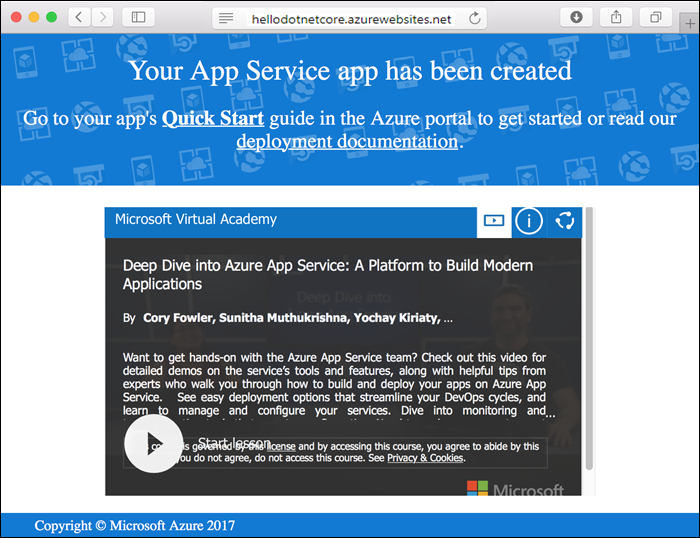

# Create an ASP.NET Core app in App Service on Linux

> [!NOTE]
> This article deploys an app to App Service on Linux. To deploy to App Service on _Windows_, see [Create an ASP.NET Core app in Azure](../app-service-web-get-started-dotnet.md).
>

[App Service on Linux](app-service-linux-intro.md) provides a highly scalable, self-patching web hosting service using the Linux operating system. This quickstart shows how to create a [.NET Core](https://docs.microsoft.com/aspnet/core/) app on App Service on Linux. You create the app using the [Azure CLI](https://docs.microsoft.com/cli/azure/get-started-with-azure-cli), and you use Git to deploy the .NET Core code to the app.


You can follow the steps in this article using a Mac, Windows, or Linux machine.

[!INCLUDE [quickstarts-free-trial-note](../../../includes/quickstarts-free-trial-note.md)]

## Prerequisites

To complete this quickstart:

* <a href="https://git-scm.com/" target="_blank">Install Git</a>
* <a href="https://dotnet.microsoft.com/download/dotnet-core/3.1" target="_blank">Install the latest .NET Core 3.1 SDK</a>

## Create the app locally

In a terminal window on your machine, create a directory named `hellodotnetcore` and change the current directory to it.

```bash
mkdir hellodotnetcore
cd hellodotnetcore
```

Create a new .NET Core app.

```bash
dotnet new web
```

## Run the app locally

Run the application locally so that you see how it should look when you deploy it to Azure. 

Restore the NuGet packages and run the app.

```bash
dotnet run
```

Open a web browser, and navigate to the app at `http://localhost:5000`.

You see the **Hello World** message from the sample app displayed in the page.


In your terminal window, press **Ctrl+C** to exit the web server. Initialize a Git repository for the .NET Core project.

```bash
git init
git add .
git commit -m "first commit"
```

[!INCLUDE [cloud-shell-try-it.md](../../../includes/cloud-shell-try-it.md)]

[!INCLUDE [Configure deployment user](../../../includes/configure-deployment-user.md)]

[!INCLUDE [Create resource group](../../../includes/app-service-web-create-resource-group-linux.md)]

[!INCLUDE [Create app service plan](../../../includes/app-service-web-create-app-service-plan-linux.md)]

## Create a web app

[!INCLUDE [Create web app](../../../includes/app-service-web-create-web-app-dotnetcore-linux-no-h.md)]

Browse to your newly created app. Replace _&lt;app-name>_ with your app name.

```bash
https://<app-name>.azurewebsites.net
```

Here is what your new app should look like:



[!INCLUDE [Push to Azure](../../../includes/app-service-web-git-push-to-azure.md)] 

<pre>
Enumerating objects: 5, done.
Counting objects: 100% (5/5), done.
Compressing objects: 100% (3/3), done.
Writing objects: 100% (3/3), 285 bytes | 95.00 KiB/s, done.
Total 3 (delta 2), reused 0 (delta 0), pack-reused 0
remote: Deploy Async
remote: Updating branch 'master'.
remote: Updating submodules.
remote: Preparing deployment for commit id 'd6b54472f7'.
remote: Repository path is /home/site/repository
remote: Running oryx build...
remote: Build orchestrated by Microsoft Oryx, https://github.com/Microsoft/Oryx
remote: You can report issues at https://github.com/Microsoft/Oryx/issues
remote:
remote: Oryx Version      : 0.2.20200114.13, Commit: 204922f30f8e8d41f5241b8c218425ef89106d1d, ReleaseTagName: 20200114.13
remote: Build Operation ID: |imoMY2y77/s=.40ca2a87_
remote: Repository Commit : d6b54472f7e8e9fd885ffafaa64522e74cf370e1
.
.
.
remote: Deployment successful.
remote: Deployment Logs : 'https://&lt;app-name&gt;.scm.azurewebsites.net/newui/jsonviewer?view_url=/api/deployments/d6b54472f7e8e9fd885ffafaa64522e74cf370e1/log'
To https://&lt;app-name&gt;.scm.azurewebsites.net:443/&lt;app-name&gt;.git
   d87e6ca..d6b5447  master -> master
</pre>

## Browse to the app

Browse to the deployed application using your web browser.

```bash
http://<app_name>.azurewebsites.net
```

The .NET Core sample code is running in App Service on Linux with a built-in image.


**Congratulations!** You've deployed your first .NET Core app to App Service on Linux.

## Update and redeploy the code

In the local directory, open the _Startup.cs_ file. Make a small change to the text in the method call `context.Response.WriteAsync`:

```csharp
await context.Response.WriteAsync("Hello Azure!");
```

Commit your changes in Git, and then push the code changes to Azure.

```bash
git commit -am "updated output"
git push azure master
```

Once deployment has completed, switch back to the browser window that opened in the **Browse to the app** step, and hit refresh.


## Manage your new Azure app

Go to the <a href="https://portal.azure.com" target="_blank">Azure portal</a> to manage the app you created.

From the left menu, click **App Services**, and then click the name of your Azure app.


You see your app's Overview page. Here, you can perform basic management tasks like browse, stop, start, restart, and delete. 


The left menu provides different pages for configuring your app. 

[!INCLUDE [cli-samples-clean-up](../../../includes/cli-samples-clean-up.md)]

## Next steps

> [!div class="nextstepaction"]
> [Tutorial: ASP.NET Core app with SQL Database](tutorial-dotnetcore-sqldb-app.md)

> [!div class="nextstepaction"]
> [Configure ASP.NET Core app](configure-language-dotnetcore.md)
