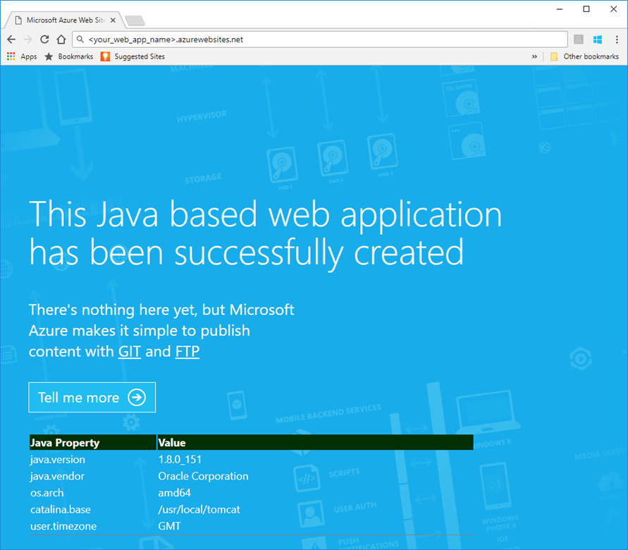
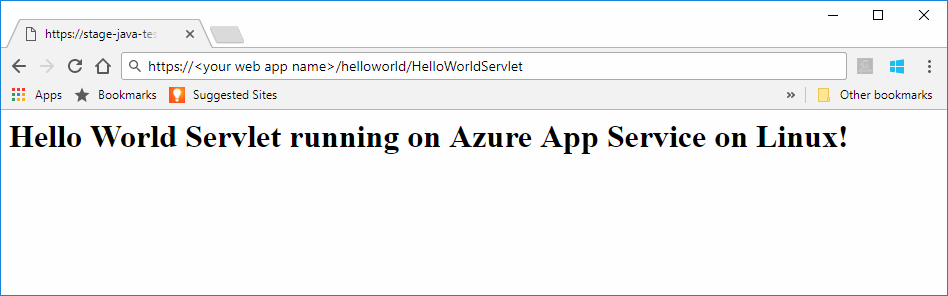

# Preview: Create a Java web app in Azure App Service on Linux

The feature described in this article is currently in Preview.  Please review the [Supplemental Terms of Use for Microsoft Azure Previews](https://azure.microsoft.com/support/legal/preview-supplemental-terms/)

> [!NOTE]
> This article deploys an app to App Service on Linux.
>

[App Service on Linux](app-service-linux-intro.md) provides a highly scalable, self-patching web hosting service using the Linux operating system. This quickstart shows how to deploy a Java app to App Service on Linux using a built-in image. You create the web app with built-in image using the [Azure CLI](https://docs.microsoft.com/cli/azure/get-started-with-azure-cli), and you use Git to deploy the Java code to the web app.


[!INCLUDE [quickstarts-free-trial-note](../../../includes/quickstarts-free-trial-note.md)]

## Download the sample

In a terminal window on your machine, run the following command to clone the sample app repository to your local machine. You will deploy this sample app in a later step.

```bash
git clone https://github.com/Azure-Samples/java-docs-hello-world
```

[!INCLUDE [cloud-shell-try-it.md](../../../includes/cloud-shell-try-it.md)]

[!INCLUDE [Configure deployment user](../../../includes/configure-deployment-user.md)]

[!INCLUDE [Create resource group](../../../includes/app-service-web-create-resource-group.md)]

[!INCLUDE [Create app service plan](../../../includes/app-service-web-create-app-service-plan-linux.md)]


## Create a web app

In the Cloud Shell, create a [web app](../articles/app-service/app-service-web-overview.md) in the `myAppServicePlan` App Service plan. You can do it by using the [`az webapp create`](/cli/azure/webapp?view=azure-cli-latest#az_webapp_create) command. In the following example, replace *\<app_name>* with a globally unique app name (valid characters are `a-z`, `0-9`, and `-`). 

```azurecli-interactive
az webapp create --name <app_name> --resource-group myResourceGroup --plan myAppServicePlan --deployment-local-git --runtime "TOMCAT|8.5-jre8"
```

When the web app has been created, the Azure CLI shows information similar to the following example:

```json
Local git is configured with url of 'https://<username>@<app_name>.scm.azurewebsites.net/<app_name>.git'
{
  "availabilityState": "Normal",
  "clientAffinityEnabled": true,
  "clientCertEnabled": false,
  "cloningInfo": null,
  "containerSize": 0,
  "dailyMemoryTimeQuota": 0,
  "defaultHostName": "<app_name>.azurewebsites.net",
  "deploymentLocalGitUrl": "https://<username>@<app_name>.scm.azurewebsites.net/<app_name>.git",
  "enabled": true,
  < JSON data removed for brevity. >
}
```

You’ve created an empty web app, with git deployment enabled.

> [!NOTE]
> The URL of the Git remote is shown in the `deploymentLocalGitUrl` property, with the format `https://<username>@<app_name>.scm.azurewebsites.net/<app_name>.git`. Save this URL as you need it later.
>

Browse to the newly created web app.

```
http://<app_name>.azurewebsites.net
```

If the web app is up and running, you should get a default screen similar to the following image:




[!INCLUDE [Push to Azure](../../../includes/app-service-web-git-push-to-azure.md)]


```bash
Counting objects: 54, done.
Delta compression using up to 4 threads.
Compressing objects: 100% (42/42), done.
Writing objects: 100% (54/54), 11.52 KiB | 0 bytes/s, done.
Total 54 (delta 13), reused 0 (delta 0)
remote: Updating branch 'master'.
remote: Updating submodules.
remote: Preparing deployment for commit id '150adb9e7d'.
remote: Generating deployment script.
remote: Generating deployment script for Web Site
remote: Generated deployment script files
remote: Running deployment command...
remote: Handling Basic Web Site deployment.
remote: Kudu sync from: '/home/site/repository' to: '/home/site/wwwroot'
remote: Copying file: '.gitignore'
remote: Copying file: 'CHANGELOG.md'
remote: Copying file: 'CONTRIBUTING.md'
remote: Copying file: 'LICENSE.md'
remote: Copying file: 'README.md'
remote: Deleting file: 'hostingstart.html'
remote: Ignoring: .git
remote: Copying file: 'WebContent/index.jsp'
remote: Copying file: 'WebContent/META-INF/MANIFEST.MF'
remote: Copying file: 'WebContent/WEB-INF/web.xml'
remote: Copying file: 'build/classes/com/azurewebsites/example/HelloWorldServlet.class'
remote: Copying file: 'src/com/azurewebsites/example/HelloWorldServlet.java'
remote: Finished successfully.
remote: Running post deployment command(s)...
remote: Deployment successful.
remote: App container will begin restart within 10 seconds.
To https://<your app name>.scm.azurewebsites.net:443/<your app name>.git
 * [new branch]      master -> master
```

## Browse to the app

Browse to the deployed application using your web browser.

```bash
http://<app_name>.azurewebsites.net/helloworld
```

The Java sample code is running in a web app with built-in image.


Browse to the servlet using your web browser.

```bash
http://<app_name>.azurewebsites.net/helloworld/HelloWorldServlet
```

The Java sample code is running in a web app with built-in image.




**Congratulations!** You've deployed your first Java app to App Service on Linux.

[!INCLUDE [cli-samples-clean-up](../../../includes/cli-samples-clean-up.md)]


## Next Steps

For more information about using Java with Azure, see the following links:

* [Azure for Java Developers](https://docs.microsoft.com/java/azure/)
* [Deploy a Hello World web app to a Linux container in the cloud using the Azure Toolkit for IntelliJ](https://docs.microsoft.com/java/azure/intellij/azure-toolkit-for-intellij-hello-world-web-app-linux)
* [Java Tools for Visual Studio Team Services](https://java.visualstudio.com/)
